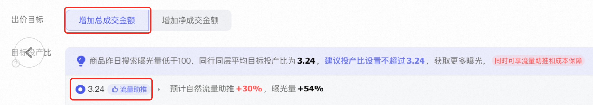
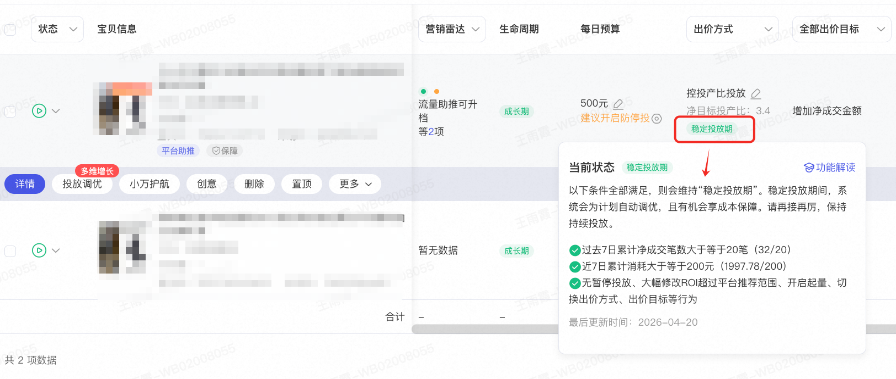
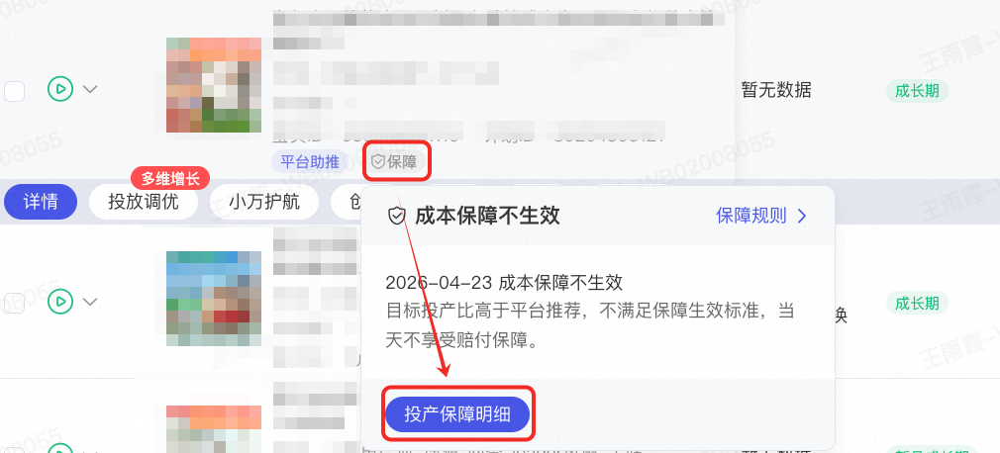
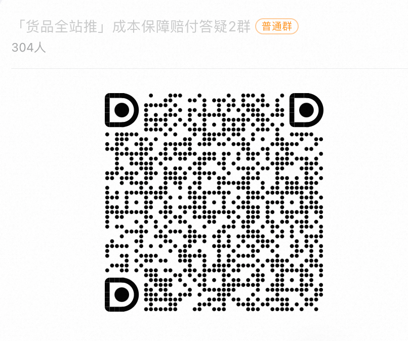

# 货品全站推广自动化「成本保障」

> 来源：https://alidocs.dingtalk.com/i/nodes/gwva2dxOW4vRkd9DUAqmKa3GJbkz3BRL

**「货品全站推广-成本保障」升级重点一览：**

**商品范围扩充！**从「平台推荐商品」升级为「全量货品全站推广上车商品」，最大程度助力您货品全站推广投放无忧！

**保障条件升级！**「采纳系统推荐ROI 或 客户自定义ROI<系统推荐ROI」，即视作满足成本保障计划出价条件！

**赔付时效缩短！**从商家填写问卷登记升级为「系统自动为满足保障条件计划发放无门槛代金券」，最大程度缩短成本保障返券时效，提升商家成本保障体感！

注：上述条件为本次成本保障升级重点，其他成本保障条件仍需满足，具体请查阅产品手册。

# **一、****货品全站推广-成本保障****简介**

已上车货品全站推广单品模式的全量计划，如：在新建计划环节显示「成本保障」，或在投中环节显示「保障」标签，**若满足以下成本保障条件**，商家无需填写问卷登记，系统将自动为该计划进行成本保障赔付。从计划新建后保障15天，计划在此期间仅能享受一次成本保障。

# **二、货品全站推广-成本保障规则**

**计划在投门槛：**计划需在投「货品全站推广-商品模式-控投产比投放」、「货品全站推广-控费比模式」及 全店模式计划

**计划操作门槛：**

**出价门槛：推广商品的ROI设置值<=系统推荐值，以下图为例，ROI出价区间在3.24及以下。 **

**投放状态门槛**：当天计划不在【数据积累期】、【效果调整期】，计划必须处在【稳定投放期】 投放期阶段功能解读

**投放操作门槛**：投放当天计划无暂停、无删除、未开启最大化拿量。

**保障成效门槛：**

置信状态：计划累计消耗需高于单笔成交成本（消耗 > GMV/成交笔数）

**超成本比例：实际投放ROI<ROI设置值*70%，ROI归因周期15天**

**成本保障金额测算逻辑：**

赔付金额=实际消耗-[实际15天归因成交金额/（目标投产比*0.7)]，计划当日多次调价的，系统按当日设置的最低ROI*0.7为保障目标。

示例：

采纳系统推荐ROI的计划，或者客户自定义ROI<系统推荐值，且计划投放进入「稳定投放期」，且计划满足上述投放操作门槛和保障成效门槛，则系统将按照客户设置的目标ROI，赔付计划中ROI*70%未达标部分的消耗。

例如：系统推荐ROI为2，客户采纳推荐ROI，实际投放ROI为1，成交金额为 100元，实际消耗：100/1=100元；预期消耗：100/（2*0.7）=71.43元，则赔付金额为：100-71.43=28.57元。

**成本保障范围：**

当前成本保障场景覆盖范围为「货品全站推广-商品模式-控投产比投放」及「货品全站推广-控费比模式」及 全店模式下的自动化「成本保障」。

**成本保障形式**

无门槛代金券，券面额=该商家货品全站推广场景下成本保障总金额，该代金券无门槛优先抵扣，生效时间30天，仅可在货品全站推广场景使用。

代金券查看方式：万相台AI无界-账户-我的优惠券。

# **三、常见问题：**

**Q：开启了“投放调优”（如一键起量、多目标出价、多目标起量）的计划，是否在成本保障赔付范围内？**

A：是的，开启“投放调优”的计划仍可参与成本保障赔付。但请注意：赔付金额仅基于“基础出价部分”的消耗及对应达成率计算，不包含因一键起量、多目标出价、多目标起量产生的额外消耗。换句话说，系统会剔除投放调优带来的增量花费，仅对主计划的有效消耗进行赔付核算。

**Q：如何获取货品全站推广成本保障「保障」标识？**

A：需满足以下门槛：

**计划在投门槛：**

计划需在投「货品全站推广-商品模式-控投产比投放」及「货品全站推广-控费比模式」及 全店模式计划

计划新建天数<30天

**计划操作门槛：**

出价门槛：推广商品的ROI设置值<=系统推荐值，以下图为例，ROI出价区间在3.24及以下。

投放状态门槛：当天计划不在【数据积累期】、【效果调整期】，计划必须处在【稳定投放期】 投放期阶段功能解读

投放操作门槛：投放当天计划无暂停、无删除、未开启最大化拿量。

**保障成效门槛：**

置信状态：计划累计消耗需高于单笔成交成本（消耗 > GMV/成交笔数/设置ROI）

**超成本比例：**实际投放ROI<ROI设置值*70%，ROI归因周期15天

注意：如果您的货品全站推广计划属于API调用修改、调用插件修改计划，则不在成本保障范围内，该计划不展示「保障」标识。

##### **Q：「保障」标识状态如何区分？**

A：点击计划列表中的“保障”标识->“投产保障明细”可查看每日的投产保障状态、赔付阶段说明

|  |  |
| --- | --- |

##### **Q：成本保障的赔付金额如何测算？**

**A：成本保障金额测算逻辑：**

赔付金额=实际消耗-[实际15天归因成交金额/（目标投产比*0.7)]，计划当日多次调价的，系统按当日设置的最低ROI*0.7为保障目标。

示例：

采纳系统推荐ROI的计划，或者客户自定义ROI<系统推荐值，且计划投放进入「稳定投放期」，且计划满足上述投放操作门槛和保障成效门槛，则系统将按照客户设置的目标ROI，赔付计划ROI*70%未达标部分的消耗。

例如：系统推荐ROI为2，客户采纳推荐ROI，实际投放ROI为1，成交金额为 100元，实际消耗：100/1=100元；预期消耗：100/（2*0.7）=71.43元，则赔付金额为：100-71.43=28.57元。

Q：**推荐ROI每天变化，按昨日值设置会影响保障吗？需每日调整吗？**

A：需要满足**推广商品的ROI设置值<=系统推荐值**（如：昨日设置roi<=系统推荐值，但今日系统推荐值>昨日设置roi，需及时调整设置ROI<=今日系统推荐值）计划当日多次调价的，系统按当日设置的最低ROI*0.7为保障目标。

Q：**成本****保障的赔付何时到账？以什么形式到账，在哪里可以查看？**

A：点击计划列表中的“保障”标识->“投产保障明细”->赔付阶段说明可查看具体赔付金额及发放情况

赔付金额以无门槛代金券形式到账，券面额=该商家货品全站推广场景下成本保障总金额，该代金券无门槛优先抵扣，生效时间30天，仅可在货品全站推广场景使用。

代金券查看方式：万相台AI无界-账户-我的优惠券（如生效中未显示，可去已失效点击查看）优惠券名称“货品全站推「成本保障」”

|  |  |
| --- | --- |

**Q：计划处于“数据积累期”和“效果调整期”，计划有可能享受成本保障吗？**

**A：**不可能。计划需处于“稳定投放期”，才是成本保障“保障”的生效条件之一；计划达成“稳定投放期”的条件可点击计划列表中的“稳定投放期”具体要求为准（如下图）；三阶段具体的生效条件可查阅文档

**Q：新计划、老计划都可享受成本保障赔付吗？**

**A：**在新建计划环节显示「成本保障」或在投中环节显示「保障」标签，若满足所有成本保障条件，系统将自动为该计划进行成本保障赔付。从计划新建后保障15天，计划在此期间仅能享受一次成本保障；

老计划需新建天数<30天，且计划下显示“保障”标识，可通过“保障”-“投产保障明细”中查看每日成本保障情况。

# **四、问题反馈通路**

如您遇到产品使用问题，或有任何产品优化建议，请反馈至阿里妈妈客服或者货品全站推广「成本保障」钉钉群中，耐心等待工作人员处理。

# **特别说明**

1、活动统计的消耗金额、优惠券金额等数据以阿里妈妈统计为准；账户消耗仅指用户按照本次活动规则创建的计划在活动期间的真实账户消耗。

2、活动期间，用户需遵守万相台AI无界、全站推广的服务相关协议及规则（包括《阿里妈妈无界软件服务协议》、《全站信息技术服务协议》等），不得作弊，不得侵犯任意第三方之合法权益，推广店铺不得违规，否则阿里妈妈有权取消用户的活动资格和收回活动奖励。

3、用户应遵守淘宝网、天猫平台和/或阿里妈妈平台相关规则协议，如因用户违规行为，包括商品或者店铺被处以下架、屏蔽、删除、扣分、限制交易、监管账号或者查封店铺等措施，导致阿里妈妈营销优惠券无法使用的，淘宝、天猫及阿里妈妈将不进行任何退款、提现或补偿，并有权收回已发放的权益。

4、本活动所涉权益均为非售卖权益。参与活动的用户店铺状态为正常的淘宝、天猫卖家，符合《阿里妈妈账号管理规范》，阿里妈妈平台将结合用户多维度经营情况（如诚信经营情况、店铺品质、商品竞争力等）及各营销活动参与情况等进行综合评估。

5、在本次激励活动中，如用户存在违规行为（包括但不限于恶意套现、机器作弊、刷信誉、提供虚假信息等），或者用户主体关联的其他账号曾存在严重违规行为被处罚或被处以特定管理措施，活动举办方将取消违规用户的激励资格，并有权收回权益（含已使用的及未使用的），按照《淘宝网市场管理与违规处理》或《天猫市场管理规范》进行处罚，必要时将追究用户的法律责任。

6、因自然灾害、网络攻击或系统故障等不可抗力等因素使活动停止或出现问题，阿里妈妈免责。在法律允许的范围内，阿里妈妈可暂停或终止本活动，或者对本活动规则进行变动或调整，相关变动或调整将公布在本页面上。

7、当奖励类型为优惠券时：优惠券仅限在万相台 AI无界推广使用，且特定产品线的优惠券仅限该产品线使用。优惠券均有有效期，在有效期开始时间当天才可进行消耗的抵扣，超过有效期结束时间后则优惠券失效，券过期后未使用余额自动回收，无法再次进行使用，亦无法申请折现等，该券不支持开发票，不可转赠，不再补发。

8、活动举办方可以根据本活动的实际举办情况对活动规则进行变动或调整，相关变动或调整将公布在活动页面上。
