# 04-3-短直联动🔥🔥

> 来源：https://alidocs.dingtalk.com/i/nodes/gwva2dxOW4vRkd9DUqD0X9QgJbkz3BRL

# 🔥双旦/CNY/38能力升级+商家案例

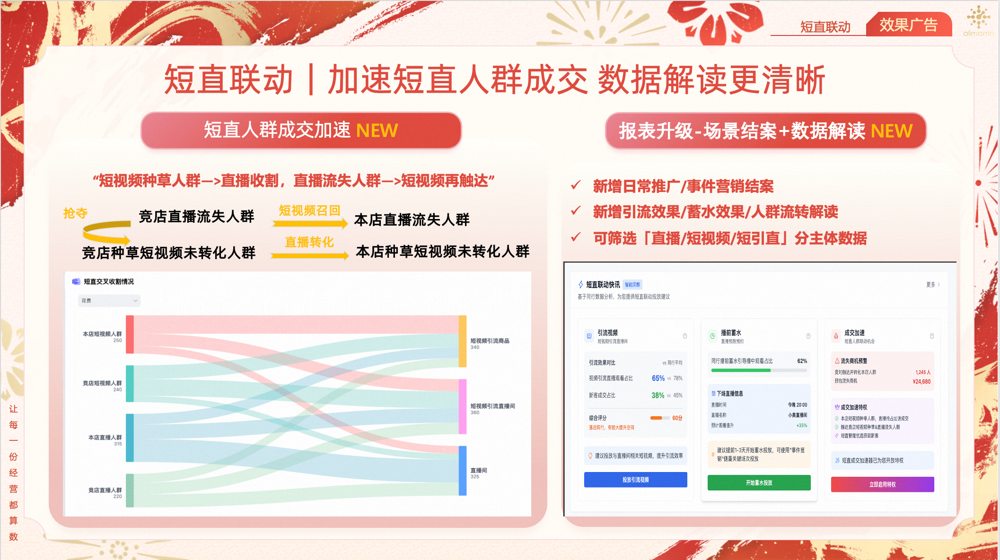

# 🔥全新升级🔥新增「日常推广」「事件营销」场景

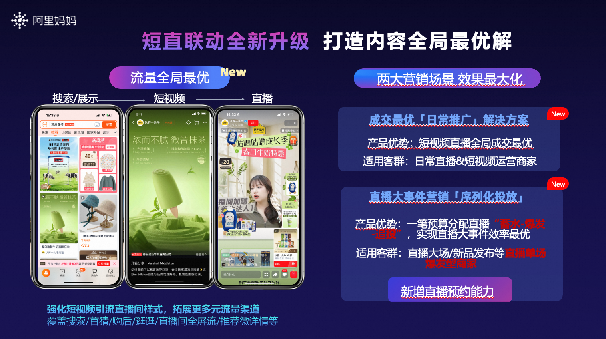

# 🔥🔥日常推广🔥🔥「直播短视频成交最大化」

**优势点：预算分配更灵活，分日效果更可控；**

** 流量渠道更多元，创意样式更丰富；**

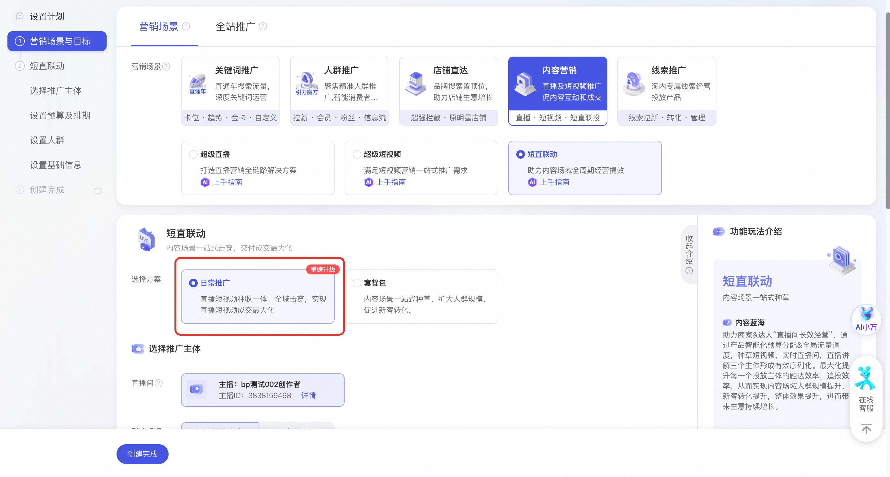

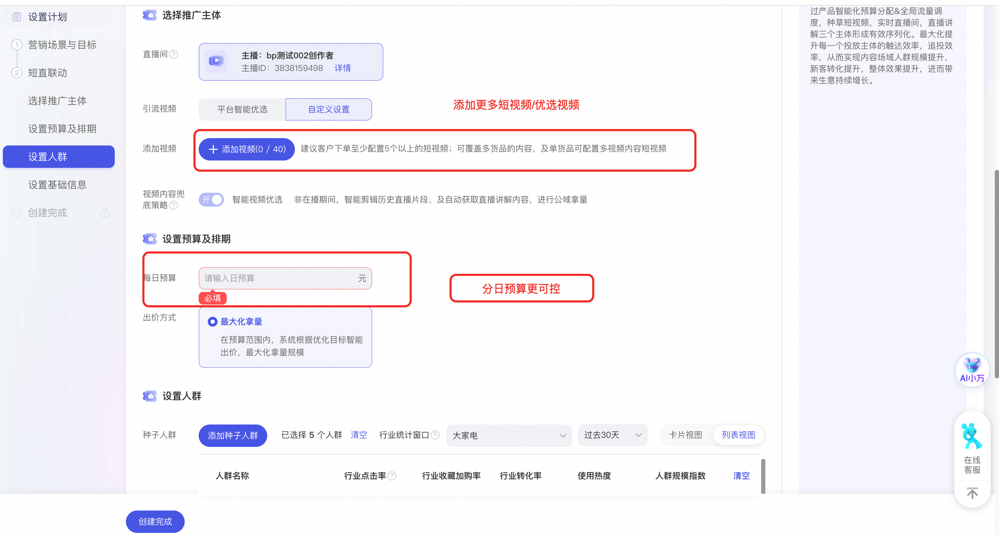

# 🔥事件营销🔥「预约蓄水 大场爆发」

**优势点：指定直播场次投放，侧重分配预算**

** 短视频素材引导指定直播间**

关联直播中控台-「直播计划」「直播预告」信息

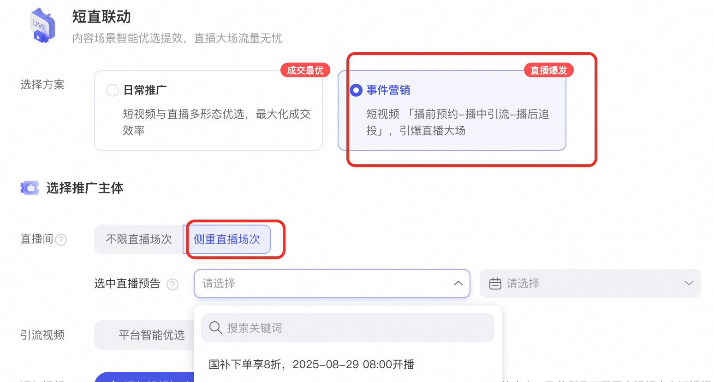

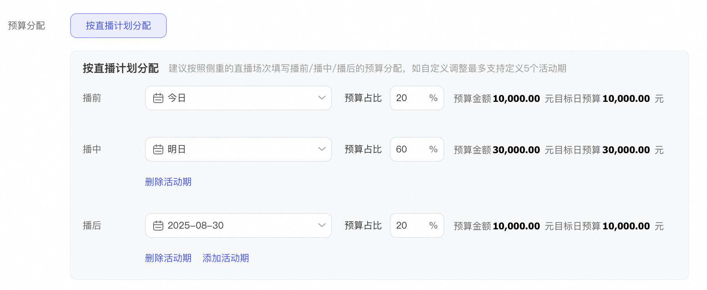

---

**原语雀文档链接：**https://yuque.antfin.com/chenchun.chen/gqhty9/pezaeqnhid806wc6

---

1、心智介绍

短直联动通过短视频&短视频引流直播间&直播间多形态效率优选，实现短视频直播成交最大化，通过产品智能化预算分配&全局流量调度，种草短视频，实时直播间，直播讲解三个主体形成有效序列化。最大化提升每一个投放主体的触达效率，追投效率，从而实现内容场域人群规模提升，新客转化提升，整体效果提升，进而带来生意持续增长。

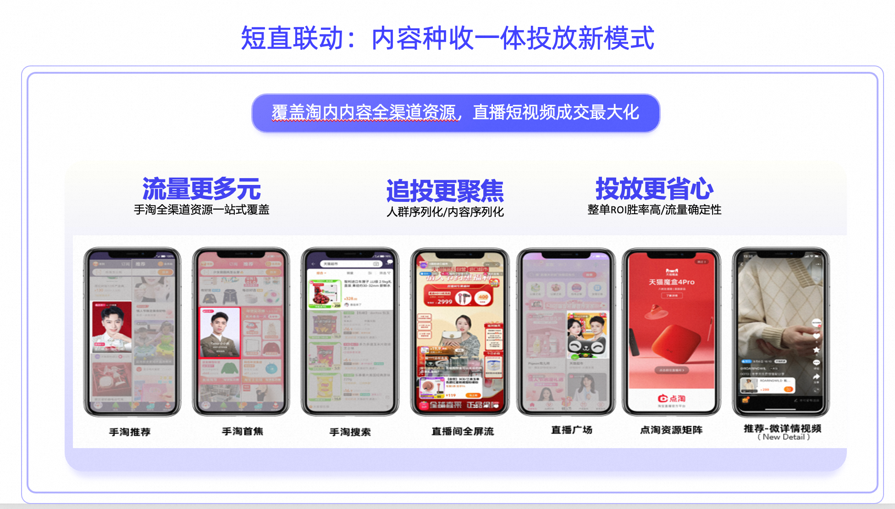

​

2、操作介绍

进入短直联动

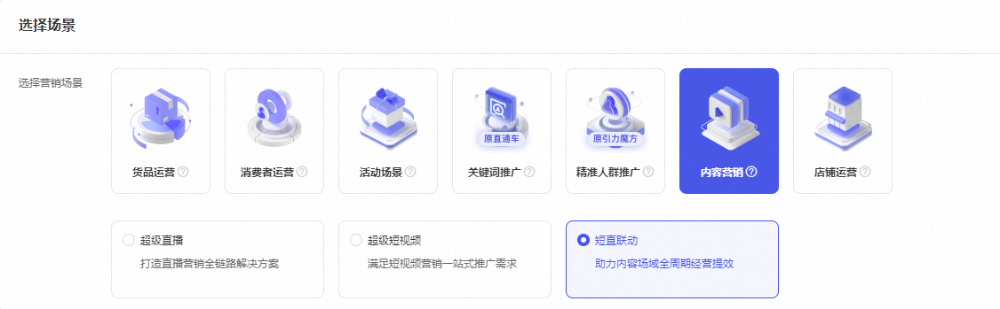

选择日常推广

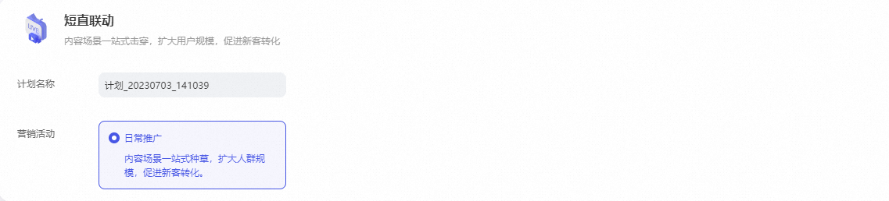

选择投放主体

默认在播直播间

默认系统优选直播讲解

添加视频

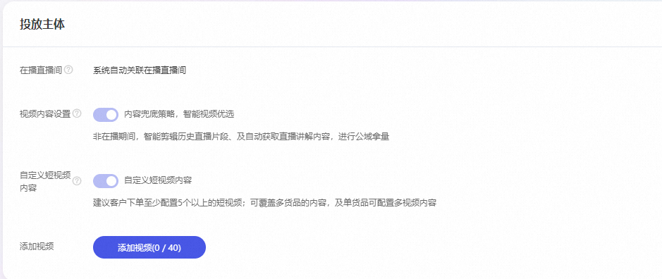

选择订单金额、设置投放日期、设置直播间投放时间段

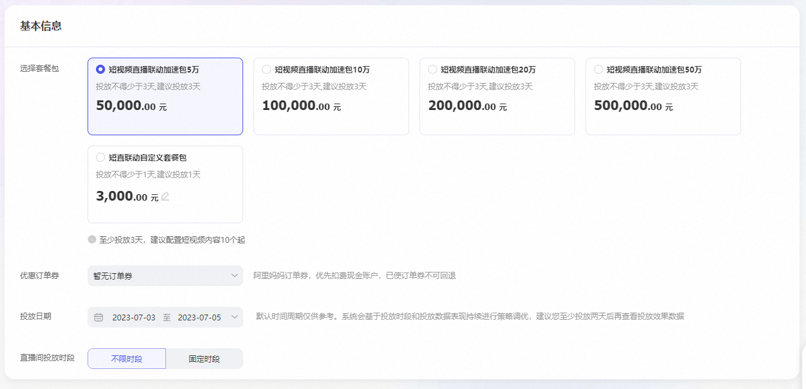

设置人群

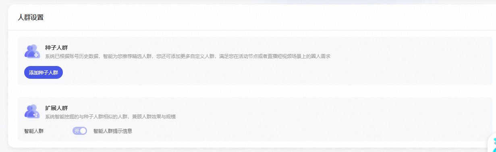

订单创建完成

二、投放数据查看说明

计划管理页、数据报表页与旧版短直联动均保持一致，以下为当前版本示意：

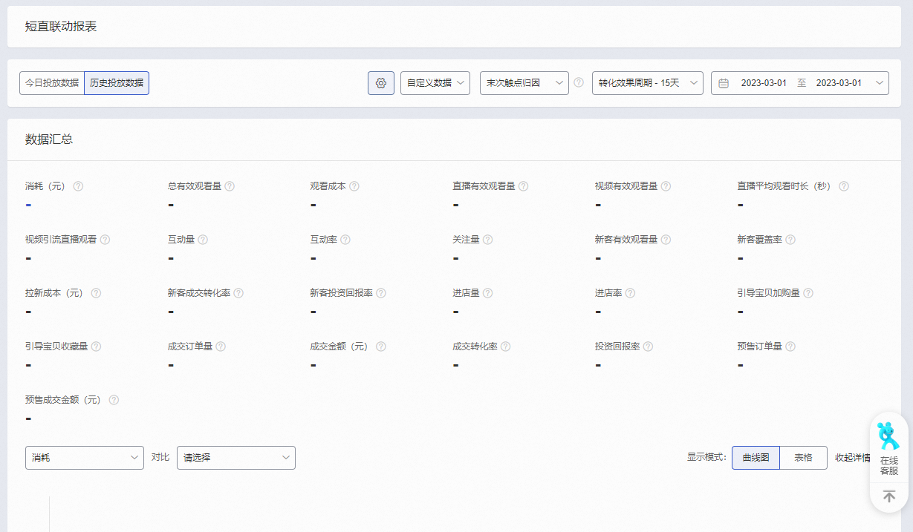

3、高频FAQ

短直联动投放的数据报表中ROI的归因口径是什么？——短直联动投放的口径是点击归因，非展示归因

短直联动和其他产品的差别是什么？——短直联动是阿里妈妈推出全新的一款一站式内容推广投放工具，覆盖淘内外核心直播&短视频内容场域；通过短视频前置蓄水种草，不仅提高种草效率，更有效的提高了直播间新客覆盖规模和新客成交。

4、平台指南
