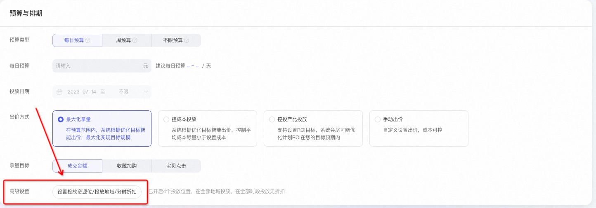
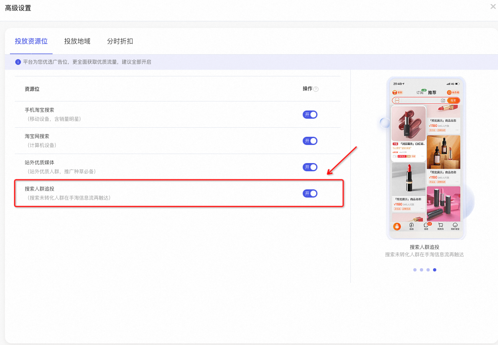
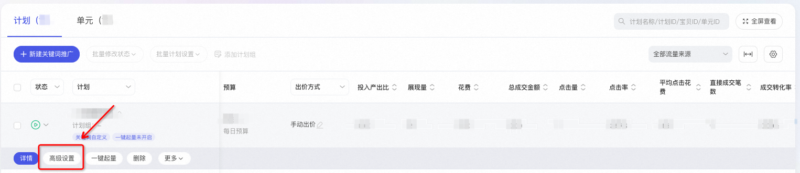
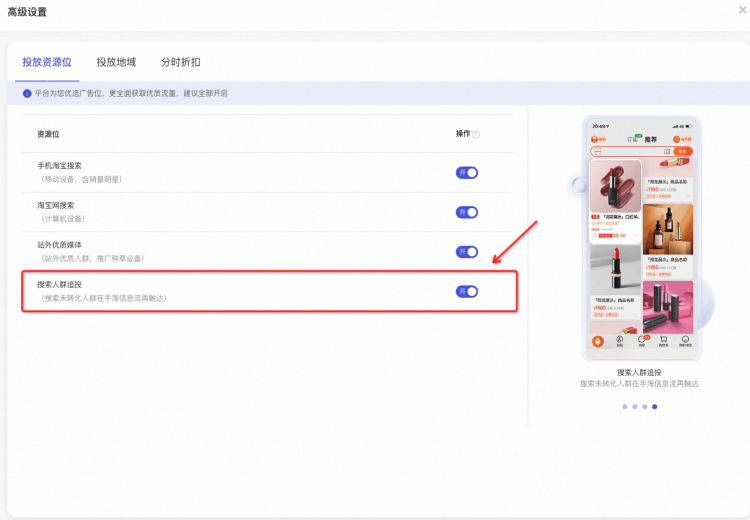
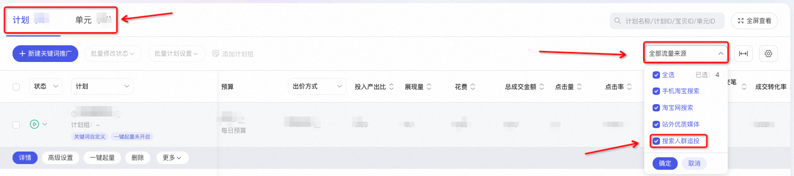
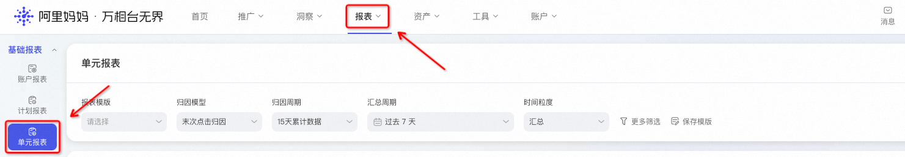
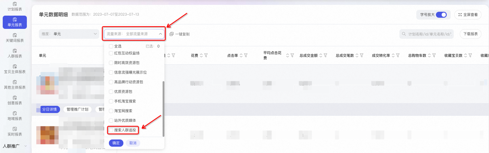
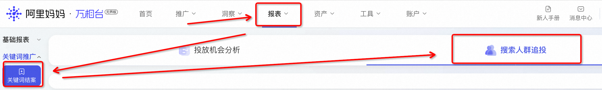

# 什么是搜索人群追投？

> 来源：https://alidocs.dingtalk.com/i/nodes/gwva2dxOW4vRkd9DUqD0pbexJbkz3BRL

**原语雀文档链接：**https://yuque.antfin.com/chenchun.chen/gqhty9/irqlac77m80ux64p

---

# 一、新功能快速了解

## 1.1 简介

** 【搜索人群追投】**是万相台无界版关键词推广重磅推出的**新功能**，该功能以消费者**搜索行为时间点**为基准，基于阿里妈妈领先的算法能力，在信息流对未转化的消费者再次进行广告触达，能够帮助商家**打破**搜索场域**相关性限制，**加速消费者转化，提升成交规模。

## 1.2 特点

**序列投放****，**搜索人群在信息流再次触达，以低成本挽回未成交消费者。

**便捷开启**，高级设置中一键开启，智能化追投至**精选资源位**（首页猜你喜欢与购后猜你喜欢），确保投放效率最大化。

**独立投放**，开启搜索人群追投后，**不影响**原搜索计划质量分、人群标签以及**计划效果**。

**效果更优**，开启后，计划点击量平均增加27%，成交额平均增长15%；提供专属结案，助力后续投放。

​

## 1.3 原理

| **消费者在手淘搜索**（图片仅供演示说明） | **信息流再次触达**（图片仅供演示说明） |
| --- | --- |
|  |  |
| 通过关键词推广计划进行投放。 | 开启搜索人群追投，智能圈选**搜索意向人群**，**搜索行为人群**进行投放。 |

1.出价方式：延用计划的出价模式，即开启前计划为手动出价，则开启后跨投部分也为手动出价；开启前为最大化拿量的出价方式，则开启后跨投部分也采用最大化拿量的出价方式。

2.扣费方式：按点击扣费，展现不扣费。

3.投放资源位：当前搜索人群追投仅投放至首页猜你喜欢、购后猜你喜欢两个资源位。

4.创意：当前搜索人群追投，跨投至信息流的创意仅使用商品的主图创意进行投放。

5.人群：会对**搜索意向人群**、**搜索行为人群**，2个人群进行投放。

6.效果：近一个月内，开启搜索人群追投的计划对比开启追投前，展现量平均提升29%，点击量平均增加27%，平均点击成本下降11%，成交规模平均增长15%。（不同出价方式，不同货品类型表现会存在差异）

## 1.4 价值

**🔥🔥🔥****搜索人群再营销，目标精准成本低！**

在关键词推广，消耗大量预算养成效果良好的计划，如果消费者搜索并点击后，却没有最终成交，消耗的预算变为沉没成本，这个时候要怎么办？搜索人群追投可以基于积累的庞大消费者行为，针对这部分消费者精准快速挽回，避免错过用户转化的黄金时期。

​

**🔥🔥🔥****搜索意向先种草，成交转化更显著！**

关键词推广（原直通车）在搜索渠道积累多年，基于搜索广告的强大算法模型，实现在消费者搜索前，对高意向高转化价值消费者的提前种草，帮助搜索计划效果提升。

​

**🔥🔥🔥一键开启极简便，展现效果更卓著！**

搜索人群追投功能操作极简，投放资源位一键开启，种草到收割全链路触达。展现量平均提升29%，点击量平均增加27%，成交规模平均增长15%！

# 二、如何操作？

## 2.1 开启搜索人群追投

### 新建计划如何打开？

新建关键词推广>>>预算与排期>>>高级设置>>>投放资源位>>>搜索人群追投

投放资源位选择搜索人群追投即可

### 已有计划如何打开？

关键词推广>>>计划列表>>>计划>>>高级设置>>>投放资源位>>>搜索人群追投

投放资源位打开搜索人群追投即可

## 2.2 如何看追投数据？

目前搜索人群追投的数据**支持以下三种方式**查看，搜索人群追投的专属结案已上线。

### 实时数据查询

操作路径：关键词推广>>>计划/单元列表下>>>全部数据来源>>>只勾选搜索人群追投

### 报表数据查询

操作路径：报表>>>基础报表>>>单元报表>>>单元数据明细>>>流量来源>>>搜索人群追投

点击全部数据来源-下拉至最下方-勾选搜索人群追投。

### 结案数据查看

操作路径：关键词推广>>>报表>>>关键词结案>>>搜索人群追投

功能价值：获取到更为详细的系统追投数据，包括搜索人群追投人群流转情况、特征人群、意向关键词、潜力好货。

**结案包含4个模块**

1. 【人群流转详情】

开启搜索人群追投后，呈现追踪精准人群的全流转周期，了解推广过程中人群流转链路，核心经营数据的披露，帮助商家优化生意经营策略。

2. 【优质人群特征】

搜索人群追投过程中，发现更多优质人群特征，帮助商家定位转化率最高的人群，助力精准营销。

3. 【好词发现】

发现搜索人群追投过程中触达效率最高的自买词和意图词。

4. 【好货发现】

洞察店铺内宝贝在搜索流内的竞争激烈程度，及时开启搜索人群追投功能，避开激烈竞争，实现高效快速拿量。

​

# 三、高频疑难问题（FAQ）

### Q1.为什么我关键词列表的数据和单元/计划维度的数据对不起来？

搜索人群追投当前不归因到关键词，因此在关键词/人群/创意列表处无搜索人群追投的数据，会出现关键词/人群/创意列表数据与单元/计划维度对不齐的情况。

但各位掌柜可以通过单元、计划维度筛选资源位查看（在关键词推广-计划/单元列表下-点击全部数据来源-只勾选搜索人群追投后查看）。

​

### Q2.开启了搜索人群追投，好像我的搜索计划效果变差了，怎么回事？

不会有这样的情况。开启了搜索人群追投，可以理解为系统为原来的搜索计划（主计划），自动创建了一个附属的展示域投放计划，该计划的人群标签等数据会与搜索计划投放模型隔离。因此不会因为开启了搜索人群追投，导致原搜索计划效果变差，可以单独筛选资源位数据情况查看搜索计划数据情况。

​

### Q3.搜索人群追投的扣费方式和扣费逻辑是什么呢？

扣费方式按照点击付费；扣费逻辑与开启搜索人群追投的主计划保持一致（主计划的出价方式决定了搜索人群追投的出价方式），但实际扣费金额是广告实时竞价决定的。（根据目前的商家反馈和数据可知，搜索人群追投的ppc是更低的，拿量能力是更强的。）同时开启后是利用计划未消耗完的预算投到展示域，因此花费增高，不代表关键词的出价提高。

​

### Q4.为什么有时候会出现扣费大于出价的情况？

开启搜索人群追投功能后，系统在周期内会将价格自动优化并控制在商家设置的出价范围内，但在实际投放的过程中，单次出价会随着竞价情况、流量质量等因素动态调整，从而保证计划整体的拿量能力。

但在计划为纯手动出价，采用“低价引流”拖价玩法的情况下，开启了搜索人群追投，系统会因为出价过低无法拿到展示域流量而被迫提高在展示域的出价，会一定程度上突破主计划设置的溢价上限。因此纯手动计划且预算控制较为严格掌柜，建议慎重开启。

​

### Q5.我开启了搜索人群追投，但为什么效果不好？

因展示域本身流量质量的原因，可能出现PV上涨，而成交较少情况，建议各位商家朋友们先观察数据情况，如果认为不符合预期，可在推广的“高级设置”处关闭搜索人群追投的资源位。

同时也并非所有的计划都适合开启搜索人群追投，在智能化出价情况下（最大化拿量、控投产、控成本）可以发挥算法实时的能力，效果较优。目前算法持续优化中，搜索人群追投的结案报告已经上线，可在关键词结案--搜索人群追投中查看。

### Q6. 搜索人群追投的资源位在哪里？

搜索人群追投的资源位只有两个：首页猜你喜欢和购后资源位。

### Q7.搜索人群追投的依据是什么？主计划购买的词和人群会有影响吗？

搜索人群追投的具体人群会由两部分组成，一部分是模型算法参考商家主计划设置的已有的关键词和人群进行追投，另一部分会基于店铺整体的搜索人群完成预估追投。

​

### Q8.搜索人群追投投放时用的是什么创意图，为什么看不到数据？

追投投放的创意使用主图创意。当前搜索人群追投仅在计划/单元维度可以查看相应的数据，后续将单独上线结案功能。

**如有疑惑可以咨询袋小蜜客服，或搜索“**75680005175**”****进入“搜索人群追投商家交流群”。**

**​**

​

​

​
