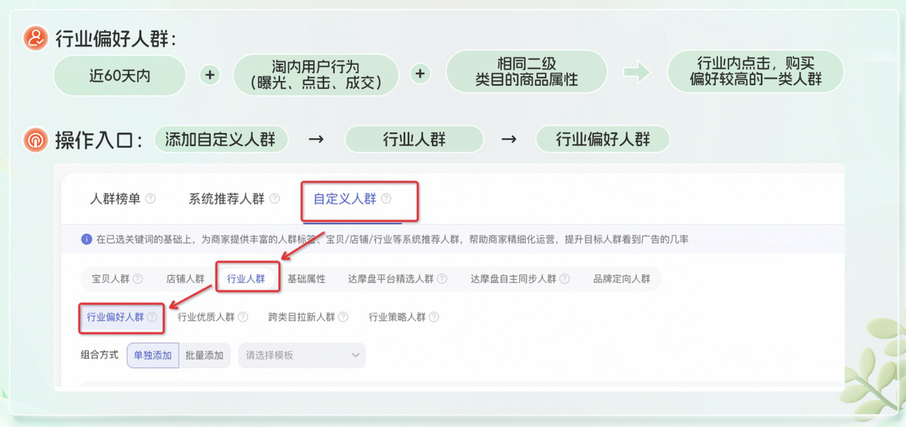

# 行业偏好人群升级：标签「超」丰富，人群圈选「更」精准！

> 来源：https://alidocs.dingtalk.com/i/nodes/jb9Y4gmKWrx9eo4dCKDj6Q2NJGXn6lpz

**原语雀文档链接：**https://yuque.antfin.com/chenchun.chen/gqhty9/nho8mo016x8qoycc

---

# 一、什么是行业偏好人群

# 二、升级亮点：人群标签「超丰富」，满足您的多样需求！

不同类目的商品，偏好人群的标签不尽相同，以下仅为个别类目的升级前后对比，仅供参考，具体请以线上显示为准！

#### 举例1：面部护理套装

| 升级前 | 升级后 |
| --- | --- |
|  |  |

#### 举例2：羽绒服饰/羽绒内胆

| 升级前 | 升级后 |
| --- | --- |
|  |  |

#### 举例3：OTC药品

| 升级前 | 升级后 |
| --- | --- |
|  |  |

#### 举例4：床垫类

| 升级前 | 升级后 |
| --- | --- |
|  |  |

#### 举例5：洁面

| 升级前 | 升级后 |
| --- | --- |
|  |  |
