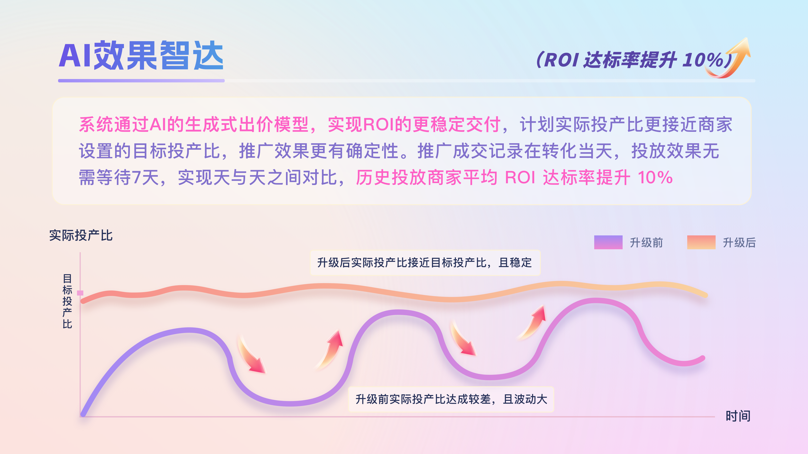

# 「AI效果智达」全面升级！

> 来源：https://alidocs.dingtalk.com/i/nodes/jb9Y4gmKWrx9eo4dCKDjGKv4JGXn6lpz

**「AI效果智达」**是平台对货品全站推**控投产比投放**计划提升效果达成交付的一项能力，系统通过AI生成式出价模型，更智能地优化投放效果达成，使得计划实际投产比更接近商家设置的目标投产比。

**NEW**全店模式已全量升级**AI效果智达**

**升级点在哪？ **

系统通过AI生成式出价模型，更智能的优化投放效果达成，**实现ROI的更稳定交付**，计划实际投产比更接近商家设置的目标投产比，推广效果更有确定性（升级对控投产比投放生效，对最大化拿量不生效；一键起量计划对控投产比的基础预算生效，对起量预算不生效）。

将推广**成交记录在转化当天**，投放效果无需等待多天，实现天与天之间对比

**商家需要做什么？**

需要保持计划**持续稳定投放**，系统自动升级控投产比投放计划的效果达成能力，使得实际投产比更接近您设置的目标投产比；

请您**积极提升计划日预算和出价**，充足的预算和有竞争力的出价，利于系统持续稳定优化投放效果

**商家案例**

某快消行业商家，在系统升级**「AI效果智达」**后，计划当日的实际ROI达成提升明显，商家**积极追加计划预算，合理提升出价**，账户日均拿量及成交金额提升30%+

​

**数据展示调整**

| **位置** | **变化** |
| --- | --- |
| **万相台无界-首页** **万相台无界-营销场景报表** **货品全站推广-结案报表** | **转化统计方式新增「按转化时间」** **货品全站推广的详细数据及结案报表，建议用「按转化时间」口径，成交、加购收藏等深度行为转化数据记录在转化产生当天，方便天与天对比，无需多天归因等待** **按点击时间：系统追溯推广效果（如成交）对应的末次推广点击，并将推广效果（如成交）记录在点击发生时间** **按转化时间：系统追溯推广效果（如成交）对应的末次推广点击，并将推广效果（如成交）记录在转化产生时间** |
| **万相台无界-实时报表** | **实时报表不含货品全站推广数据，请在货品全站推广计划列表查看实时数据** |
| **货品全站推广场景页-数据汇总** | **数据汇总的效果相关指标按实际效果产生时间汇总（****如成交按成交产生时间记录****），页面数据仅供参考，历史推广数据以报表数据为准 ** **右上角时间筛选今日为分时累计数据，提供按小时累计效果，曲线上每个点的数据均为0点至该时刻的累计数据；筛选其他时间为对应时间当日数据，提供分日变化情况** |
| **货品全站推广场景页-计划列表-详情** | **原「累计转化数据」和「分时基础数据」合并为「分时数据」，披露成交转化、基础指标、潜在转化、成交意向等维度数据** **右上角时间筛选今日为分时累计数据，提供按小时累计效果，曲线上每个点的数据均为0点至该时刻的累计数据；筛选其他时间为对应时间当日数据，提供分日变化情况** |

**Q&A**

问：为什么升级后在无界看到的货品全站推广效果和在货品全站推广内看到的**数据不一致**？

答：无界的效果默认**按点击时间统计**，货品全站推广「AI效果智达」升级后默认**按转化时间统计**，二者统计口径不一致，会有数据差异。升级后，货品全站推广的效果建议按转化时间统计查看，货品全站推广的数据请在货品全站推广场景或货品全站推广报表查看。**货品全站推广的详细数据及结案报表，建议用「按转化时间」口径查看，成交、加购收藏等深度行为转化数据记录在转化产生当天，方便天与天对比，无需多天归因等待**

问：为什么升级后**无界实时报表不含**货品全站推广的数据了？

答：无界其他场景的实时数据**按点击时间统计**，货品全站推广「AI效果智达」升级后，**按转化时间统计**，数据统计口径不同，无法在同一报表汇总。货品全站推广实时数据请至货品全站推广投放列表页查看

问：为什么升级后货品全站推广场景页的实时趋势图从原分小时绝对值变成**按小时累计**了？

答：请关注升级后实时及多日的ROI达成情况，保持计划稳定投放，避免因短时其他指标的正常波动，对计划做**频繁无效操作**（如反复启停、频繁来回改价），影响系统优化

问：为什么当天计划**没有投放，有转化效果数据**？

答：升级后货品全站推广的效果默认**按转化时间记录**，当天未投放或者刚开启投放，可能会有过去几天的计划点击在当天产生成交，记录在当天，是正常现象，请您关注计划整体的效果交付情况

问：计划删除后，在投计划列表的计划效果数据和合计行**数据对不上**？

答：升级后货品全站推广的效果默认**按转化时间记录**，投放计划被删除后会有过去几天的推广点击在当天产生的成交记录在当天，在计划投放列表和合计数据对不上（已删除计划不展示在在投计划列表），请您**在货品全站推广报表查询**含已删除的计划数据明细

问：为什么计划的**点击单价波动较大，短期扣费较多**？

答：系统智能匹配流量，更好的让计划实际投产比接近目标投产比。不同流量的精准度不同，系统基于**流量价值预估动态出价**，点击成本可能因此波动较大，请关注计划实际投产比达成情况；预估转化率高的精准流量，系统会以较高的出价竞争，因此精准流量集中的时段可能扣费较多，属正常现象，请保持计划稳定投放。同时，点击单价也与计划目标投产比相关，目标投产比设置越低，点击单价相对更高。全站推广按点击扣费，实时数据仅供参考，因数据积累的原因可能存在一定延迟，建议关注计划日终报表整体数据

问：为什么计划**实时的投产比波动较大**，上一个小时投产比高，这个小时投产比低，甚至只花钱无成交？

答：计划实时投产比和实时流量不完全是均匀的、投放数据稀疏等有关，消耗量级、点击数、订单笔数少容易使得实时投产比波动。AI效果智达尽量保证天级别的实际投产比达成，尽可能让实时的投产比波动更低。系统会基于计划实时效果智能动态调价，当前投产比达成好的后续加大流量探索，当前投产比达成偏低的后续控制投放成本，来优化天级别的交付稳定。建议您保持计划稳定投放，设置充足的预算，关注计划天级别或多天的实际投产比

问：为什么大促的预售预热期，**实际投产比达成偏低**？

答：大促预售预热期消费者以收藏加购为主，成交转化有一定抑制，建议观察大促全周期（预售、预热、正式、爆发）的整体投产比达成情况，可在货品全站推广报表选择官方活动周期查看整体效果 点击跳转

问：**预售商品**的推广效果怎么判断？

答：有预售的大促期，预售商品在货品全站推广按**总预售成交金额**（推广预售商品在15日内引导用户产生的所有支付宝交易的总成交金额（含定金、尾款及运费））优化，相应的投产比交付为**含预售投产比**（包含预售尾款的总成交金额/花费），建议推广预售商品的商家关注**含预售投产比、****总预售成交金额**，判断推广效果的达成。预售指标可在货品全站推广相关数据字段右侧的小齿轮配置

**案例大赏**

|  | **ROI交付更稳定** **维特丝官方旗舰店**作为国产品牌中销量领先的个护行业头部品牌，在升级「AI效果智达」前，**其货品全站推广的ROI交付效果相对较差，导致出价策略与预算设置受到显著影响。** 商家应用： 通过系统升级后，其计划当日的ROI表现实现显著提升，商家随即采取积极策略追加计划预算并合理调高出价。 商家打法： 商品选择平台推荐品，选择控投产比出价方式，roi设置在三挡roi之内 自定义创意，第一张创意图加上赠品福利，第二张创意图附加上不同的利益点，第三张图打标店铺当前活动 大促期间开启一键起量，日销期保持计划稳定投放 升级成效显著：账户日均拿量及成交金额均提升30%以上，整体计划ROI达标率更提升12%，较投前基础期实现13%增长。商家反馈表示："**升级后ROI稳定性明显增强，与预期目标的差距进一步缩小，投放效率显著提升，因此我们非常愿意继续加大投放基数**"，充分体现了技术升级对品牌电商营销效能的赋能价值。 |
| --- | --- |
|  | **优化投放效果达成** **艳嫩旗舰店**作为产业带美妆商家，此前在货品全站推广投放中面临“**ROI不稳定、效果欠佳**”的问题，导致投放信心受挫。 商家应用： 在投计划的出价和预算设置更放开，并且增加50%的商品在货品全站推广投放 商家全站思路： 店铺商品全部开控投产比出价，力求拿到更加稳定的稳定的roi 新计划开启一键起量，起量预算设置为50，roi设置在平台推荐范围内 roi交付已达标计划提升10%日预算，持续15天roi不达标计划暂停 成功实现货品全站推广流量与成交额翻倍增长，同时账户整体计划ROI达标率提升15%+，较投前基础期实现10%增长。商家表示，**当前投放更易平衡ROI与规模增长，无需过度担忧投产误差，因此已坚定加大投入力度，全面聚焦货品全站推广布局**。 |
|  | **先达标再放量** **贝诗霓旗舰店**作为产业带服饰商家，主营女士牛仔裤，此前将全部预算投入货品全站推广，**初期效果显著，但随着竞争加剧，流量增长放缓、投产比持续下滑，即便不断调高投产目标也难见改善，投放信心受挫**。 商家应用： 商家积极接入平台交付能力升级白名单 全店核心思路 女装类目，核心是上新+动销，店铺固定在每周上新超30个品的频率 新品先使用直通车进行测款测图，完善好商品的基础内容且有一定的数据基础之后使用货品全站推广进行推广 货品全站推广期间，通过设置不同的roi来进行测试，最踪选择最优的roi设置和预算进行投流 系统升级后数据表现大幅提升：账户整体流量与成交规模增长超50%，计划ROI达标率更提升15%以上，较投前基础期实现12%增长。商家反馈称，**新版ROI系统精准匹配了其核心需求**——"**先达标、再放量**"，**升级前因投产常不达预期而不敢降低目标放量，如今不仅稳定达成预设投产，更敢于通过调低ROI阈值进一步拓量，对系统效果给予高度认可，直言"如果没升级，连基础目标都难以实现，更无从谈增长"。此次升级不仅提振了商家投放信心，更通过数据实证验证了系统对中小商家精细化运营的赋能价值**。 |
|  |  |
