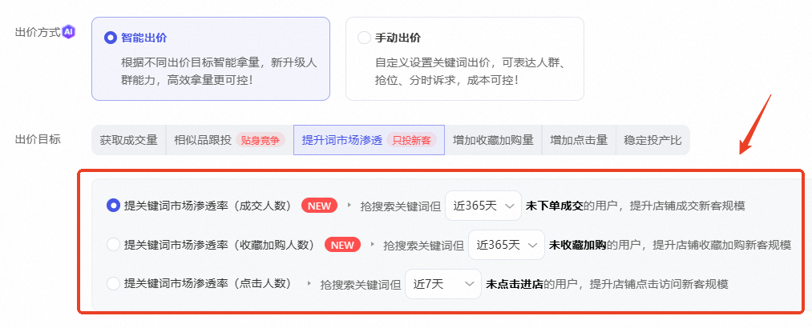
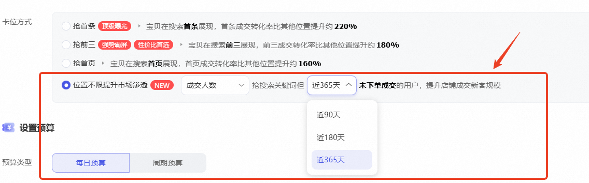
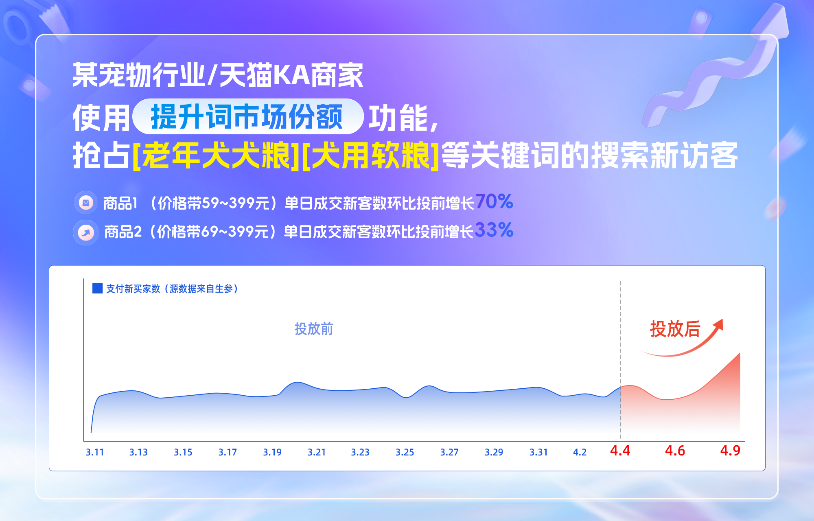

# 「提升词市场渗透」突破升级，支持投搜索365天未购新客!

> 来源：https://alidocs.dingtalk.com/i/nodes/jb9Y4gmKWrx9eo4dCp6GZOQkJGXn6lpz

**「提升词市场渗透」突破升级，支持仅投放搜索新客！给店铺带来新增量，突破流量瓶颈！**

**本期升级点**

**可投搜索未成交用户****（新增升级）****：90天、180天、365天****成交新客****灵活任选**

**可投搜索未收购用户****（新增升级）：****90天、180天、365天****收购新客****灵活任选**

**可投搜索未进店用户：7天、15天、30天、90天****进店新客****灵活任选**

**举例：**美妆商家可投放“今日搜索**精华**且 **365/180/90天店铺维度未成交/收加/进店消费者**”；通过关键词搜索行为实时拦截，将精准搜索用户转化为店铺专属资产，大促蓄水、转化精准消费者必用！

**操作路径**

**路径1：关键词推广->自定义推广 ->智能出价->提升词市场渗透**

**路径2：关键词推广->搜索卡位->搜索卡位->提升词市场渗透**

**优质案例**

