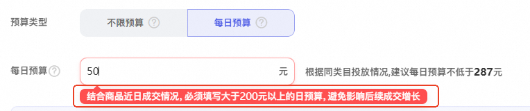
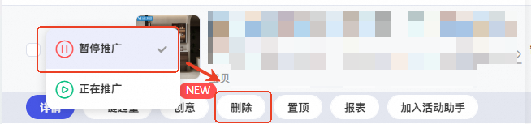

# 起投门槛限时降低（已暂停开客）

> 来源：https://alidocs.dingtalk.com/i/nodes/lyQod3RxJKe9QjOMi23Nw0N9Wkb4Mw9r

货品全站推广日预算模式起投门槛太高，想尝试投放更多单品，却感觉单品日预算起投门槛太高？面向定向邀约商家，本次限时降低货品全站推广起投门槛！

权益面向商家：定向邀约商家

权益内容：开通商家会根据平台规则圈选店铺内1-10个商品降低门槛，门槛会降低至初始起投门槛的60%-80%不等，具体以后台显示门槛为准

如何查看降低了门槛的商品？在宝贝选品页面，可看到如下“门槛降低”标签，存在标签的商品即为已降低门槛的商品

生效范围：仅针对货品全站推广-控成本投放模式中的每日预算模式

注意事项：若当前计划存在货品全站推广投放状态为“暂停中”的计划，需要将计划先删除，再重新新建，门槛降低权限才会生效

