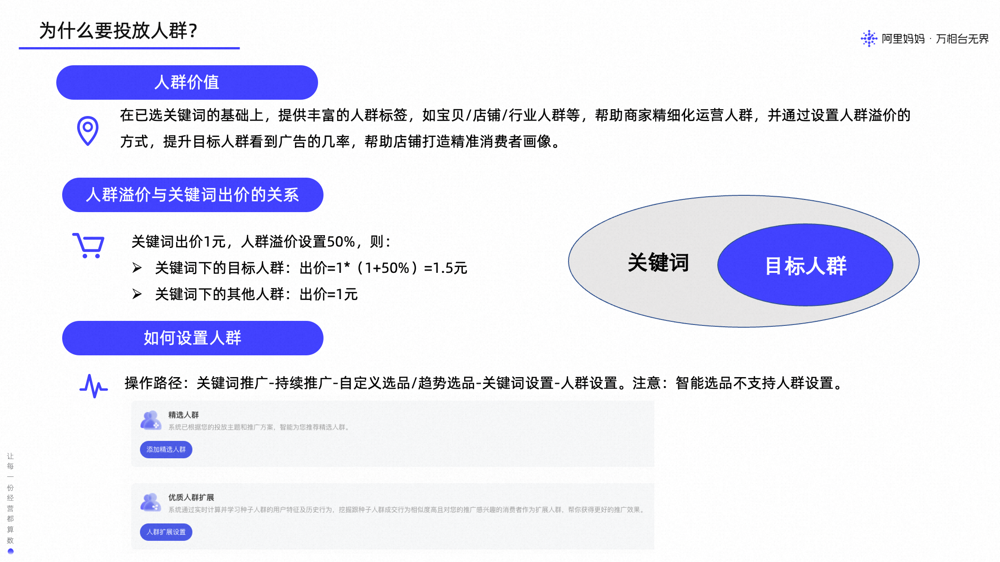
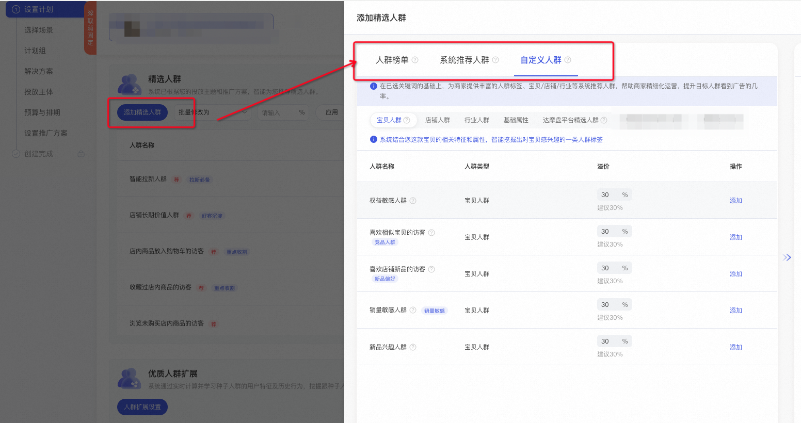
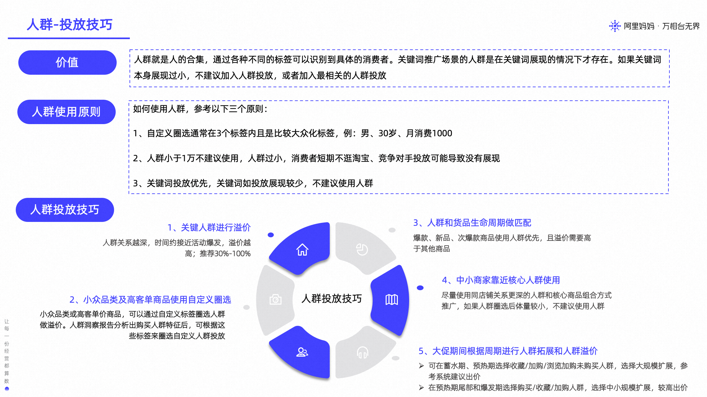

# 关键词推广-关键词场景下为什么还要投放人群？

> 来源：https://alidocs.dingtalk.com/i/nodes/lyQod3RxJKe9QjOMiPQROEroWkb4Mw9r

**原语雀文档链接：**https://yuque.antfin.com/chenchun.chen/gqhty9/esvhw1wtx0u66mm4

---

# **一、功能价值**

# **二、功能入口**

**操作路径**：关键词推广-持续推广-自定义选品-关键词设置-人群设置

注意：只有【自定义选品】+【手动出价】，才可支持添加人群投放。

商家可根据自己的需求，选择合适的自定义人群进行投放。自定义人群包括：宝贝人群、店铺人群、行业人群、基础属性、达摩盘平台精选人群

# 三、概念解释

### 1、直通车人群是在关键词展现的情况下才存在

没有关键词，不存在人群概念。若关键词出价过低，导致关键词无展现可能，即人群不存在，人群出价高低无意义，此时人群也拿不到流量。

### 2、人群溢价

人群的溢价是对某类特别想投放的人群增加出价，以提升目标人群搜索时看到广告的几率，但不是说只投放这类特定人群。

举例：关键词【连衣裙】基础出价1元，人群25-30岁女溢价50%，除此之外没有设置其他溢价条件

如果搜索的人是28岁女，那么出价为1.5元

如果搜索的人是20岁女，那么出价为1元，而不是不出价！！！

# 四、投放技巧

# **五、常见问题**

### **1、为什么圈选多个标签后，人群推广没有展现或者展现少？**

多个标签下的组合人群体量过少，加上这些人群也被其他人投放，可能符合的人群最近没逛淘宝，那么就会出现投放人群无展现或展现少的问题。建议人群标签圈选在3个标签内，且人群覆盖数尽量大于1万

### 2、商品定位是男性、三十岁、月均消费1000，产品早期推广直接用这类人群？

不建议，原因如下：

产品早期的人群定位和实际市场情况可能有所差异，还有其他人群会进行购买消费

产品早期推广更加建议用精准的关键词匹配积累数据，可开通智能拉新人群功能，后续查看实际表现好的人群加入推广（推广7-15天后）
