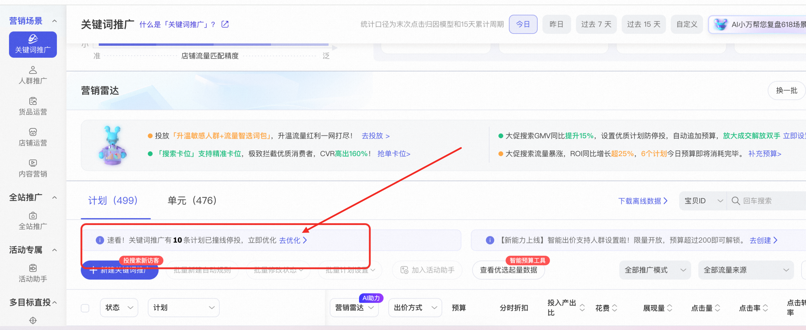

# 关键词推广「计划预警」弹窗，为您的投放保驾护航！

> 来源：https://alidocs.dingtalk.com/i/nodes/lyQod3RxJKe9QjOMiPjmz4oZWkb4Mw9r

# **一、哪些计划会触发系统预警？**

### **1、哪些计划会触发「计划撞线预警」？**

系统每日巡检，今日实时已撞线/即将撞线的计划，会触发计划撞线预警。具体条件为

已撞线计划：预算已花完的计划

即将撞线的计划：今日实时花费/计划设置的预算>70%，该计划被认为是即将撞线

不是流量金卡和手动出价的计划

### **2、哪些计划会触发「计划展现预警」？**

系统每日巡检，今日实时正常投放但是没有获得展现/低展现的计划，会触发计划展现预警。具体条件为：

计划的投放状态为在线

截至当前计划展现小于100的计划

投放诊断正常（如宝贝创意等审核通过）的计划

不是最大化拿量、手动出价、流量金卡计划

# **二、作为商家，我该如何优化计划？**

操作路径：关键词推广→计划列表上方找到下图小蓝条→点击查看「已撞线/即将撞线、无展现/低展现」的计划→一键采纳建议

# **三、常见QA**

### **1、预算采纳次日，是否会恢复初始预算？**

不会。举例：6月2日的初始计划预算是40元，6月2日当天采纳了系统建议/将预算上调至50元，6月3日该计划的预算为50元，不会恢复至初始计划预算。
