# 04-1-3 内容型/产业带/白牌商家超级短视频投放测试SOP

> 来源：https://alidocs.dingtalk.com/i/nodes/m9bN7RYPWdyrPBREcQA4LAlAVZd1wyK0

**原语雀文档链接：**https://www.yuque.com/yijiaoqu/vpgdoi/slawul

---

如果您是短视频商业化投流强依赖的商家，请收藏并查看本文，部分商家从0元到超级短视频日均投放30万，ROI及相关成本持续打正，30天卖爆单品！

# 如何选视频？

投放效果的好坏，有一半是由视频创意本身决定的！

**视频尺寸：**竖版视频720×1280（9 ：16）

*如果您上传的视频不是9 ：16的尺寸视频可能会发生以下裁剪及填充

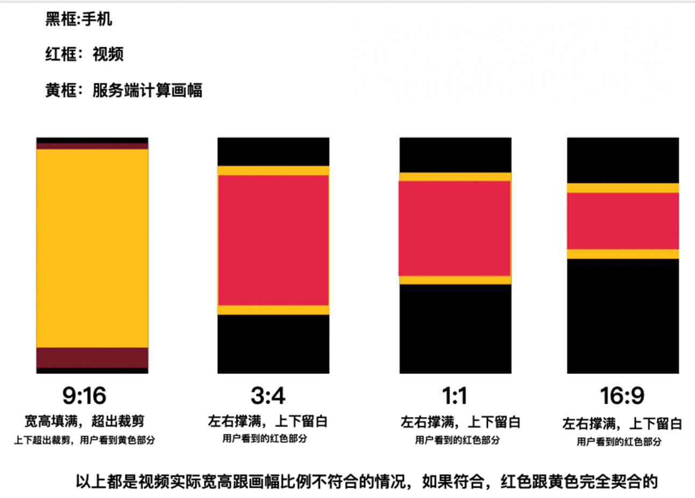

**视频标题：**产品功效+利益点（手淘首页猜你喜欢显示约10个字）

**视频封面：**封面建议打上显眼花字，和标题表达一直的内容，关注创意本身，短视频封面很重要

**视频内容：**15S-60S内的短视频，视频前3秒很重要，直接说重点

**已发布视频的选择：**

视频智选：您在超级短视频后台-智能选择-全店视频，进行潜力视频探测和优质视频打爆

视频种草力：您在超级短视频后台-自定义选择-添加视频后，可以按照视频种草力选择优秀的视频进行投放

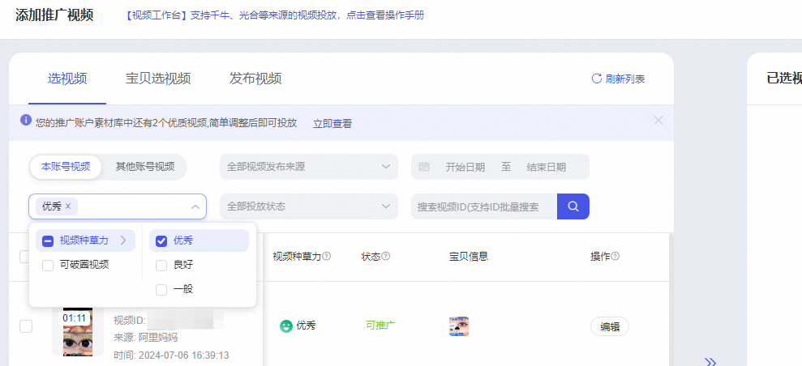

历史爆款：如您的视频在其他平台有过优异转化表现，在免费流量有过不错的转化，可以选择该视频进行投放

**选多少视频投放**：建议在测试阶段储备不少于100条视频来投投放

# 如何在超短后台上传视频

1.您可以在在超级短视频后台-自定义选择-添加视频-发布视频进行视频本地发布

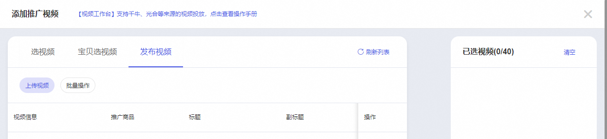

2.您可以在万相台无界-素材管理-视频素材进行视频本地发布

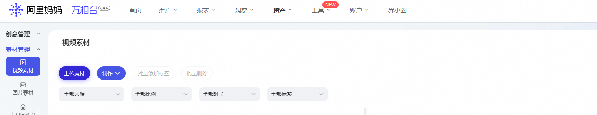

3.您也可以在光合后台进行视频发布，在超短后台选择投放

*无论您选择在哪个后台发布，在视频的推荐和流量上并无差异

# 如何选品？

可以通过短视频表现产品功效，使用效果的货品最适合进行商业化投放！

目前内容商家的几个选品来源

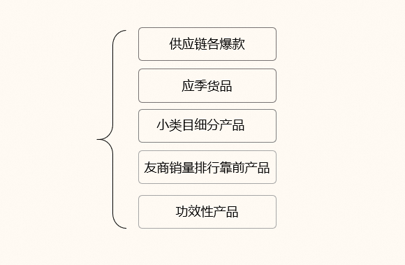

**价格设置**

玩法①高定价高利润品进行超短的推广，50%以上的成交金额用于超短投放

玩法②也可以通过爆品设置低价引流到店铺，通过超短去做拉新，关键词去做收割，积累人群资产，积累收加进行后续的成交

注意：新店新账户投放超短，建议选择只锚定一个品进行推广；多品类推广可以在账户稳定，投放有较多的数据积累后进行

# 如何搭建计划？

测试初期，需要7天左右的时间来度过冷启动，建议准备2000-5000元左右的预算

建议内容商家选择超级短视频-视频加速-促有效观看进行推广投放

建议选择以下方式设置计划

1.单个计划每日预算100-300元

2.选择最大化拿量出价

3.建3-5个计划，以下两种方式可以并行，建议前期不要放太多品类进行测试，集中测试店铺1-2个品即可

按照品的聚合建计划，如货品A同时添加20条挂载该品的短视频进行投放

按照视频建计划，如计划A推荐视频A，计划B推广视频B

​

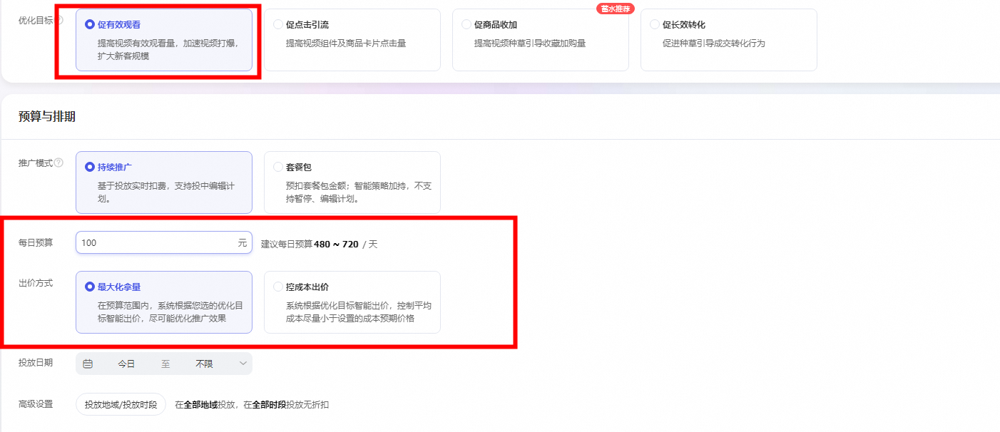

# 如何度过冷启动？

如果一个视频已经积累了超过1000VV，最多投放到7天，我们判断这个视频已经过了冷启动，基本可以判断视频的投放效果，同时可以以视频种草力为参考，判断视频效率

一般来说，一个新的计划需要2小时左右的时间才会慢慢起量，视频审核大约需要2-4小时的时间，请商家耐心等候；

注意：不要频繁的修改计划，如修改出价、修改人群、添加删除视频、开启结束计划等；每次编辑都会让导致计划冷启变慢，或者出现爆量快速消耗等问题

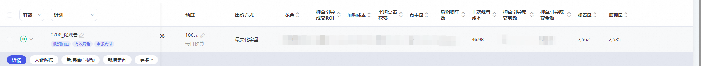

# 需要关注的数据指标？

实时数据可以观测：花费、点击成本、加购成本、种草成交相关数据

注意当日内计划的ROI 及 花费 可能分时会有波段，属于正常的情况，请不要担心；商家需要重点关注次日的ROI，最为准确

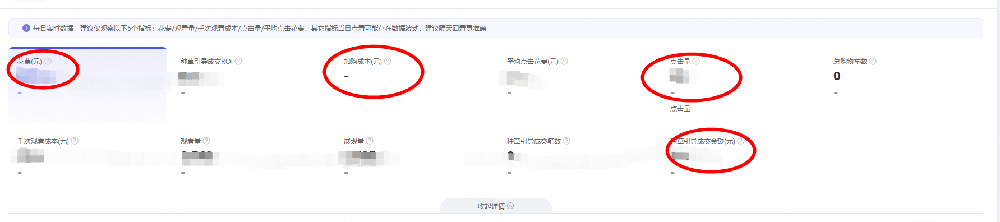

# 人群的选择和优化？

智能人群是必选的，建议新商家初期投放超短以智能人群为主

投放稳定后，可以添加喜欢我的视频的人群，关键词相关人群、相似店铺、喜欢我的店铺的人群

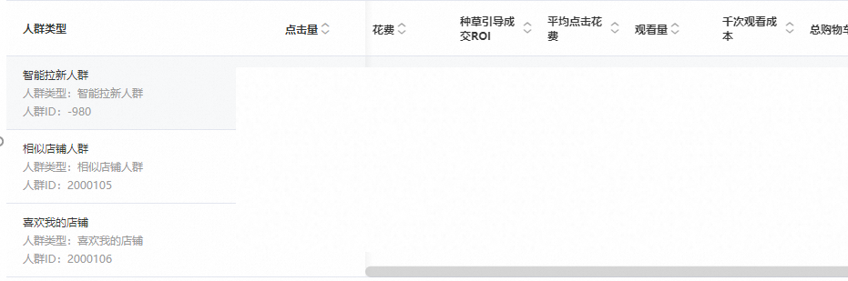

# 如何优化计划？

1.能够放量的计划，拉长时间维度看计划的数据，ROI符合预期直接增加预算放量；计划内有些视频好有些视频坏，删除ROI差的视频，继续放量；如果一个计划内只有一个视频能放量，可以直接只投放可以放量的视频；增加新的计划测新视频

2.如果投放的是观看目标，基本上种草力优秀，该计划ROI是比较好的，可以参考种草力来判断计划的效果；如果一个视频3-5日内质量分都不高，基本可以放弃

3.可以选择小预算多计划来搭建账户

# 商家投放案例

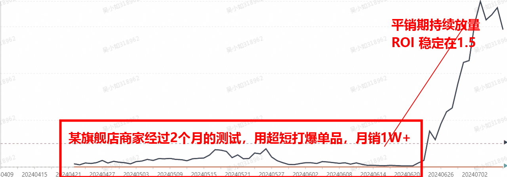

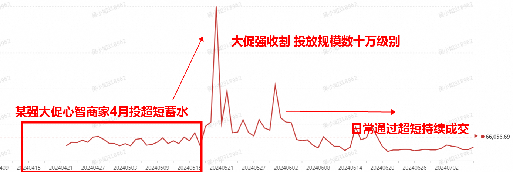

# 常见的问题

#### 1.超级短视频会有冷启动吗？

新计划和新账号都会有冷启动，请商家给计划多一点时间和耐心

#### 2.计划冷启动需要多久？

如果一个视频已经积累了超过1000VV，最多投放到7天，我们判断这个视频已经过了冷启动，基本可以判断视频的投放效果，同时可以以视频种草力为参考，判断视频效率

一般来说，一个新的计划需要2小时左右的时间才会慢慢起量，视频审核大约需要2-4小时的时间，请商家耐心等候；

**注意：不要频繁的修改计划，如修改出价、修改人群、添加删除视频、开启结束计划等；每次编辑都会让导致计划冷启变慢，或者出现爆量快速消耗等问题**

#### 3.计划效果不好怎么办？

能够放量的计划，拉长时间维度看计划的数据，ROI符合预期直接增加预算放量；计划内有些视频好有些视频坏，删除ROI差的视频，继续放量；如果一个计划内只有一个视频能放量，可以直接只投放可以放量的视频；增加新的计划测新视频

可以选择小预算多计划来搭建账户

多测试视频，多测试视频适合的投放目标

#### 4.计划不消耗怎么办

先检查视频素材是否被拒绝，按照诊断建议修改

若计划无异常，联系小袋鼠和运营小二核查

直接重新创建计划

查看账户余额是否＞0

#### 5.计划无展现怎么办？

可能是视频创意过期下线，可以重新创建计划投放

#### 6.计划快速消耗怎么办（什么是快速消耗）

短时间内消耗超20%的预算，可能是快速消耗，计划若遇到集中消耗的问题，可以联系小袋鼠提交工单处理

#### 7、新账号需要搭建多少个计划

建议搭建3-5个计划，以下两种方式可以并行，建议前期不要放太多品类进行测试，集中测试店铺1-2个品即可

按照品的聚合建计划，如货品A同时添加20条挂载该品的短视频进行投放

按照视频建计划，如计划A推荐视频A，计划B推广视频B

#### 8、复制跑的好计划有用吗

不一定，最好不要完全一模一样的复制，建议复制计划的时候做不同搭配，去投放不同的定向人群或者营销目标，或者新建全新的计划使用全新的创意，这样也会浪费新计划的测试预算。与其把预算花给已经有投放反馈的计划类型，不如给新计划多一些探索预算，至少知道新计划的目标/人群/视频好或者不好。

#### 9、复制计划会抢量吗，会投给相同的人群吗？

投放设置完全相同的计划，有可能去竞争同一部分用户群体，不建议盲目复制之前的老计划基本不做什么改动，投放设置完全相同的计划，也会让账户的计划比较重复冗杂，也有可能去竞争同一部分用户群体，即使复制的部分计划可能效果好，但是所有计划的总量效果不一定是变大的。

#### 10、投的不好的计划和视频需要及时暂停投放吗？

首先需要对计划保持耐心，拉长时间来看计划和视频的数据表现来决定是否暂停：

投放效果较差的计划或者计划里的单个视频，比如一直消耗不出去，系统没有任何异常提示建议，可以暂停重新建计划

跟在投计划相似严重且数据表现不佳的计划可以暂停投放

一直处于空耗的计划，若您的是需要长期种草的视频和商品，可能因为转化回流比较慢，可以适当延长观察时间，若投放7天后还是不符合预期，根据您的投放经验暂停

#### 11、计划有消耗，但是ROI一直不稳定怎么办？

实时roi可能会有一点波动是正常的，调整计划可能导致数据有一定波动，比如修改出价、修改人群、添加删除视频、开启结束计划等；每次编辑都会让导致计划冷启变慢，或者出现爆量快速消耗等问题，不建议对计划做频繁的调整，另外数据流量也会受到市场竞争趋势及市场流量的影响，次日看roi会比较准确，拉长周期来看roi是符合预期的即可

#### 12、计划有消耗，但是一直没有成交怎么办？

对新建的计划可以多一点耐心，给足计划充分的冷启时间，至少7天：

若计划消耗＜100元/天，连续投放7天一直没有成交，可以暂停新建计划

若计划消耗＞100元/天，连续投放7天一直没有成交，先从素材优化入手，对视频素材进行优化调整

#### 13、提高投放效果的几个动作

投放设置：若商家以roi为首要目标，在选择营销目标时建议优先选择长效转化目标（有效观看目标）

人群定向：开启人群调优，提高自定义人群竞价，算法更好竞得种子人群；在促商品收加和长效转化目标下开启种草人群追投提升roi效果

#### 14.如何通过超短获取新客（365未购新客）

使用超级短视频-过滤人群功能-过滤购买人群（7天/15天/30天/90天/180天/365天）

使用超级短视频-内容破圈人群-店铺新客覆盖率提升

#### 15.付费流量影响自然流量吗？

不影响。

#### 16.超级短视频本地上传可以拿到自然流量吗？

在超级短视频投放的视频也可以在自然流量拿量，包括视频商品和视频都有机会拿到自然流量，均有机会进入推荐入池拿到推荐流量，同时可以在参考生意参谋-商品流量，观察流量数据。

**1）如何帮助视频拿到自然流量**

整体围绕提升信息流ctr/3snd有效停留两个指标进行素材优化，符合基础入池素材标准的方可进入猜你喜欢分发。

👉具体查看：猜你喜欢-行业通用优质素材标准(新)

基础素材要求：

尺寸建议：9:16或者3:4

时长建议：720p以上/时长>=5s，主推15s～90s

**2）如何帮助商品拿到自然流量**

基础入池要求：需要同时满足以下规则可入推荐基础池

基础负向（如包含敏感词/类目错放/营销新8条等）

剔除1、2星价格力

店铺体验分≥4.3分

七天无理由/包邮（命中其一即可）

主图4张起

月销量≥5

目前可优先优化ctr、cvr

CTR提升-可优先优化素材：符合基础尺寸/清晰度/素材数量/基础素材规范。

CVR提升-可优先优化权益（以下规则同样也是加分项，有额外加权侧重）**：**

平台背书：双11、618等S+/S级大促、小促、小黑盒、ifashion、聚划算、百亿补贴、**新品**；

品牌商家：天猫头部品牌core1000、品牌调性分6分以上、品牌4/5星价格力；

用户权益（对用户有折扣力度）：新享、88vip、新品礼金等；

服务履约：包邮、运费险、极速退款、物流体验分、客服响应速度等；

热点商品：如与电影“热辣滚烫”相关商品等；

💡视频商品进入基础池分发，在效率达标（核心考核指标：时长+GMV）的情况下进阶，进入精品池，持续分发甚至可以进入爆品池！

#### 17.短视频准入规则

https://rule.alimama.com/?spm=a311a.7996332.0.0.6d953080iFPrG0#/detail?&query=%7B%22id%22%3A11005606%2C%22categoryId%22%3A%221126%22%7D

#### 18.商品准入规则

https://rule.alimama.com/?spm=a2e1vs.26155762.0.0#/rule?query=%7B%22parentId%22%3A%22371%22%2C%22categoryId%22%3A%2240502%22%7D

#### 19.如何处理创意审核拒绝？

根据系统提示的审核拒绝原因，针对视频进行修改调整

若拒绝原因是光合审核拒绝，可以选择在超级短视频本地上传该视频进行投放

为了增加商家可推广的短视频数量，超级短视频支持您在光合发布并不存在内容违规的视频投放，广告审核标准不变；同时，建议您使用超级短视频后台的本地视频上传功能，更加便捷快速的进行视频推广投放

#### 20.常见的几个审核拒绝的原因?

妈妈审核如何处理

👉具体查看：

https://alidocs.dingtalk.com/i/p/L4BYmaLl7xrrXNA8dBgX4k5x9A0pPz8e?dontjump=true

光合审核：

👉具体查看：https://browser.alibaba-inc.com/?Url=https://spzx.yuque.com/org-wiki-spzx-hrxgtf/qip26n/rgyp3hi36yiiqnyx

光合审核拒绝-视频重复——这部分有问题，进群处理：8160027228

#### 21.光合过审视频，为什么在超级短视频后台提示不能投放？

T+1查看是否能投放，若不能推广，可联系小袋鼠

#### 23.视频拒绝，但是还有消耗，怎么办？

原因是前台提示拒绝，但是被投放到的部分渠道被拒绝，所以还会有消耗，遇到这种情况可以先暂停投放，新建计划投放

#### 24、本地上传的视频，如何删除

万相台-资产-视频素材，搜索视频ID，可以对视频进行删除

#### 25、一键生产的视频，如何下载？

在超级短视频一键生产的视频，可以在万相台-资产-视频素材搜索，点击视频详情，在视频播放页面右下角点击下载

#### 26、视频一直在审核，怎么办

| **视频来源** | **视频状态** | **状态描述** | **含义** | **子状态提示** | **描述** |
| --- | --- | --- | --- | --- | --- |
| 光合平台 需通过光合平台审核和阿里妈妈审核，即可推广 | 光合审核通过 超级短视频提示可推广 | **可推广** | **表示****可创建****推广计划** | 无 | 说明视频通过了阿里妈妈基础审核 也通过了光合平台审核，能够获取公域流量 |
|  | 光合审核通过 超级短视频提示不可推广 | **不可推广** | **表示****不可创建****推广计划** | 提示平台审核中 请等待 或 提示具体拒绝原因 | 可能未通过阿里妈妈基础审核（含待审核） 鼠标点上去 会提示具体原因 |
| 阿里妈妈 通过“本地上传视频/一键生产”功能上传的视频创意。 仅需通过阿里妈妈审核，即可推广 | 超级短视频提示可推广 | **可推广** | **表示****可创建****推广计划** | 无 | 说明视频通过了阿里妈妈基础审核 |
|  | 超级短视频提示不可推广 | **不可推广** | **表示****不可创建****推广计划** | 提示平台审核中 请等待 或 提示具体拒绝原因 | 视频未通过阿里妈妈基础审核（含待审核） 鼠标点上去 会提示具体原因 |

#### 27、种草力代表什么？

种草力优秀会有拿量扶持，比如拿量成本更低，自然流量扶持。不过拿量好不等于效率好，跟roi没有强相关关系，种草力得分仅供参考，投放效果以实际的ROI为准。

#### 28、为什么有的视频没有种草力打分？

超级短视频视频种草力按照每日T+1更新打分，新视频需至少投放推广一天后才会显示；若计划停止投放一段时间，分数将被清零，故会出现有的计划有视频种草力有的计划没有的情况

#### 29.广告后台数据与生意参谋后台数据差异大？

生意参谋和广告报表，在统计的渠道规则上、具体指标口径上都存在差异，所以无法用生意参谋直接比对广告投放数据，广告投放效果以广告后台报表为准。

点击/访问的数据：

近期部分商家生意参谋的访客数呈现断崖式下滑的情况，是因为生意参谋的统计取数口径有差异，实际数据模块待生意参谋接入中，若商家有类似情况，可以先看广告后台的访客数为准。

生意参谋的访客数在微详情场景的访客数和点击数差异大,因为在全屏微详情下,消费者上下滑,不需要点击就可以完成访问,所以会出现点击数小于访客数的情况

成交相关的数据，统计口径差异大：

生参的种草成交：必须要当天通过广告进店访问后，在当天内成交才算成交转化数据

超短的种草成交：与所有万相台产品统计方式一致，超短种草成交=直接引导成交＋间接引导成交，归因可选展示/点击，统计时间可选3/7/15/30天。其中直接引导成交指视频挂品引导成交，间接接引导成交指购买店铺其他商品的成交(即通过A品视频进店，买了B品，则统计为间接引导成交，万相台产品均为此逻辑）

所以：1⃣️生参的种草成交，统计的是单品维度；超短的种草成交，统计的是全店维度2⃣️超短的直接引导成交，计入生参种草成交；超短的间接引导成交，不计入生参种草成交，但这部分价值也很大，毕竟是通过内容产生的进店流量，也买了其他品，人群是准的

实时数据有差异：

生意参谋-单品流量来源-实时数据，超级短视频广告流量大于所有流量总和的情况，出现较大的实时数据差异时，建议以第二天产出的离线报表数据为准。原因是由于个渠道流量计算量大且会有一定的数据延迟，同时需要对异常数据进行过滤，故第二天的离线数据是准确的。

👉具体查看：【生意参谋】超级短视频数据在生意参谋中如何查看

#### 30、引导进店量比观看量多，是什么原因？

超级短视频的引导进店量包括观看量和访问量

#### 31、计划页面和表报表页面的数据不一致？

超级短视频有2种统计数据的口径分别是展现效果和点击效果：

展现效果——指广告被用户观看3秒以上或产生点击行为后，该用户后续的进店/收藏加购/购买等行为将被计入广告引导效果。在此口径下，超级短视频的广告引导效果与阿里妈妈其他广告渠道不互斥。

点击效果——指广告被用户观看3秒以上或产生点击行为后，该用户后续的进店/收藏加购/购买等行为，将被统计入效果数据。在此口径下，超级短视频的广告引导效果与阿里妈妈其他广告渠道按照末次触点归因互斥，即超级短视频作为「最后一个触点」被用户观看3秒/点击后，后续的进店/收藏加购/购买等行为将被计入广告引导效果。末次触点归因口径与阿里妈妈其他推广产品和生意参谋保持一致。

#### 32、超级短视频的数据如何正确查看：

先确定数据口径,再看归因周期

超级短视频-计划页面：展示每日实时数据，统计口径为展现效果归因模型和15天累计周期，建议仅观察以下5个指标：花费/观看量/千次观看成本/点击量/平均点击花费。其它指标当日查看可能存在数据波动，建议隔天回看更准确

万相台-报表-短视频页面：可选展现效果归因/点击效果归因，统计时间可选3/7/15/30天。在展现效果归因口径下，数据与计划页面一致；在点击效果归因口径下，数据与妈妈其他广告归因口径一致

**33.观看量和展现激增，但是点击量没有上涨？**

计划有展现但是没有点击/点击少，主要和您的创意质量有关的 ，同时和您设置关键词覆盖情况（比如匹配方式、词 、地域、精选人群）影响的 ，并且点击的动作是买家的自主行为，如有展现没有点击/点击少 ， 建议优化创意关注推广数据。

#### 34.如何联系小二

钉钉群：81920001200

小二钉钉：zaichun6262
