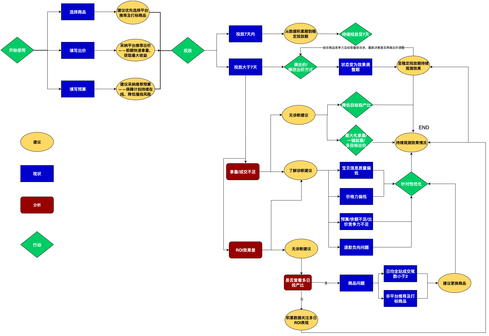
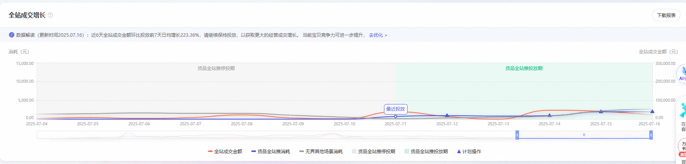

# 控投产比投放指导

> 来源：https://alidocs.dingtalk.com/i/nodes/m9bN7RYPWdyrPBREcgzkLDryVZd1wyK0

## 全文太长？可以先看这张图

# **产品原则说明**

#### **1、****货品全站推不是普通推广计划**

货品全站推从机制上付免一体，可触达淘系全局流量，与传统推广计划只能触达部分资源位，有本质的区别。正是这一付免联动的机制，货品全站推可以撬动商品在淘系全局流量的成交，同时交付的也是商品在全局流量的整体效果数据，因此不支持**单独拆分数据**。请商家关注投放后商品整体的GMV增长情况和整体投产比

#### **2、****互斥原则**

为了更好的撬动和交付推广商品全局流量的整体效果，同一商品开启货品全站推后不可同时投放其他推广。同一商品（同一个宝贝id）也仅允许开启一条货品全站推。一旦商品的货品全站推开启，这个商品的其他推广会暂停；同一宝贝在商品推广&全店推广同时仅一条计划可投放

#### **3、****整体原则**

投放后不支持拆分商品的免费流量和自然流量，请商家关注投放后商品整体的增长情况和整体投产比

#### **4、****看数原则**

**数据积累期**的新计划投放，主要目标是让计划尽快积累数据、出单、进入稳定投放期，采用**提出价（降低目标投产比）、一键起量、多目标出价、切换至最大化拿量**的过程中**，**实际投放ROI会有波动，属于正常情况，请持续投放保持观察

**稳定投放期**的计划，建议持续投放，**观察7天以上的整体投产比**。单日数据因转化累积时间较短，可能存在波动

​

​

# **投放效果评估**

**1、预期效果**

投放货品全站推后，在商品全局流量的ROI（总成交/总花费）基本持平的基础上，货品全站推带来的全局流量成交额，即货品全站推总成交额，**提升20%～50%**（供参考。数据来自测试商品的整体表现，不同商品因本身基础、类目、竞争的差异，个体投放结果存在差异，请以实际为准）

**2、效果评估**

通过评估投放前后商品数据变化，在全局流量整体ROI基本持平的情况下，整体全站GMV有无提升

**评估途径**：货品全站推-货品全站推结案-全站增长，可对比货品全站推未投放和货品全站推投放期的消耗和成交金额，评估投放货品全站推带来的增长

**3、效果评估对比前提和注意**

尽快让计划从数据积累期到稳定投放期（采纳系统建议出价、设置一键起量、最大化拿量），过程中投放ROI和跑量可能会不稳定，请持续投放，耐心观察

尽量用**稳定投放期**的数据对比投放前的数据。同时建议多天均值对比，如投前7天对比投后7天（排除大促、淡旺季等影响）

​

​

# **货品全站推怎么投效果好**

| 方向 | 问题点 | 建议操作 |
| --- | --- | --- |
| 基础原则 | 货品全站推适合哪些商品 | 新品、爆品、潜力品都可以投放货品全站推，提升拿量能力，撬动全站整体成交 建议优先选择「平台推荐」、「流量助推」等标签的商品，系统优选商品拿量提升更快 同时需要注意优化**商品创意**、**转化率**等内功，设置系统推荐范围内的**出价**，优化提升推广的综合竞争力 |
|  | 要投放多久才能跑稳 | 新建的计划起始投放，处于「数据积累期」，投放相对不稳定 建议持续保持投放，设置有竞争力的出价，尽量避免频繁修改目标投产比，计划直接引导成交笔数积累20-50笔可进入稳定投放期 |
|  | 资源位在哪里 | 货品全站推已接入淘系全局流量流量，包含搜索结果页、搜索结果页-销量排序、首页猜你喜欢、购中猜你喜欢、购后猜你喜欢等 |
| 投前设置 | 如何选品 | 建议优先选择有「平台推荐」、「流量助推」等标签的商品，算法挖掘的成交潜力品，立即推广销量提速，满足条件可获得成本保障权益 |
|  | 如何设置出价 | 目标投产比=推广在15日内引导用户产生的所有支付宝交易的总成交金额/推广花费 目标投产比设置越低，拿量能力越强；设置越高，拿量能力越弱，请根据商品利润情况，合理设置出价 新建计划建议优先采纳系统推荐的高竞争力档位（即较低的目标投产比）出价，可以更快撬动更多的总成交金额提升，并享多重权益激励 |
|  | 如何设置预算 | 算法基于商品历史投放数据和笔单价，设置了最低日预算，可以在此基础上设置商品投放一天的预算 如果计划正常跑量提前下线，建议提升预算至计划日消耗的2倍以上，以保证计划全天在投 当投放稳定后，建议设置为不限预算，以保证稳定获取更多GMV |
| 投中优化 | 如何获得更大的流量 | 采纳系统推荐的高竞争力档位（即较低的ROI）出价 开启「一键起量」，系统利用部分预算快速起量 切换至「最大化拿量」投放，系统在预算范围内尽可能帮助拿量 优化商品基础，提升创意竞争力（点击率）和转化竞争力（转化率） |
|  | 日预算和出价调整 | 不建议每天调整日预算，日预算的设置需要能支撑计划持续在线投放 出价每天建议不要调整超过两次，同时每次调整的幅度不宜过大，尤其是目标投产比设置较低时，调整幅度要尽可能小 充足的预算和稳定合理的出价有助于计划更稳定跑量 |
|  | 怎么看ROI | 在计划投放列表页可看投放实时投放ROI，因短期投放数据存在较大波动，建议您保持投放，观察多天整体效果； AI效果智达升级全面提升投产比稳定交付 |
|  | ROI不好怎么调整 | **计划处于「数据积累期」**，投放不稳定。建议**持续保持投放，尽量避免频繁修改目标投产比**，计划直接引导成交笔数积累20-50笔可进入稳定投放期； **计划开启了「一键起量」**，加速拿量期间成本会波动，**属于正常现象，请继续保持投放**； **计划开启了「多目标出价」**，系统探索多维目标提升，主计划请关注基础预算的效果，多目标投放效果请至计划详情-投放调优查看 **计划切换到了「最大化拿量」**，系统加速拿量引起成本波动，请**参考系统预估GMV设置合理的日预算**； **近期频繁调整出价**，会导致效果波动，建议您综合近期出价记录来评估效果，同时**尽量设置系统推荐范围内的出价，并避免频繁大幅度调整出价**； 投放的**数据量较少**，较低的消耗金额，或者较少的订单数，让短期的实际投产比看起来有波动。系统会尽可能优化计划整体的效果，建议您**拉长时间周期和消耗金额，看整体的效果达成** **处于平销期和大促周期的切换节点**，大促周期建议关注**「长周期整体ROI」，并避免大促期间频繁调整出价类型、出价设置，同时保持充足的日预算** **排除以上原因，效果仍较差的（实际投放ROI低于目标ROI*0.7），满足相应条件，可申请赔付** 详见 【控投产比出价成本保障】 |
| 投后复盘 | 怎么看数据 | 可在投放列表页跳转「报表」看多日投放数据，根据数据评估计划整体投放效果 评估前提：尽量用**稳定投放期的数据**对比投放前的数据，同时建议多天均值对比，如投前7天对比投后7天 再结合生意参谋或者全站增长数据，分析投放商品投前投后变化情况，判断投放效果（具体见前面产品说明的投放效果评估） |

# **投放问题及解法**

## **1、ROI效果问题**

| **排查方向** | **原因和排查路径** | **解法和建议** |
| --- | --- | --- |
| 是否处于「数据积累期」 | 新建计划一般会经历投放的数据积累期、效果&拿量都会存在不稳定情况，这期间系统会快速学习积累计划的投放情况以便后续更好的调控计划效果 | 计划处于数据积累期时，建议通过诸如开启一键起量、降低ROI设置值、增大预算等方式实现拿量能力提升快速度过数据积累期； 当计划处于稳定投放期，系统会尽可能保证ROI达成，若不满足则有机会享成本保障赔付 |
| 是否开启一键起量 | 开启一键起量功能一般会加速放量，此时会导致ROI有相应的降低或波动，属于正常现象 | 开启一键起量功能期间更关注拿量能力的提升，快速积累足够的成交数据帮助系统更好的优化计划投放效果 |
| 是否近期调整ROI设置值 | 对于「控投产比投放」，平台调控主要关注计划设置ROI达成情况，因此若ROI设置不符合平台推荐或频繁调整ROI设置值，可能会造成计划投放效果波动，属于正常现象 | 强烈建议ROI设置值处于平台推荐范围、且不要频繁调整，在满足一定条件情况下不仅可享受ROI采纳流量助推福利、还可享受ROI未达成赔付保障 |
| 出价类型 | 当出价类型从「控投产比投放」切换到「最大化拿量」，一般会造成拿量能力提升、ROI下降； 当出价类型从「最大化拿量」切换到「控投产比投放」，一般会造成拿量能力下降、ROI提升 | 建议不要频繁调整出价类型，否则可能会影响投产保障赔付生效；且每次更换出价类型后，建议保持3~7天的持续稳定投放，再观察计划效果 |
| 长周期ROI效果 | 当计划单日成交笔数较少时，会导致ROI计算的可信度较差，因此此时ROI的参考意义不大 当天看当日成交笔数一般不含多日归因效果，而货品全站推交付15日归因的成交，因此一般单日成交笔数会偏少 | 建议观察多日累积ROI效果，例如：观察近7日累积ROI效果与设置ROI关系、平台多日ROI交付更稳定！ |
| 退款负向影响投放 | 商品退款率较高or流量、大促等原因导致退款率波动较大，在计划目标投产比不变的情况下，实际去退投产比下降 | 建议切换至净成交出价，控制退款负向影响，优化净成交金额 |

## **2、跑量差，gmv偏低**

| **排查方向** | **原因和排查路径** | **解法和建议** |
| --- | --- | --- |
| ROI设置值是否高于平台推荐值 | 当ROI设置值远高于平台推荐值，可能会导致计划拿量困难；当投放过程中调整ROI设置值，计划会进入「效果调整期」，期间拿量能力也会存在波动 | 建议调整ROI设置值时在平台建议出价范围内，以提升计划拿量竞争力 不要频繁调整ROI设置值，否则会严重影响计划投放效果，造成拿量和ROI显著波动 |
| 是否近期切换「出价类型」 | 当出价类型从「最大化拿量」切换到「控投产比投放」，一般会造成拿量能力下降、ROI提升 | 切换出价类型后当日消耗波动属于正常现象，建议观察出价切换后稳定投放满一天的效果 为避免出价类型切换导致的消耗波动，建议不要频繁来回切换，请保持稳定投放，待系统优化 |

## **3、推广消耗变化问题**

| **排查方向** | **原因和排查路径** | **解法和建议** |
| --- | --- | --- |
| 是否近期开启「一键起量」 | 开启「一键起量」功能会显著提升计划的拿量能力，造成消耗波动，属于正常现象 | 开启一键起量功能造成效果波动是正常现象，只要ROI不出现显著下滑，保持持续关注即可 |
| 是否计划「创意审核不通过」 | 计划主图创意不通过会造成计划无法正常投放，当计划无法正常放量时，需要检查计划主图创意是否正常 | 通过平台提供的商品诊断能力检查计划创意状态，若发现创意问题请及时调整创意，保障计划正常投放 |
| 是否计划日预算发生变更 | 当计划为「最大化拿量」投放且日预算发生显著变更，则可能造成拿量波动，属于正常现象 | 建议「最大化拿量」计划增减日预算时定在「晚上22后」，避免日中增加预算造成短时集中消耗情况 |
| 是否「账户余额不充足」 | 账户余额不充足时会造成计划无法拿量 | 保持账户余额充足，保障计划稳定投放，可以考虑开启「自动充值」 |

## **4、商品整体生意涨幅不显著问题**

| **排查方向** | **原因和排查路径** | **解法和建议** |
| --- | --- | --- |
| 是否货品全站推消耗与无界消耗差距较大 | 当商品在「货品全站推」消耗显著低于「万相台无界」的投放消耗，可能导致商品投放货品全站推前后无显著GMV变化，属于正常现象 | 保持货品全站推投放消耗同万相台无界保持一致，此时全店GMV的变化才具备可比性，若全站推投入预算和无界保持一致但消耗显著降低，可检查是否是设置ROI过高(若是则可适当调低ROI) |
| 是否ROI设置值过高 | 当计划设置ROI相对较高时，此时计划拿量能力较差，很难撬动商品GMV增长，属于正常现象 | 若计划设置ROI高于平台推荐ROI，建议参考平台推荐ROI进行设置 若当前设置ROI在平台推荐范围内&实际投放ROI符合设置ROI、可考虑基于商品利润率进一步下调设置ROI值&保持预算充足来撬动商品GMV增长 |
| 是否处于「平销期」与「大促期」切换节点 | 判断当前流量环境是否是「平销期」和「大促期」的切换节点，在流量变化期间，货品全站推的生意撬动力度波动属于正常现象 | 平销期相对大促周期商品GMV撬动减弱属于正常现象，此时可参考同类目商品的GMV撬动变化趋势，保持商品投放在所属类目的竞争力较优即可 |
| 商品历史日均成交是否>0 | 若当前商品属于0动销商品或商品销量评价较低，数据积累不足，可能导致商品投放货品全站推撬动力不显著情况，属于正常现象 | 强烈建议投放「平台推荐」、「流量助推」等标签的商品，积累一定销量数据的商品，更容易在货品全站推被进一步撬动增量 |
