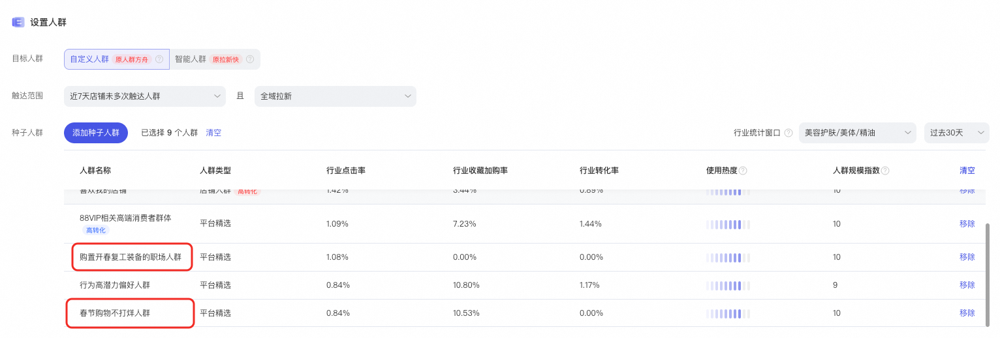
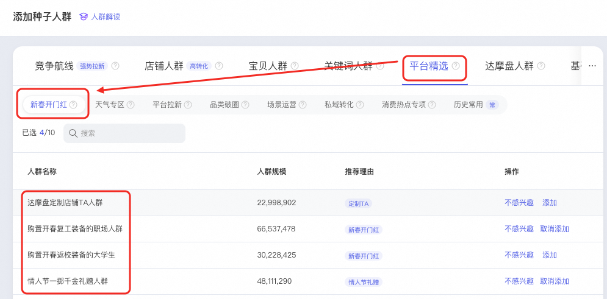
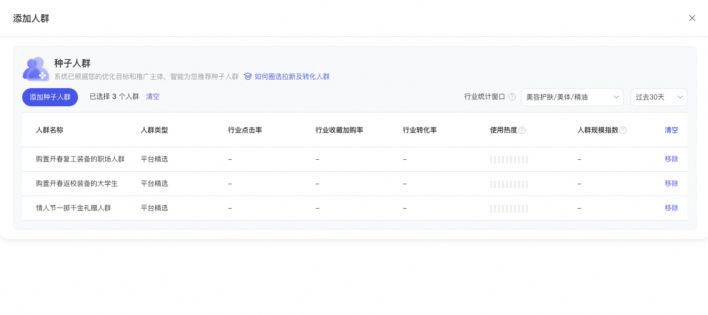
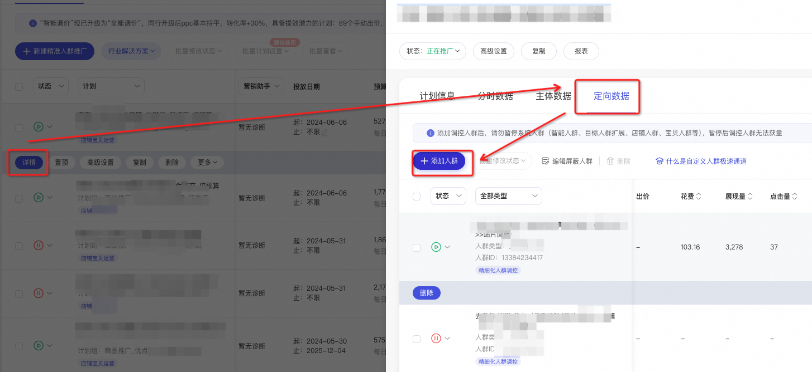
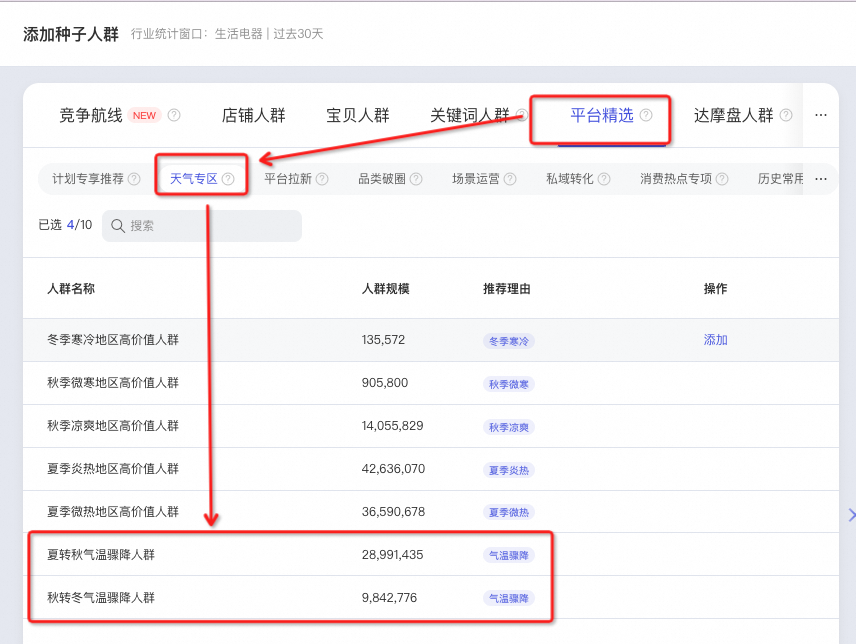
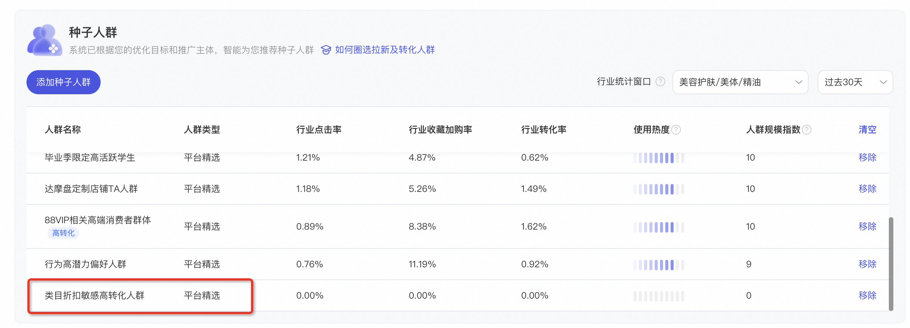
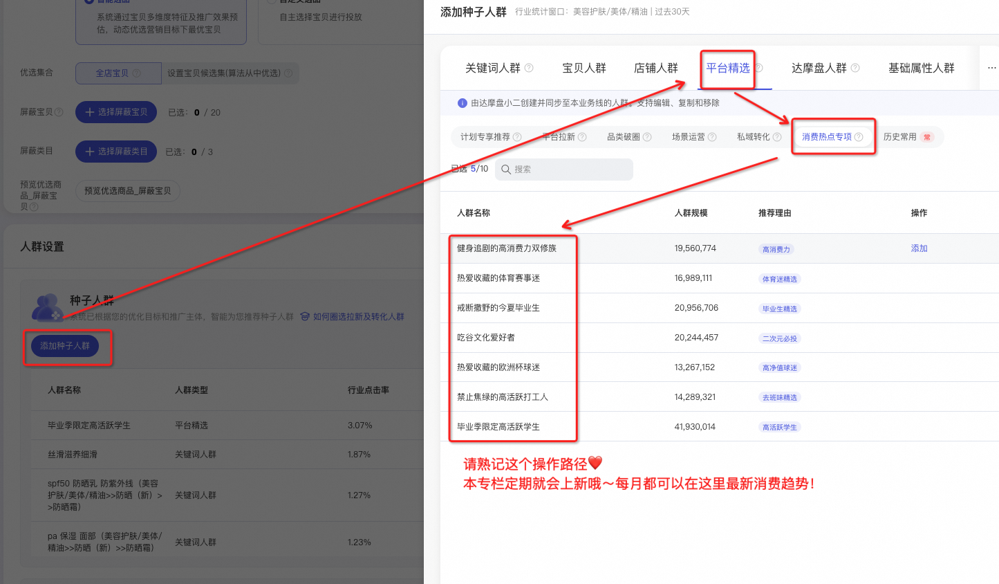

# 🙋「平台精选人群」上新ing

> 来源：https://alidocs.dingtalk.com/i/nodes/m9bN7RYPWdyrPBREcgzkLEXMVZd1wyK0

**【无界-人群推广】专属平台精选人群**** 持续上新中！**

**如您有相关疑问，欢迎加钉群反馈：**** 91690005511**

---

---

## *新建计划指引*

**算法优选：**可在设置人群——自定义人群——种子人群的默认推荐中，找到算法推荐您关注的**「开门红」人群****；**

**自行挑选：**进入平台精选页面，从**「开门红」**专区中自行挑选符合推广诉求的人群。

---

## *旧计划补充人群*

**批量计划补充人群：**

**入口👉**点击此处快速对批量计划添加本期人群

** **

选择您感兴趣的**机会****人群**，再选择需要补充人群的计划即可

**单计划补充人群：**计划管理页——计划详情——定向数据——添加人群，搜索您感兴趣的人群，并添加进计划。

---

## *投后解读与调优*

好奇** ****平台精选人群 **** **具体的人群结构？

包含**「开门红」人群**** **在内的全部平台精选人群，现已支持对**领券行为、高消费力、消费金额、88VIP、低退货率**人群标签做溢价调控！

操作解读详见：

## 历史人群

#### **2月开门红人群**

## **‼️ ****复工大吉！****请您查收本周最需关注的消费者群体 ‼️**

春日暖意，更有情人节将至

**初春买新衣、复工返校新装备、情人节送礼...**

想要**开门红****抢跑同行**？快把**以下人群**加入推广计划吧！

| **人群名称** | **人群逻辑解读** | **玩法推荐** |
| --- | --- | --- |
| **购置开春****复工装备****的职场人群** **购置开春****返校装备****的大学生** | 当前忙碌购置复工装备的**高消费力职场人群**，ta们期望通过更时尚或更具质感的鞋服配饰及彩妆护肤让自己焕然一新，也会买电脑、录音笔等数码产品提升工作效率。 当前忙碌购置开学装备的**高消费力大学生**，ta们期望通过鞋服配饰及彩妆护肤让自己焕然一新，会为更舒适的宿舍生活购置日用百货，也会买平板电脑等数码产品提升学习效率。 | **适用商家：**适用于**各行业各层级商家**！是近期的最具营销价值消费群体，建议开门红前期加重投放！ **适用商品：**适用于店铺不同阶段商品！爆品续航、新品冷启均可尝试！ |
| **服饰开春焕新** **高活高购人群** | 正在淘内**搜索含“早春”“春季”等关键词服饰商品**的行业下“双高”（高活跃度+高购买力）消费者，ta们对时尚趋势保持敏感，渴望通过潮流服饰展现自信与活力，是鞋服配饰等春季新品的必投人群。 | **适用商家：**适用于**服饰行业**全部商家！**春装上新**不要错过这波消费者！ **适用商品：**适用于所有的**春夏单品**！新品or存货均可投放！ |
| **情人节** **一掷千金礼赠人群** | 正在为即将到来的情人节认真做准备的消费者，ta们重视浪漫与品质，**愿意花费大量时间与金钱**为心爱的伴侣创造难忘的回忆，是彩妆香水、珠宝首饰、3C数码等适合情人节礼赠场景商家的必争人群。 | **适用商家：**适用于**各行业各层级商家**！情人节礼物精挑细选，人群记得提前布局！ **适用商品：**若您的商品能够匹配**情意送礼、取悦自我**等礼赠场景，强烈推荐您将对应人群加入推广计划！ |

#### 1月春节不打烊人群

**‼️春节不打烊，请关注年末消费新动向 ‼️ **

春节假期有闲暇，收藏加购不停歇！

**急现货、买春装、复工返校新装备、情人节送礼...**

想要**节后开门红****抢跑同行**？快把**以下人群**加入推广计划吧！

| **人群名称** | **人群逻辑解读** | **玩法推荐** |
| --- | --- | --- |
| **年末发货急急急人群** | **人群场景定制上新！** 春节临近，礼赠场景高频，不少消费者需要紧急下单现货，或赶在快递停运前紧迫购物。他们愿意牺牲对于价格、品质的要求，转而**高优关注商家发货时效性**，并对**商品的发货时间、发货地、快递公司**等物流信息格外敏感。 | **适用商家：**若您店铺有**物流优势**，推荐您**年货节持续投放**；若您店铺**发货即将停止**，推荐您**停止发货前加大力度投放**。 **适用商品：**推荐您投放**现货/发货快/物流快**等物流具备优势的商品。 |
| **春节购物不打烊人群** | 基于历史及当前行为数据预测，春节期间在**店铺主营**一级类目下仍有着强烈购买意向的消费者。ta们在结束一年工作后、在回到家人身边时，总还想买点什么，无论是犒劳自己还是礼赠亲友，是**春节期间商家可重点触达人群**。 | **适用商家：**适用于**不同行业不同层级商家**！春节期间计划补量的最优选人群！ **适用商品：**推荐您投放**现货**商品，以免产生高频退单行为。 |
| **「新春开门红」专区人群** | 购置开春复工装备的职场人群 购置开春返校装备的大学生 服饰开春焕新高活高购人群 情人节一掷千金礼赠人群 | **适用商家：**适用于**不同行业不同层级商家**！节后立刻进入开门红，假期必须抢先拿下活跃消费者！ **适用商品：**若您的商品能够匹配复工装备、春装上新、情意送礼等消费场景，强烈推荐您将对应人群加入推广计划！ |

#### 1月年货节人群

**‼️「年货节人群」带你玩转春节消费热潮 ‼️ **

冬季最后一场大促现已开售，莫忘**及时更新人群**！
**年末物流时效性、春节高频消费场景...**
年货节**人群攻略**详尽如下！一键添加投放，新春完美收官！

| **人群名称** | **人群逻辑解读** | **玩法推荐** |
| --- | --- | --- |
| **年末发货急急急人群** | **人群场景定制上新！** 春节临近，礼赠场景高频，不少消费者需要紧急下单现货，或赶在快递停运前紧迫购物。他们愿意牺牲对于价格、品质的要求，转而**高优关注商家发货时效性**，并对商品的发货时间、发货地、快递公司等物流信息格外敏感。 | **适用商家：**若您店铺有**物流优势**，推荐您**年货节持续投放**；若您店铺**发货即将停止**，推荐您**停止发货前加大力度投放**。 **适用商品：**推荐您投放现货/发货快/物流快等物流具备优势的商品。​ |
| **年货节「十大锦囊」人群** | 结合春节期间**“孝敬长辈”、“团圆聚餐”、“衣着焕新”、“家居布置”、“拜年礼赠”**等高频消费场景，达摩盘提炼十大锦囊人群，助力商家迎接年潮消费热，抓住新年增长趋势！**限时上线**，快来试试~ 细分人群解读见⬇️⬇️⬇️ 2025年货节趋势报告&达摩盘十大锦囊人群 | **适用商家：**适用于**不同行业不同层级商家**！年货节消费热度高涨，不要错过公域流量小高峰！ **适用商品：**若您的商品能够匹配解读中的消费场景，强烈推荐您将对应人群加入推广计划！*各人群均适应宝贝所在类目信息，无需担心类目行为差异。*​ |

#### 天气专区-降温人群

**☀️☁️ 天气专区-降温人群上新 ⛅️🌧️ **

🥶 *全国断崖式***降温***，***换季单品加购行为***暴涨！*

平台精选新增**「天气专区」**人群！提前锁定**降温、换季**等相关消费趋势！

**秋冬上新、保暖主题****类商品**千万不要错过**「气温骤降人群」**！

| **人群名称** | **人群逻辑解读** | **玩法推荐** |
| --- | --- | --- |
| **夏转秋气温骤降人群** | **当前处于夏季温度带（25度以上）**，且近7天气温开始骤降（降温5度以上）的人群，ta们对降温有很强的体感，在转秋的阵阵凉风中开始活跃于**淘内搜寻适合秋季的服装配饰、家具用品**等，且具有较高购买力！ | **适用于****南方城市****消费者！！** **早秋、深秋****单品必投！** |
| **秋转冬气温骤降人群** | 当前处于**秋季温度带（10-25度）**，且近7天气温开始骤降（降温7度以上）的人群，ta们对降温有很强的体感，在转冬的阵阵寒风中活跃于**淘内搜寻适合冬季的服装配饰、家具用品**等，且具有较高购买力！ | **适用于****北方城市****消费者！！** **深秋、初冬****单品必投！** |

**STEP 1：**可在种子人群——平台精选——天气专区，找到**「气温骤降人群」**及其他天气专区人群，请您**直接采纳；**

#### 双11全域拉新人群

**‼️ 全域拉新人群-重磅上线 ‼️**

😲 *双11已经拉开帷幕，***存量人群***渗透***卷到飞起***？？*

快来抢夺**近期平台流量红利**：**微信支付、站外种草、平台折扣...**

**拓拉新，稳转化**** **国庆期间即可快速铺设**双11人群运营作战阵地**！

| **人群名称** | **人群逻辑解读** | **玩法推荐** |
| --- | --- | --- |
| **微信支付红利拉新人群** | 随淘宝与微信支付开通双向合作，部分历史淘内低活人群近期开始在平台活跃且在类目下频繁加购，但还未产生下单行为，ta们具有明确的购物诉求，且触达成本低，是您抢夺平台新客的必选人群！ | 新支付渠道带来**新活跃**平台流量，历史触达少竞争少，**低竞价高成交** 强烈推荐**有较强类目拉新诉求**的商家选择！！ |
| **站外种草回流高活人群** | 近期在站外优质内容平台（如B站、小红书等）进行种草并回流至淘内的人群，ta们当前在类目下有高频加购行为，有很强的被种草后购物意向，是您可短期快速转化的优质人群！ | 站外种草强化购物欲，**站内快速收割以免被竞对抢夺** 推荐**以站外内容平台作为种草拉新主阵地**的商家，加大投放力度！高效完成站内收割！ |
| **双11极致质价比人群** | 在历史大促中抱着“可以买的贵，不能买贵了”信念的消费者群体，会使用大额消费券满足自己对于高品质宝贝的追求，ta们有很高的消费力和类目客单价，且近期本类目下高频活跃，是头部品牌双11重点抢夺的核心人群。 | 看**品质**而非品牌，**高消费力且类目摇摆**，需要快速触达强化单品感知 推荐**报名参与会员券、类目券、平台满减、大额消费券等营销活动的商品**重点投放 |

#### 中秋国庆&双11蓄水

**‼️ 喜迎双节-人群上新 ‼️**

😎 年度大戏**【双11】**又要来临！是谁还在为不会玩转人群而发愁？！

没事哒没事哒没事哒！小二这就呈上**满分人群攻略！**

**🤯人群场景定制：****双节长途旅程策划家****、****精明购物长线布局者**

没错！**从****中秋****到****双11****的最高效人群**已经出现！照着抄作业就可以了！！

| **人群名称** | **人群逻辑解读** | **玩法推荐** |
| --- | --- | --- |
| **双节长途旅程策划家** | 中秋国庆双节临门，许多消费者正在淘宝规划着一场长途旅行，抚慰往日疲惫的灵魂。从**机酒规划**到**服饰选择**、从**户外装备**到**旅行用品**，ta们在每一个细节上都倾注用心和期待，是鞋服配饰、旅行相关用品当下必投人群！ | **中秋&国庆小长假**必投！ **服饰、箱包服配、运动户外、航旅出行**等行业类目必投 |
| **精明购物长线布局者** | 双11脚步临近，ta们开始**活跃于淘宝**，或是细心研究商品详情，或是认真比较价格和服务，并出现**频繁的加购行为**，期望趁着大促能买到性价比好物。ta们对大促优惠十分敏感，是适合抢先种草的优质人群！ | **全行业必投！！！早点投！**晚投一秒就会**被竞对抢先一步**！😨 |

#### 9月消费热点人群

**‼️ 恭喜你，发现了全网最新消费趋势人群 ‼️**

**🤩 秋风送爽，商机盎然！****团圆礼、秋养生、新中式****，****洞察秋日消费新趋势，为商家揭开秋季市场新篇章！！**

👉 人群推广场景定制**“今秋热点”人群**，现可开启推广！

| **人群名称** | **人群逻辑解读** | **玩法推荐** |
| --- | --- | --- |
| **中秋限定礼赠高购买力人群** | ​基于中秋礼赠场景，精选中秋节有明确赠礼需求且有高购买力的人群 | **食品、奢品珠宝、高定礼品**等行业类目必投 |
| **初秋限定养生高价值人群** | 紧跟初秋健康养生热潮，食疗养生祛秋燥正当时，精选秋季养生高价值人群 | **食品、保健、健康**等行业必投 |
| **秋季限定新中式高消费人群** | 结合近期国潮文化热点，精选追求高端品味与文化内涵的高消费力人群 | **服饰、运动户外、箱包服配**等行业必投 |

#### 秋冬新势力周&开学季

**‼️「秋冬新势力周」&「开学季」专属人群上新 ‼️**

**🍂 **微凉秋风送来最新消费热潮！**秋冬上新早鸟人群****、****开学囤货大中小学生**

初秋平台节促即将拉开序幕，提前布局蓄水，大促轻松收割！

| **人群名称** | **人群逻辑解读** | **玩法推荐** |
| --- | --- | --- |
| **秋冬上新早鸟抢购人群** | ta们是时尚潮流先驱者，对于季节换新高度敏感，在夏末开始规划秋冬品质生活，无论是**新款服饰、保暖家居**还是**换季必备品**，都是ta们的目标。 | 所有**秋冬新势力周**宝贝 or** ****秋冬新品**** **必投本人群！！ *换季热度来袭，错过又要再等三个月 *😢 |
| **开学囤货校园活力人群** | 大学生们是青春活力的象征，对新学期充满期待。临近开学，ta们疯狂加购**学习用品**和**生活必需品**，从**潮流服饰**到**零食**囤货，从**书籍文具**到**宿舍装饰**，无一不被加入购物车。 | 所有主打**年轻消费者群体**的品牌必投！！ |
| **雏鹰成长家庭采购人群** | 新学期到来，父母们开始为子女精心挑选各类学习用品和生活必需品：从舒适的**书包和文具**、到营养丰富的**食品**、寓教于乐的**游戏和玩具**、安全实用的**运动装备**，都是ta们关注的重点。 | 所有面向**有娃家庭** or **中、小学生阶段消费群体**的品牌必投！！ |

#### 8月消费热点人群

**‼️ 恭喜你，发现了全网最新消费趋势人群 ‼️**

**🤩 夏末商机，轻松解锁！****三伏、溯溪、开学季****，抓住夏天的尾巴，洞察8月消费趋势，激发人群运营无限潜力！**

👉 人群推广场景定制**“今夏限定”人群**，现可开启推广！

| **人群名称** | **人群逻辑解读** | **玩法推荐** |
| --- | --- | --- |
| **夏季限定****养生****高价值人群** | 三伏天养生，中医与运动的完美结合，引领健康生活新潮流 | **食品、保健、健康**等行业必投 |
| **夏日****运动玩水****精选人群** | 水上活动，夏日清凉的最佳选择，释放热情与活力 | **运动户外、服饰、箱包配饰**等行业必投 |
| **开学****宿舍****必备高活跃人群** | 开学季来临，极简风格与极繁创意的碰撞，定义个性化宿舍空间 | **家装家居、创意潮玩**等行业必投 |

#### 冲奥燃动季&88会员日

**‼️「冲奥燃动季」&「88会员节」专属人群上新 ‼️**

**🤩 **紧追消费热潮，抢夺平台流量！**奥运主题人群****、****折扣敏感高转化人群**，今夏最大规模的平台节促现已开启，人群推广不可错失良机！

👉 人群推广场景定制**「冲奥燃动季」&「88会员节」人群包**，现可开启推广！

| **人群名称** | **人群逻辑解读** | **玩法推荐** |
| --- | --- | --- |
| **类目****折扣敏感**高转化**人群** | ta们是精明购物者，近期对类目宝贝有明确购买意向但在等待一个最佳入手时机。为追求性价比，ta们时刻关注**店铺促销**和**平台满减**活动，善于抓住折扣优惠。**在节促强化触达该人群，轻松实现高转化。** | 推荐**冲奥燃动季**与**88会员节****(7.26-8.11) **持续投放，临门一脚，提醒消费者及时清空购物车！ |
| 奥运观赛**零食热购**人群 | 巴黎奥运会期间关注体育运动的人群，ta们有很大概率会因观看奥运比赛产生对啤酒、薯片、花生、方便面等零食的购买需求，是**食品行业商家结合奥运营销的必选人群**。 | **食品行业**必投！ 紧跟奥运热潮，快速识别兴趣人群，**破圈拉新**轻松拿下！ |
| 奥运体育**运动偏好**人群 | 巴黎奥运会期间关注体育运动的人群，很大概率会因奥运氛围燃起运动激情，产生对**体育用品、运动装备、健身器材**的购买需求，尤其是与奥运会比赛项目相关的商品。 | **运动户外、箱包服配**行业必投！ 紧跟奥运热潮，快速识别兴趣人群，**破圈拉新**轻松拿下！ |

可在种子人群——默认推荐列表，找到**本期上新人群；**

#### 7月消费热点人群

**‼️ 恭喜你，发现了全网最新消费趋势人群 ‼️**

**🤩 “夏日轻感生活”浪潮悄然兴起！****轻享松弛感、轻悦氛围感、轻活元气感****，三大夏日趋势风向标，人群推广不可错失良机！**

👉 人群推广场景定制**“轻感生活”人群包**，现可开启推广！

| **人群名称** | **人群逻辑解读** | **玩法推荐** |
| --- | --- | --- |
| **禁止“蕉绿”的高活跃打工人** | 高活跃打工人拒绝“蕉绿”，寻求工作生活平衡新风尚 | 全网广域解析**最新最全消费趋势**，蹭热点就是要**分秒必争**！ ​ 建议**从拉新至转化快速铺设**！积极追赶消费热点，**破圈拉新**轻松拿下！ |
| **健身追剧的高消费力双修族** | 健身追剧双修，高消费力融合健康娱乐新潮流 |  |
| **毕业季限定高活跃学生** | 毕业季学生党活力全开，高需求映射青春消费潜力 |  |
| **戒断撒野的今夏毕业生** | 步入社会前的最后一次撒野，用礼赠旅行定格毕业季青春美好 |  |
| **热爱收藏的体育赛事迷** | 体育赛事收藏迷，情怀消费，记录每一刻激情瞬间 |  |
| **热爱收藏的欧洲杯球迷** | 欧洲杯狂热收藏家，球赛不仅是竞技，更是文化情怀 |  |
| **吃谷文化爱好者** | 吃谷文化兴起，二次元轻潮新势力，Cosplay展现自我风格 |  |

📚 完整热点趋势报告见：

可在种子人群——平台精选——消费热点专项，找到全部的**【“夏日轻感生活”人群】；**

#### 7月夏日与旷野主题

**‼️ 炎炎夏日-人群上新 ‼️**

**🤩 洞察夏日消费新潮流！****夏日防护、旷野探索****，人群推广不可错失良机！**

👉 人群推广场景定制：**夏日防护清凉一族、暑期探索旷野年轻人群**，现可开启推广！

| **人群名称** | **人群逻辑解读** | **玩法推荐** |
| --- | --- | --- |
| **夏日防护清凉一族** | 面对梅雨绵绵与炎炎夏日，他们巧思应变，拥抱冰爽贴、随身风扇的清凉科技；高频购买防晒隔离、补水舒缓护肤用品；更少不了一杯清冽饮品、时令鲜果与消暑凉茶，为炎夏带来一抹清爽，引领夏日品质生活新风尚。 | 7月最新消费趋势，建议**从拉新至转化快速铺设**！积极追赶消费热点，破圈拉新轻松拿下！ |
| **暑期探索旷野年轻人群** | 汇聚暑期寻秘旷野的年轻族群，他们不畏挑战，热衷于徒步穿越自然奇境，星空下露营谈笑风生，更勇于攀登岩壁，捕捉每一刻心跳回忆。他们对户外装备、摄影器材、酒店民宿等满怀激情。 |  |

---

#### 618最系列人群

**‼️ 618年中开门红-人群上新 ‼️**

**🤩 洞察大促消费行为，一键提效蓄水拉新，千万不要错过****「618最系列人群」****！**

👉 大促必投：**618最爱大促狂买人群、618最具早鸟潜质人群、618类目最具长期价值人群**

| **人群名称** | **人群逻辑解读** | **玩法推荐** |
| --- | --- | --- |
| **618最爱大促狂买人群** | 过去一年大促周期的购买金额占年度购买金额的比例居前30%且近期在淘宝活跃度极高的消费者，他们热衷于大促期间大规模囤货，是大促营销的必备人群。 | 配合货品性质，推荐从**预热到爆发持续投放**，可搭配新享礼金进一步提升转化 |
| **618最具早鸟潜质人群** | 在过去一年大促中，大促第一天的下单笔数和下单金额占整个大促期的绝大多数比例的消费者集合，他们看准了就下单，拼手速的能力无人能及。是品牌获取大促开门红的核心消费者群体。 | 预热蓄水必争人群，建议**预热阶段**提高预算，最大化触达规模。 |
| **618类目最具长期价值人群** | 您店铺主营类目下活跃度和购买频率、购买金额都长期稳定的人群，这是一群最具长期价值的消费者集合，建议通过大促的高频触达转化为本店购买客户。 | 需长期渗透客群，巩固复购粘性。推荐从**预热到爆发持续投放。** |
