# 【智能单品页】线索推广智能留资页产品介绍

> 来源：https://alidocs.dingtalk.com/i/nodes/m9bN7RYPWdyrPBREcgzkLxRxVZd1wyK0

**原语雀文档链接：**https://yuque.antfin.com/chenchun.chen/gqhty9/mtxmegbirpcbgohs

---

# 一、什么是智能留资页？

**智能单品页是什么？**

智能单品页是【线索推广】为有获取咨询/留资的商家专门提供的新玩法！落地页提供**预约领取优惠、预约流程与导购卡片**等多个组件，并设置多个旺旺咨询和表单提交入口，可以极大提升线索留资效率，实现**让消费者在“商详页”实现旺旺咨询和表单提交**！

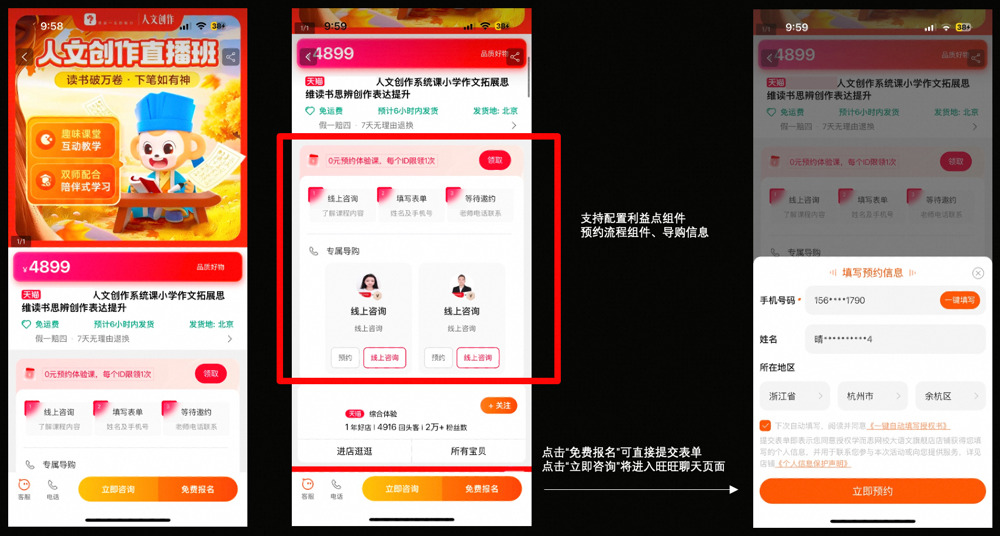

智能单品页，还将商详页、首猜微详情的**底部行动按钮（加购和下单）改成立即咨询和免费报名**，前期内测商家的旺咨率、留资率均有较大提升，平均咨询成本、留资成本下降15%以上。

# 二、如何配置智能留资页？

### 第一步：选择营销场景与优化目标

打开万相台无界版--点击推广--进入**【线索推广】****-**-选择**【优化留资获客成本】**目标

👉**一键直达创建页面：**

***目前该功能已全量开通，欢迎各位商家使用：**

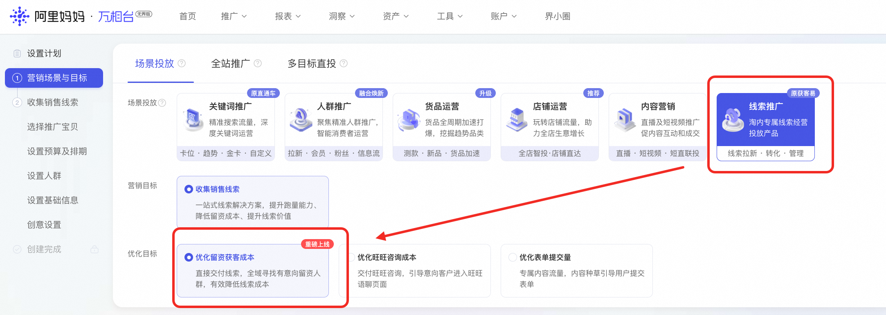

​

### 第二步：选择推广宝贝

**1、****添加推广宝贝，****一次可最多添加10个商品****，无需重复创建计划，盯盘更简单！**

**2、设置智能单品页，可有效提升留资率，该落地页目前可在搜索、推荐流量透出，拿量更方便。🔥🔥🔥**

（没有选择智能单品页默认出商品详情页，选择了智能单品页将同时投放商详页、智能单品页，拿到更多流量）

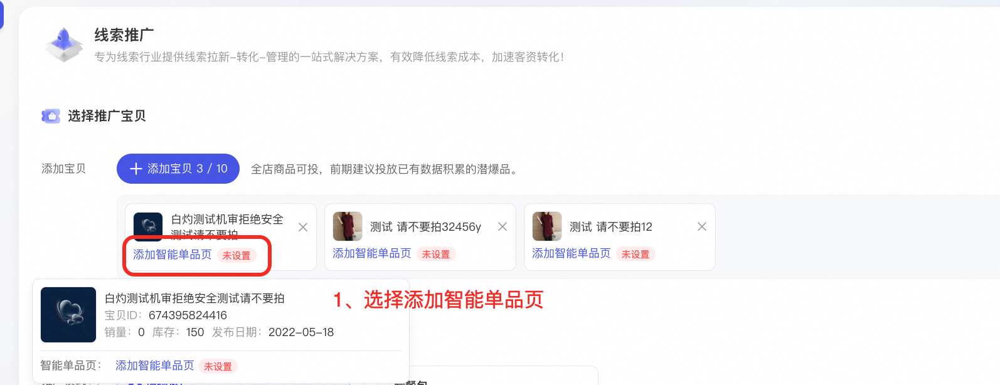

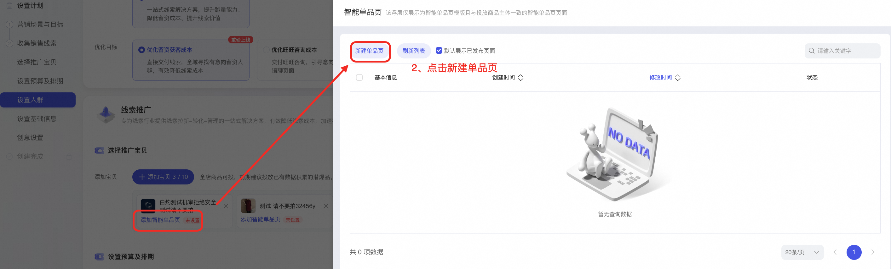

只能用线索推广-「智能留资页」这个模板创建的才可以同步到线索推广后台，其他模板暂不支持。

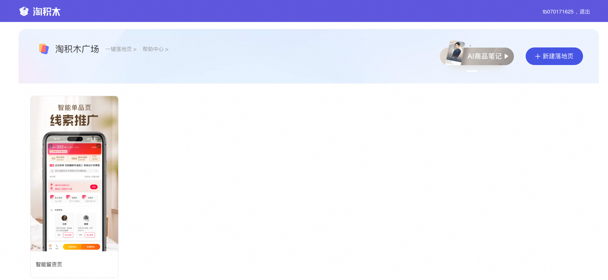

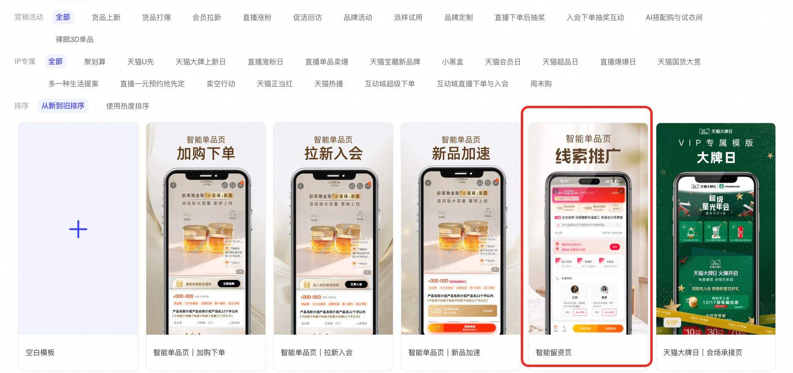

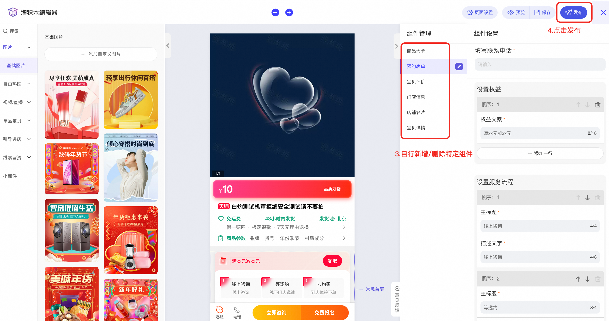

商品大卡：选择推广计划所绑定的商品

预约表单：

填写联系电话：填写可供消费者主动联系的客服电话

设置权益：根据自己实际情况填写。若无，可将模块删除。

设置服务流程：建议将服务过程说明清楚，让消费者了解免费咨询后会如何、免费报名后会如何...

设置导购：仅作为宣传点透出，可用于介绍门店团队构成，如店内经验丰富的设计师、医生，及其履历等。若无，可将模块删除。

宝贝详情：选择推广计划所绑定的商品

门店信息：有门店的商家，还可以通过下述地址增加门店。届时会根据消费者的地理位置，展示附近门店，增强消费者的留资欲望。没有门店的商家，直接忽略即可。

https://place.taobao.com/store/homepage.htm

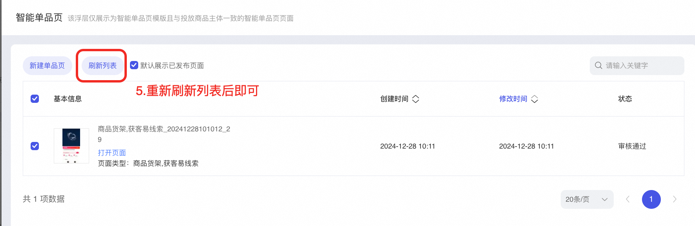

### 第三步：创建计划，测试调优

商家可采用下列方案进行测试，验证**智能单品页**和**商品详情页**哪个投放效果更好。

**方案一：**创建两个计划，一个只有商详页，一个只有智能单品页，测试7天，将投放效果较差的计划关停，同时加大另一计划的预算。

**方案二：**创建一个计划，同时包含商详页和智能单品页，测试7天，将投放效果差的落地页类型关停。

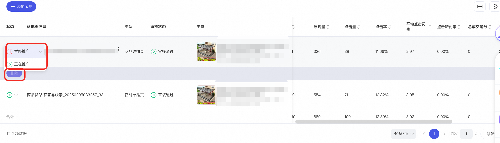

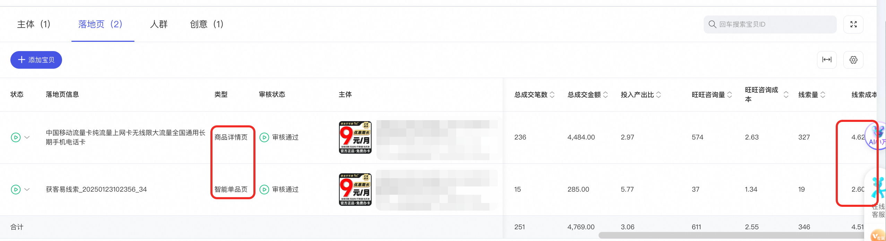

# 三、智能留资页使用流程

## 1）消费者如何留资

**展示流量**

**点击下方行动按钮——填写表单/进入旺咨**

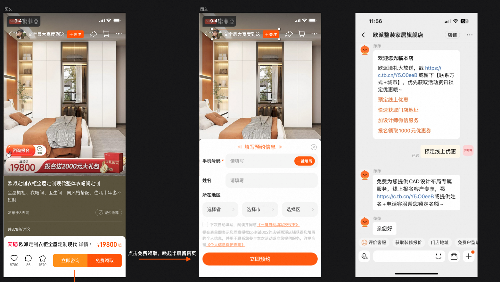

**搜索流量**

**点击商品卡——进入智能留资页——点击「领取」「预约」「免费报名」等组件——跳转表单/进入旺咨——实现留资**

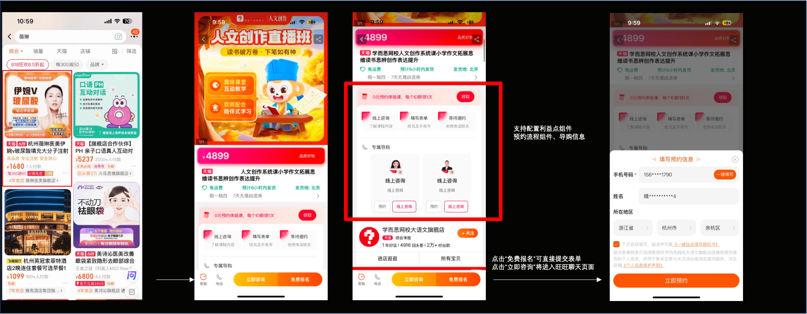

## 2）商家如何查看留资

消费者留资后，客户可以在妈妈客户工作台的「线索管理」里看到所有的线索，包括线索跟进漏斗、线索列表、转化状态、归属人等信息。线索管理能力只对符合类目要求的线索行业商家开放，行业要求详见：规则中心。天猫商家可以自动开通，淘宝商家需要加入钉群后邀约开通。

妈妈CRM产品入口：https://mamabusiness.taobao.com/#/lead/pages/LeadChart

妈妈工作台操作手册：https://www.yuque.com/tihrel/iug1p0/rsvrkg#rrEfU

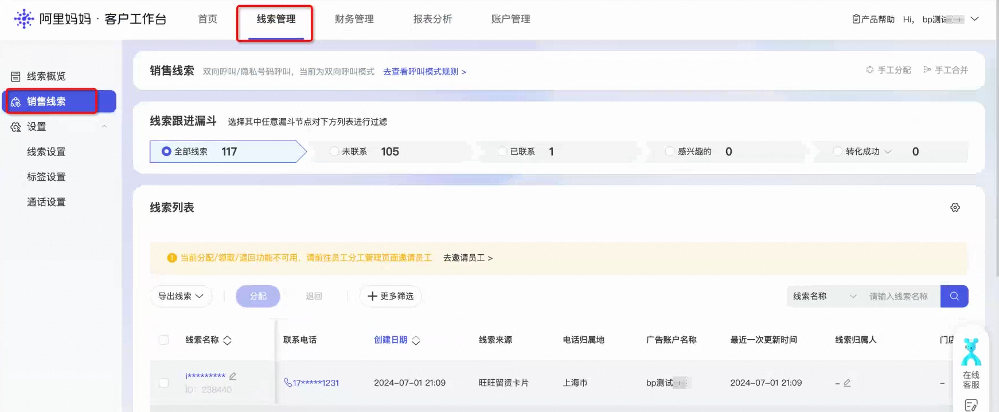

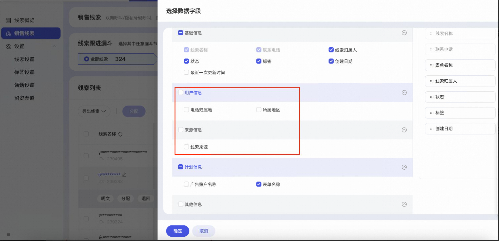

# 四、客户案例

某家装头部客户：投放同周期内，智能单品页线索成本对比商详页**-322%**

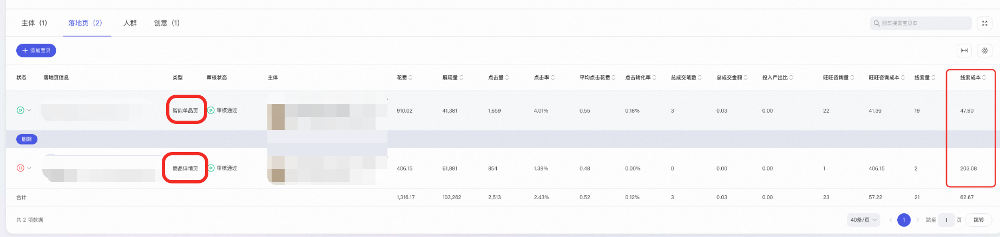

假发类目某商家：留资成本 商详148 单品页100，**降幅32%**
大家电-大型净水器类目商家：留资成本 商详72 单品页60 **降幅16%**
家装-全屋定制类目某商家：留资成本 商详80 单品页60 **降幅25%**
文教-教育培训类目某商家：留资成本 商详94 单品页72 **降幅23%**

# 五、常见问题

1）这个计划投放了线索推广智能留资页，还会投我的商详页吗？

答：会的。计划会对两个落地页的投放效率进行预估，智能分配预算到智能留资页与商品详情页上。

2）如何判断智能留资页效率更佳？

答：可以通过「计划详情页」-「创意」找到智能单品页，查看展点消数据。

3）智能留资页拿不到量该怎么办？

由于智能单品页是一个新页面，冷启时间较长。若还是出现抢量问题，可以先尝试将计划中的商详页删除。
