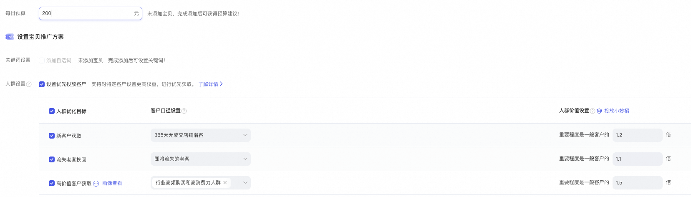
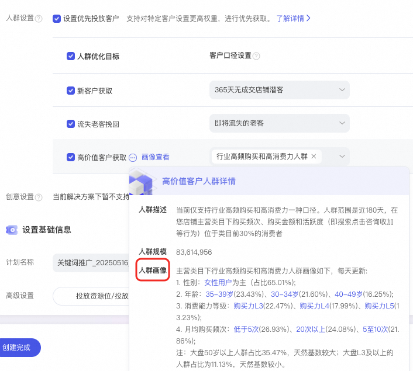
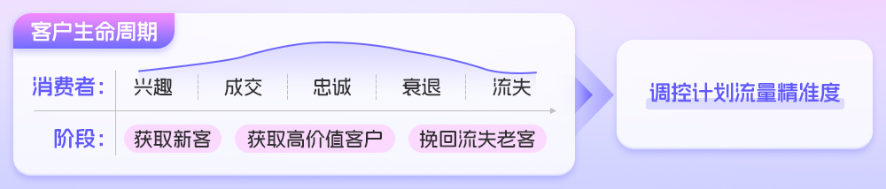
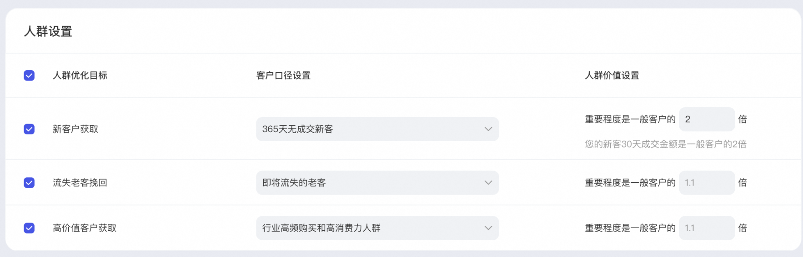
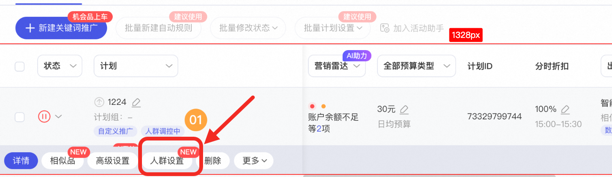

# 「关键词推广」智能出价支持人群设置（已上线）

> 来源：https://alidocs.dingtalk.com/i/nodes/m9bN7RYPWdyrPBREcoqzb9jXVZd1wyK0

**商家群：** 125125005391

## 一、背景

您的广告是否还在用统一出价策略？

高价值用户抢不到，低效流量浪费预算？

不知道如何拉新，获取生意增长机会？

⛽智能出价「人群设置」功能，让每一类用户都获得“量身定制”的出价策略！**激活广告增长新引擎！**

**针对性的获取新客、流失老客、高价值客户！****助您精准锁定目标客户，提升广告竞争力，轻松实现营销目标。**

## 二、功能介绍

💥**智能出价支持「人群设置」**：支持对新客、流失老客、高价值客户设置不同的价值系数（区间为1.1～3.0），对人群做差异化的出价表达；算法会提升计划获取对应人群的广告竞争力，从而优化投放效果。

注意：

价值系数不等同溢价，模型会参考价值系数、人群长期价值等综合因素，进行最终出价

*注：本次仅支持自定义推广下，出价目标为***「获取成交量」、「相似品跟投」、「增加收藏加购量」和「增加点击量」**

**本次不支持「稳投产比」和「提升词市场渗透」；**

💥**高价值客户的人群画像：**包括性别、年龄、消费等级和月均购买频次

注：大盘50岁以上人群占比35.47%，天然基数较大；大盘L3及以上的人群占比为11.13%，天然基数较小。

**👉点我即可去创建👈**

**👉设置人群就点我👈**

**适配场景**

**店铺****拉新：**针对新客设置价值系数，在搜索结果中抢占核心位置，快速触达潜在用户

**抢占市场****：**对行业高价值客户用设置价值系数，优先展示广告，刺激二次消费

**流失召回**：对即将流失的老客设置价值系数，以中等成本挽回流失

## 三、产品优势

**优势一：精准调控计划流量，****把钱花给“对的人”**

精准触达目标人群，实现广告投放效果的最大化，让您的每一分广告费都物超所值！**基于客户生命周期，针对性获取三类目标人群**

**新客户**：365天无成交新客、180天无成交新客

**高价值客户**：行业高频购买和高消费力人群

**流失老客**：即将流失的老客、近期有复购需求但是未购买的老客

**优势二：****灵活精准，差异化出价**

通过价值系数（1.1~3.0）实现人群差异化出价，对应人群的系数设置越高，人群拿量越强，人群占比越高：

高价值客户×1.5（激进抢量）

新客×1.2（抢占增量市场，扩大用户池）

流失老客×1.1（低成本召回）

**优势三：提升广告竞争力，辅助模型训练**

模型会综合参考设置的价值系数、人群长期价值、人群历史效果等，动态出价，抢占目标人群，提升广告竞争力！

## 四、产品使用建议

### 1、根据不同投放诉求，选择人群设置（可以同时设置多个人群价值系数）

#### 诉求一：店铺重拉新，期望在关键词推广获取更多店铺新客

选择新客口径“365天无成交新客”，**价值系数建议在参考推荐值基础上****提升20%～30%**

#### 诉求二：店铺有较多老客资产，希望能挽回历史老客

选择老客口径“近期有复购需求但未买的老客”，**价值系数建议在参考推荐值基础上****提升20%～30%**

#### 诉求三：强烈期望获取更多行业高价值消费群体

高价值客户的价值系数值在参考推荐值基础上提升30%～50%

### 2、根据人群长期价值，阶段性调整价值系数

**第一步，计划对比测试：**分人群对比「固定出价」与「设置人群价值系数」的ROI差异，调整系数阈值。

**第二步，根据投放效果，调整优化**

新客：若新客转化成本过高，需检查商品详情页或新客权益吸引力

流失老客：结合留存数据和长周期价值评估效果，而不是仅根据ROI调整系数

高价值客户：结合行业投放数据对比参考

## 五、操作手册

**第一步：****关键词推广——新建计划——点击“自定义推广”——****选择出价目标****「获取成交量」、「相似品跟投」、「增加收藏加购量」和「增加点击量」。「稳定投产比」、「抢占搜索卡位」和「提升词市场渗透」，且不支持人群设置；**

第二步：**点击人群设置，为目标人群设置价值系数；价值系数越高，人群拿量越强**

第三步：查看人群数据

## 六、常见问题

Q：所有关键词推广的智能出价计划都可以设置人群吗？

A：目前仅限自定义推广下，出价目标为**「获取成交量」、「相似品跟投」、「增加收藏加购量」和「增加点击量」**，**「稳定投产比」、「抢占搜索卡位」和「提升词市场渗透」**，且不设置成本的智能出价计划。

Q：刚开始投放，建议如何设置【人群价值】的系数？

A：新客户获取参考出价系数1.1～1.5，流失老客挽回参考出价系数1.2～1.8，高质量客户参考出价系数为1.5~2.5

Q：如何查看人群投放后的数据？

A：点击计划列表内的单一计划上「人群设置」即可查看不同人群的投放效果

**Q：****新客的定义是什么？**

A：分为两类，365天无成交新客、180天无成交新客

365天无成交新客是指"过去365天未在店铺成交的店铺潜客"

180天无成交新客是指"过去180天未在店铺成交的店铺潜客"

**Q：****流失老客的定义是什么？**

A：分为两类，即将流失的老客、近期有复购需求但未买的老客

即将流失的老客：近7天在本店铺没有互动，但是在同类目下其他店铺有点击/咨询/收藏/加购等行为的店铺老客

近期有复购需求但未买的老客：超过您店铺主营类目平均复购周期仍未在该类目下有购买行为的店铺老客

Q：高价值客户的定义是什么？

A：近180天，在您店铺主营类目下购买频次、购买金额和活跃度（即搜索点击咨询收加等行为）位于类目前30%的消费者
