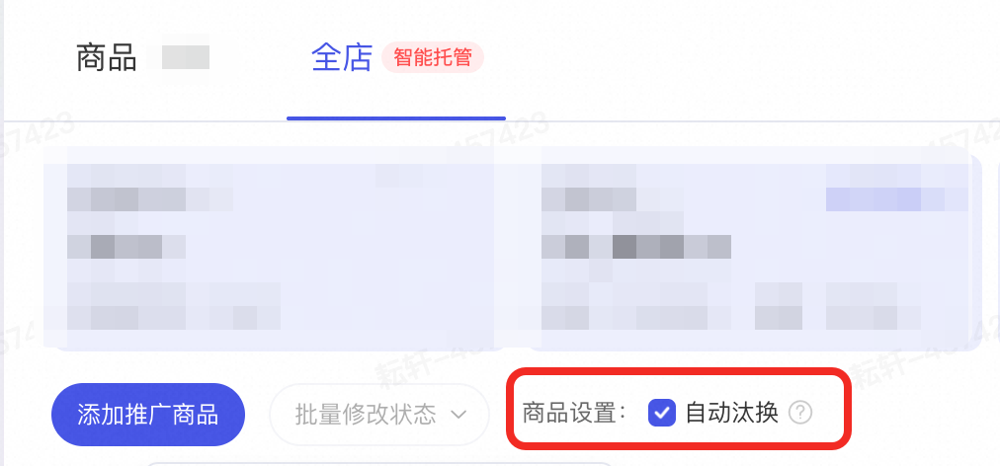
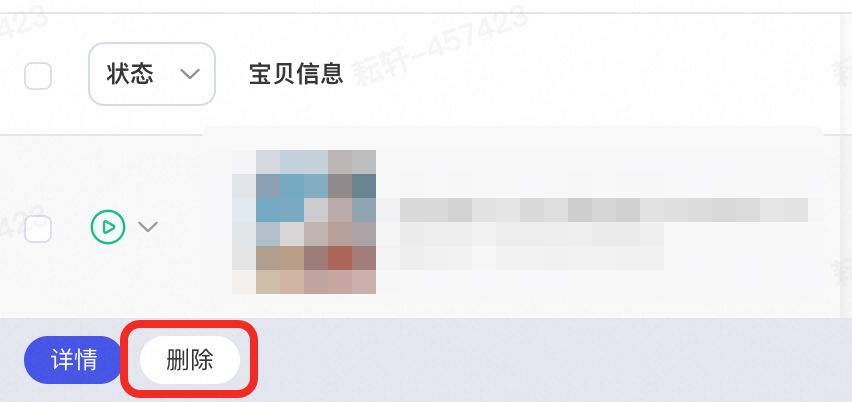
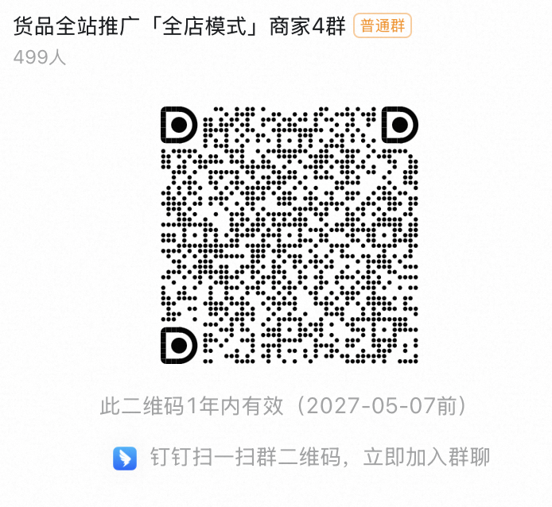

# 【全店模式】商品池汰换提效，自动推广新上架商品，汰换低效品

> 来源：https://alidocs.dingtalk.com/i/nodes/mExel2BLV59rgdDPiDK9DLg5Vgk9rpMq

## **功能介绍**

全站推-全店模式新增**商品池汰换功能**，自动推广店铺中新上架且未推广的商品，并汰换表现差的商品，系统将挖掘潜力商品，自动优化出价，动态分配预算，探索全店增长机会；

**勾选商品汰换功能，预计带来成交金额+2.X%，加购量+1.X%，成交单量+2.X%**

## **功能使用**

### 1.**新增「****自动汰换****」设置，**提升全店模式投放商品池效率；

开启「自动汰换」即表示您授权系统，将店铺中新上架且未推广的商品天级转投至全店模式智能托管，并汰换在投商品中表现差的，系统将**挖掘潜力商品，自动优化出价，动态分配预算**，探索全店增长机会！

### 2.全店模式商品**新增****“删除”****按钮，**可按需删除，提升商品列表管理效率；

### 3.全店模式营销雷达提供**下架商品****批量****删除、机会商品一键添加推广**操作，提升商品管理效率；

|  |  |  |
| --- | --- | --- |

## **常见问题**

| 什么是自动汰换 | 全站推-全店模式新增**商品池汰换功能**，自动推广店铺中新上架且未推广的商品，并汰换表现差的商品，系统将挖掘潜力商品，自动优化出价，动态分配预算，探索全店增长机会； |
| --- | --- |
| 自动汰换但找不到开关入口，不清楚在哪里设置 | 货品全站推广 -> 全店 -> 商品设置：开启**自动汰换** |
| 哪些品会被淘汰、新品如何自动加入、什么条件触发替换 | 自动推广店铺中**新上架且未推广的商品，并汰换表现差**的商品 |
| 开启自动汰换后，系统会不会自动提高预算或改变出价，导致多花钱 | 会自动提升预算，不会改变出价。 |
| 自动汰换能否真正提升投放效果 | 勾选商品汰换功能，预计带来成交金额**+2.X%**，加购量**+1.X%**，成交单量**+2.X%** |
| 不清楚自动汰换与分组托管、全店模式、商品推广等其他功能的关系和区别 | **自动汰换**：自动汰换功能是全店模式新增功能。 自动推广店铺中新上架且未推广的商品，并汰换表现差的商品 **分组托管**：分组托管功能是全店模式新增功能。 支持商家创建多个计划组，每个计划组下可按需添加商品，并为这个计划组设置对应的出价（控投产比设置ROI/最大化拿量）和预算 **全店模式：**是一款由AI大模型驱动的，致力于解放店铺人力，提升「全店铺」成交金额的产品。 **商品模式：**如有单品投放强诉求，可选择货品全站推广-商品模式对该品进行投放。 |

## **商家答疑反馈群**

如您对以上有任何疑问，可向阿里妈妈小袋鼠客服咨询或者钉钉扫码进群咨询；

