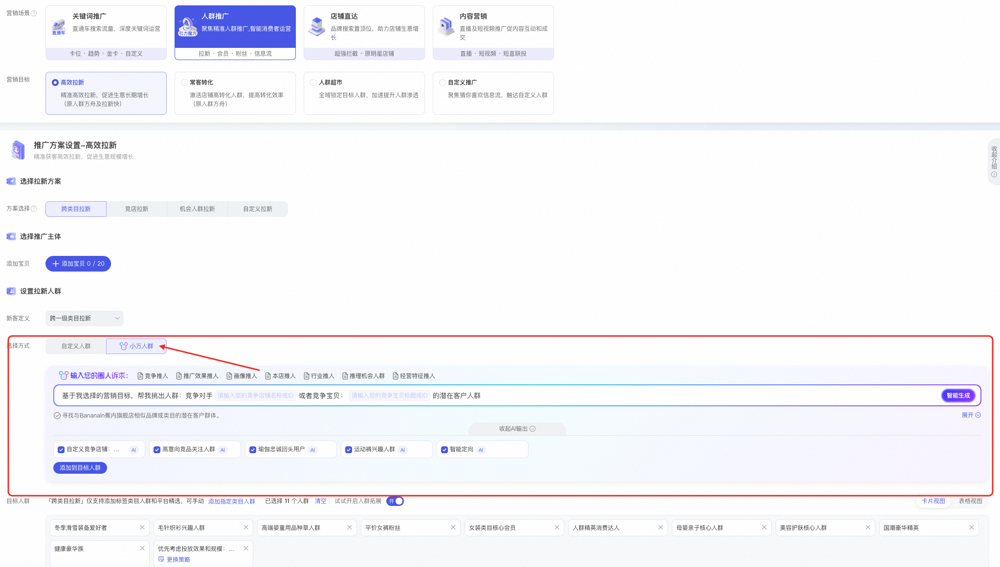
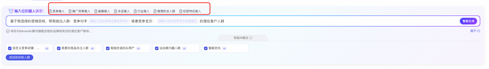
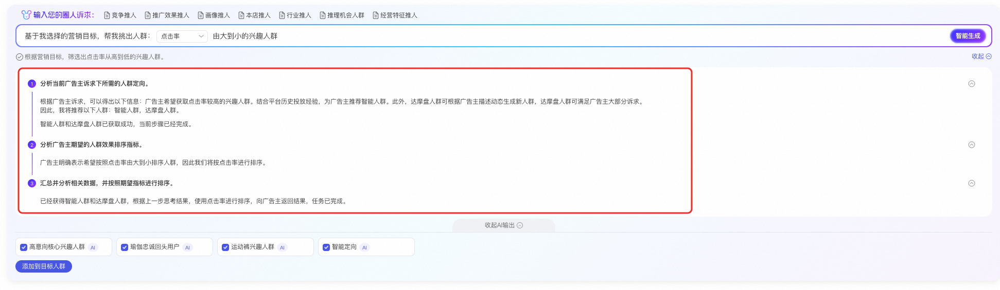

# 📢 AI推人2.0升级：人群投放提效

> 来源：https://alidocs.dingtalk.com/i/nodes/mExel2BLV59rgdDPiEG6KwPkVgk9rpMq

# **AI推人2期重磅升级**

轻松锁定高潜力人群，抢占流量先机，更准更快更强！

### ** ****升级点1，****新增【学习同行推人】****，AI智能找到同层级同行近14天的正在真实使用的人群，一键追投抢占机会！**

### ** ****升级点2，****竞争推人能力升级****，支持竞店及竞品双维度精准圈选相似竞争店铺，并通过AI解析本店及竞店经营数据，直击竞争核心！**

### ** ****升级点3，告别繁琐手动添加！AI自动为你匹配并添加优质人群，同时完善AI推理过程与结果，人群更精准，投放效果更显著！**

目前产品内测限时开启，名额有限，立即体验！更多产品信息欢迎加入官方钉钉群【 161765006254】

#

---

**【AI推人】重磅来袭，AI驱动人群提效**

人群场景重磅推出的全智能**AI人群定向能力**，你可以自由输入人群或生意需求，系统将通过AI大模型深度解析并结合平台海量数据及社会知识学习等**自动识别并匹配最合适的人群**，有效减少人群试错成本，显著提升计划效率！

| **小万人群** | vs 自定义人群 |
| --- | --- |
| 支持客户自由表达人群，**人群更灵活可控** | 系统预设的人群，人群选择有限 |
| AI大模型下人群优选，**提升人群投放效率** | 人群定向类型多，需自行甄别判定，试错成本高 |
| 对话式人群选择推荐，**满足不同人群投放需求** | 需手动一个个选择，操作繁琐，人群选择不清晰 |

## **【AI推人】操作指引**

#### **1、产品入口**

万相台无界--人群场景--高效拉新/常客转化/自定义推广（人群超市暂不支持）--人群设置--AI推人

#### **2、AI人群设置**

在你选择万营销目标及投放宝贝后，在小万人群模块平台已准备好常用的**7大人群圈选模板**，你可以根据自己的需求进行补完信息，同时也支持你自由表达想要的人群需求，填写完成后点击智能生成开启AI推理；

**根据海量商家数据，总结的3种最高频操盘方法，**

**小万竞争推人：自由定向您要的竞争店铺、竞争宝贝以及可选竞争力偏高/偏低的对手！**

**小万效果推人：自由选择您的推广目标，根据点击率/收加率/投产比等指标找合适人群！**

**小万行业推人：自由选择您想要拓展的类目人群，帮你找到额外机会，增量拉新客！**

*更多AI人群模板如下：

| **人群分类** | **排序** | **输入框的默认内容** |
| --- | --- | --- |
| 竞争推人 | 1 | **基于我选择的营销目标和宝贝，帮我挑出人群：竞争对手****请输入您的竞争店铺名称****或者****请输入您的竞争宝贝id****的潜在客户人群** 竞争店铺：支持客户输入全淘宝的店铺名称（其他店铺） 竞争宝贝id：支持客户搜索全淘宝的id |
| 推广效果推人 | 2 | **基于我选择的营销目标和宝贝，帮我挑出人群：****平均点击花费****小于****数值****的兴趣人群** 数据指标：支持选择投入产出比、平均点击花费、点击转化率、收藏加购率 对比：小于、大于 数值：具体值 |
| 画像推人 | 3 | **基于我选择的营销目标和宝贝，帮我挑出人群：****请输入消费者的特征，如月消费3000以上的30岁女性****的兴趣人群** |
| 本店推人 | 4 | ** 基于我选择的营销目标和宝贝，帮我挑出人群：店铺和店铺中****请输入本店宝贝名称****的****收藏加购****的人群** 宝贝名称：支持客户输入宝贝名称进行查询店铺可推广宝贝 收藏加购：支持收藏加购/高频搜索/即将成交/粉丝 |
| 行业推人 | 5 | **基于我选择的营销目标和宝贝，帮我挑出人群：对****请输入淘宝类目或关键词****感兴趣并频繁搜索的人群** 淘宝类目：支持选择二级类目 |
| 推理机会人群 | 6 | **根据我店铺已有的人群资产和推广数据，学习和分析我店铺的已成交的人群的特征和画像，智能帮挑出淘宝中****相似度最高****人群** 类型：相似度最高/转化效率最好 |
| 经营特征推人 | 7 | **基于我的行业特性，帮我挑出已购买****请输入宝贝的叶子类目****在****请输入天数范围，如10～50****天 的人群** 宝贝叶子类目：支持选择商品的叶子类目 天数范围：0～999 |

#### **3、AI人群生成**

以**平台推荐海量召回数据**（消费者特征/商品特征/交叉特征以及行为序列特征等）为基础，结合社会知识&流量现状通过**AI大模型**推理符合营销意图的特征人群，并可视化预测推理人群投放逻辑

#### **4、AI人群投放**

你可以根据自己的需求选择AI生成的人群添加至目标人群后，完成出价及预算等设置成功创建计划即可，后续你可在计划列表页查看AI人群投放数据等；

## **【小万人群】常见问题**

**1、商家可以通过哪些方式进行AI小万人群的添加编辑？**

| **新建计划** | **存量计划编辑、添加人群** | **AI小万助手** |
| --- | --- | --- |
|  |  |  |
