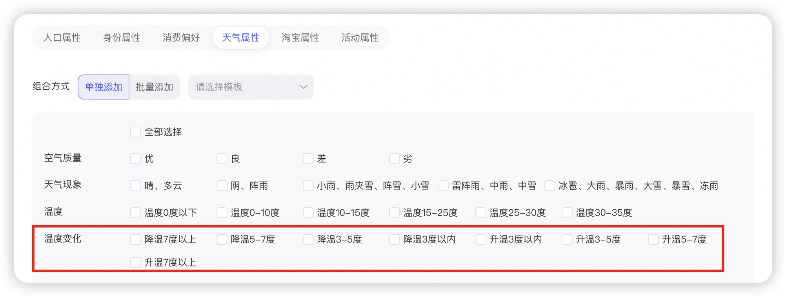

# 【天气属性、月均消费额度】人群标签升级

> 来源：https://alidocs.dingtalk.com/i/nodes/mExel2BLV59rgdDPiEjzDbPQVgk9rpMq

**原语雀文档链接：**https://yuque.antfin.com/chenchun.chen/gqhty9/cctth0r1qti65t56

---

# 一、天气属性：新增【温度变化】标签

操作路径：关键词推广-手动出价-添加人群-自定义人群-基础属性-天气属性

# 二、天气属性：【温度】标签

操作路径：关键词推广-手动出价-添加人群-自定义人群-基础属性-天气属性

| 新版 |  |
| --- | --- |
| 旧版 （已下线） |  |

# 三、月均消费额度

| 新版 |  |
| --- | --- |
| 旧版 （已下线） |  |
