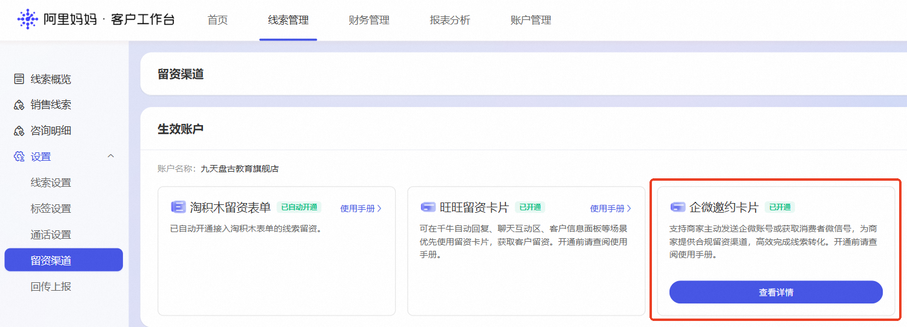

# 【线索推广-企微邀约卡片】使用指南

> 来源：https://alidocs.dingtalk.com/i/nodes/o14dA3GK8gQlkoYwcKYdAvDyV9ekBD76

# **一、企业微信邀约卡片是什么？**

企业微信邀约卡片系阿里妈妈为投放【线索推广】产品的商家所提供的线索收集工具，本产品旨在为合规经营商家提供安全、规范的留资渠道，助力商家在合规前提下高效完成线索转化，提升客户跟进效率。

### 核心功能

通过企业微信邀约卡片，商家可通过以下两种方式添加消费者：

其一，扫码添加：主动发送店铺企业微信，消费者扫码添加。商家可主动向消费者发送店铺的企业微信账号，引导消费者扫码添加。

其二，留下手机号：企业微信添加消费者微信号。商家可通过企微邀约卡片，获取消费者主动填写的个人微信，并使用企业微信添加完成建联。

### **产品优势**

| **优势项** | **详细说明** |
| --- | --- |
| 合规经营 | 于平台管控政策背景下提供合规留资渠道，有效降低违规风险 |
| 高效转化 | 支持【留下手机号】和【扫码添加】两种方式，灵活适配不同消费者加微需求 |
| 状态追踪 | 实时回显用户操作状态，便于商家及时跟进处理 |
| 团队协同 | 支持批量添加企业微信账号，实现多人协作跟进线索 |

# **二、企微邀约卡片怎么开通？**

### 2.1 开通条件

商家须**同时满足以下条件**方可开通：

**商家已经开通了客户工作台【线索管理】功能（报名链接：**https://survey.taobao.com/apps/zhiliao/VENIUcIwa**）**

**在【线索推广】场景消耗大于规定金额次日12点生效，**可以自动在阿里妈妈客户工作台开通权限，进入【线索管理】-【设置】-【留资渠道】页面。在企微邀约卡片下点击【确认开通】即可完成开通。

**一键开启线索推广消耗：**https://one.alimama.com/index.html#!/manage/hky

### 2.2 开通流程

**第一步：进入留资渠道配置页面**

若商家满足开通条件，登录客户工作台后，进入【线索管理】-【设置】-【留资渠道】页面。在企微邀约卡片下点击【确认开通】，平台检验账号内线索推广场景消耗规模符合开通门槛后，即可完成开通。

**注意事项：**

**开通门槛：平台自动化判定商家消耗规模是否符合开通门槛，不符合门槛商家将收到弹窗提升，具体开通门槛以商家后台弹窗提示为准。**

**回收规则：开通后若连续30天线索推广消耗不满足规定金额，卡片权限将暂时回收，待后续重新投放后可再次激活使用。**

**行业限制：新零售商家暂不支持开通企微邀约卡片。**

*图2：企微邀约卡片开通申请页面*

**第二步：配置邀约方式**

进入邀约卡片配置页面后，商家可根据业务需求选择邀约方式：

**手机号加微**：系统默认开启，此选项不可关闭

**扫码加微**：商家可自主选择开启或关闭

在邀约设置模块中，商家需添加员工企业微信账号。系统支持批量添加操作，商家需一一对应上传以下信息：

企业微信账号的企微号**（必填）**

企业微信二维码**（必填）**

**！！！重要提示：请确保上传的为企业微信官方二维码且在有效期内。如发现上传非企微二维码、过期二维码或其他违规行为，平台将直接收回使用权限。**

*图2：邀约方式配置页面*

**第三步：确认开通状态**

企业微信邀约卡片开通成功后，系统页面【企微邀约卡片】将显示【已开通】，表明功能已正常启用并可投入使用。点击【查看详情】，可查询已上传员工企微账号并支持批量删改。

*图3：已开通邀约卡片页面*

---

## 三、如何使用？

### 3.1 配置方式

企业微信邀约卡片功能上线初期，仅支持【商家手动发送】模式。

适用场景：商家主动跟进高意向线索客户

操作方式：客服人员于千牛客户端手动选择目标企业微信账号，向消费者发送邀约卡片

功能优势：实现精准触达，客服人员可根据消费者意向程度灵活把握跟进时机

### 3.2 使用步骤

**第一步：发送企业微信卡片**

### **！！！【企微邀约卡片】开通后，客服首次使用前，务必刷新千牛客户端！！！**

客服人员登录千牛客户端，在【线索推广】蓝色功能栏区域选择需发送的企业微信账号，点击【确认】按钮后，系统将向消费者发送企业微信邀约卡片。

**重要提示：仅支持已完成添加的企业微信账号通过邀约卡片进行线索跟进。**

*图4：千牛工具栏邀请添加企业微信界面*

**第二步：消费者完成添加操作**

消费者可通过以下两种方式完成企业微信添加：

| **客资获取** | **留下手机号** 消费者于卡片内填写个人微信号并提交，提交成功后，卡片将实时回显用户当前状态"已发送"标识，客服端实时回显消费者填写的手机号码（暗文）。 | **扫码添加** 消费者扫描客服人员发送的企业微信二维码，主动添加企业微信，卡片将实时回显用户当前状态"已发送"标识，客服端实时回显消费者添加状态，展示【待通过】提示。 |
| --- | --- | --- |
| **客资管理** | 点击【查看详情】可跳转至客户工作台，直接定位到该条客资并打标。 |  |
| **客资打标** | **建议客服侧直接在语聊页面的客户信息下方【修改备注】完成客资打标**，详细操作见>>（开发中，预计7月初上线） |  |
| **示意图** | *图5：消费者已提交微信号状态* | *图6：消费者已扫码发送请求状态* |

---

## 四、常见问题

**问题一：开通企业微信邀约卡片须满足何种条件？**

答：商家须同时满足以下两项条件：其一，已开通线索管理功能；其二，在线索推广场景消耗超过规定金额（具体金额以系统页面提示为准）。满足条件后，功能将于次日生效。

（**注：新零售商家暂不支持开通 企微邀约卡片**）

**问题二：企业微信账号是否支持批量添加？**

答：支持批量添加。商家可于邀约设置页面一次性上传多个员工企业微信账号的企微号及二维码，便于团队协同跟进线索。

**问题三：手机号加微与扫码加微有何区别？**

答：手机号加微系消费者填写个人微信号，商家使用企业微信主动添加消费者；扫码加微系商家发送企业微信二维码，消费者主动扫码添加商家企业微信。手机号加微为系统默认开启且不可关闭，扫码加微商家可根据业务需要自主选择开启或关闭。

**问题四：消费者填写微信号后，商家如何查看相关信息？**

答：消费者提交微信号后，商家可于千牛客户端查看消费者留资信息，并通过企业微信添加消费者为好友。

**问题五：卡片状态显示"已发送"代表何种含义？**

答："已发送"状态表明消费者已成功提交留资信息（填写微信号或完成扫码），商家可据此及时跟进处理。

**问题六：企业微信邀约卡片支持哪些投放场景？**

答：本产品目前支持**线索推广**场景，商家须前置投放无界AI·线索推广，并开通客户工作台的线索管理模块，方可使用该功能。

**问题七：若消费者填写的微信号存在错误，应如何处理？**

答：建议商家于添加过程中注意核对微信号格式规范。如添加失败，可与消费者联系确认正确微信号。

**问题八：多名客服人员是否可同时使用企业微信邀约卡片？**

答：可以。商家于邀约设置中添加的企业微信账号，对应授权客服人员均可使用。建议商家根据团队分工合理配置账号权限。

**问题九：企业微信邀约卡片是否收取费用？**

答：企业微信邀约卡片作为线索推广附赠功能，卡片使用本身不会收取费用，但若商家希望开通【企微会话回传】功能，则需额外付费，具体收费政策请以阿里妈妈·客户工作台为准。

**问题十：如何关闭扫码加微功能？**

答：商家可于【线索管理】-【设置】-【留资渠道】页面的邀约设置模块中，关闭扫码加微选项。关闭后，消费者将无法通过扫码方式添加商家企业微信。

---

**更新日期**：2026年7月

**适用范围**：阿里妈妈线索推广产品商家

**如有疑问，请联系阿里妈妈官方客服或加线索推广官方客户群（群号：159050038411）获取进一步支持。**
