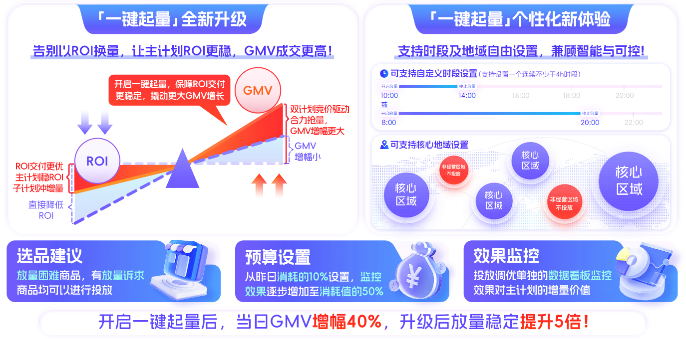
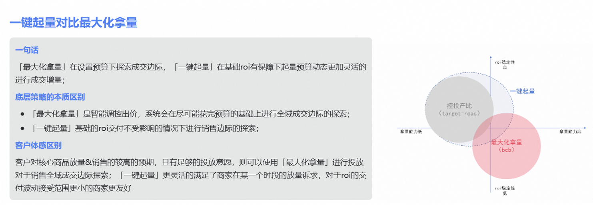

# 🔥大促必用【投放调优-一键起量】-三期能力（已全量）

> 来源：https://alidocs.dingtalk.com/i/nodes/o14dA3GK8gQlkoYwcQdK4QOlV9ekBD76

**原语雀文档链接：**https://yuque.antfin.com/chenchun.chen/gqhty9/gp250xnu3u39d02v

---

*货品全站推广「一键起量」能力已经帮助众多商家解决了起量需求，已经累计有10W+个商家使用过「一键起量」能力，为实现商家更加灵活可控的放量需求，提升商家对于一键起量的操作体感，对「一键起量」能力全面升级*

| 更新时间 | 主要分类 | 重点更新点 | 相关材料 |
| --- | --- | --- | --- |
| 2024.5 | **产品上线** | 货品全站推广支持一键起量功能 | 见下文 |
| 2024.12 | **产品升级** | 自定义起量预算 提供起量部分的数据展示 | 见下文 |
| 2025.1 | **产品升级** | 自定义时段能力 自定义地域能力​ | 见下文 |
| 2025.6 | **产品升级** | 投放链路升级 实时数据披露 创编链路升级 支持极简弹窗新建 新增批量修改页面 | 见下文 |
| 2025.10 | **产品升级**** ****new！** | 营销雷达-计划诊断&场景页 【黄灯-调优潜力计划】 投放解读优化 提升看数便捷性 | 见下文 |
| 2026.5 | **产品迭代****new！** | 多目标起量（内测） 交付升级&链路优化（更简单的计划新建） 投中预算升级（支持主计划分配预算） 结算升级（更清晰的增量展示） |  |

## 4句话读懂一键起量

**1. 适合投放的商家：**有较强的起量诉求，能够接受成本小程度上涨​

**2.适合投放的场景：**

**新品快速度过冷启动****（hot!)****：**快速帮助商家实现两阶段的跃迁，**更快进入稳定拿量期**，实现稳定成交贡献；

**爆品大促销量冲刺：**大促放量升级兼顾稳定的roi交付，助力**爆品成交稳中有进**；

**控投产比放量困难：**预算使用率低的商家，同时roi波动的承受力有限，希望在保障基础roi的情况下进行**销售放大**的商家；

**3.一句话原理：**

在总体成本相对稳定的基础上更大程度提升跑量，**起量效率优于手动提价！**

**只拿增量，预算更大化**：系统**探索最优探价区间**，对应生效跑量策略，寻找最大“边际收益”。

**加速消耗，持续保障**：在基础预算下进行起量预算的调控，获取更多高性价比流量，会以**最优效率进行拿量**，在保障获取更多成交机会的同时同时保障非起量部分roi的稳定交付；

**4.效果如何**

起量效果大幅加强，两阶段切换率提升**40%** ；放量能力明显提升，平均增幅**40%** ；gmv爆发增长，平均提升**20% **

## 一、**产品升级点&产品示意图**

**货品全站推广计划新建计划，改为全部黑盒开启一键起量，帮助客户计划更快进入稳定投放期；新建流程不再有一键起量开关**

| **升级点** | **升级说明** | **图示** |
| --- | --- | --- |
| **升级点1** **自定义起量预算** | 横向管理**“投放调优”**入口，**选择一键起量能力**。客户可**设置额外起量预算**，支持商家更灵活的进行起量能力的控制。 |  |
| **升级点2** **提供起量部分的数据展示** | 在一键起量的设置页面上提供**“起量数据”**tab，报表中也支持客户进行起量数据的筛选。 |  |
| **升级点3** **自定义时段能力** | 商家可以自定义“起量预算”的**放量时段偏好**，自定义时间不小于**4小时** |  |
| **升级点4** **自定义地域能力** | 商家可以根据非运营地域，进行**投放广告的区域的屏蔽** |  |
| **升级点5** **全链路提效升级** | **投放链路升级：**一键起量底层机制升级至eCPM叠加机制，提升起量时段对客交付结果，优化客户起量集中消耗的反馈； |  |
|  | **实时数据披露：**适配底层链路升级，起量报表侧透出实时数据； |  |
|  | **创编链路升级：**投前创编流加入一键起量新建入口； |  |
|  | **支持极简弹窗新建：**预算使用率低的商品引导开启一键起量，支持一键全部开启； |  |
|  | **新增批量修改页面：**支持商家批量进行一键起量的设置，方便商家的批量化操作； |  |
| **最新升级点** |  |  |
| **营销雷达-计划诊断** | 【**黄灯-调优潜力计划**】查看分析与建议-支持自定义设置调优比例，确认采纳预算修改实时生效； |  |
| **场景页-营销雷达** | 【**调优潜力计划**】去使用-批量设置投放调优潜力计划，确定后预算修改实时生效； |  |
| **投放解读优化** | 升级投放调优洞察页，对比解读开启与未开启调优计划的环比数据； |  |
| **提升看数便捷性** | 计划横向列表页：支持查看投放调优合计预算和基础ROI、花费情况； 计划横向列表页：点击去查看调优数据>即可跳转起量数据页面； 投放调优数据页面：支持查看单计划和所有计划的投放调优汇总数据； 计划筛选框：默认展示该计划（计划名称xxx），支持选择“全部计划（商家所有计划）和按照关 键词搜索选择其他计划 |  |

## **二、大促操作建议****（左右滑动可查看更多内容）**

| **新手投放** **（运营动作）** | **平台建议** | **为什么** |
| --- | --- | --- |
| **如何选品** | 1、**节促必投商品：** 投放全站推高预算商品 （预算 top10 必投） 2、** 建议商品：**遇到增量困难的商品均可投放； | 1、 **必投：**高预算商品承担更多的GMV目标，开启多目标可以有效的带动核心计划的竞争力，抓住大促的成交爆发； 2、**建议投：**增量遇到困难的商品，短期难以增加产品基础分，建议开启多目标/起量增加竞价能力，短期内提升 GMV，突破瓶颈期； |
| **如何设置预算** | 主体逻辑为，少量多次的增加预算，从10%的基础预算逐步增加至 30%预算；**核心现货期及爆发日当天，必投** | 突然设置较高的投放调优预算，会导致对于预算使用率低的计划造成较大的ROI交付波动，**少量多次的预算增加**，可以更有效的探索增量空间 |
| **如何监控效果** | 1、 **在哪里看效果：**在投放调优板专属效果板块监控投放效果； 2、 **如何判断效果：**关注计划整体的GMV变化及计划整体的消耗变化，大促适当降低对ROI/PPC 的波动关注，抓住GMV增长 | 投放调优是助力商家在产品分无明显波动的情况下（质量分及价格均无变动规划），广告侧竞争力可以通过**投放调优增加，带动主计划增长**，同时交付个性化指标（加购/直接成交/起量） |

## 三、注意事项

明确为起量产品目标客户

有较强起量诉求，能够接受成本小幅度上涨；

正确认识起量周期内超成本现象

为探索优质流量，成本可能有一定涨幅。起量结束后，虽然拿量的效果不一定能持续，但探索更充分的模型可能帮助计划稳定量级和成本，建议拉长投放周期后观测投放效果。

建议在起量时间不要频繁关停，避免影响模型效果，开启后持续投放至少12小时。

## 四、常见问题

1**｜****一键起量二期的核心优势是什么？**

1）可控起量预算，对于消耗更加符合运营规划

2）同时间内非起量部分的roi仍可得到保障（按照平台推荐进行设置）

3）起量消耗可视化，可以通过起量效果看板监控起量效果，对起量操作可控性更强

**​**

2**｜****新版本的一键起量是否也会自动关闭呢？**

新版本不会自动结束，商家可完全自主操控起量的开始和结束

​

3**｜****旧版本一键起量每天有2次的操作上限，新版本是否还有操作限制呢？**

是的还是有操作次数限制，修改起量预算不计算次数，只有开启和关闭起量计算次数

​

4**｜****新版本开启一键起量期间的消耗优先级是怎么样的，是先消耗起量预算还是基础预算？**

是一起消耗的

​

5**｜**** 开启一键起量的预算为什么比设置的高？**

一键起量预算为单独的起量预算设置，独立于基础预算，总预算为起量预算+基础预算的和

​

6**｜****什么情况下建议开启一键起量？**

1）新计划建议开启一键起量，前期帮助计划快速积累数据;

2）大促活动期间，平台竞争激烈，建议您开启一键起量，抢夺平台优质流量;

3）计划长期消耗慢，建议开启一键起量帮助计划快速积累数据;

​

7**｜****一键起量对比最大化拿量**

精简版：

详细版：

8**｜****一键起量对比多目标出价****（左右滑动可查看更多内容）**

| **产品能力** | **产品定位及产品优化方向** |  | **商家操作** |  |  |  |
| --- | --- | --- | --- | --- | --- | --- |
|  |  |  | **选品** | **计划设置** |  | **效果监控** |
|  |  |  |  | **预算设置** | **个性化调优设置** |  |
| **多目标出价** | **产品定位** | 满足商家多维增长的经营诉求，满足低竞争力预算消耗不全面的商家进行整体竞争力的提升，带动销售的同时交付多目标指标的增长； | 有多维增长诉求的商品均可以进行投放 1. 新品:增加新品的广告竞价能力，集中打爆新品没进行浅层成交蓄水； 2. 爆品:通过商品的用户特征及商品属性，挖掘预测未来有 GMV 增长空间的商品进行推荐，通过净成交出价交付确收 GMV，带动潜力品成交跃迁； | 单独设置起量预算，建议**采纳平台推荐预算**，投放效果更优，预算建议不低于基础预算值的 20%； | 在基础预算下可以设置「加购」、「直接成交」 的多维目标进行成交优化； **加购：**高客单/转化周期长类目的商家建议可以开启加购进行长周期蓄水，待活动日提升单品爆发力（大家电/家居等高客单，长周期转化类目） **直接成交：**聚焦在单品直接成交增量需求，有强烈的单品打爆需求，爆品运营策略可选择（服饰类目\快消类目等有强单品打爆需求商家） | 点击「计划」下的「投放调优」页面->在投放调优右侧的投放调优数据进行查看一键起量/多目标效果增量效果（一键起量/加购/直接成交） |
|  | **适配商家** | 有自营投放方法论，有多场景运营诉求，可以接受用一定的成本波动带来更多维度的增量探索 |  |  |  |  |
|  | **优化方向及原理** | 多目标出价可以增强计划整体的竞争力，同时对于加购目标/直接成交进行增量探索，保障基础预算交付稳定的同时，进行增量探索，达到 “1+1＞2” 的效果； |  |  |  |  |
| **一键起量** | **产品定位** | 保障基础预算的roi交付，同时起量预算探索成交增量，同时商家可以定向设置时段/地域，满足商家灵活可控的诉求； | 放量困难商品，有放量诉求商品均可以进行投放 1. 新品快速度过冷启动（hot!)：快速帮助商家实现两阶段的跃迁，更快进入稳定拿量期，实现稳定成交贡献； 2. 爆品大促销量冲刺：大促放量升级兼顾稳定的roi交付，助力爆品成交稳中有进； 3. 控投产比放量困难：预算使用率低的商家，同时roi波动的承受力有限，希望在保障基础roi的情况下进行销售放大的商家； |  | 起量更可控，可以单独设置时段&地域 1**. 放量时段可控：**可以自定义“起量预算”的放量时段偏好，自定义时间不小于4小时 2. **放量地域可控：**根据非运营地域，进行投放广告的区域的屏蔽 |  |
|  | **适配商家** | 有较强的起量诉求，能够接受成本小程度上涨 |  |  |  |  |
|  | **优化方向及原理** | 在总体成本相对稳定的基础上更大程度提升跑量，起量效率优于手动提价！只拿增量，预算更大化：系统探索最优探价区间，对应生效跑量策略，寻找最大“边际收益”。 |  |  |  |  |

## 五、商家案例

##### **1、新品过冷启**

|  |  |  |
| --- | --- | --- |

##### 2、大促放量

|  |  |  |  |
| --- | --- | --- | --- |

##### 3、爆品冲量

|  |  |  |
| --- | --- | --- |

##### **4、转投过冷启**

|  |  |
| --- | --- |

##### **5、灵活放量**

|  |  |
| --- | --- |
