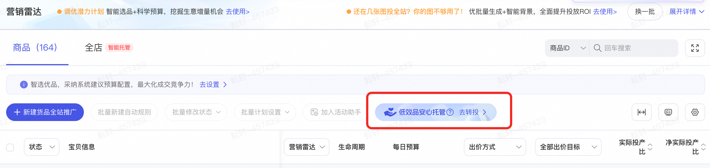
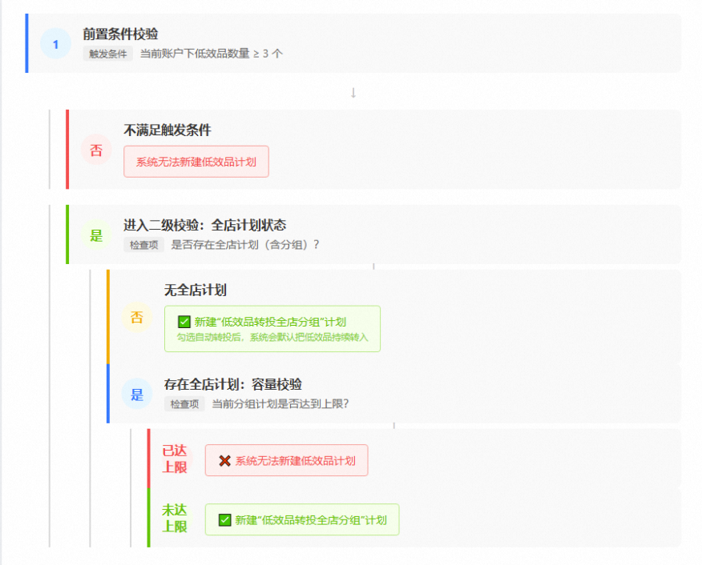

# 【全店模式】低效品安心转投至全店分组托管功能（内测）

> 来源：https://alidocs.dingtalk.com/i/nodes/oP0MALyR8kzGnoOwF299jBDpJ3bzYmDO

**什么是****低效品？**

**系统智能识别货品全站推广-商品推广在投商品中成交少、投产比不稳定，但仍有增长潜力的商品集合**

成交少：日均成交小于1笔

投产比不稳定：实际投产比交付率低（如仅为目标投产比的30%）

这类商品因单日流量少、成交稀疏、新品冷启动、消费者成交决策长等原因，积累数据少且不稳定导致投放效果较差

**系统智能识别商品潜力，一键转投至全店模式分组投放，可提升组合商品整体拿量能力，且计划整体投产比交付更稳定**

** ****实验显示 **低效品组合转投安心托管后，**整体成交平均提升****23%****，ROI达标率平均提升****11%**

** ****平台扶持 **为进一步提升低效品转投后的效果，平台会对转投商品提供**20%****的流量扶持**，助力转投品拿量能力和投产比交付进一步提升

**转投安心托管为什么能提升效率？**

** ****投放预算共享 ****多个商品各自预算汇总成计划预算，系统基于组合内商品不同表现动态再分配预算，提升预算使用效率和拿量**

单个商品投放可能因跑量较好，预算不足下线错失后续优质流量；也可能因拿量不稳定，预算剩余过多。

多商品组合投放后，预算共享，系统基于组合内不同商品的潜力及投放情况，**动态智能分配预算、灵活调整出价**，使得每个商品能更好的竞争优质流量，能保持更长的在线投放状态，**组合整体的拿量能力得到优化**

** ****成交数据共享 ****计划成交越多、数据越充分，系统竞价调控越稳定，投放效果交付越稳定**

单个商品独立为一个计划因单日流量少、成交稀疏、新品冷启动、消费者成交决策长等原因，数据少不稳定导致投放效果较差。

当多个低效品组合为一个新的「安心托管」计划后，**这个计划的点击、成交数据会比单一商品计划充分**，系统能更好的调控这个组合计划，**带来更稳定的投放效果**

**如何操作转投安心托管？**

进入货品全站推-横向计划管理；

系统已为您选取符合条件的商品，点击**货品全站推广-低效品安心托管转投**引导，跳转新建转投计划；

注意低效品安心转投全店分组计划会存在以下情况，请按照您账户实际情况进行投放；

建议您采纳**系统推荐的目标投产比和日限额**，有助于计划的拿量和系统优化；

建议默认**「自动转投」**开启；系统会定期把**商品推广-控投产比投放计划中效果差的商品（成交少、投产比不稳定），转投至全店分组模式安心托管**，系统挖掘转投商品增长潜力，动态分配预算调整出价，有效提升组合投放。无需频繁手动操作，省时省心，安心托管

**注意：低效品转投至分组投放计划，有且只有一个****低效品分组计划；****若有开启中的低效品转投计划，勾选自动转投后默认进入****低效品分组计划****中；****若有暂停的****低效品转投计划，****勾选自动转投后会新建****低效品转投计划，****并删除原计划中的商品，重新投放。**

**常见问题****？**

| 什么是低效品 | 成交少、投产比不稳定，但仍有增长潜力的商品集合； 成交少：日均成交小于1笔 投产比不稳定：实际投产比交付率低（如仅为目标投产比的30%） 这类商品因单日流量少、成交稀疏、新品冷启动、消费者成交决策长等原因，积累数据少且不稳定导致投放效果较差 |
| --- | --- |
| 功能入口找不到 | 进入货品全站推-横向计划管理 系统已为您选取符合条件的商品，点击**货品全站推广-低效品安心托管转投**引导，跳转新建转投计划； 如后台没有截图飘条，则表示目前账户没有符合低效品定义的商品，无法新建低效品全店分组计划 |
| 转投安心托管后能否改善效果 | 实验显示：低效品组合转投安心托管后，**整体成交平均提升****23%****，ROI达标率平均提升****11%** |
| 新品是否自动加入 | 可能会。 如开启全站推-全店模式新增**商品池汰换功能**，自动推广店铺中新上架且未推广的商品，并汰换表现差的商品，系统将挖掘潜力商品，自动优化出价，动态分配预算，探索全店增长机会； 如**「自动转投」**开启；系统会定期把**商品推广-控投产比投放计划中效果差的商品（成交少、投产比不稳定），转投至全店分组模式安心托管**， |
| 与全店托管/分组托管的关系 | 全店模式最多可创建**1个「智能托管」计划，10个「分组托管」计划**，低效品转投至分组投放计划，有且只有一个低效品分组计划；若有开启中的低效品转投计划，勾选自动转投后默认进入低效品分组计划中；若有暂停的低效品转投计划，勾选自动转投后会新建低效品转投计划，并删除原计划中的商品，重新投放。 |
| 已屏蔽的商品是否还会被自动转投到安心托管，或者如何从安心托管中排除特定商品 | 不一定。已屏蔽商品自动转投到安心托管的问题已在排查，请等待官方通知结果。 |
