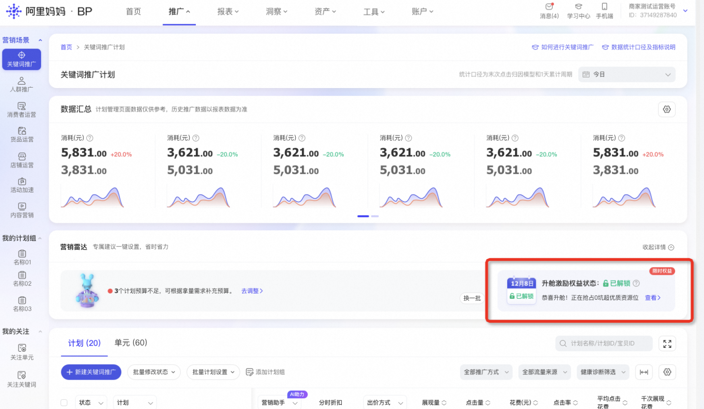
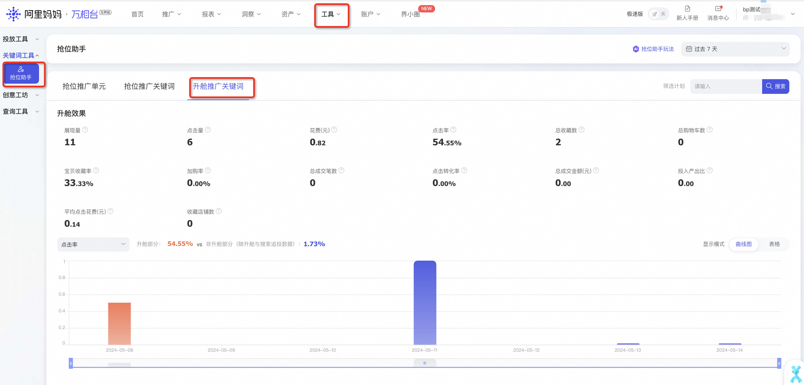

# 什么是「关键词升舱·激励体验装」

> 来源：https://alidocs.dingtalk.com/i/nodes/oP0MALyR8kzGnoOwF7yKOZ00J3bzYmDO

**原语雀文档链接：**https://yuque.antfin.com/chenchun.chen/gqhty9/pl9ab16mqr4r6ws1

---

**产品内测中，非全量客户开通，敬请期待！**

# **一、权益内容介绍**

**满足关键词场景活跃及消耗要求的天猫商家，可获得「关键词升舱·激励体验装」权益。**

**享受权益时，客户在投计划将****在预算及出价不变的前提下****，自动将商品升舱至「搜索置顶位置」（如下图），商家****无需额外提高出价****就有机会****体验超优质资源位的高点击、高转化效果****。**

# 二、权益状态确认

**展示位置：登陆无界 - 推广 - 关键词推广 - 营销雷达右侧**

鼠标移至小问号处可查看「今天-3，今天-2，今天-1，今天，今天+1」共5天的权益状态，权益状态一般在凌晨1点左右进行更新，可能会有适当延迟。

*开客过程中解锁时间以开权限时间为准，过去状态已解锁但没有投放数据是因为暂未开通权限。

若无权益板块展示，则说明暂时不满足享受权益的条件。

# 三、权益解锁后如何拿到更多优质流量

**权益解锁后，需满足以下条件，才能真正通过权益体验到优质资源位投放效果，满足条件的计划越多，效果越好。**

关键词场景有正在投放的自定义推广计划、搜索卡位计划、趋势明星计划；

正在投放的自定义推广计划、搜索卡位计划、趋势明星计划中绑定了可升舱词。

# 四、权益投放数据查看

**登陆无界 - 工具 - 抢位助手 - 升舱推广关键词**

# 五、常见问题

**1、当前没有解锁权益，该如何解锁权益？**

具体规则可参考文档：

**2、「激励升舱」与「正式升舱」有什么区别？**

「激励升舱」需满足关键词场景消耗要求才可解锁，正在推广中的计划（仅包括自定义推广、搜索卡位计划、趋势明星计划）若有符合条件的升舱词，则可在原本计划出价的基础上，自动（无需操作）享受更大版面、更优位置展现；**「正式升舱」**需在搜索卡位或手动出价计划中针对可升舱词进行单独出价；

「关键词升舱·激励体验装」目的为让商家体验更大版面、更优位置推广效果，但拿量有限且具有随机性，若对拿量有更多确定性需求，建议使用「关键词升舱」；

**4、「关键词升舱·激励体验装」与「关键词升舱」有冲突吗？**

没有冲突，若同一个商品、同一个词已设置「关键词升舱」，则「关键词升舱·激励体验装」权益在该商品、该词下不再生效。

**​**

## 更多相关问题欢迎进钉钉群@福福咨询

**1群：88010000873（已满）**

**2群：65930022821（已满）**

**3群：95535012849**
