# 04-1-0 内容拉新 超级短视频重磅场景 专注内容域新客覆盖及成交

> 来源：https://alidocs.dingtalk.com/i/nodes/oP0MALyR8kzGnoOwFEnyOvnEJ3bzYmDO

**推广链接（PC)：****一键直达内容拉新 开启高效拉新**

**内容拉新·新升级——**

| 内容主题优化 | 支持主题搜索 | 结案升级 |
| --- | --- | --- |

**优化主题排行榜：**按照流量增速、流量规模、竞争蓝盖；同时，结合店铺视频内容，进行实时的市场主题排行

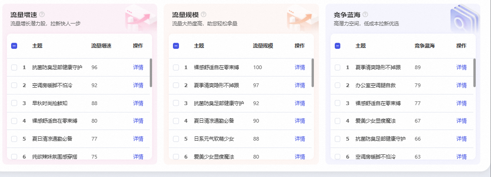

**支持主题搜索：**支持搜索本账户视频相关的主题，获取潜在机会主题流量

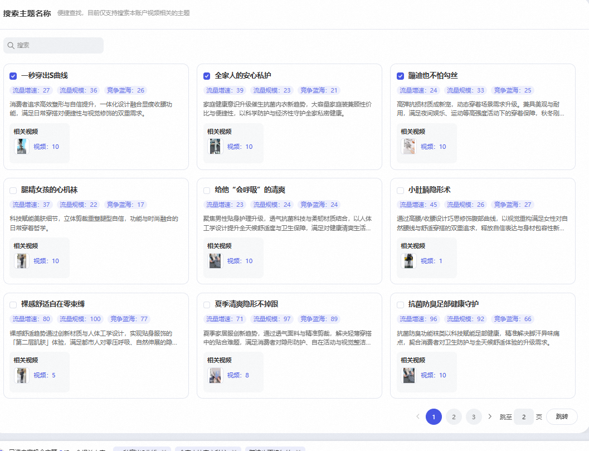

**专属结案升级：**场景报表下新增内容拉新结案数据

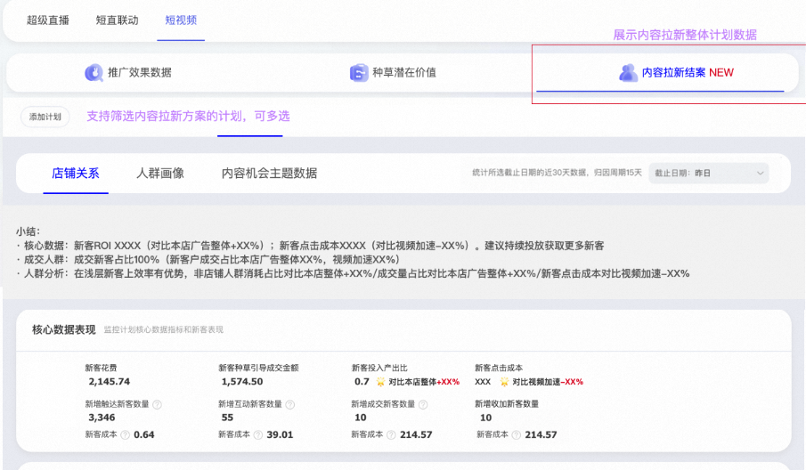

# 一、场景心智

「内容拉新」是超级短视频2025年首个重磅推出的营销场景，帮助商家通过短视频内容高效的获取首购新客，覆盖更多的店铺新客；内容拉新场景专注优化内容首购新客数，为店铺带来更多的新成交。

**数据效果：新客roi 提高+13%+ 新客ppc 降低33% vs **超级短视频其他目标** **

**人群效果：非店铺人群有消耗和成交上的优势 **非店铺人群触达+7% 非店铺人群成交+13%

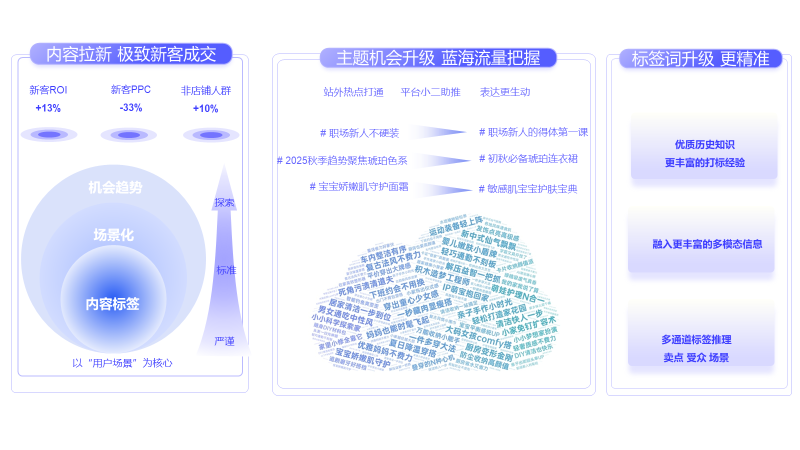

# 二、商家案例

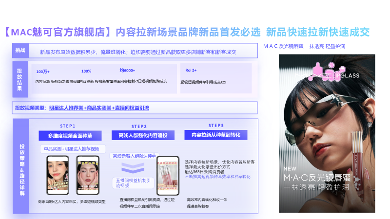

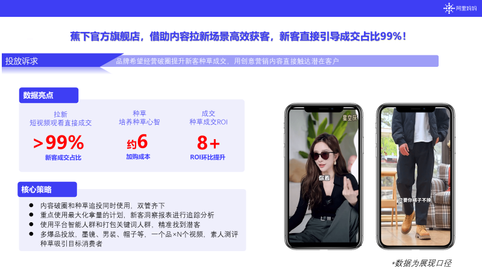

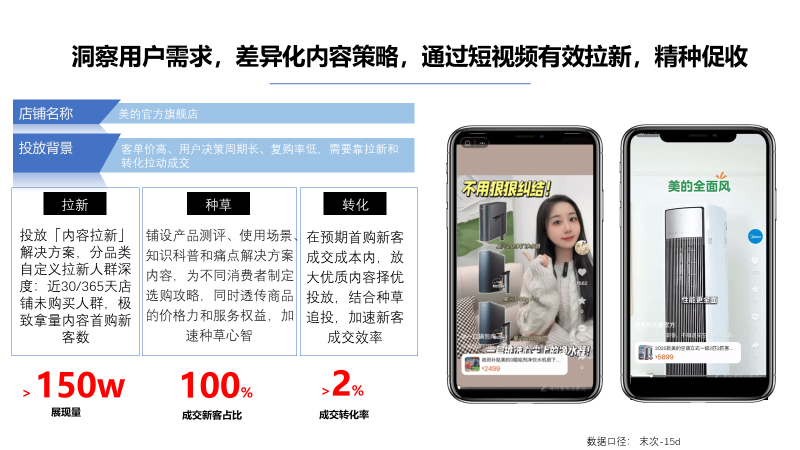

# 三、操作流程

### 1.选择场景“内容营销——超级短视频——内容拉新“

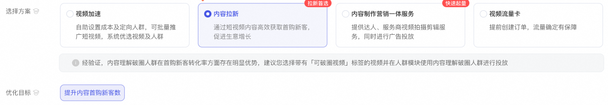

推广链接（PC)：一键直达内容拉新 开启高效拉新

### 2.选择推广主体

#### **选择内容机会主题（****new****）:****基于您店铺的视频，按照市场的流量增速、流量规模、竞争蓝海等情况，给到内容机会主题，商家可以选择不同的主题进行推广**

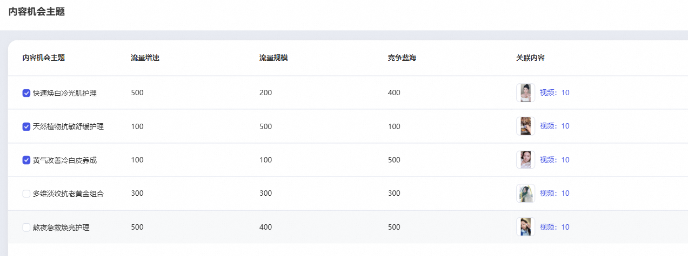

使用TIPS:

1.商家可以选择1-5个内容机会主题，不同的主题下视频不重复

2.内容机会主题会根据您所选主题及视频，使用多模态大模型理解所推理出来的内容及标签进行破圈和投放机会探索，分为严谨----标准----探索，三重破圈机会人群推广，商家可以自定义选择推理程度；推理程度越严谨，推荐人群越精准，推理程度越广泛，人群会更具有潜力，在新客增量上表现更优

3.建议选择5个主题，建议选择探索式内容机会破圈

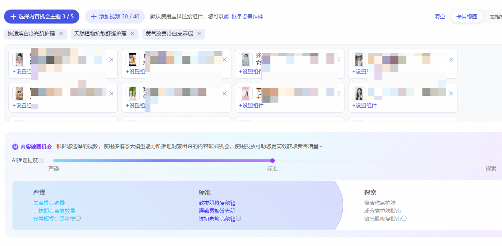

#### **添加视频：****添加您想推广的视频，支持千牛发布&光合发布通过内容审核的短视频和超级短视频后台本地上传的视频**

tips1：上传视频到投放视频的方式

通过千牛或者光合平台上传；通过审核后，即可在超级短视频后台中直接选择

在超级短视频后台-视频工作台-本地上传视频使用详解→https://www.yuque.com/yijiaoqu/vpgdoi/os8c4x

tips2：视频创意越多，越容易跑出高效率视频，建议推广视频数量>10支。

tips3：视频审核常见问题详解→https://www.yuque.com/yijiaoqu/vpgdoi/qq48md?spm=a2etp.23434838.0.0.1273340cdzxDen

### 3.设置视频组件（可不设置，默认投放视频下个商品）

每个视频可以选择任一种视频组件，支持投中修改组件（开发中，预计7月份上线）

### 4.**设置出价及预算**

设置出价：最大化拿量 或 控成本出价

设置预算：预算设置最低100元/天，可以投中暂停

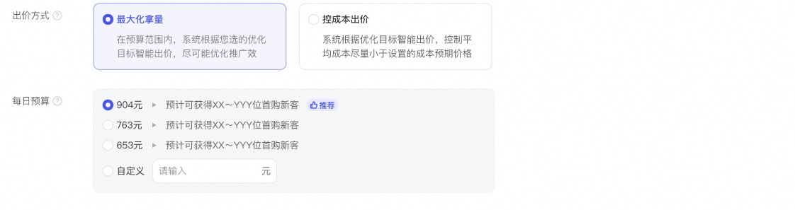

### 5.开启种草追投

每日预算大于180元时，种草追投默认开启，可以帮您在商品城触达种草未转化人群，实现种草人群即种即收，带动计划RO提升，建议开启。

### 6.设置人群

触达范围：

店铺未购新客（近365天，180天，90天，30天，15天，7天）

未多次触达人群（近30天，15天，7天，不考虑触达次数）

种草人群：​

系统推荐人群系统结合您的店铺、推广宝贝及所在行业的相关特征和属性，智能挖掘出对其感兴趣的一类人群标签

自定义人群含内容破圈、内容偏好人群、店铺人群、关键词人群、达人偏好人群、平台精选基础属性人群和达摩盘人群（达摩盘已保存人群可投，建议人群规模大于1000万）

智能人群：系统将根据访客特征实时计算并智能优选对您推广内容感兴趣程度较高的人群，帮您高效达成推广目标

内容破圈人群：默认开启，即内容机会主题人群（或手动添加后，有内容破圈标签的视频的内容破圈人群）

人群调优：若开启人群调优，系统将提高自定义人群出价，可能会影响您最终的投放成本

过滤人群：过滤不符合优化目标的人群，建议使用默认设置效果最优

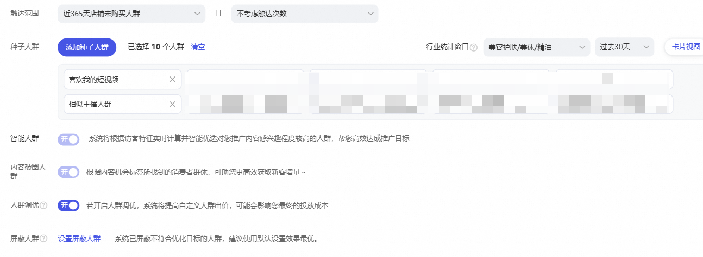

### 7.设置基础信息

投放日期：投放日期默认不限，建议使用系统默认设置效果最优

高级设置：投放地域及资源位预览

**完成创建并投放**

# 四、计划详情管理

新增触达范围管理：除了对计划、视频、人群进行正常的管理以外，新增编辑触达范围的管理，可以随时调整触达的新客及触达频次的范围。

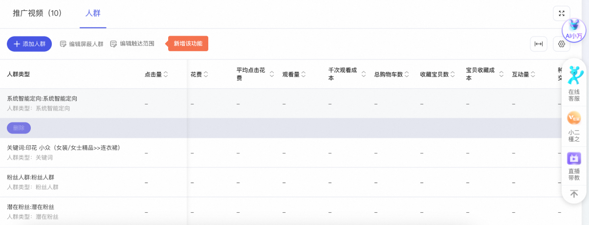

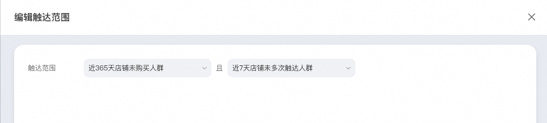

新增内容拉新解读：点击进入”内容拉新解读报表“，报表分为四个部分：计划数据汇总、新客流转、新客画像、新客长期价值。

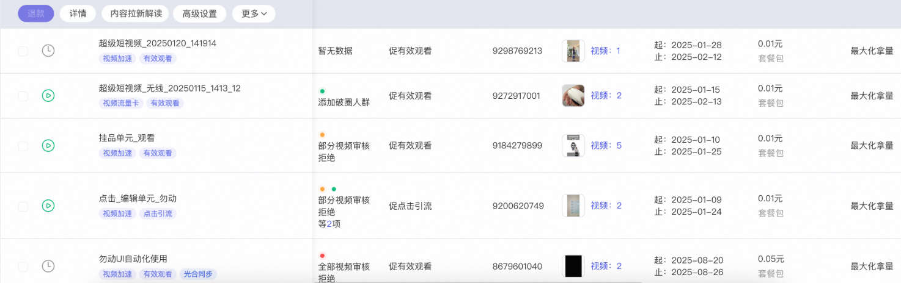

计划数据：包含消耗、种草引导成交金额、投入产出比等基础数据，新增首购新客增量、首购新客流转率、首购新客成本、访问新客增量、访问新客流转率、访问新客成本、兴趣新客增量、兴趣新客流转率、兴趣新客成本，数据口径为末次点击口径。

新客流转：给出了被超短广告触达的人群状态（人群初态），不同人群初态的消耗占比、首购新客数、首购新客流转率、首购新客成本、投产比，帮助店铺更好的分析不同状态人群的被超短广告触达后的表现。

新客画像：按照7大人群特征，对投放数据解读，让店铺明确超短广告带来的新客画像

新客长期价值：在长周期归因时间下，超短新客对店铺整体成交的贡献金额。

# **五、课程讲解**

投放布局：https://shuyuan.taobao.com/#!/knowledge/detail/index?id=35499

计划数据调优：https://shuyuan.taobao.com/#!/knowledge/detail/index?id=35498
