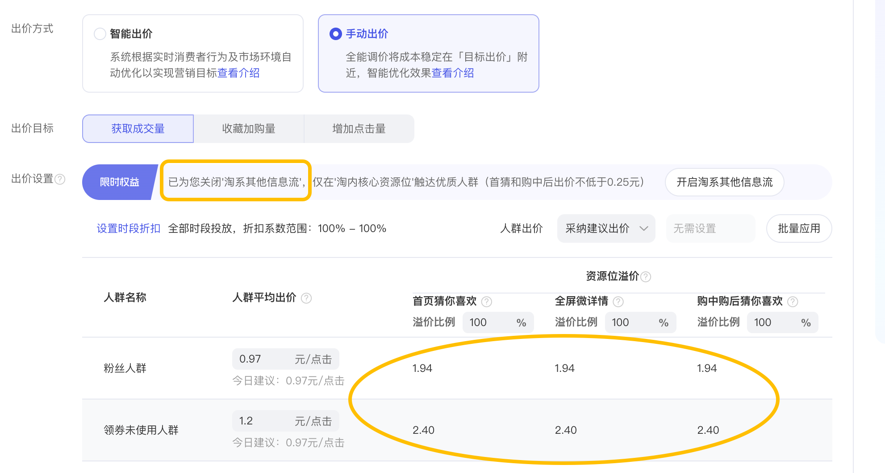

# 【邀约制，不支持申请】618限时返场！专注淘内，“淘系其他信息流”投放可选

> 来源：https://alidocs.dingtalk.com/i/nodes/oP0MALyR8kzGnoOwFKg55Y5nJ3bzYmDO

# **🚀 重磅回归！手动出价 V2 强势升级，助力618爆发！**

还记得去年双11吗？**“手动出价限时福利 V1” **曾帮助无数商家朋友实现了更精准的推广、更聚焦的流量、更满意的ROI！📈

应广大商家要求，同时全面赋能本次618大促，**“手动出价限时福利 V2” ** 带着全新能力焕新归来！ ✨

🔥 这次升级了什么？有多好用？
👇 话不多说，先睹为快，一图看懂产品新面貌！

# **升级点详解**

🎯 资源位精准聚焦淘内

极简操作：只需设定手动出价最终**出价 ≥ 0.25元**，即可关闭**“淘系其他信息流”**，计划将流量严格锁定在淘宝内，确保预算不流失。

🎨 交互体验全新升级

三维合一，直观可视：创新性融合“人群定向”、“资源位溢价”与“时间折扣”三大维度，**实时计算**并展示最终出价。告别复杂换算，投放成本一目了然。

🧠 LMA大模型深度赋能

全链路优化：基于最新LMA V2大模型能力，实现从“点击”到“转化”的全链路智能调控。**精准捕捉手淘首页猜你喜欢等淘内核心流量**，提升高价值用户获取效率。

# **FAQ**

如何获得本次“限时福利”？

本次活动为邀约制，不支持单独申请；具体请以后台通知/展示为准

本次“限时福利”预计持续多久？

预计本次618大促结束后回收

本次“重磅限时福利”升级后，店铺的“手动出价”计划会投放到哪？

该计划只会投放到：**“首页猜你喜欢”、“全屏微详情”、“购中后猜你喜欢”**
