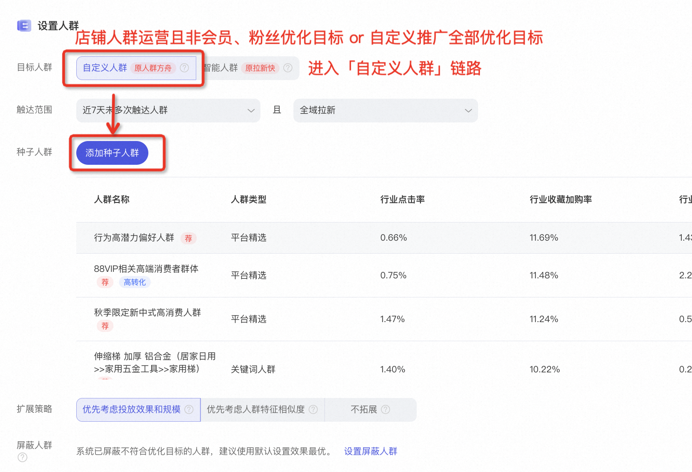
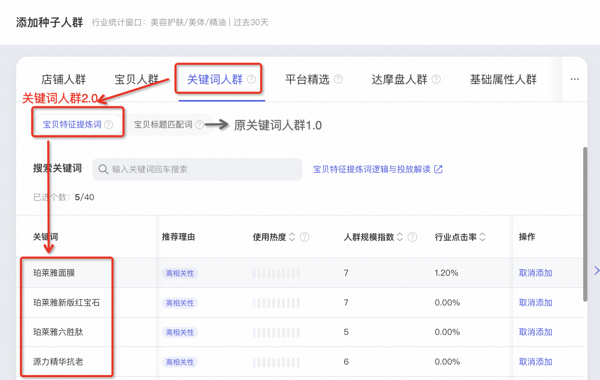
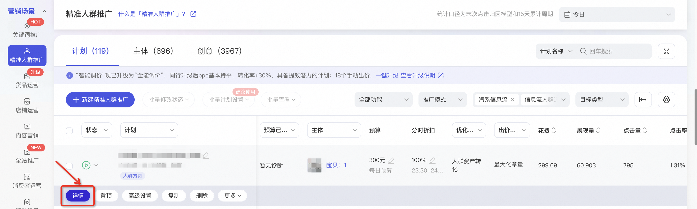
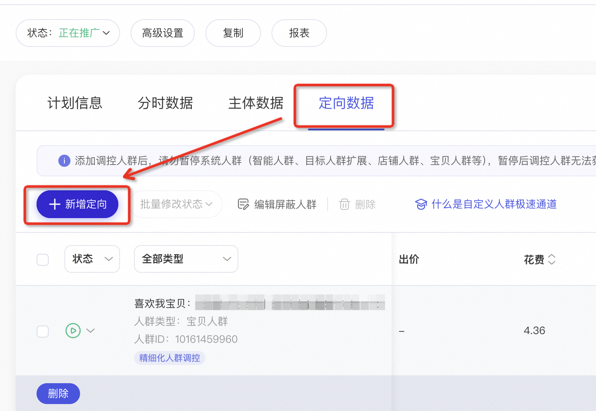
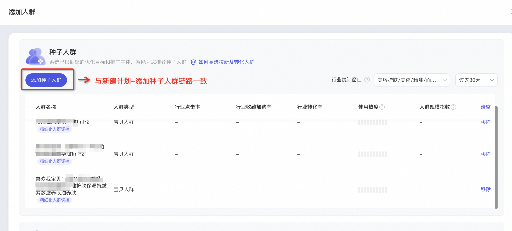
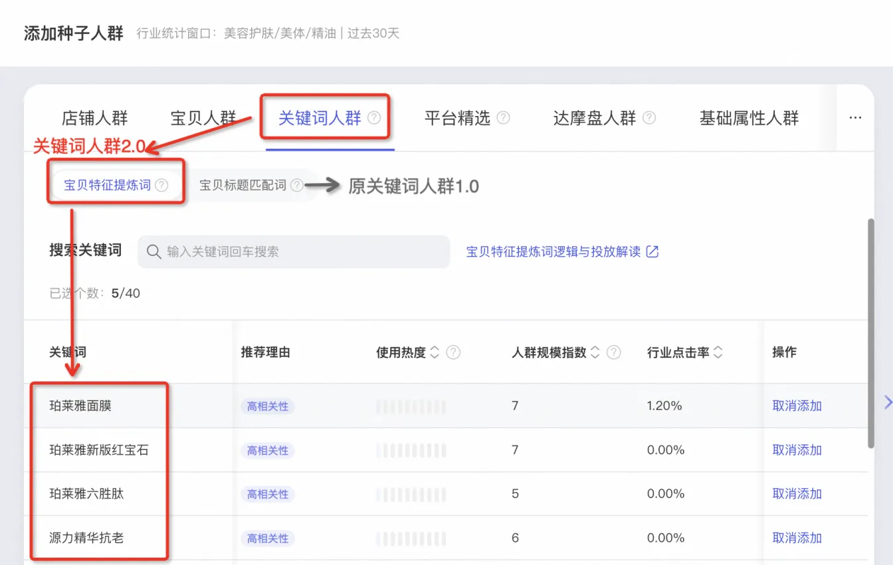

# 🔝关键词人群2.0：宝贝特征提炼词

> 来源：https://alidocs.dingtalk.com/i/nodes/qnYMoO1rWxrkmoj2IMxzBnLnJ47Z3je9

🤕 亲爱的商家朋友，您是否曾遇到以下问题：

*“**「抗皱 提拉 紧致」3、4个短语组合就是一个关键词人群？***啥意思？？***”*

*“有这么多关键词给我，***哪些词的人群转化好？哪些词的人群可破圈？”**

*“我的**宝贝很***小众***，***标题信息***总共都拆不出几个人群，怎么投呢？”*

⬇️ ⬇️ ⬇️

**❗️❗️【关键词人群2.0】现已上线人群推广❗️❗️**

**搭载 ****AI大语言模型 ****技术，全新推出 ****宝贝特征提炼词**

✨**词更全**：跳出标题限制，覆盖**商详信息**及**消费者搜索词**！全域解析宝贝特征！！

**✨人更准：**全淘系消费者行为数据挖掘➕更清晰语义表达🟰**高效匹配消费者兴趣偏好！**

**👉更多问题请加钉群：****88640003763**

---

| 🎉 关键词人群2.0升级点一览表～～ |  |  |
| --- | --- | --- |
|  | **2.0-宝贝特征提炼词** | **1.0-宝贝标题匹配词** |
| **​** **NEW 词可读性升级** 以：蜂花护发素润发乳改善毛躁干枯补水保湿顺滑丝肽精华女男1L发膜 为例 | **修护顺滑、护发蜂巢结构、特润保湿修护、密集滋润护发、秋冬滋润、滋养修护、丝滑柔顺、密集滋润水润、保湿无硅油、滋养柔顺、**国货修护、蚕丝蛋白水润、强韧顺滑发膜、柔亮顺滑发丝、清爽顺滑护发、氨基酸护发顺滑 | 1L干枯 改善 毛躁、保湿 干枯 毛躁、保湿 改善 毛躁、修复 天猫超市 干枯、修复 干枯 改善、修复 干枯 毛躁、发膜 改善 毛躁、天猫超市 干枯 改善、干枯 改善 蜂花、干枯 毛躁 营养 |
| **NEW 语料信息扩充** | 由语义大模型对商品标题、商品详情页、消费者淘内行为等进行总结提炼的关键词，语句更具可读性，更偏向消费者视角，词义表达更宽泛 | 由系统对商品标题进行标签化拆解而来的关键词，更强类目相关性，词义表达更具体精准 |
| **NEW 新增推荐理由** | 新增**高相关性、潜在机会**两类推荐理由 **高效收割***建议投放***「高相关性」** **破圈拉新***可尝试***「潜在机会」** | *无* |
| **NEW 技术底层升级** | AI大语言模型+全淘系消费者行为数据作为prompt**放量更简单，人群更精准** | *无* |

---

## 一、投放指引

### 1-新建计划

**操作步骤1：**店铺人群运营下的原方舟优化目标（除去会员、粉丝以外均可）or 自定义推广下的任意优化目标——设置要推广的宝贝；

**操作步骤2：**人群设置——**自定义人群**——**种子人群；**可于人群推荐列表看到算法优选高效关键词人群（匹配优化目标、推广宝贝），亦可进入种子人群侧滑窗，手动新增更多关键词人群；

**操作步骤3：**添加种子人群——关键词人群——**宝贝特征提炼词；**此处默认推荐更高效的2.0关键词人群，亦可手动搜索关键词，增加更多人群；

*宝贝标题匹配词：*原1.0关键词人群，回显类目信息且支持类目筛选，语义仅来源于商品标题，对应人群范围更窄。若您不习惯使用2.0关键词人群，可在此处添加1.0人群（一条计划可以既投放1.0人群又投放2.0人群哦）

---

### 2-计划管理与添加人群

**操作步骤1：**推广管理页——精准人群推广——计划详情页，找到需要添加人群的计划，点击 详情 ；

**操作步骤2：**进入计划管理侧滑窗，点进 **定向数据** 页面，选择 新增定向 。

**操作步骤3：**进入种子人群侧滑窗，选择 添加种子人群 ，后续流程与新建计划-添加种子人群链路一致。

## 二、更多问题

**🤔 Q1：2.0关键词我用不习惯，如何切换成之前的关键词人群？**「关键词人群」当前分成**【宝贝特征提取词】**和**【宝贝标题解析词】**，其中【宝贝标题解析词】保留了旧版关键词的交互形式与关键词词库，您可根据自己的推广习惯与推广效果，自由选择投放哪种关键词人群。

**🤔 Q2：宝贝特征提取词为何没有类目信息？**「宝贝特征提取词」扩展了语料库，以**消费者淘内搜索词**为核心，提取更具可读性的短语，整体也会更偏向消费者视角；**消费者在进行搜索时，****少以类目信息限制搜素结果**，故搭载了大模型技术输出的「宝贝特征提取词」**亦不再展示类目信息**。

若您有**强类目信息**索引诉求，可手动检索类目信息，添加符合推广诉求的**「宝贝特征提取词」**；或直接切换至**「宝贝标题解析词」**

**​**

**🤔 Q3：为何当前的关键词人群拿量不均匀，曝光集中在部分词上？**「关键词人群2.0」优化了人群归因逻辑；**当一个消费者同时命中两个关键词时**，会更精细地计算该消费者的标签与两个关键词的匹配程度，**优先归因****给更相关的词****下面**。

举个例子：消费者【59】可归为关键词【<60】，亦可归为关键词【<100】，两个词相同出价下，关键词1.0会将这类消费者**均匀划分**给两个词；关键词2.0一定会高优分给关键词 【<60】。

---

**🎁 ****邀您参加有奖调研，我们将收集您的使用感受并不断优化：****https://survey.taobao.com/apps/zhiliao/pY4zO9upA**
