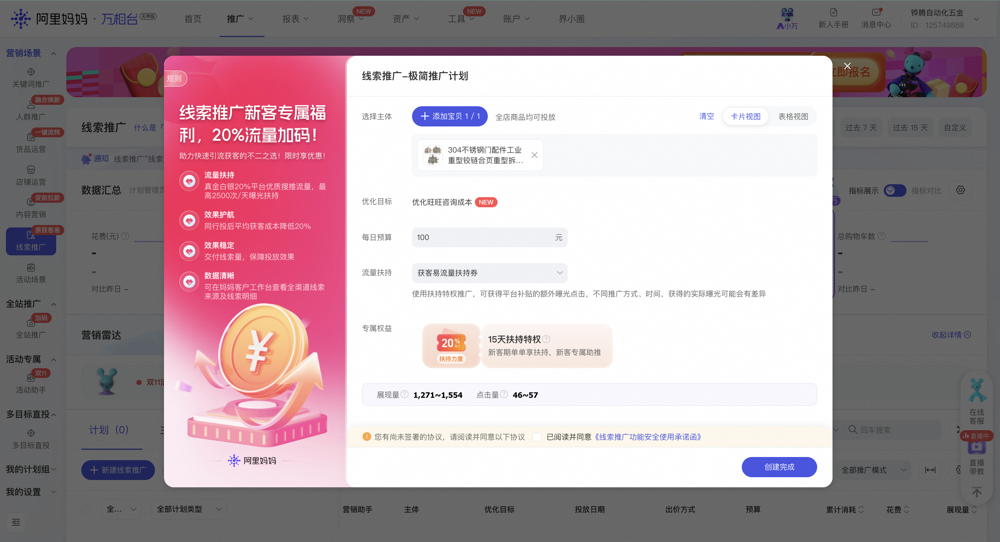
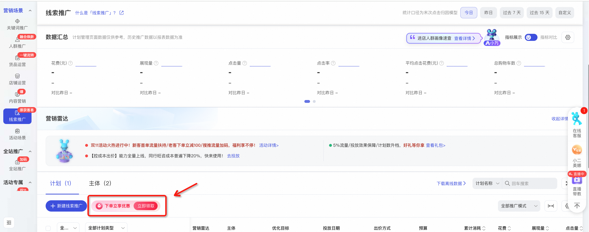
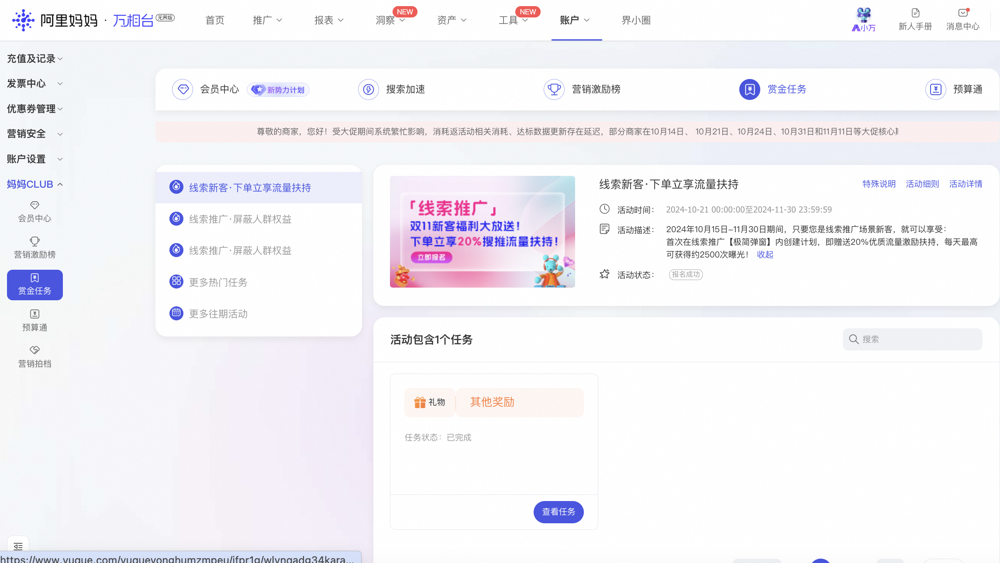
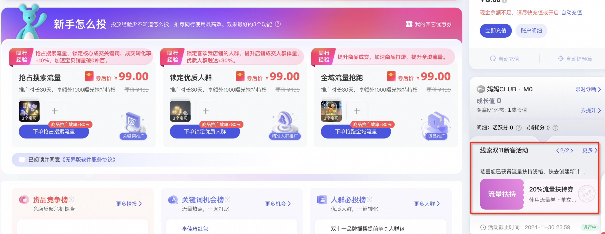

# 🔥线索推广新客首单享20%优质流量补贴

> 来源：https://alidocs.dingtalk.com/i/nodes/qnYMoO1rWxrkmoj2IMxzGAAnJ47Z3je9

**原语雀文档链接：**https://yuque.antfin.com/chenchun.chen/gqhty9/xiviahtl9zspriew

---

**活动时间：持续在线**

**活动对象：线索推广场景新客（近180日未在线索推广有过消耗）**

**活动方式：****在「线索推广」场景，****首次创建极简版计划****，****即赠送**20%优质流量激励补贴**，投放5日内补贴完毕！**计划预算金额越高，享受扶持越多，投放越划算！

**奖励发放：**即时发放**（每日补贴金额50元封顶，每天最高可获得2500次左右曝光！）**

**参与方式：**

**方法一：**进入**线索推广横向管理页面，在极简下单弹窗中创建计划**，将自动开启流量扶持。

>直达链接领取权益< **​**

**方法二：**在**万相台无界版PC端-妈妈CLUB-赏金任务-报名****【线索推广·下单立享流量扶持】****活动**，再跳转线索推广场景-极简下单弹窗使用即可。

>直达链接领取权益< **​**

**方法三：**在**万相台无界****PC端首页—点击右下角****【线索双11新客活动】****进行报名**，即享有下单20%优质流量激励补贴的资格，跳转线索推广场景-**极简弹窗下单**即可。

>直达链接领取权益< **​**

**FAQ：**

**1、扶持数据怎么看？**

完成创建后，可以在线索推广计划列表查看「流量扶持」标签中相关内容。

**2、****首单流量扶持是否需要我手动领取？**

不需要，在弹窗中下单时直接完成领取与使用的动作。

3、新客流量扶持只能在弹窗中才能领取使用，在主流程里新建计划是不享有的。
