# 场景升级！四大营销目标助力经营

> 来源：https://alidocs.dingtalk.com/i/nodes/qnYMoO1rWxrkmoj2IMxzYv2QJ47Z3je9

**原语雀文档链接：**https://yuque.antfin.com/chenchun.chen/gqhty9/ukbo08gvztfgy1g6

---

## 一、主要升级点

**1、营销场景更丰富：**从客户关键词投放诉求出发，新增营销目标，包括搜索卡位、趋势明星、流量金卡、自定义推广

**2、操作流程更简便：**部分客户反馈关键词推广创建计划流程较为复杂，本次升级针对创编流程简化，减少商家新建耗时

## 二、操作引导

####

#### 1、搜索卡位：未大范围开始内测，请耐心等待

#### 2、趋势明星：市场趋势一网打尽，高效引流

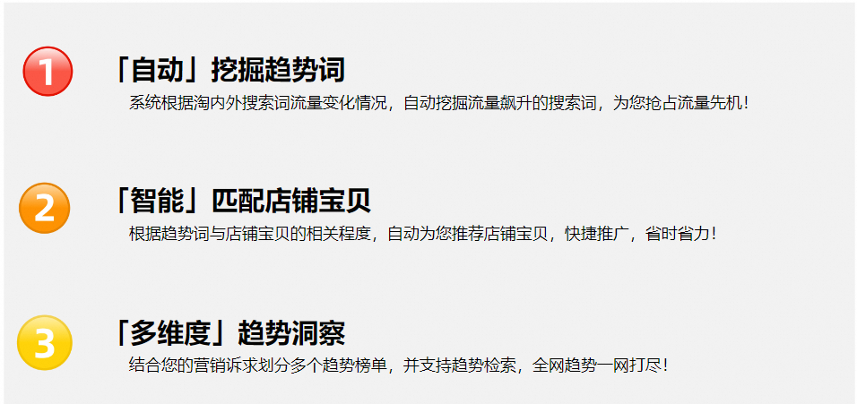

**选择趋势主题+添加自选宝贝**

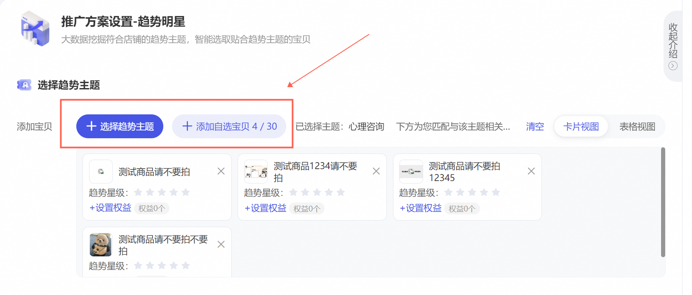

**设置预算及选择出价**

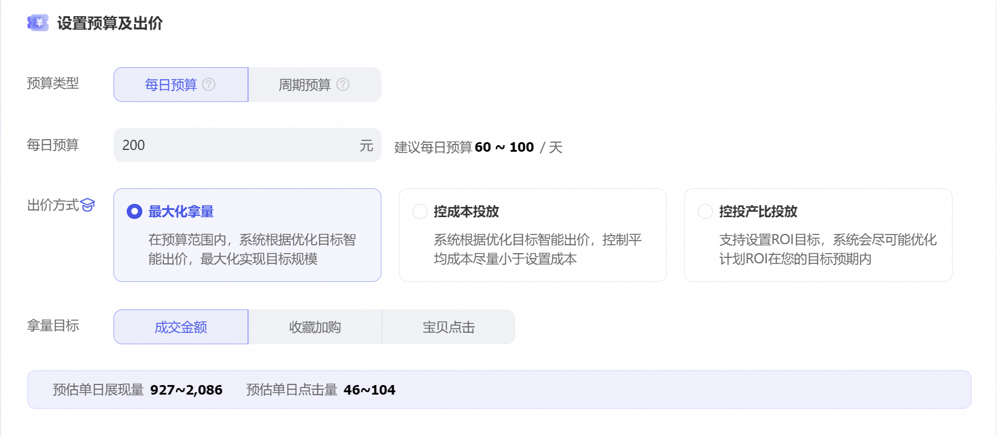

**设置基础信息&高级设置**

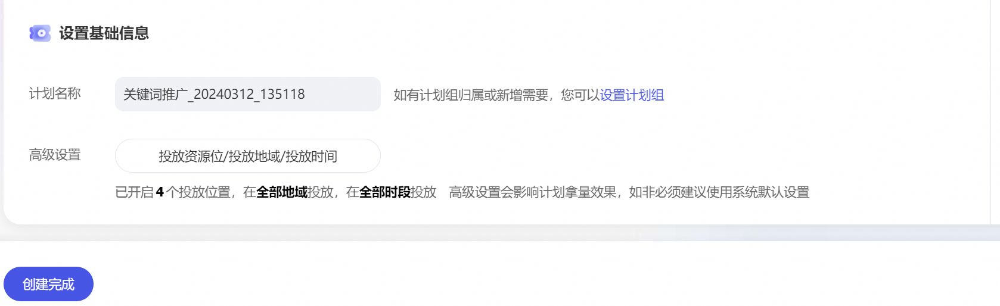

#### 3、流量金卡：生意份额加速提升利器

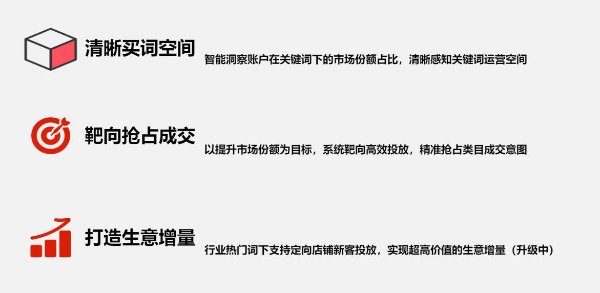

**选择金卡类型**

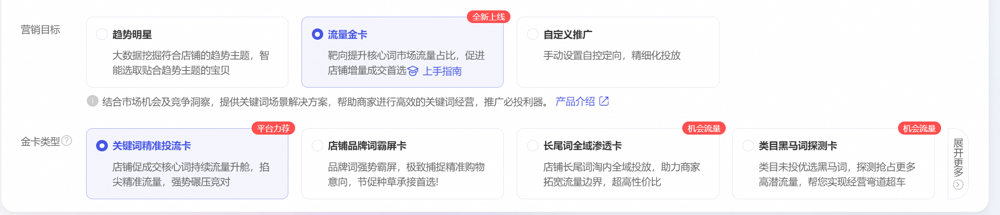

**设置关键词&添加宝贝（部分货品卡片不需要选词）**

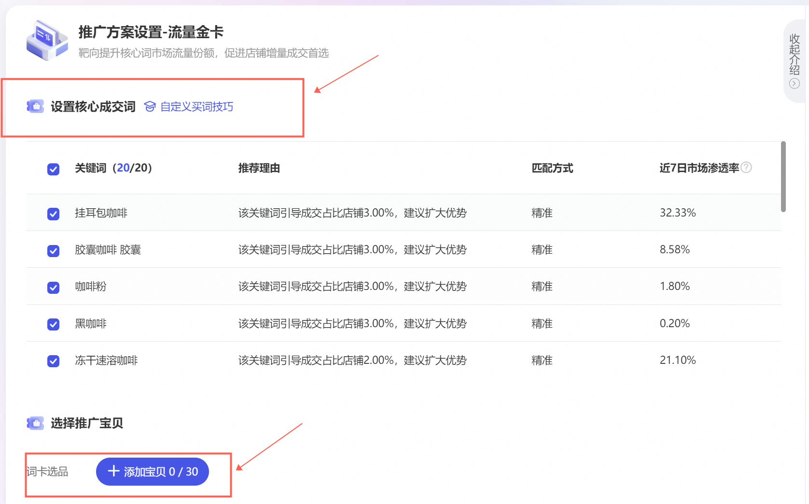

**设置预算&支付方案**

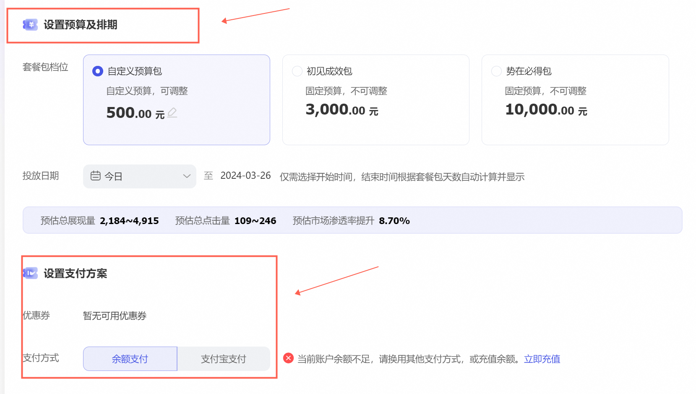

#### 4、自定义推广：个性化定制投放策略，精准可控

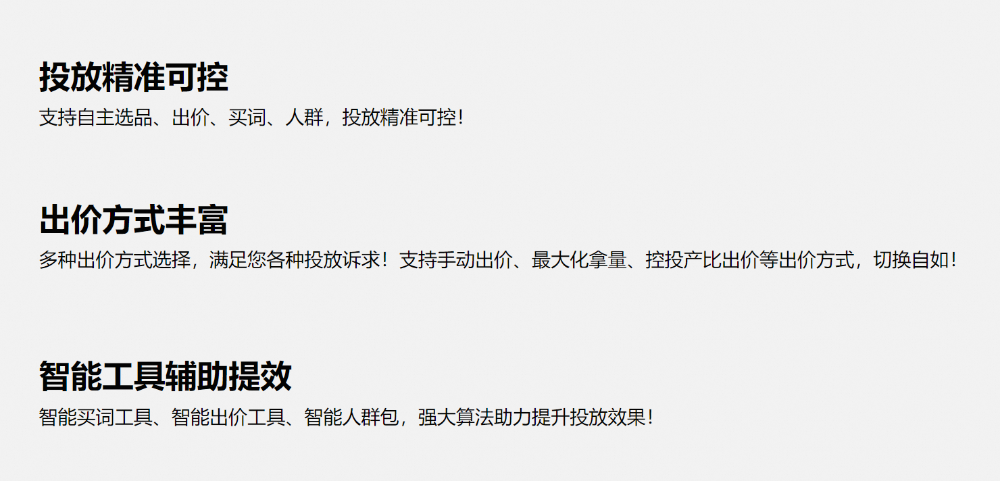

**确定选品方式&添加宝贝**

####

**设置预算&出价方式**

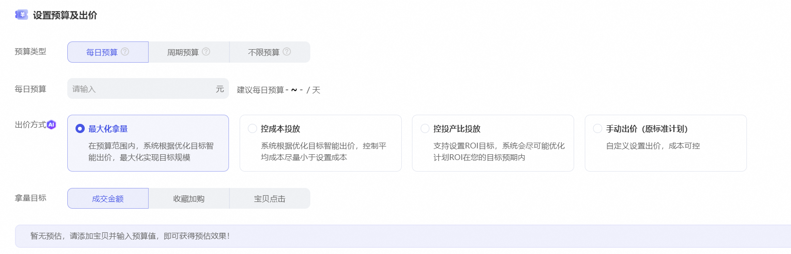

**当计划选择多个宝贝时，支持一键应用选中宝贝设置项，帮助商家解决多宝贝下重复买词的问题**

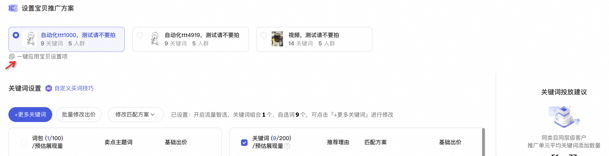

**设置关键词&人群**

选择手动出价时，关键词&人群设置页面

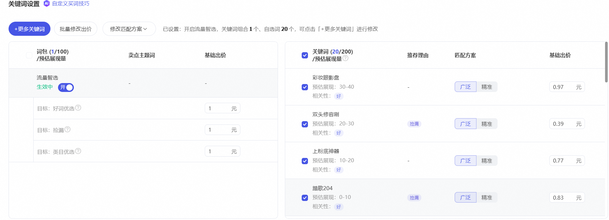

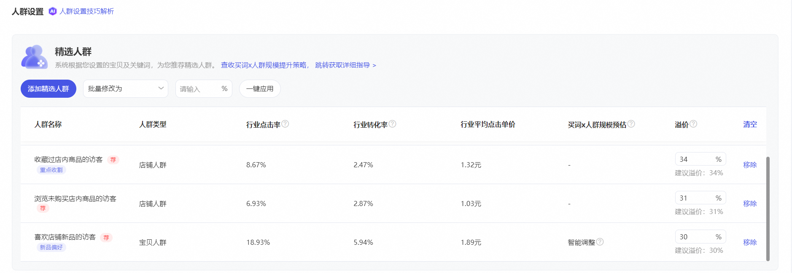

选择智能出价时，关键词设置页面

**设置计划基础信息**

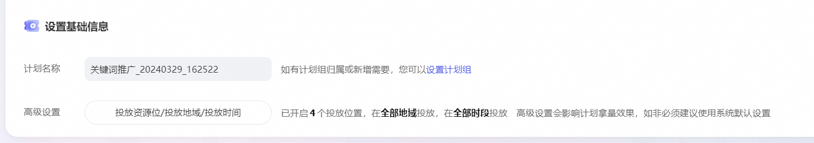
