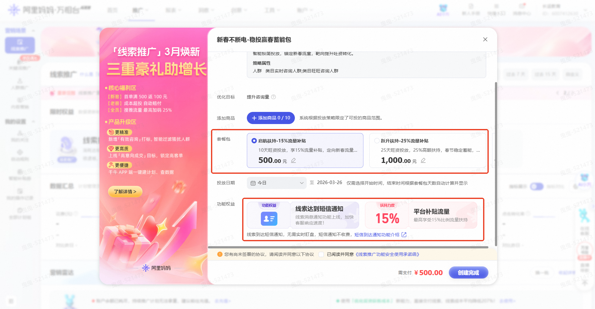
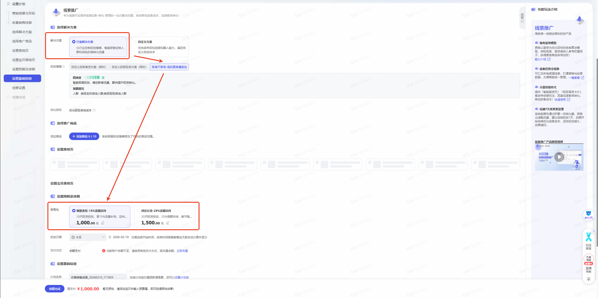

# 开春早复工，线索开门红 好生意“马上”就来！

> 来源：https://alidocs.dingtalk.com/i/nodes/qnYMoO1rWxrkmoj2IQYmXLmPJ47Z3je9

「**开春早复工，线索开门红**」——**线索商家专属营销激励活动火热开启！**

**历史最高激励！消耗达标获15%～25%额外曝光！获取首页搜推核心展示位！**

亲爱的线索商家：

您是否遇到过春节停投重启后计划跑量完全衰退？

您是否也想在年后立马爆单，“马上”赢得开门红？

「**线索推广**」平台重磅推出「**开春早复工**」专属营销活动！

为多行业商家量身定制高性价比套餐包，投放即享：

**行业精准词人定制、核心搜推流量加码、限时搜索通知权益**

小预算维稳营销模型，低成本守住精准流量池，助您开年快人一步赢全局！

---

### 🎯 活动对象

所有具备线索全量权限的商家（含新客及活跃老客）均可参与。

---

### 💡 活动规则：分层激励，投得越多，权益越多！

根据您的历史或近期营销消耗水平，我们为您匹配专属套餐档位。**只需一次性投放指定金额套餐包，即可立即获得对应比例的核心搜推流量补贴及优先线索通知权益**！

| 商家消耗分层 | 套餐选项一 | 套餐选项二 |
| --- | --- | --- |
| **历史未投放商家** | 投放 ¥500 → 获 **15% 流量补贴**（¥75） | 投放 ¥1,000 → 获 **25% 流量补贴**（¥250） |
| **月消耗 ¥200–¥1,000** | 投放 ¥1,000 → 获 **15% 流量补贴**（¥150） | 投放 ¥1,500 → 获 **25% 流量补贴**（¥375） |
| **月消耗 ¥1,001–¥2,000** | 投放 ¥2,000 → 获 **15%流量 补贴**（¥300） | 投放 ¥2,500 → 获 **25% 流量补贴**（¥625） |
| **月消耗 ¥2,001–¥3,000** | 投放 ¥3,000 → 获 **15%流量 补贴**（¥450） | 投放 ¥3,500 → 获 **25% 流量补贴**（¥875） |
| **月消耗 ¥3,001–¥4,000** | 投放 ¥4,000 → 获 **15% 流量补贴**（¥600） | 投放 ¥4,500 → 获 **25% 流量补贴**（¥1,125） |
| **月消耗 ¥4,001–¥5,000** | 投放 ¥6,000 → 获 **15% 流量补贴**（¥900） | 投放 ¥7,000 → 获 **25% 流量补贴**（¥1,750） |
| **月消耗 ¥5,001 及以上** | 投放 ¥20,000 → 获 **15% 流量补贴**（¥3,000） | 投放 ¥30,000 → 获 **25% 流量补贴**（¥7,500） |

✅ **额外权益**：**成功下单任一套餐包，次日即可享受【线索实时通知】权益**，第一时间掌握高意向客户动态，获取成交先机！

---

**📍计划创建：首页弹窗，极简下单！**

**商家参与方式1：**登录万相台AI无界后台 → 进入【线索推广】场景→ 自动弹窗页面，选择**「新春不断电-稳投赢春蓄能包」下任意套餐包：「启航扶持包」or「跃升扶持包」**→ 设置投放商品及时间 → 一键投放，坐享流量红利！

**商家参与方式2：**登录万相台AI无界后台 → 进入【线索推广】场景→ 新建推广，选择**行业解决方案****「新春不断电-稳投赢春蓄能包」下任意套餐包：「启航扶持包」or「跃升扶持包」**→ 设置投放商品及时间 → 一键投放，坐享流量红利！

**🔥 立即行动，让每一分预算都产生更大价值！**

**把握机会，引爆增长！我们在商机前线，与您共赢！**

了解更多投放指南，请查阅官方文档：

---

### ❓ 常见问题解答（FAQ）

**Q1：如何判断我属于哪个消耗分层？**
A：平台将自动根据您近30天的实际消耗金额进行分层匹配，无需手动申请。

**Q2：流量补贴如何发放？**
A：套餐包下单且计划显示“推广中”状态时，流量补贴实时生效。

**Q3：线索通知权益如何发放？**

**A：**套餐包下单且计划显示“推广中”状态后，次日线索通知权益将由平台统一发放，次日中午12点前生效，生效后商家需手动开启线索通知：进入阿里妈妈客户工作台-线索管理-线索设置-线索通知设置 https://business.alimama.com/#/，填写接受短信的手机号并获取验证码（仅当其设置手机号时生效，未设置手机号不发送短信）。

当通过「线索推广」获得一条线索时，系统将会及时推送到对应手机短信中。详见文档

**Q4：是否可以同时购买多个套餐包？**
A：每位商家在活动期内**每条计划仅可选择一个套餐包**参与（如选择¥1,000档，不可再修改为¥1,500档）；但可通过调整推广商品创建多条计划，并使用其他档位套餐包。注意，单个商家单日流量补贴额度不超过100元，请根据自身预算与目标合理选择。

**Q5：线索通知权益具体包含什么？**
A：开通后，您将能实时接收来向阿里妈妈客户工作台的新线索提醒，以短信形式推送，确保商家不错过任何商机。

**Q6：活动是否有截止时间？**
A：本次活动限时开放，活动时间暂定至2.28，权益有限，先到先得！建议尽早参与锁定权益。具体结束时间请关注平台公告。

### **特别说明**

1、活动统计的消耗金额、优惠券金额、流量补贴等数据以阿里妈妈统计为准；账户消耗仅指用户按照本次活动规则创建的计划在活动期间的真实账户消耗。

2、活动期间，用户需遵守万相台AI无界、全站推广的服务相关协议及规则（包括《阿里妈妈无界软件服务协议》、《全站信息技术服务协议》等），不得作弊，不得侵犯任意第三方之合法权益，推广店铺不得违规，否则阿里妈妈有权取消用户的活动资格和收回活动奖励。

3、用户应遵守淘宝网、天猫平台和/或阿里妈妈平台相关规则协议，如因用户违规行为，包括商品或者店铺被处以下架、屏蔽、删除、扣分、限制交易、监管账号或者查封店铺等措施，导致阿里妈妈营销优惠券无法使用的，淘宝、天猫及阿里妈妈将不进行任何退款、提现或补偿，并有权收回已发放的权益。

4、本活动所涉权益均为非售卖权益。参与活动的用户店铺状态为正常的淘宝、天猫卖家，符合《阿里妈妈账号管理规范》，阿里妈妈平台将结合用户多维度经营情况（如诚信经营情况、店铺品质、商品竞争力等）及各营销活动参与情况等进行综合评估。

5、在本次激励活动中，如用户存在违规行为（包括但不限于恶意套现、机器作弊、刷信誉、提供虚假信息等），或者用户主体关联的其他账号曾存在严重违规行为被处罚或被处以特定管理措施，活动举办方将取消违规用户的激励资格，并有权收回权益（含已使用的及未使用的），按照《淘宝网市场管理与违规处理》或《天猫市场管理规范》进行处罚，必要时将追究用户的法律责任。

6、因自然灾害、网络攻击或系统故障等不可抗力等因素使活动停止或出现问题，阿里妈妈免责。在法律允许的范围内，阿里妈妈可暂停或终止本活动，或者对本活动规则进行变动或调整，相关变动或调整将公布在本页面上。

7、活动举办方可以根据本活动的实际举办情况对活动规则进行变动或调整，相关变动或调整将公布在活动页面上。

---
