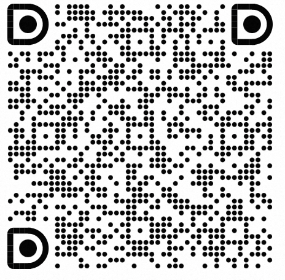
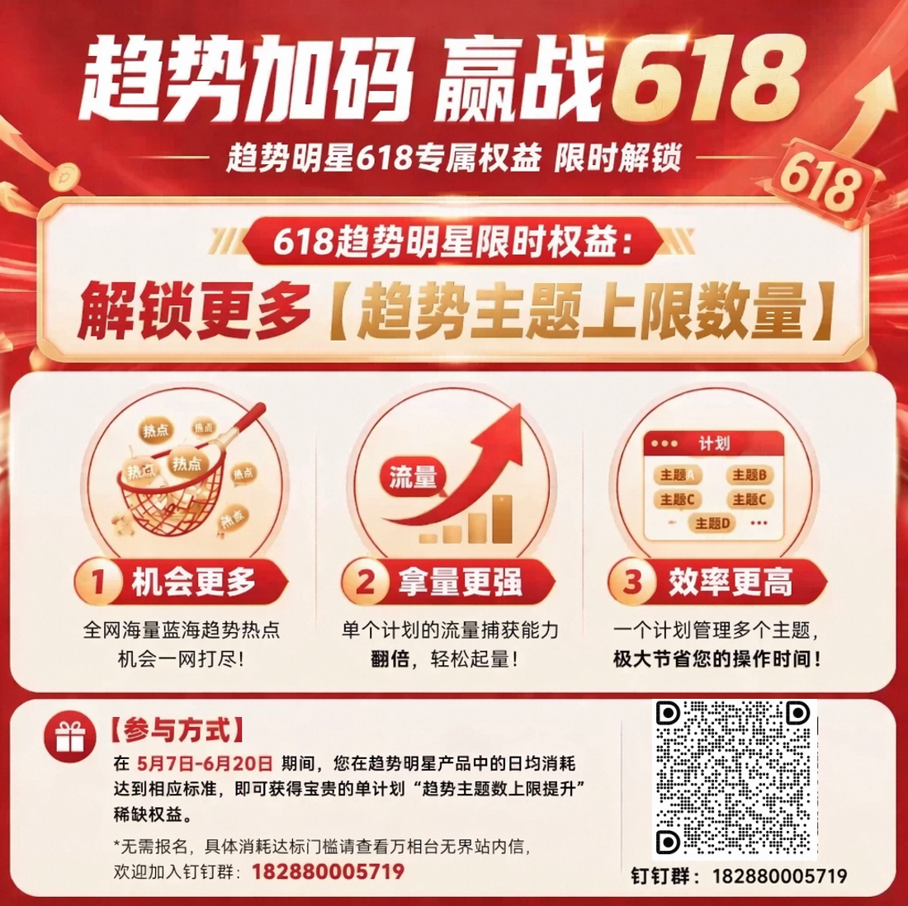
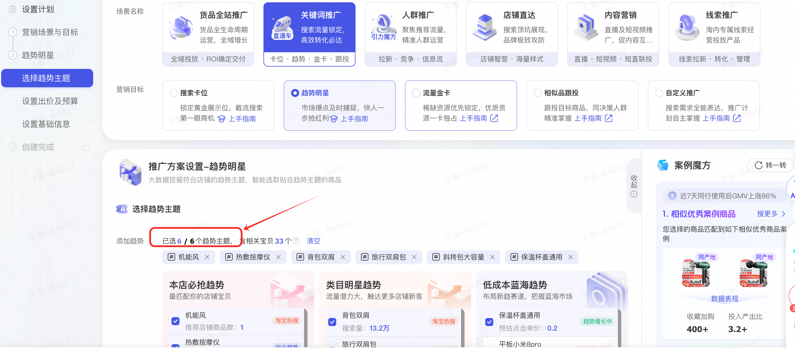
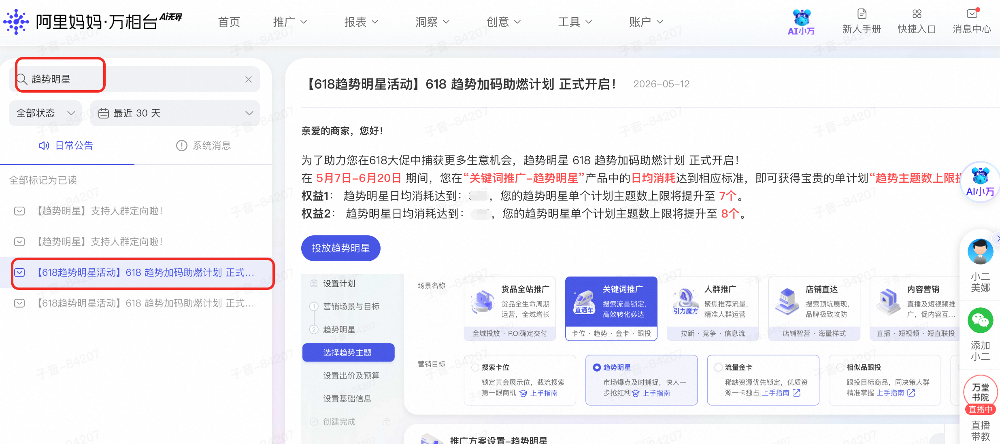

# 【活动介绍】618趋势加码助燃活动介绍

> 来源：https://alidocs.dingtalk.com/i/nodes/qnYMoO1rWxrkmoj2Iz5kXN9DJ47Z3je9

具体活动信息欢迎加入钉钉群：182880005719

## 1、活动概述

亲爱的商家，您好！

为了助力您在618大促中捕获更多生意机会，趋势明星 618 趋势加码助燃计划 正式开启！

在 **5月7日-6月20日**** **期间，您在**“关键词推广-趋势明星”**产品中的**日均消耗**达到相应标准，即可获得宝贵的单计划**“趋势主题数上限提升”**稀缺权益。

**机会更多**：全网海量蓝海趋势热点流量机会一网打尽！

**拿量更强**：单个计划的流量捕获能力翻倍，轻松起量！

**效率更高**：一个计划管理多个主题，极大节省您的操作时间！

**点击投放趋势明星>>>>>>>>>>**

## 2、活动权益

**权益1**： 基础消耗目标达标后，您的趋势明星**单个计划主题数上限**将提升至 7个。

**权益2**： 进阶消耗目标达标后，您的趋势明星**单个计划主题数上限**将提升至 8个。

## 3、活动时间

**2026年5月7日 — 2026年6月20日**

## 4、参与方式

目前活动是邀约制，如您收到万相台站内信消息即可参与。系统会根据您参与前的历史投放数据，为您生成个性化的消耗目标。活动结束后，我们将为所有达标商家统一发放相应权益。

*具体消耗达标门槛请查看您的万相台无界站内信。

## 常见问题

### Q1：我怎么看我是否能参加活动？

目前活动是邀约制，如您收到万相台站内信消息即可参与。系统会根据您参与前的历史投放数据，为您生成个性化的消耗目标。活动结束后，我们将为所有达标商家统一发放相应权益。

### Q2：如何查看我的达标进度？

您可以随时登录万相台后台，选择关键词推广-趋势明星计划，查看消耗当前值。

### Q3：权益什么时候生效？

当您达成消耗目标后，我们会统一合适具体的数据达标情况，预计6月底统一发放权益，届时请及时关注站内信消息。权益将长期生效。

### Q4：如果中途消耗下降怎么办？

活动考核的是整个活动期（5月7日—6月20日）的日均消耗。即使某天消耗有所下降，只要整个活动期的平均值达到目标，权益依然有效。

### Q5：趋势明星7个主题和8个主题有什么区别？

单计划可以选择的投放主题更多，8个主题比7个主题多意味着更多的曝光机会和潜在的消费者触达。
