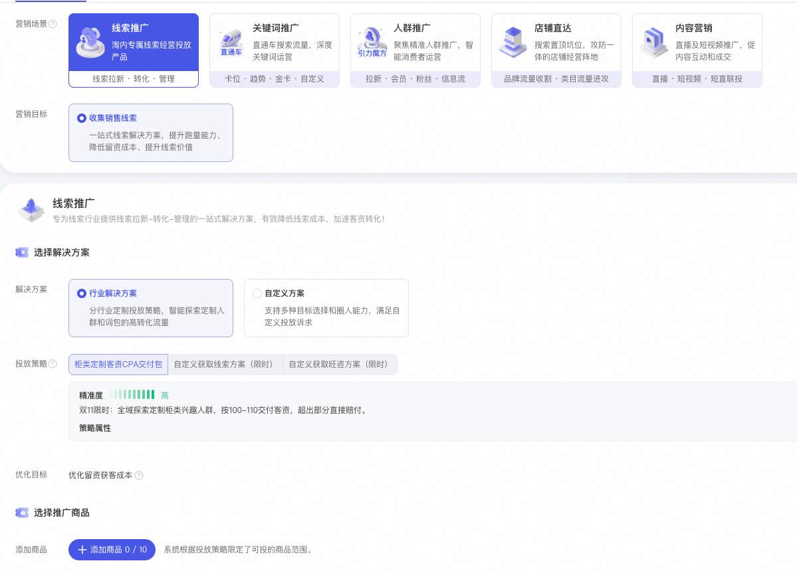
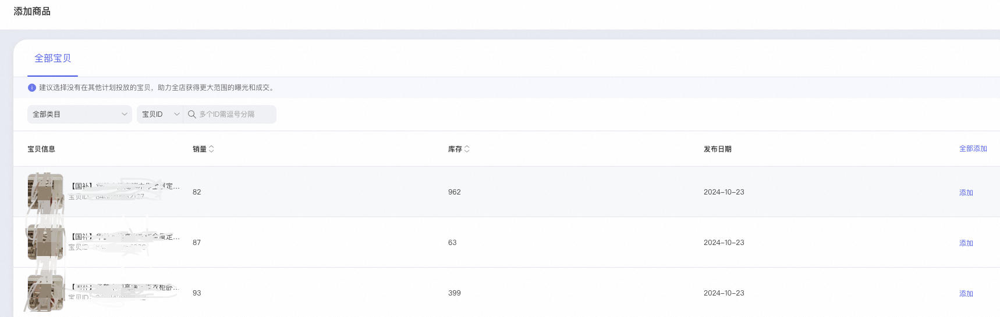
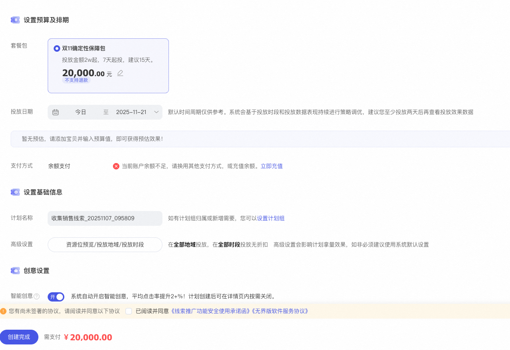
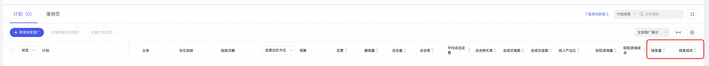

# 双11限时权益-客资解决方案

> 来源：https://alidocs.dingtalk.com/i/nodes/r1R7q3QmWew5lo02fBOXw91lJxkXOEP2

# **一、产品****介绍**

线索推广·双11限时客资解决方案是双11期间限时限量上线的客资对赌方案，交付确定成本下的客资数。超出方案预期客资成本上限后，后续给予投放补贴，仅限11.14前采纳有补贴保障，面对特定商家开放，帮助商家获取确定性生意增量。

# **二、操作步骤**

**产品入口：**>进入线索推广<

**第一步：无界后台-线索推广-新建计划，选择行业解决方案- XX客资CPA交付包，每个类目的预期成本区间不同**

**第二步：选择限定范围内的商品，建议优先选择高销量商品，拿量能力更强**

**第三步：最低2万起投，默认投放15天，可修改投放金额和时间**

**第四步：新建完成开启投放，查看线索成本，实时和单日数据会有波动，建议以2～3天时间核对线索成本**

# **三、产品QA**

1、**活动时间**

**2025年11月14日前采纳均享受成本不达标后给予投放补贴**

**2、中间成本波动怎么办？**

**投放结束后，成本超出预估成本上限后，会给予投放补贴，可进群咨询****，群号：162735000808**

**3、为什么我看不到这个客资包**

**限时限量对部分商家开放**
