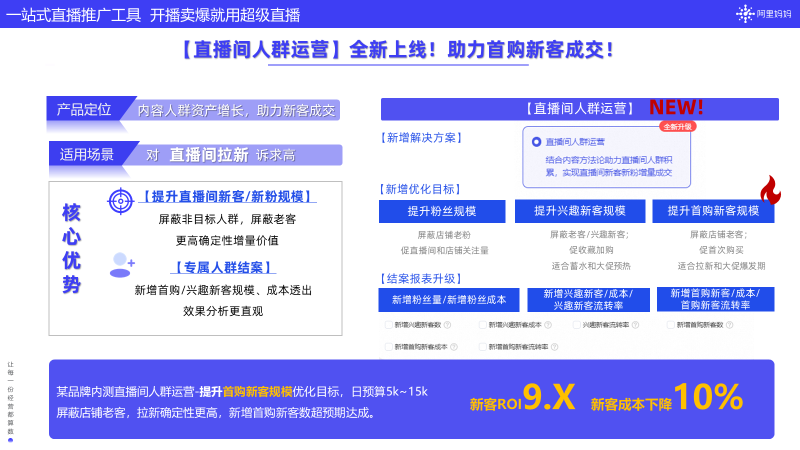
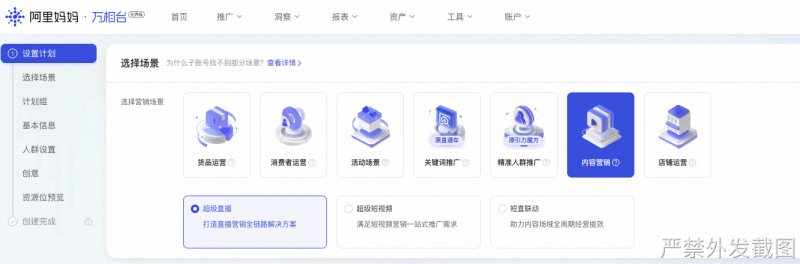
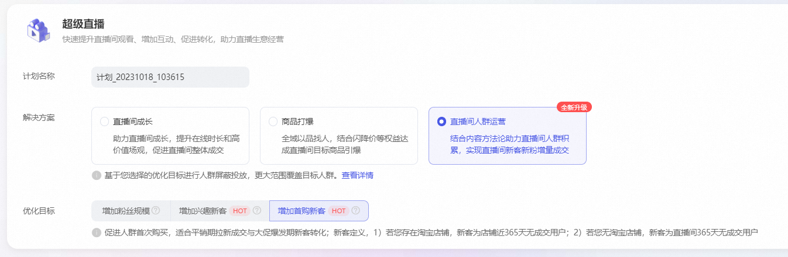
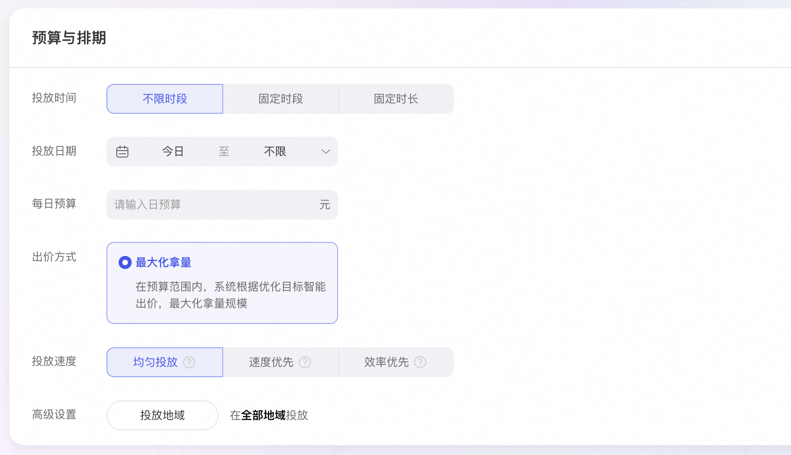

# 04-1-3-直播间人群运营

> 来源：https://alidocs.dingtalk.com/i/nodes/r1R7q3QmWew5lo02fOPZRnD1JxkXOEP2

**原语雀文档链接：**https://yuque.antfin.com/chenchun.chen/gqhty9/gfuiog2zqnllge1p

---

## 1、心智介绍：

#### 内容人群运营能给客户更多人群选择的空间，人群运营更加精细化，让品牌/达人投的明白，投得值得！

**1、产品定位：**内容人群资产增长最大化运营阵地，结合方法论实现内容人群资产积累，扩大直播间运营人群规模。

**2、优化目标：**3个人群目标，分别满足人群流转链路上不同诉求；

a、增加粉丝量，屏蔽粉丝人群，提升粉丝量

b、增加兴趣新客（新）屏蔽老客，屏蔽兴趣新客，提升兴趣新客人数

c、增加首购新客（新）屏蔽老客，提升首购新客人数

**3、数据结案：**​客户维度及计划维度投放报表增加以下指标

| **NO.** | **指标** | **定义说明** |
| --- | --- | --- |
| 1 | 新增粉丝量 （粉丝关注量） | 新增关注量 |
| 2 | 新增粉丝成本 | 非粉丝消耗/关注量 |
| 3 | 新增兴趣新客数 | 新增兴趣新客 |
| 4 | 新增兴趣新客成本 | 非兴趣人群消耗（整单消耗）/新增兴趣新客 |
| 5 | 兴趣新客流转率 | 新增兴趣新客数/触达的UV总数 |
| 6 | 新增首购新客数 | 新增首购新客 |
| 7 | 新增首购新客成本 | 相关消耗/ 新增首购新客 |
| 8 | 新增首购新客流转率 | 新增首购新客数/触达UV总数 |

## 2、操作介绍：

1、选择营销场景-内容场景-超级直播

2、选择内容人群运营-选择优化目标-增加粉丝量/增加兴趣新客/增加首购新客

3、完善基本信息，设置投放时间、日期、预算、投放速度等

