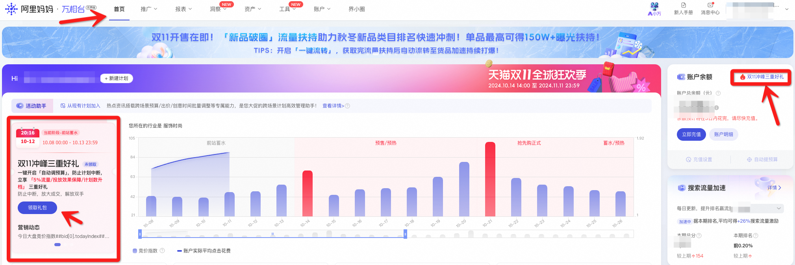
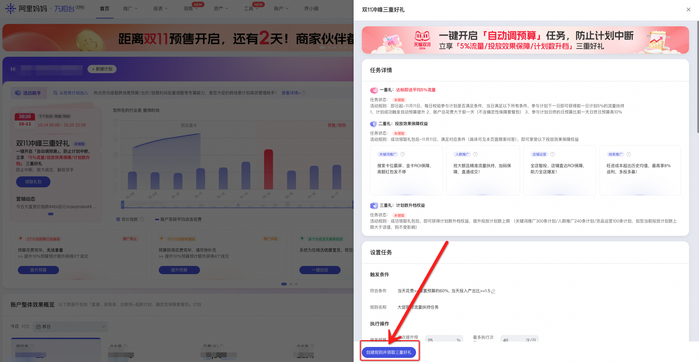
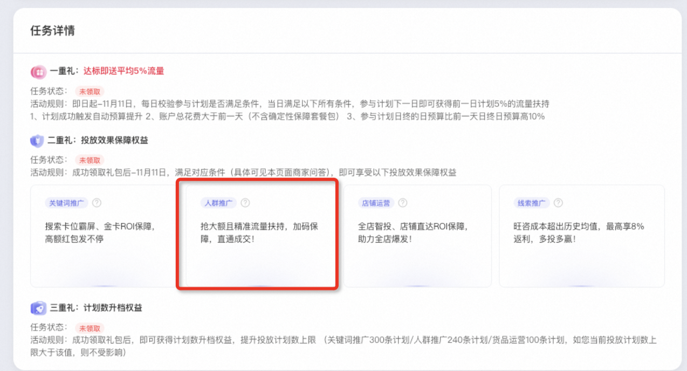
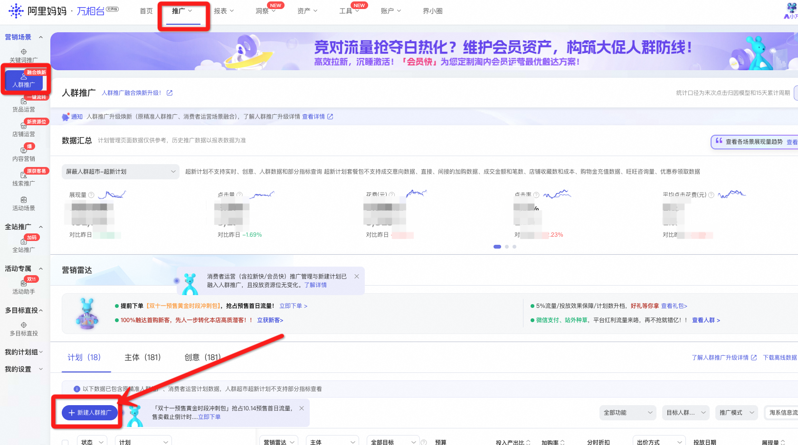
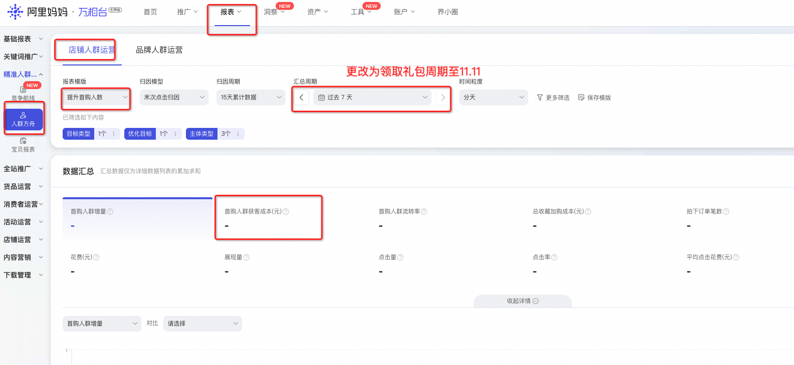
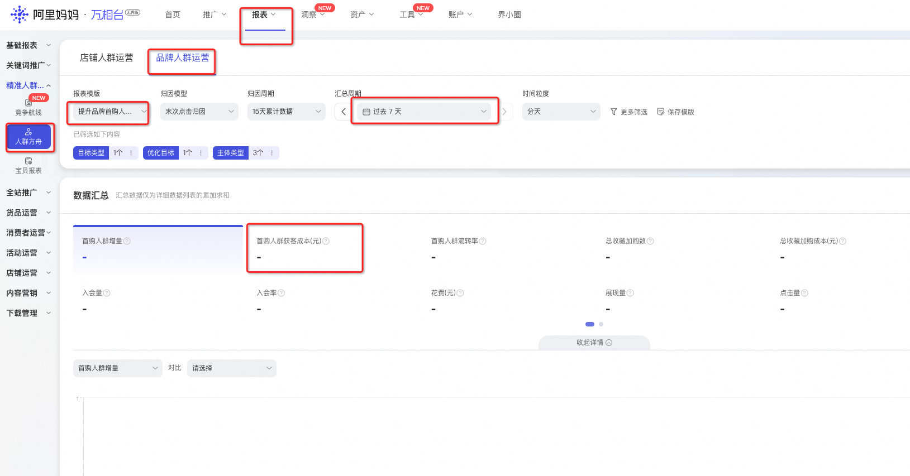
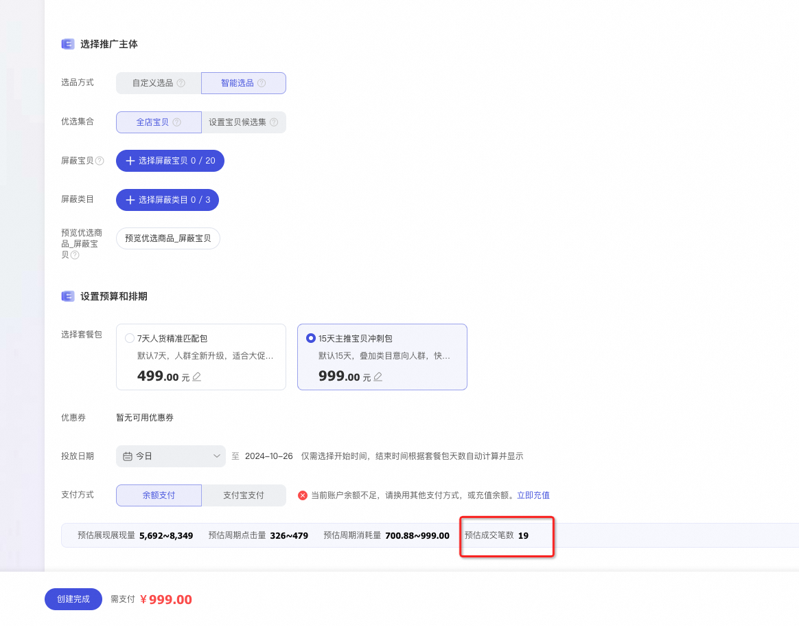

# 👏双十一｜精准人群百亿扶持&成交保障福利

> 来源：https://alidocs.dingtalk.com/i/nodes/vy20BglGWOxjGpq0CER0BjebVA7depqY

**原语雀文档链接：**https://yuque.antfin.com/chenchun.chen/gqhty9/wawew4sx06gv4wfr

---

**「精华抢先速递」**商家您好，为了帮助人群推广新手和中小商家在大促前后更加精准的完成流量蓄水和成交收割，我们为您准备了**百亿流量扶持和成交保障福利！！！****🎉🎉🎉流量扶持**：涵盖宝贝行为人群、店铺行为人群、类目必争人群等多种稀缺流量，同时还上线了相似价位高转化、大促精选、类目摇摆人群等限时限量套餐包供您选择。**🎉🎉🎉成交保障**保障规则从10月23日起，更新为：**针对****妈妈整体中小商家****，推出消耗提升得成交保障！****升级点1：**不再区分是否新手及回归客户，只要是中小商家，均可参与保障活动。如点击下方活动入口未查看到“三重礼”活动，即视为暂无参与资格。**升级点2：**下单产品不再局限于某个套餐包或某一类计划，只要在人群推广（含消费者运营）消耗达标，便可享受保障！**升级点3：**消耗测算更加简单！即在领取活动的礼包后至11月11日，人群推广场景日均消耗环比9月提升50%，如周期内人群推广roi低于9月该账户人群推广roi均值得90%，则按照花费的8%赔付「人群推广保障券」。如9月和10月至今在人群推广（含消费者运营）无消耗，需在领取活动礼包后至11月11日在人群推广场景日均花费不低于100元，若推广roi未达1，则按照消耗的8%赔付「人群推广保障券」。注：原有规则请在文末查看。

**<快速参与活动入口>**

**大促高成交产品集锦**截止10.23，专为中小商家定制的“相似价位宝贝高成交人群包”平均ROI已高于场景均值130%，优先选择相似宝贝转化人群，有效促进大促GMV爆发！！点击此处创建计划（如未参加活动需先在上方活动入口领取礼包再创建计划）

# 一、活动时间

即日起至11月11日。

# 二、活动介绍

| 目标商家类型 | 具体定义 | 保障指标 | 开放权益及规则 |
| --- | --- | --- | --- |
| 万相台无界版 全体中小商家 | 以万相台无界版日常公告《中小商家人群推广成交保障》为准 | 成交 ​ | 在领取活动的礼包后至11月11日，人群推广场景日均消耗环比9月提升50%，如周期内人群推广roi低于9月该账户人群推广roi均值得90%，则按照花费的8%赔付「人群推广保障券」。 如9月无消耗，需在领取活动礼包后至11月11日在人群推广场景日均花费不低于200元，若推广计划roi未达1，则按照消耗的8%赔付「人群推广保障券」。 |

# 三、参与方式

活动入口

万相台无界版内活动助手“领取礼包”，或右上方账户余额后“双11冲锋三重好礼”文字链。

点击上方“快速参与活动入口”，或点击此处进入万相台无界pc端活动页面，即可弹出此活动页面。

按照活动提示，领取“双十一冲锋三重礼”，并可在人群推广部分后，跳转至人群推广横向管理页面。

人群推广二重礼参与方式：

如在人群推广横向管理页面顶部可查看到标题为“大促推广多重保障”banner，可点击直接跳转至指定下单页面

如无banner示意，可手动开始计划创建，点击“新建人群推广计划”新建计划

# 四、常见问题

活动升级后，已经参与活动的商家，以升级前的规则为准

在哪里确认账户命中了哪种权益：小二会结合您的账户状态发送万相台无界pc端的日常公告，并在消息中告知您的账户身份所属类型，并显示对应的权益。

在哪里看我的首购新客成本

点击报表-点击人群报表-筛选首购新客成本，设置时间周期。

在哪里看预估成交笔数

在指定套餐包下单页面，选择宝贝并设置预算后，查看预估成交笔数。

如在10.23前领取礼包，仍以原有规则为准，10.23前的活动规则如下

【人群推广保障1】精准扶持加码成交保障：人群推广场景新手商家（过去365日在人群推广或消费者运营无消耗）和回归老客（过去30日在人群推广或消费者运营无消耗）在领取礼包后-11月11日在相似价位宝贝高成交人群创建的套餐包花费满 2000 ，如成交笔数低于系统预估的90%，则按照套餐包实际花费金额的 8%赔付「人群推广成交保障订单券」。

【人群推广保障2】拉新保障加速爆发收割：人群推广中小商家（非新客和回归老客，以万相台无界版商家后台日常公告消息或人群推广页面banner为准）在人群方舟（店铺人群运营/品牌人群运营）的首购新客计划花费环比9月提升50%，且在领取礼包后-11月11日期间，首购新客计划日均花费需不低于70元，如在领取礼包后-11月11日店铺首购新客成本高于9月均值，则按照商家该人群方舟计划领取礼包后-11月11日花费金额的8%返还【人群方舟满折券】，多投多得！
