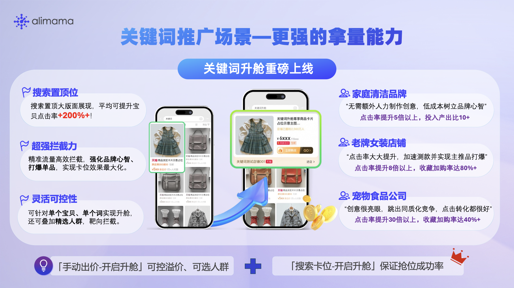
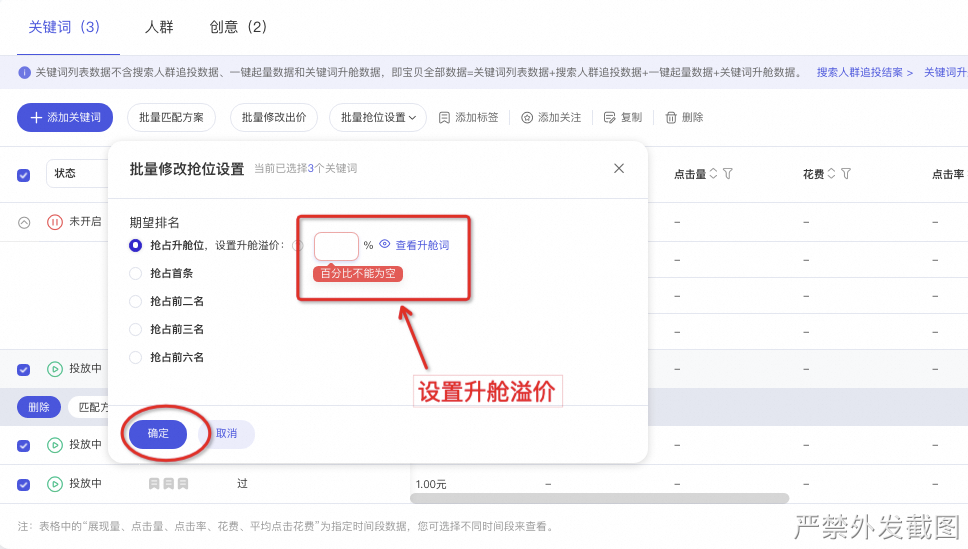
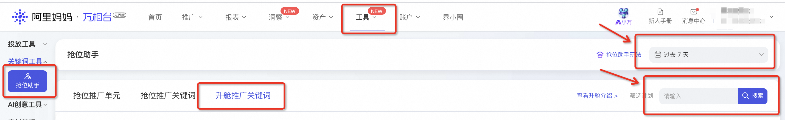

# 🎁（已下线）「关键词升舱」双11新客福利，限时领取100元红包！

> 来源：https://alidocs.dingtalk.com/i/nodes/vy20BglGWOxjGpq0CER0Bq6mVA7depqY

**原语雀文档链接：**https://yuque.antfin.com/chenchun.chen/gqhty9/wo0n0uyrgei3e01x

---

**📢双11大促到来，竞争激烈，官方为您准备了「关键词升舱」新客福利，让关键词升舱为您抢占搜索置顶大版面位置，双11大卖！**

## 1、活动玩法

商家首次创建**正式升舱计划**，且正式升舱计划双11周期内（10.14~11.11日）累计消耗**≥100元**，**即可领取100元【升舱新客券】。**

## 2、活动说明

活动需报名参加，若未报名且完成任务将无法获得补贴。

**>>点击立即报名<<**

**仅限前3000名完成任务的商家可获得****【升舱新客券】**，先完成先领取！

活动**仅计算「正式升舱」消耗**，不包含激励升舱，正式升舱需在搜索卡位或手动出价中创建，例如：

A商家2024.10.14前已体验过激励升舱，但未创建正式升舱计划，属于可参与本次活动的范围。

B商家2024.10.14前未体验过激励升舱，且未创建过正式升舱计划，10.14-11.11期间激励升舱部分消耗为5w元，正式升舱部分消耗为50元（小于100元）则无法获得升舱新客券。

## 3、保障券发放说明

**【升舱新客券】**券类型为满折券，可**50%**比例抵扣关键词推广场景推广费用。

**【升舱新客券】**活动结束后**3天内**发放到账，发放后需领取后可开始抵扣，发放后需7天内领取，领取后15天内有效。

## 4、操作指引

#### 怎么创建正式升舱计划？

「关键词推广-搜索卡位」中创建（建议使用此方式，抢占升舱位成功率更高，效果更好。）

| 1、点击链接-直达搜索卡位。 |  |
| --- | --- |
| 2、一键添加可升舱词，建议至少添加20个以上可升舱词，保证拿量效果。 |  |
| 3、设置升舱部分预算，**该部分预算仅使用在升舱位置。** |  |

「关键词推广-手动出价」中创建：

计划关键词列表页-选择可升舱词-修改抢位设置，建议设置溢价40%以上并打开广泛匹配，保证拿量效果。

#### 怎么查看正式升舱双11周期消耗？

无界后台-工具-抢位助手-升舱推广关键词-选择时间周期（10.14-11.11）-输入正式升舱计划名称并搜索-查看花费。

#### 完成任务后怎么领券？

无界后台--账户--我的优惠券

