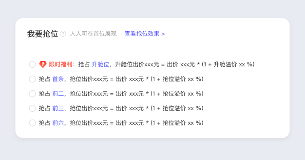

# 「关键词升舱」产品介绍

> 来源：https://alidocs.dingtalk.com/i/nodes/vy20BglGWOxjGpq0CER0KgOmVA7depqY

# 一、功能简介

商家可**使用「关键词升舱」将商品展示在搜索置顶位置**，如下图：

**进行关键词推广时（目前仅支持手动出价和搜索卡位计划），有「符合升舱要求」的关键词则有机会被系统选中升舱。升舱成功后，可在****搜索置顶位置****（即升舱位，如下图）大版面展现****，历史数据验证该位置平均可相对提升点击率****+200%****，抢占高价值资源位，实现卡位效果最大化！**

### **产品优势**

**树立品牌心智：优质资源位，****搜索置顶位置大版面展现，高效拦截品牌词下流量****，快速树立品牌心智，扩大品牌声量，实现卡位效果最大化。**

**新品快速打爆：支持对单个词、单个商品进行升舱，历史数据验证可相对****提升点击率+200%，快速打爆宝贝****。**

**拉爆全店动销：高点击高转化****，以爆带爆，拉动全店动销****。**

# **二、可使用商家范围**

*需同时满足以下条件

**天猫商家，部分有资质的淘宝商家**

**有可升舱词**

# **三、可升舱的关键词**

***需同时满足以下条件**

**包含品牌名**

**该词未被品牌专区、店铺直达&明星店铺购买**

# **四、常见问题**

#### **1、「搜索置顶位置/升舱位」具体指的是什么资源位，创意样式是怎么样的？**

**回答：手淘搜索页顶部的大版面超优质资源位，创意样式如下图，****创意无需手动设置，是基于商品主图等信息自动生成的智能创意****。****注意：该位置创意审核需要一定时间，计划创建后1天内数据量较少可能是由于创意仍在审核中，建议至少观察3天以上数据，来判断推广效果。**

#### **2、升舱的数据在哪里查看？**

**回答：万相台无界版首页 ****→**** 工具 ****→**** 关键词工具/抢位助手 ****→**** 升舱推广关键词**

#### **3、为什么有品牌词却不能进行关键词升舱？哪些品牌词可以进行关键词升舱？**

**回答：部分品牌词由于被品牌专区、明星店铺购买，不支持升舱，若想购买这部分词可以通过品销宝后台购买品牌专区或无界-店铺直达。**

#### **4、显示升舱状态异常是什么原因？**

**回答：异常状态下，升舱标记显示为黄色（如下图），将鼠标移至升舱标记上可以查看异常状态原因**

#### **5、看到同行专营店品牌词在展示关键词升舱广告，不想让它展示怎么办？**

**专营店投放关键词升舱是符合规则的哦。**

**关键词升舱是黑盒投放，不确保谁家店铺可以投放成功。如果你想确定性投放首坑可以去投放店铺直达哈，店铺直达优先级高于关键词升舱。**

## 更多相关问题欢迎进钉钉群 “关键词升舱-商家4群”群的钉钉群号： 112800004245
