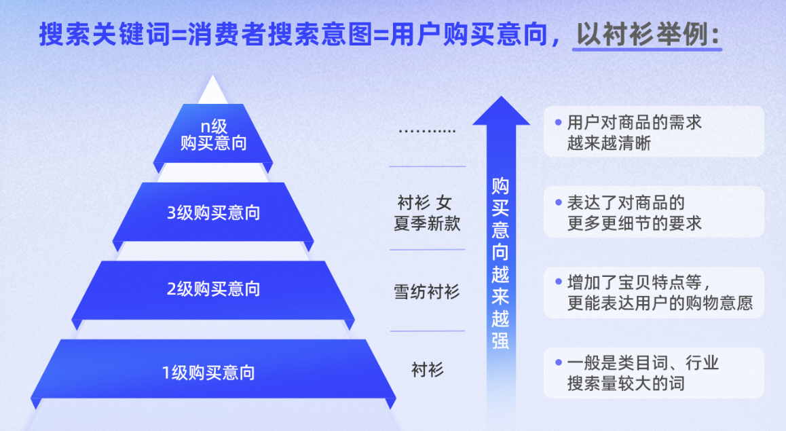
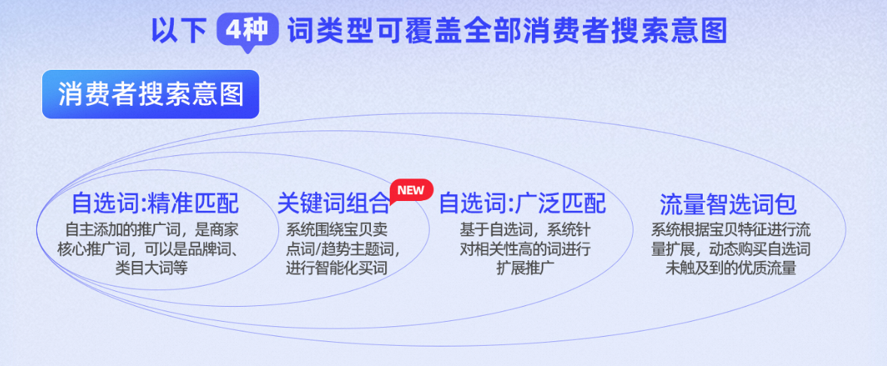
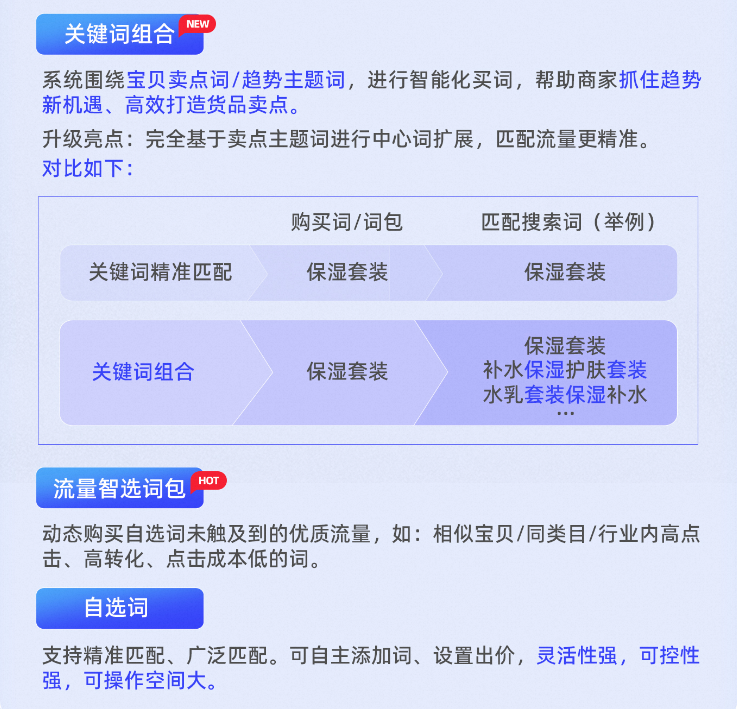
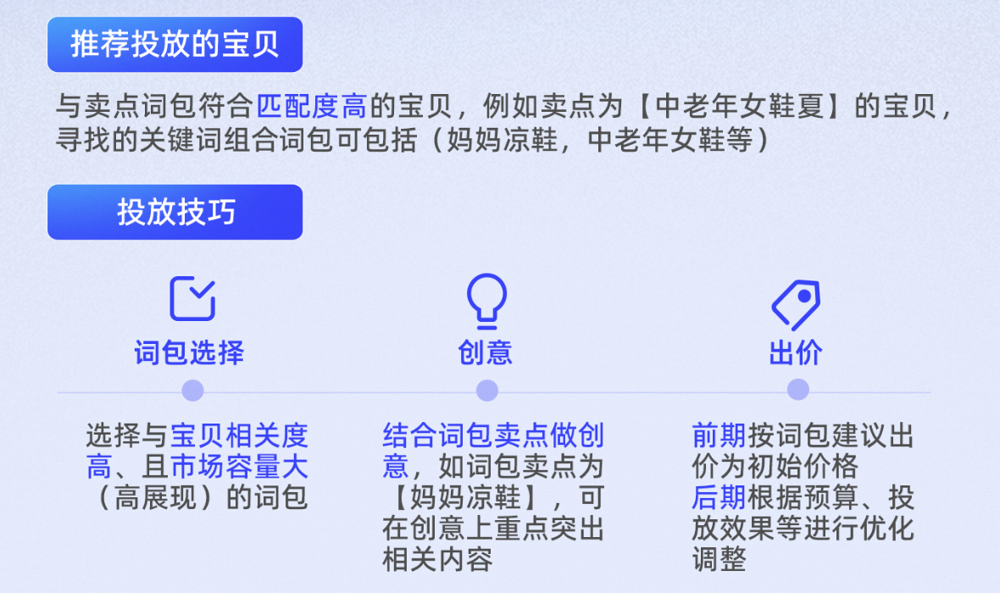
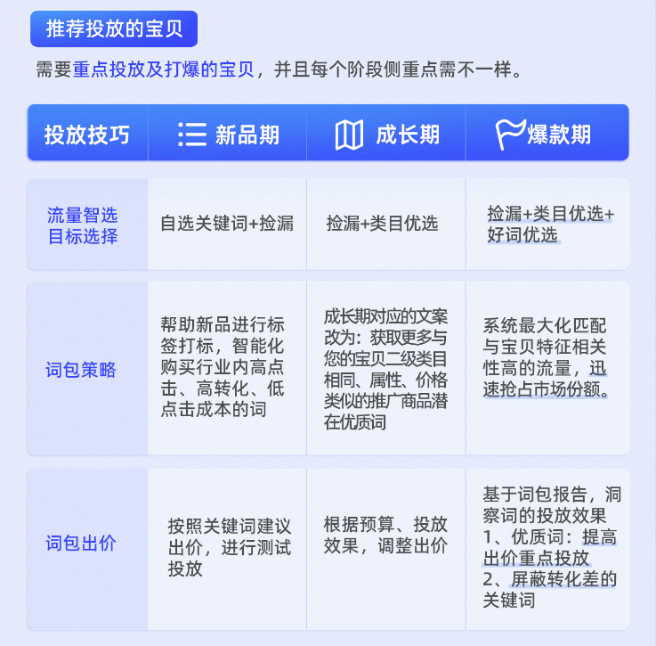
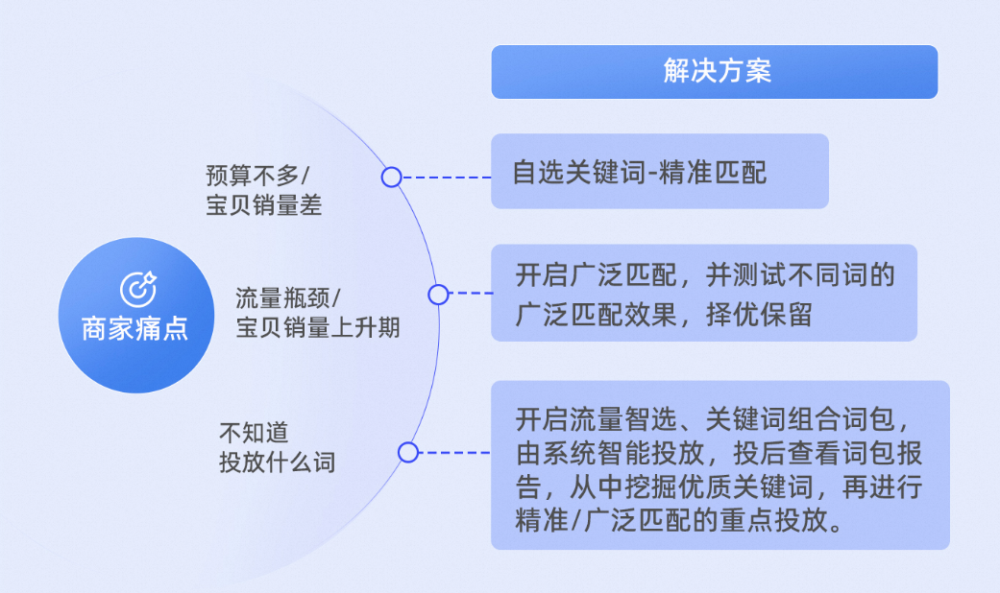

# 关键词推广-关键词百宝箱 | 教你如何覆盖「全部」消费者搜索意图

> 来源：https://alidocs.dingtalk.com/i/nodes/vy20BglGWOxjGpq0CER0Kjx6VA7depqY

**原语雀文档链接：**https://yuque.antfin.com/chenchun.chen/gqhty9/wx514g4npn7qv35k

---

# 一、为什么要投放关键词？

# 二、如何覆盖「全部」消费者搜索意图？

### 1、投放必选的4大词类型

### 2、不同词的优势说明

# 三、值得收藏的「关键词投放技巧」

### 1、关键词组合-投放技巧

### 2、流量智选-投放技巧

### 3、自选词-投放技巧

精确匹配：用户搜索词与广告投关键词完全相同或者是同义词时，推广宝贝才有机会展现

用户投放词：女连衣裙

用户搜索词：新款女连衣裙

展现机会：❌

广泛匹配：用户搜索词与广告投关键词相同或者与之相关时，推广宝贝均有机会展现

用户投放词：女连衣裙

用户搜索词：新款女连衣裙

展现机会：✅

