# 🤖 AI圈人：达摩盘人群重磅升级！

> 来源：https://alidocs.dingtalk.com/i/nodes/vy20BglGWOxjGpq0CER0y6GnVA7depqY

## **‼️**** ****「AI圈人」****正式入驻小万**** ****‼️**

🤕 想要人群运营玩出花样，却被传统标签组合圈人限制想象力？

🤔 小二推荐了很多人群让我推广，但我不知道具体画像，怎么选呢？

**🎉 快来试试全新****「AI圈人」****能力！**

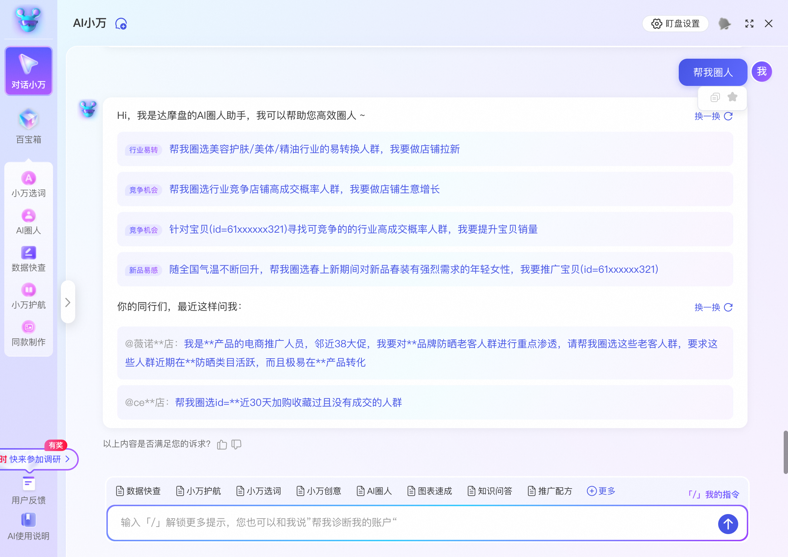

**简单**：输入一句指令，快速完成目标人群圈选；

**灵活**：突破传统标签限制！只要你想得到，AI圈人都能找得到；

**高效**：AI模型+画像解析，高效预估人群成交潜力并对比本店人群相似度。

**该能力现已在无界、达摩盘全量开放，答疑请加钉群：**** 69120023911**

---

| **一、功能介绍** |
| --- |

基于LMA大模型，为商家提供**【 圈人意图理解 → 人群智能圈选 → 人群画像解读 → 人群投放 】**，一整套简单灵活高效的人群解决方案。

👋 告别传统达摩盘圈人的繁琐步骤和人群测试成本，助力商家**轻松玩转多元人群运营**！

### **功能亮点**

**1、全新的交互方式，操作简单**：超脱传统自定义圈选人群的方式，以对话和提问的形式快速完成人群圈选，告别繁琐的圈人步骤；

**2、提供人群数据解读&画像洞察，人群价值一目了然**：系统提供人群成交价值、获客成本和行业成交率等数据指标，并提供与店铺老客画像相似对比，人群圈选更安心；

**3、AI大模型算法圈人，人群更精准**：突破达摩盘标签的用户识别限制，实现用户识别的深度精准化，人群圈选更精准和多样化。

## **二、优秀案例**

| **虎北尔*AI圈人** | **AI圈人实操成绩** |
| --- | --- |
| **🤓 ****花点时间，深入学习一下课程吧～** |  |

## **三、使用操作**

**快捷入口👉**点击此处跳转至小万进行AI圈人** **

### **常规入口：**

#### **人群场景入口：**

1-新建计划/投中编辑—>种子人群—>**达摩盘人群**—>找到**「AI圈人」**入口；

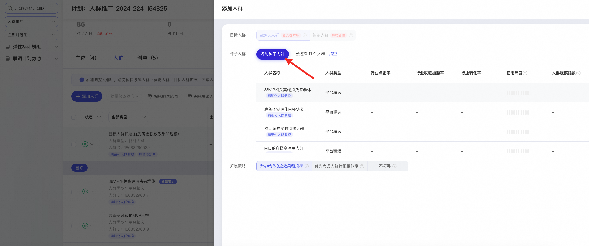

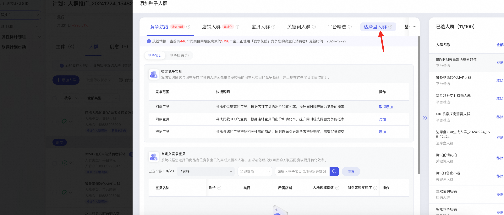

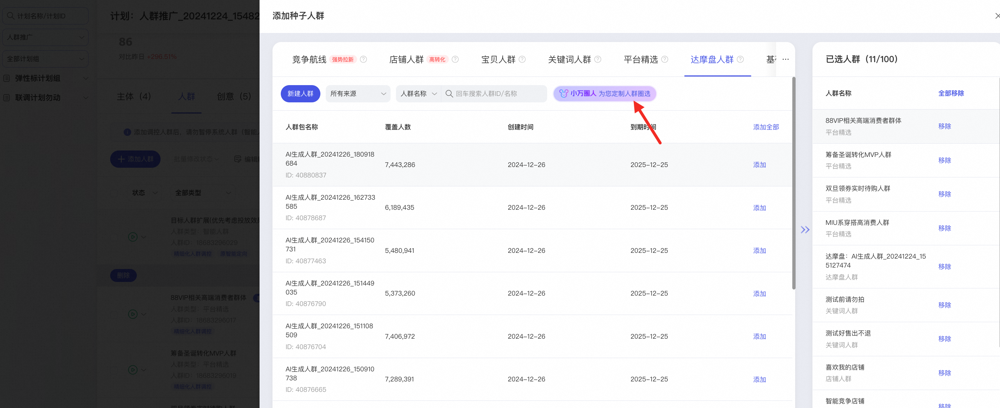

2-进入小万-AI圈人页面，通过对话创建人群，可以参照预设模版进行人群圈选（tip：使用的预设常用模板效果更佳）；

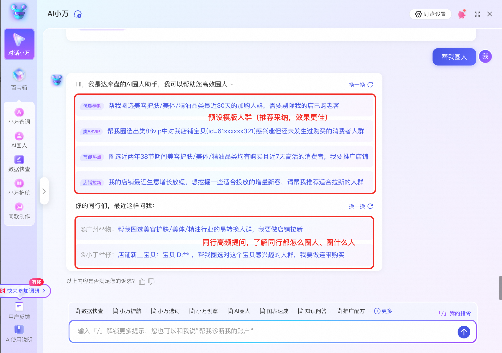

3-输入圈人诉求后，小万将理解您的圈人诉求并生成**目标消费者的人群特征**（解析特征不满意，可以手动删除），自动识别您输入人群背后对应的**「营销主体」**和**「营销目标」**（不准可以修改）；

注：「营销主体」和「营销目标」一定要设置准，和**推广计划的主体、营销目标等信息对应**，避免投不出去。

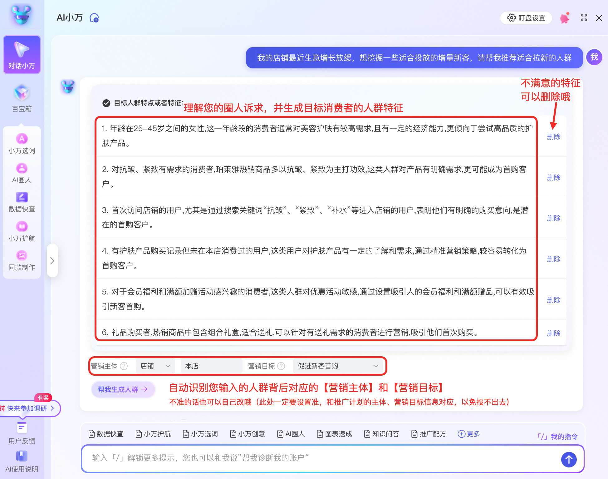

| **【营销主体】** 用于标识所圈人群需要与何宝贝/品牌/店铺/行业有过、将产生互动行为；需手动输入主体信息。 tip：新品冷启请选「品牌/店铺-本店」或「行业-本行业类目」，爆品续航请选「宝贝-商品标题」。 | **【营销目标】** 用于标识所圈人群需要实现何种推广目标；会影响人群实际投放效果。tip：关注新客成交请选「促进新客首购」，若关注单品成交请选「促进直接成交」。 |
| --- | --- |

4-完成人群特征、营销目标等设置后，点击【**帮我生成人群**】，AI将帮您实现人群圈选（预计需等待10秒左右）；人群生成后可详查人群**特征相似度**、**营销价值**及**具体画像**，若符合推广诉求，您可将其保存，用于后续推广计划使用（不符合就重新提问哦，优化下提问话术～）。

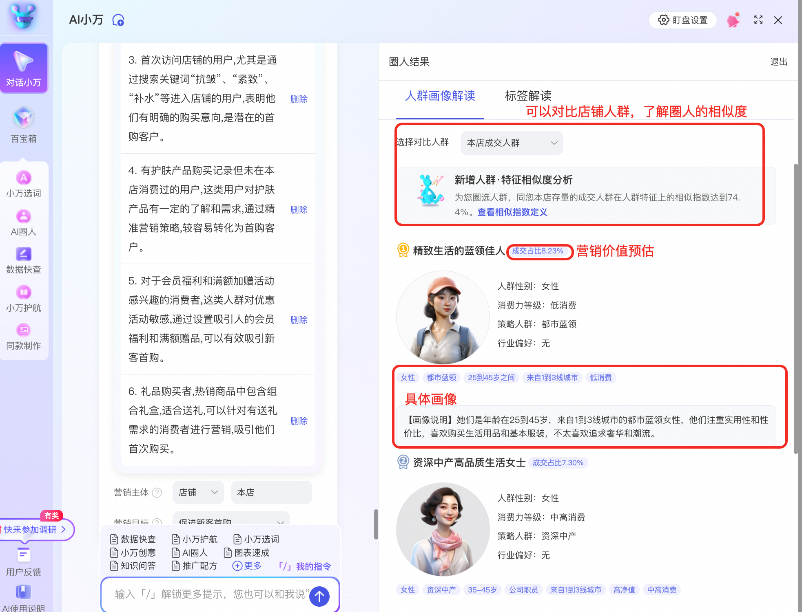

5-完成圈人后保存人群，关闭小万浮层。**默认添加AI人群至计划「已选人群」列表**，可继续完成计划创建/编辑。

注：AI圈人生成人群类型为达摩盘人群，适用「极速通道」扶持拿量，但不支持「精细化人群调控」作标签溢价。

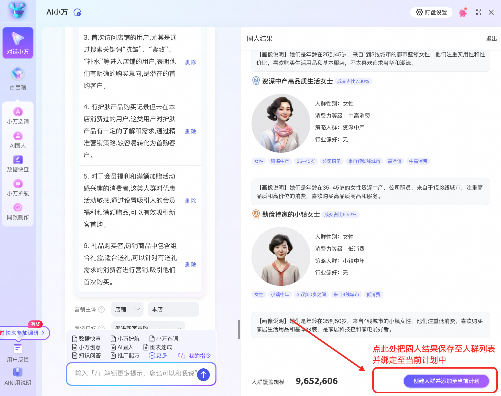

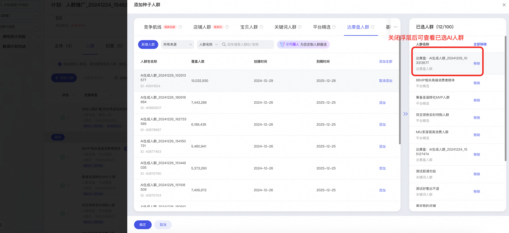

#### **小万入口：**

1-从各小万点位进入并找到“AI圈人”导航；

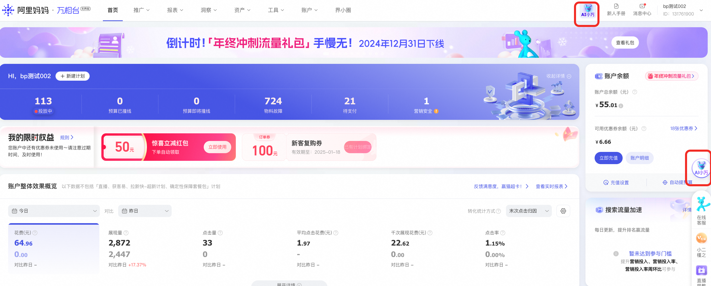

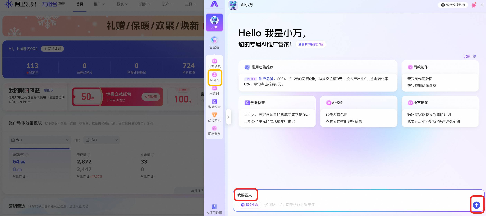

2-通过对话创建人群，可以参照预设模版进行人群圈选（tip：使用的预设常用模板效果更佳）

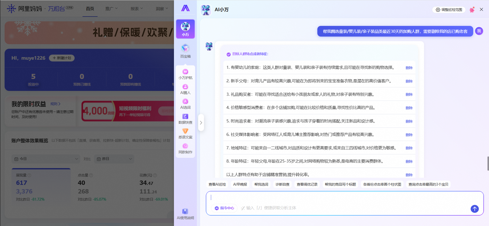

3-选择**营销目标**后，点击**帮我生成人群**，系统会进行人群圈选（预计需等待10秒左右），人群生成后可详查人群营销效率及人群画像洞察。

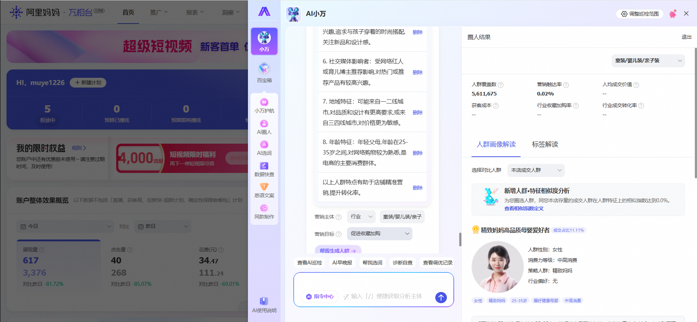

4-完成圈人后保存人群，关闭小万浮层，可进入人群场景或其他场景完成后续投放。

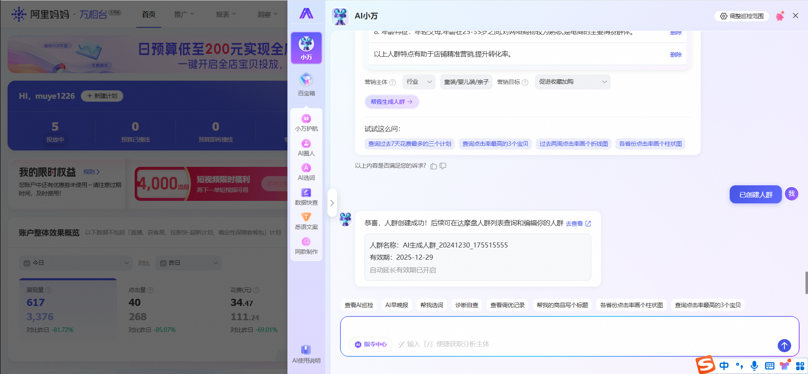

### **快捷指令：****不会提问？试试下面的话术呢～**

**除“我要圈人”快捷指令外，试试这么问:**

| 营销目标 | 精准目标 | 话术 |
| --- | --- | --- |
| **直接成交** ​ | 货品打爆 | 我要提高店铺日常产品销售，特别是店铺里的宝贝(id=61xxxxxx321)，圈选适合投放的人群，不要店铺老客 |
|  | 货品上新 | 店铺新上宝贝(id=61xxxxxx321)，请推荐适合投放的人群 |
|  | 新品偏好 | 店铺新上宝贝(id=61xxxxxx321)，帮我圈选${mainCateName}类目下喜好新品的人群，我要加速新品打爆 |
|  | 类88VIP | 帮我圈选出类88vip中对我店铺宝贝(id=61xxxxxx321)感兴趣但还未发生过购买的消费者人群 |
|  | 竞争机会 | 筛选历史365天相似店铺收藏和购买行为人群，近7天活跃，但未曾光顾我的店消费者 |
|  | 高活优客 | 帮我寻找最近7天在${mainCateName}类目频繁活跃且易确认收货的潜在消费者人群 |
|  | 一触即购 | 我要投放推荐渠道，帮我圈选${mainCateName}类目近期高频互动但未成交活跃人群 |
|  | 潜客挖掘 | 帮我定位最近7天在${mainCateName}类目中搜索过相关关键词但未成交的年轻父母人群 |
|  | 趋势机会 | 针对当前的降温趋势，帮我圈选对冬季商品有需求的消费者人群，我要推广宝贝(id=61xxxxxx321) |
|  | 竞争机会 | 帮我圈选行业竞争店铺高成交概率人群，我要做店铺生意增长 |
|  | 竞争机会 | 针对宝贝(id=61xxxxxx321)寻找可竞争的的行业高成交概率人群，我要提升宝贝销量 |
|  | 潜品促活 | 店铺宝贝(id=61xxxxxx321)成交量增长缓慢，帮我从宝贝所在类目中圈选高成交概率消费者，我要提升宝贝销量 |
| **新客首购** | 行业易转 | 帮我圈选${mainCateName}行业的易转换人群，我要做店铺拉新 |
|  | 店铺拉新 | 我的店铺最近生意增长放缓，想挖掘一些适合投放的增量新客，请帮我推荐适合拉新的人群 |
|  | 优质待购 | 帮我圈选${mainCateName}品类最近30天的加购人群，需要剔除我的店已购老客 |
|  | 内外联动 | 请帮我圈选店铺近30天站外曝光且站内活跃的消费者人群，我要做站内再运营 |
| ​ | ​ | 持续更新中，请关注。。。 |

​

## **四、FAQ**

Q1：是否支持某类用户特征指定或剔除？
A1：支持。可通过指令明确要求某一特征用户或剔除某类特殊群体，如“只要女性用户群体”或者“不要店铺老客”；也可圈人时扩大范围，再通过人群推广的**屏蔽人群设置**对部分人群进行过滤。

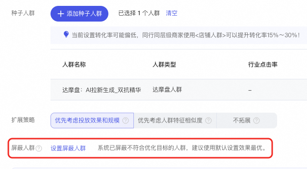

Q2：C店可以使用AI圈人吗？
A2：可以，支持淘宝店铺。但**当前不支持天猫超市、达人等非店铺的特殊账号**。

Q3：是否支持圈选竞品/竞店人群？
A3：支持，不过圈选出来的人群是基于**所选竞品/竞店人群的优质特征**优选的**相似**人群，而非本身纯竞品私域人群。

Q4：我之前用AI圈的人群，怎么现在找不到了？
A4：提醒您**完成人群创建后尽快进行投放**；仅保存至人群列表，未设置推广产生花费的人群，仅为您保存30天，过期后将无法投放。

---

**更多问题，邀您进群答疑：****69120023911**

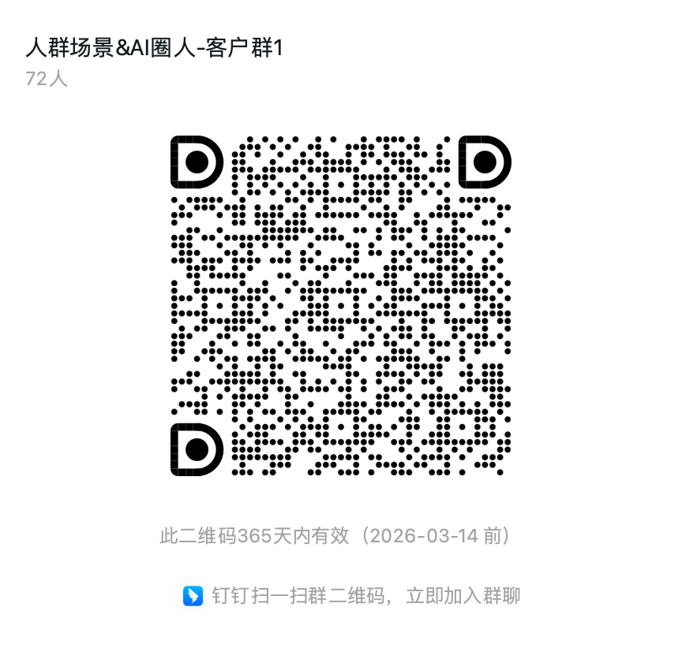
