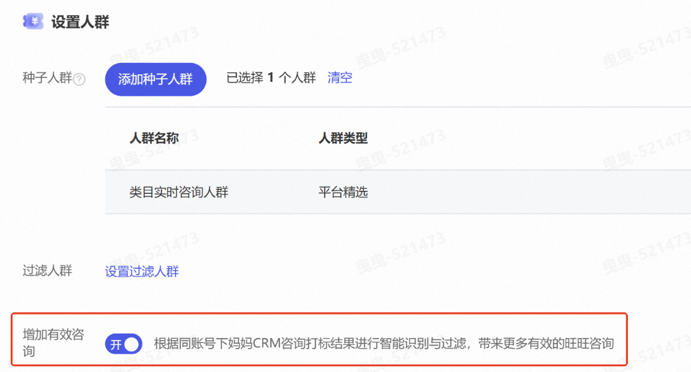
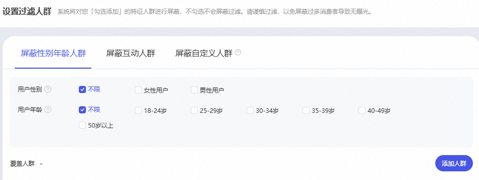
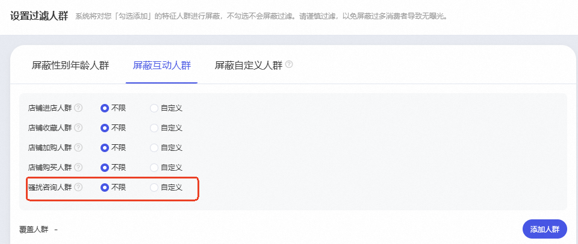
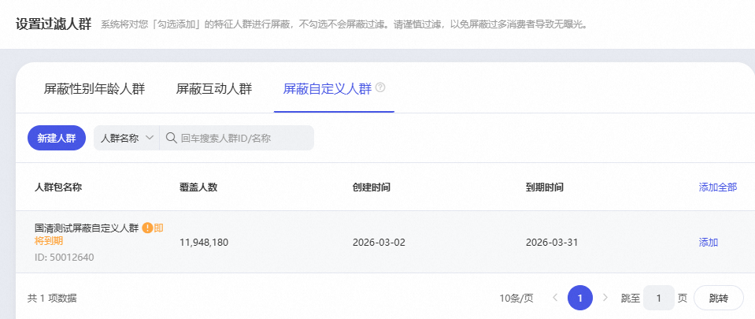
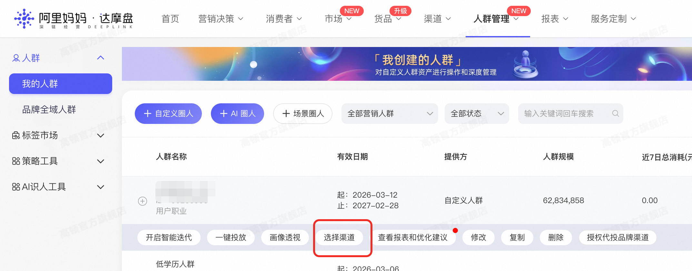
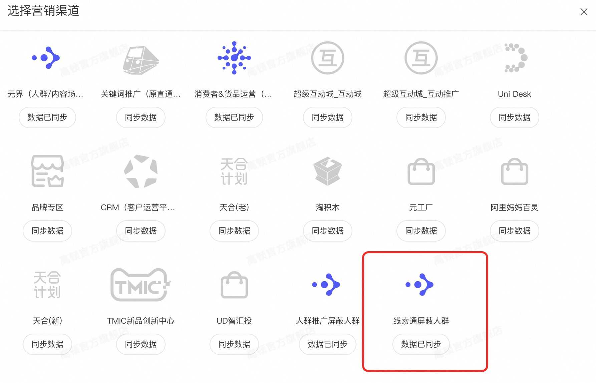

# 【增加有效咨询】及【自定义人群屏蔽】能力上线

> 来源：https://alidocs.dingtalk.com/i/nodes/vy20BglGWOxjGpq0CG3gbeMrVA7depqY

# **一、新增产品能力：增加有效咨询**

#### **1.功能介绍**

新增**「增加有效咨询」**能力开关，对应平台有效咨询优化产品能力升级！打开后，平台将依据同账号下妈妈CRM咨询打标结果实时学习正向高营销价值人群特征及负向无效人群特征（骚扰人群、空号、无意向用户），商家稳定打标数据可帮助算法模型精准放大优质咨询及线索，实现“越打标，模型越懂你；越训练，线索越精准。"

咨询明细打标商家操作手册：

新增**增加有效咨询**开关目前只针对“优化旺资成本”目标开放。

**核心目标：帮助商家在计划投放过程中减少对低效/无效人群的曝光，优先触达高转化潜力人群，提升商家推广计划的整体有效性**

**关键行动：增加有效咨询强依赖咨询明细功能打标数据，且模型生效周期长****需每天持续完成对CMR咨询明细的有效无效打标**

# **二、产品功能升级：自定义人群屏蔽**

**自定义人群屏蔽：**依据商家需求自定义设置过滤人群，在原有能力上，**新增「骚扰咨询人群」及「达摩盘自定义人群」**，推广计划前置过滤无效/骚扰人群以减少预算浪费。

**（1）屏蔽性别年龄人群：**

** （2）屏蔽互动人群**：在原有店铺进店/收藏/加购/购买人群外，**新增骚扰咨询人群**

**（3）屏蔽自定义人群**：支持客户自定义圈选屏蔽人群，人群数据来源于达摩盘，包含商户通过达摩盘标签、一方标签圈选的人群。

**达摩盘自定义屏蔽人群同步步骤：**在**”我的人群“**选择需同步的人群点击**”选择渠道“**数据同步至**”线索通屏蔽人群“**。

# **📢 新能力FAQ：「增加有效咨询」与「自定义人群屏蔽」
**

**Q1：新功能上线后，我可以直接在正在跑的老计划上开启吗？
**A： **不建议直接修改稳定运行的老计划**。

增加有效咨询：仅支持新计划使用，老计划无法使用。

自定义人群屏蔽：新计划及老计划均可使用。开启后会触发模型重新学习人群特征。直接在老计划上操作可能会打断原有的模型收敛状态，导致消耗波动或成本不稳定。

✅ **最佳实践： **建议您**新建一个测试计划，设置小预算进行尝试**。待新计划模型稳定、效果验证符合预期后，再考虑逐步加大投入或替换旧计划。

**Q2：为什么我开启了“增加有效咨询”或设置了“自定义人群屏蔽”后，广告跑不动了（拿量困难）？
**A： 这通常是因为过滤条件设置过于激进，导致符合投放条件的人群池过窄。

**原理说明：** 当系统同时排除“骚扰/空号/无意向”人群，且商家又额外添加了严格的“达摩盘自定义屏蔽人群”时，剩余的可投放流量可能不足以支撑计划的正常探索。

**优化建议：**

放宽屏蔽条件： 检查自定义屏蔽人群是否范围过大，尝试减少屏蔽包数量或缩小屏蔽范围

给予学习期： 新计划开启开关后需要 3-5 天的冷启动学习期，期间请保持预算充足，避免频繁调整。

数据积累：如果您的历史打标数据较少，模型识别精度尚在爬坡期，建议先积累一段时间的有效/无效咨询打标数据，再开启强过滤开关。

**Q3：如何正确使用“增加有效咨询”开关以达到最佳效果？
**A： 该功能的核心是结合同账号下CRM咨询打标数据、自定义人群屏蔽数据，沉淀账户个性化数据池，反哺至账户广告计划算法模型智能训练，以拓展精准有效人群，从而优化推广效果。为达到这个目标，建议商家按以下步骤操作：

第一步： 确保您在 CRM 中对咨询线索进行了及时、准确的打标，**区分有效（高意向及低意向） 及无效咨询**，沉淀数据池。——注：CRM打标标准过于严格，可能导致有效咨询数量少，模型学习周期长且学习人群画像过窄，导致难以拿量。

第二步： 新建计划并开启【增加有效咨询】开关，让算法实时学习您的有效打标人群和无效人群画像。

第三步： 观察数据。随着打标数据积累，模型会越来越精准地自动放大高营销价值人群，过滤无效噪音，期间观察计划跑量速度，若速度过慢则需优化打标逻辑或放宽自定义人群屏蔽设置。

**Q4:自定义屏蔽人群已经全量开放目前为****限时免费使用****，后续会设置****相应门槛****具体门槛标准请关注后续公告通知。**

**💡 温馨提示：
**产品升级旨在帮您把钱花在刀刃上，但模型的精准度依赖于数据的积累与合理的策略配置。切勿急于求成，小步快跑、科学测试才是提升 ROI 的关键！
