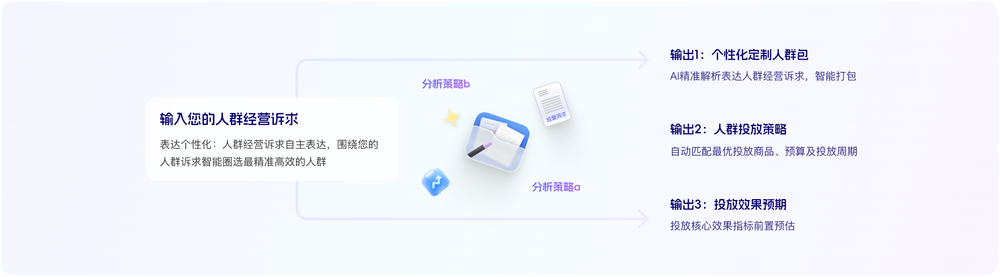
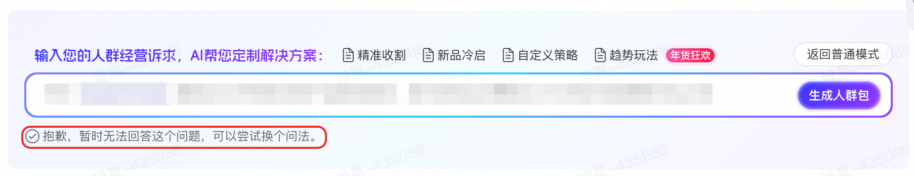
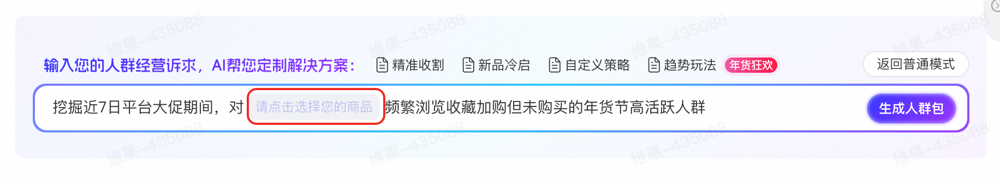
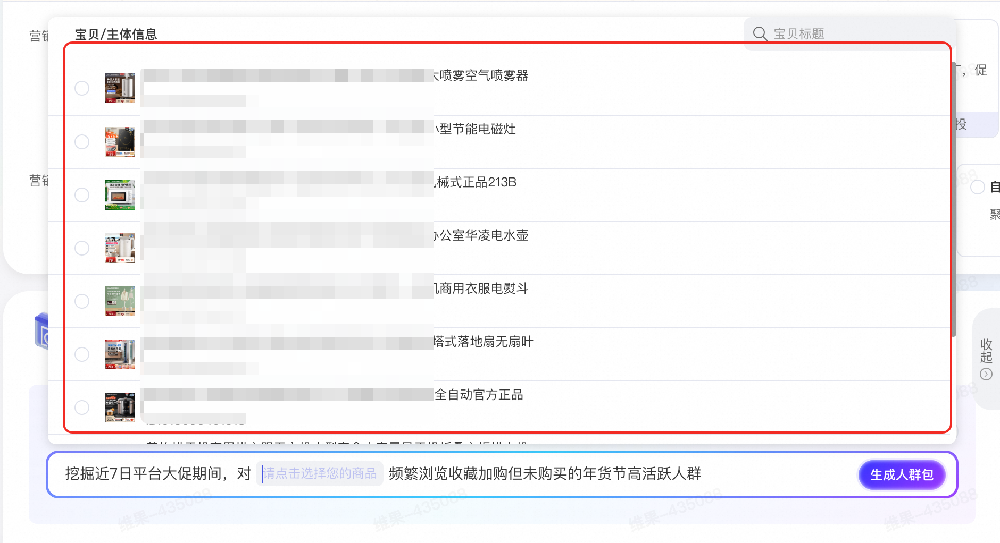
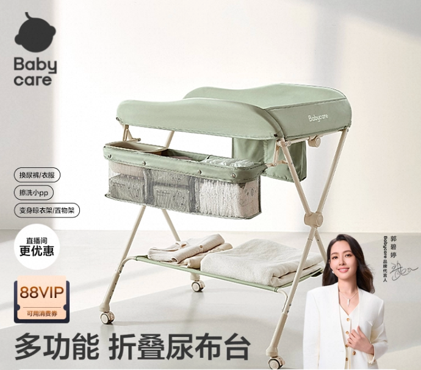

# 【全新升级】人群超市重磅推出「AI解决方案」

> 来源：https://alidocs.dingtalk.com/i/nodes/vy20BglGWOxjGpq0CqEa5YvOVA7depqY

**全新升级！告别原有“千人一面”模式**

**AI驱动全链路智能人群投放，满足更多人群个性化诉求**

|  |  |
| --- | --- |

**有任何使用体验反馈或疑问及后续产品更新进展可进群自选官方小二（群号：** 152650005412**）**

# **AI解决方案升级点**

| 千人千商千面 | 最优方案选择 | 一键全程无忧 |
| --- | --- | --- |

|  | **个性化人群诉求精准识别**自然语言描述人群诉求，AI精准解析，自动生成专属人群包**全链路智能决策**自动匹配最优投放商品、预算及投放周期，最大化人群投放效率**效果前置可视化**前置预估方案投放效果，效果有保障 |
| --- | --- |

# **操作使用SOP**

| **操作步骤** | **图示与详细说明** |
| --- | --- |

| 进入「人群超市」 |  |
| --- | --- |

| 选择「AI解决方案」模式 | 点击**定制投放策略**进入「AI解决方案」模式 切换模式后，点击**返回小二模式**，可回归原有人群包模式选择投放 |
| --- | --- |

| 选择解决方案 | 选择解决方案，可精细化调整人群描述和诉求，点击**生成人群包** 建议：**选择需要投放的商品**可以提升AI圈人逻辑和解决方案的准确度与适配性 |
| --- | --- |

| 等待AI生成人群/商品/预算/周期组合解决方案 | 过程可能会持续1分钟，请耐心等待 AI智能圈人推理示例某服饰头部品牌摇粒绒外套GMV收割诉求AI生成圈人推理某食品生鲜行业头部店铺新品高效冷启诉求AI生成人群推理 |
| --- | --- |

| 确认生成方案 | AI思考完成后，确认解决方案是否符合需求，可点击**展开**，查看AI生成解决方案思考具体过程 根据经营诉求，AI推荐投放商品/预算和周期已自动加入计划设置页面，商家可根据诉求进行调整 |
| --- | --- |

| 创建计划 | 确认无误后，点击**创建完成**，即可开始投放 |
| --- | --- |

# **常见QA**

**Q：**为什么我没有AI解决方案的创建入口？

**A：**该功能目前在测试阶段中，只有部分商家有投放权限，后面会陆续对所有商家开放，请您耐心等待。

**Q：**AI为我智能推荐的人群有我不想要的人群画像怎么办？

**A：**可以在输入需求阶段，调整query，对AI输入更多人群圈选方向和限制，引导AI输出更契合你当前投放需求的人群。

**Q：**为什么会出现“抱歉，暂时无法回答这个问题，可以尝试换个问法”的报错

**A：**报错一般源于没有正确选择投放商品，请勿在选品小蓝框里直接输入商品ID

正确操作应该是，先点击选品小蓝框，等出现选品框后，选择想要定制投放的商品

# **投放案例**

## **女装行业：国风正当时！AI解决方案精准锁定国风潮流趋势人群，ROI提升300%+**

|  | vgrass女装旗舰店 女装行业TOP级商家 |
| --- | --- |

投放诉求：双旦大促期间为店铺主推品挖掘高价值、高转化倾向人群，提升投放ROI

投放商品：【云锦研究所联名】VGRASS26春新款水貂毛领新中式提花国风马甲女

|  | 商品属性 高客单价，2000+ 店铺核心爆品 南京云锦研究所联名款，需精准锁定联名品牌潜在人群 新中式潮流趋势商品 |
| --- | --- |

AI解决方案智能生成人群定向方案

商家输入人群经营诉求：尽可能提升【云锦研究所联名】VGRASS26春新款水貂毛领新中式提花国风马甲女投放ROI，精准圈选高转化率、高成交价值人群

AI解决方案挖掘高价值人群

新中式国风高净值女性：年龄35-49岁，月均消费金额在3000元以上，消费力等级L4-L5，长期关注新中式、国风服饰品类，偏好高质感面料与文化符号设计，对【云锦研究所联名】VGRASS26春新款水貂毛领新中式提花国风马甲女所承载的文化溢价与工艺价值高度认同，具备强品牌忠诚度与非价格敏感性，是国风高端女装的核心消费引擎。

高阶时尚人群+88VIP高端会员：近30天内高频访问vgrass女装旗舰店，曾收藏/加购过品牌中高端马甲、大衣或联名款商品，且为88VIP会员或高淘气值用户，具备“为设计买单、为身份表达消费”的决策逻辑，对联名IP（云锦研究所）有明确认知与向往，是品牌高端化战略的精准承接人群。

国风文化兴趣迁移人群：过去90天内搜索或互动过“新中式穿搭”“云锦”“非遗服饰”“毛领马甲”等关键词，浏览过类似风格的江南布衣、例外、素然等国风品牌商品，虽未购买过VGRASS，但消费决策导向为“品牌+颜值+文化”，具备跨品牌迁移潜力，是通过文化共鸣实现破圈拉新的高转化潜力池。

冬季高需求场景敏感人群：居住于北方及华东地区（如北京、上海、杭州、南京等），当前气温低于5℃且昼夜温差＞8℃，近期有加购羽绒服、羊绒大衣、毛领配饰等保暖单品行为，对“轻暖+高雅”场景化穿搭有迫切需求，该马甲作为外搭单品完美契合其“保暖不臃肿、出片有气场”的核心使用场景，转化动机明确

投放效果

| 投放全周期ROI （VS同周期投放其他产品） **+367%** | 投放全周期CVR （VS同周期投放其他产品） **+450%** |
| --- | --- |

## **食品行业：智能挖掘年货节食品行业高成交意向/高转化倾向/高消费能力人群，投放当日实现ROI暴涨305%**

|  | 盛X食品 食品生鲜行业中小商家 |
| --- | --- |

投放诉求：挖掘年货节期间食品生鲜行业MVP人群。

投放商品：汤圆/烧卖/饺子等客单价相对较低必囤年货商品

|  |  |  |
| --- | --- | --- |

AI解决方案智能生成人群定向方案

商家输入人群经营诉求：圈选类目消费金额分层为'高'、消费决策导向为'质量/品牌'的行业MVP最有价值人群

AI解决方案挖掘高价值人群

高价值早茶消费人群：近180天在食品生鲜类目消费金额分层为‘高’，且决策导向为‘质量/品牌’，长期购买广州酒家、利口福等高端中式点心品牌，偏好即食、即蒸类早餐食品，具备强品牌忠诚度与支付意愿，是盛X食品店铺的核心高净值客群。

亲子家庭早餐刚需人群：年龄25-45岁、女性为主，居住在一线及准一线城市，月均消费频次高于15次，近30天频繁浏览/加购儿童包子、流沙包、叉烧包等家庭早餐场景商品，且有‘儿童营养’‘健康无添加’等关键词搜索行为，属于‘最会照顾家庭人群’，对品牌背书与食品安全高度敏感，是早茶点心复购的核心驱动力。

88VIP高端早餐品质追求者：与88VIP会员强关联，月均消费金额超3000元，近7天内对‘早茶茶点’‘广式点心’‘老字号速食’等关键词有搜索或互动行为，同时曾购买过广州酒家、利口福等高端品牌商品，属于平台‘最有价值人群’，对包装精致度、品牌历史、冷链保鲜等品质要素高度认可，是提升ROI的关键转化群体。

跨类目高潜早餐转化人群：过去30天在烘焙、速食、健康食品类目有收藏加购行为，但尚未购买过盛会食品:欣喜店铺商品，且其消费决策导向为‘质量/品牌’，具备‘类目消费金额分层：高’特征，属于‘跨类目拉新可转化人群’，可通过精准种草唤醒其对广式早茶场景的消费认知，实现低竞争高转化的破圈拉新。

历史大促高活早茶囤货党：过去两年双11/618期间在食品生鲜类目下单金额占年度消费前30%，且曾购买过速食包子、流沙包等节日礼赠型点心，属于‘最爱大促狂买人群’中的‘最有价值’子群，对‘老字号’‘礼盒装’‘早餐套餐’等促销形式高度敏感，是提升GMV峰值的核心蓄水池。

投放效果

| 创建当日ROI （VS同周期投放其他产品） **提升305%** | 创建当日新客成交占比 **100%** |
| --- | --- |

## **母婴行业：ROI提升153%！AI解决方案精准圈选高价值人群，助力babycare中高客单价商品高效转化**

|  | babycare旗舰店 快消母婴行业TOP级商家 |
| --- | --- |

投放诉求：提升商品成交ROI和转化效率

投放商品：尿布台婴儿护理台（店铺内中高客单价商品）

AI解决方案智能生成人群定向方案

商家输入人群经营诉求：尽可能提升babycare尿布台婴儿护理台多功能换尿布抚触按摩便携可折叠婴儿床投放ROI，精准圈选高转化率、高成交价值人群

AI解决方案挖掘高价值人群

高价值婴童用品消费人群：近180天在婴童用品类目消费金额分层为‘高’或‘偏高’，月均消费金额超3000元，且为88VIP会员或高淘气值用户，具备强支付意愿与品牌忠诚度，是babycare旗舰店高客单价护理产品的核心转化群体。

多功能婴儿护理设备深度兴趣人群：过去30天内对‘婴儿尿布台’‘多功能婴儿护理台’‘便携式婴儿床’‘婴儿抚触按摩台’等关键词有过搜索、浏览或加购行为，或曾浏览/收藏/购买过babycare旗舰店同类护理产品，表明其正处于新生儿护理设备升级决策周期，对‘一物多用’‘便携折叠’‘抚触按摩’等核心卖点高度敏感，转化路径极短。

新生儿家庭核心决策者：年龄25-35岁、女性、居住在一线及准一线城市，宝宝年龄在0-12个月，且近90天内有母婴类目高频访问（≥15天）、收藏加购行为，属于‘最会照顾家庭人群’与‘大快消策略人群’中的‘精致女性’或‘资深中产’，对安全、便捷、高颜值的育儿工具有强需求，是babycare尿布台产品最精准的高成交价值人群。

babycare品牌潜客与复购高潜力人群：过去90天内曾访问babycare旗舰店但未购买尿布台类目商品，或购买过babycare纸尿裤、湿巾、奶瓶等关联品类的复购老客，具备品牌认知基础，仅需强化‘护理台+抚触按摩+便携折叠’场景化价值，即可实现跨品类转化与高价值复购。

投放效果

| 投放全周期ROI （VS同周期投放其他产品） **提升153%** | 首购新客成本 （VS同周期投放其他产品） **降低18%** |
| --- | --- |

## **家装行业：精准挖掘高成交倾向人群，新客成交占比100%，计划创建当日实现投放商品成交破零！**

|  | x言家具 家装卧室家具行业高潜商家 |
| --- | --- |

投放诉求：圈选店铺高价值人群，提升投放ROI

投放商品：店铺核心主推品

|  |  |  |
| --- | --- | --- |

AI解决方案智能生成人群定向方案

商家输入人群经营诉求：尽可能提升请点击选择您的商品投放ROI，精准圈选高转化率、高成交价值人群

AI解决方案挖掘高价值人群

小户型高箱储物床精准需求人群：过去30天内搜索或浏览过“小户型床”“储物床”“高箱抽屉床”“1.2米/1.35米/1.5米单人床”等关键词，且有收藏、加购行为，明确聚焦空间利用率与收纳功能，符合x言家具主推商品的核心卖点，转化意图强烈。

88VIP高端新婚/年轻家庭人群：月均消费金额在3000-6000元以上，属于88VIP高价值会员，年龄集中在25-35岁，近期有家装类目行为，且居住于一线/准一线城市，正处于婚房布置或首次独立居住阶段，对真皮材质、箱体储物、小户型适配性等品质型家具有高支付意愿与审美要求，是x言家具高客单价转化的核心靶心。

家装阶段潜客与竞品浏览人群：近60天内浏览过“装修设计”“卧室家具”“床具”类目，且曾访问过宜家、林氏木业、全友等竞品店铺的同类型床品，但未完成购买，属于高意向但未转化的“摇摆用户”，可通过x言家具真皮材质+高箱储物+贵族定位的差异化卖点实现精准截流与价值升级。

投放效果

| 创建当日新客成交占比 **100%** | 创建当日ROI （VS同周期投放其他产品） **提升475%** |
| --- | --- |

## **小家电行业：借助「AI解决方案」紧跟降温消费热潮，定向渗透高价值取暖器高需求人群！**

|  | 本X旗舰店 小家电行业高潜商家 |
| --- | --- |

投放诉求：寒潮来临，急需高效锁定降温敏感和取暖器高需求人群，提升店铺主推品销量和ROI。

投放商品：取暖器

|  |  |  |
| --- | --- | --- |

AI解决方案智能生成人群定向方案

商家输入人群经营诉求：尽可能提升石墨烯取暖器2025新款取暖炉新型电暖气家用桌下室内烤火炉无光投放ROI，精准圈选高转化率、高成交价值人群

AI解决方案挖掘高价值人群

石墨烯取暖器2025新款核心兴趣人群：近30天内对‘石墨烯取暖器’‘桌下取暖炉’‘无光电暖气’等关键词有搜索、浏览或加购行为，明确指向新型高效取暖设备需求，具备高精准购买意图，是本品最直接的转化引擎。

冬季高敏感区域高消费家庭用户：居住在气温低于5℃且昼夜温差＞10℃的二至四线城市，月均消费金额在1000-6000元区间，近90天有生活电器或家居取暖类目消费记录，注重居家舒适与健康取暖，对‘无光静音’‘桌面节能’等产品卖点高度敏感，转化动机强烈。

本臣旗舰店高潜复购老客与跨类目高价值人群：过去60天内访问过本臣旗舰店且有生活电器类目收藏/加购行为，或近180天在小家电、家居环境类目中消费金额位于前20%（L4-L5），具备高复购倾向与品牌信任基础，且对‘新品’‘升级款’有天然偏好，是提升ROI的核心资产人群。

投放效果

| 投放全周期CVR （VS同周期投放其他产品） **提升3倍** | 投放全周期ROI （VS同周期投放其他产品） **提升287%** |
| --- | --- |

## **美妆行业：助力国货美妆品牌「林清轩」**锁定高端抗皱面霜兴趣人群，**抢夺平台消费中坚力量和竞争品牌核心人群**

|  | 林清轩官方旗舰店 国货美妆头部品牌 |
| --- | --- |

投放诉求：锁定高端抗皱面霜兴趣人群，精准触达平台MVP消费客群

投放商品：林清轩山茶花黑金时光肽抗皱焕亮精华霜

|  |  |
| --- | --- |

AI解决方案智能生成人群定向方案

商家输入人群经营诉求：针对 【新年礼物】林清轩山茶花黑金时光肽抗皱焕亮精华霜 圈选偏好国货面霜，抗皱面霜，抗老面霜，保湿面霜等关键词、且为平台MVP中坚力量的理性消费人群，具有对毛戈平面霜，赫莲娜面霜，珀莱雅面霜，海蓝之谜面霜，兰蔻面霜，百雀羚面霜，可丽金面霜等高端竞品人群

AI解决方案挖掘高价值人群

高价值抗老护肤决策人群：近180天在美容护肤类目消费金额分层为‘高’或‘偏高’，且消费决策导向为‘质量’与‘品牌’双高偏好，曾购买或深度互动过赫莲娜、海蓝之谜、兰蔻、珀莱雅等高端抗老面霜，具备明确的抗皱需求与品牌溢价接受度，是林清轩黑金时光肽面霜2.0精准承接的理性高净值人群。

国货高端护肤忠诚者：过去90天内频繁浏览、收藏、加购国货高端护肤品牌（如林清轩、可丽金、百雀羚、毛戈平），且月均消费金额在3000-6000元区间，属于‘国货替代高端国际牌’的理性迁移人群，对成分科技（如肽类、焕亮技术）敏感，具备从大牌转向高性价比国货高端线的转化动因。

新年礼赠场景驱动型中坚力量：平台MVP中坚力量人群，近30天访问天数≥20天，且搜索或互动过‘新年礼物’‘抗皱面霜礼盒’‘高端护肤送礼’等关键词，结合节庆易感标签中的‘传统佳节’与‘亲友小聚’高分，正处于节日礼品决策高峰期，对‘黑金包装’‘淡纹紧致’‘精华面霜’等商品属性有强共鸣，是新年礼赠场景下最易被唤醒的高转化群体。

投放效果

| 投放全周期CTR （VS同周期投放其他产品） **提升9.5%** | 投放全周期CVR （VS同周期投放其他产品） **提升36%** | 投放全周期ROI （VS同周期投放其他产品） **提升181%** |
| --- | --- | --- |
