# 通信行业·线索推广投放教程

> 来源：https://alidocs.dingtalk.com/i/nodes/ydxXB52LJqPvwoK0IAxMBAzeVqjMp697

**原语雀文档链接：**https://yuque.antfin.com/chenchun.chen/gqhty9/hu273s0vhhq9sqgz

---

# 一、线索推广是什么

**「线索推广」是专门为线索行业商家****（交易方式上偏向引导消费者留资，如家装、汽车、通讯等）****提供的淘内一站式线索获取、线索经营、线索管理的解决方案，****能有效提升成交率，显著降低开卡成本，获取高质量客资。**

**产品直达链接：**https://one.alimama.com/index.html#!/main/index?bizCode=onebpAdStrategyLiuZi

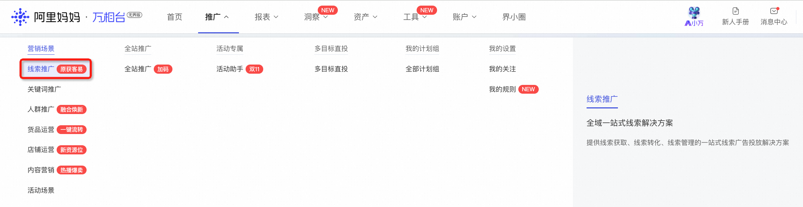

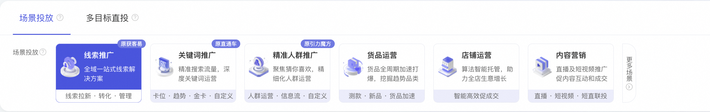

# 二、针对通信行业的定制产品能力

## 1、准入猜你喜欢流量，获取更多拿量机会！

目前面向号卡类目店铺启动招商，支持号卡进手淘“猜你喜欢”场域进行投放，近30天销量大于1万可报名，报名链接：

https://sale.tmall.com/sale/seller/activity_detail.htm?activityId=607752510168

## 2、升级智能单品页，提升留资转化率！

智能单品页是【线索推广】为通信行业商家提供的更快获取留资（开卡订单）的新玩法！该落地页提供**开卡流程、0元开通利益点**等多个组件，可直接引导进入办理套餐页面，实现让消费者直接**在“商详页”**实现开卡，极大提升转化率，降低开卡成本。

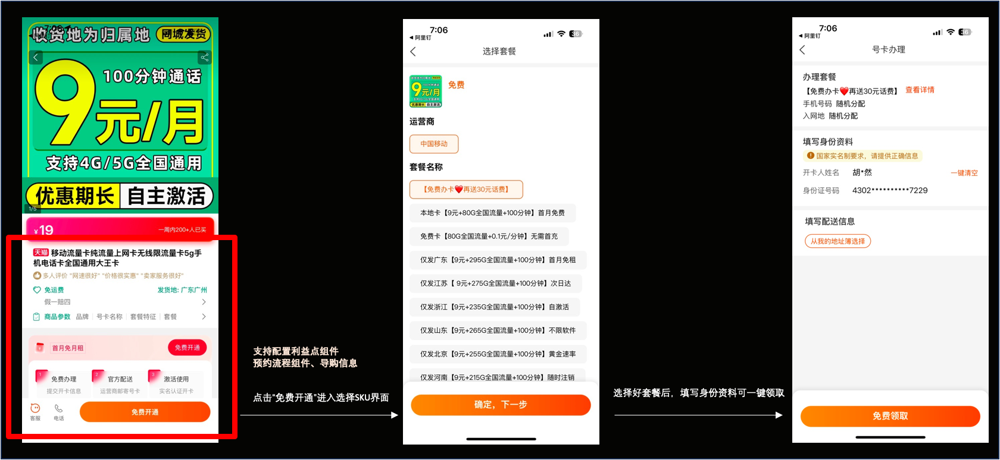

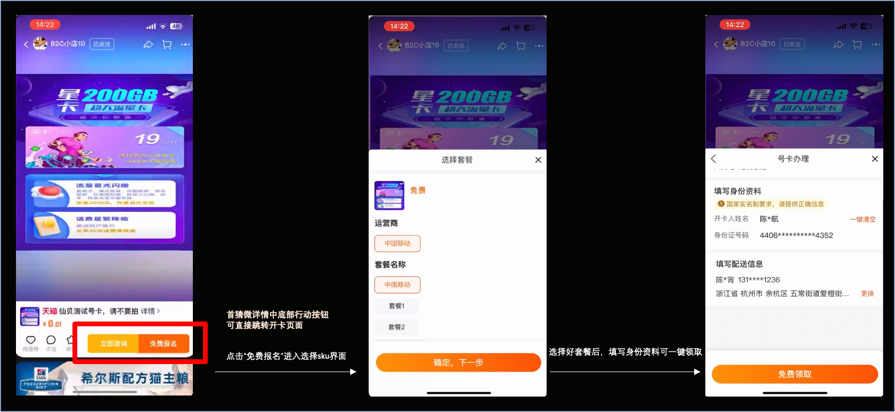

|  |  |
| --- | --- |

# 三、投放教程

## 1、投前加白

商家投放【线索推广】前需提前提供**旺旺账号全称、需要投放的商品ID**

**请商家申请权限填写下列表格：****，加入答疑钉钉群 105120012987 等待小二1～2个工作日内帮您开通。**

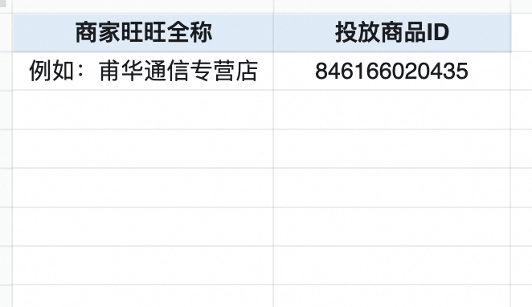

## 2、创建计划

等待小二为您加白完成后，可以开始创建【线索推广】场景的计划了！

### 第一步：选择营销场景与优化目标

打开万相台无界版--点击推广--进入**【线索推广】****-**-选择**【优化留资获客成本】**目标

👉**一键直达创建页面：**

​

### 第二步：选择推广宝贝

**1、****添加推广宝贝，****一次可最多添加10个商品****。**

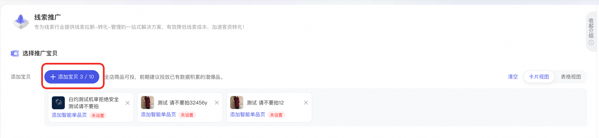

**2、设置智能单品页，可有效提升留资率，该落地页目前可在搜索、推荐流量透出，拿量更方便。🔥🔥🔥**

（没有选择智能单品页默认出商品详情页，选择了智能单品页将同时投放商详页、智能单品页，拿到更多流量）

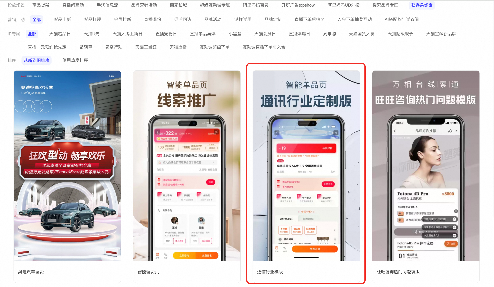

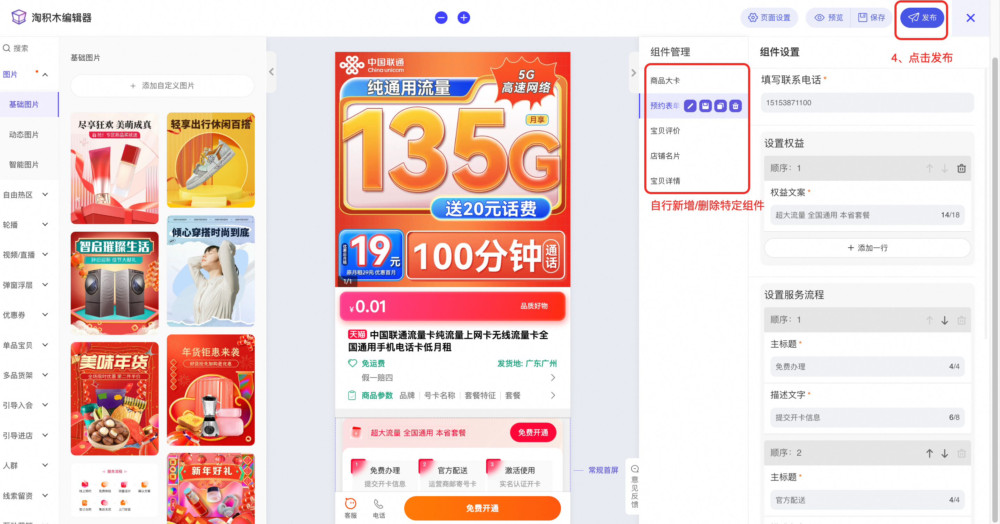

### 第三步：设置预算与出价

**1、选择推广模式：持续推广 or 套餐包**

**持续推广：***实时扣费，起投门槛低，投放灵活，无需设置结束日期，可以随时调整创意、人群、出价***（推荐使用）**

**套餐包：***预扣费模式，相对简单高效智能，创建后无法进行修改*

**2、设置投放时间和投放日期**

*建议每日预算不低于200元。*

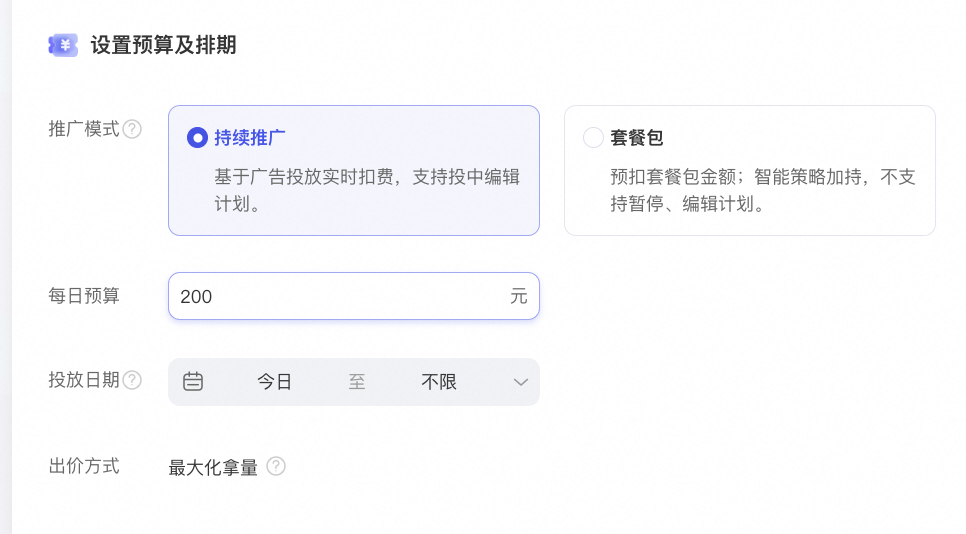

### 第四步：设置人群

**1、添加种子人群（达摩盘人群）加速放量，有效提升广告触达精准度！**

**2、设置屏蔽人群，定向屏蔽店铺已购、加购、收藏人群，特定年龄/性别人群。**

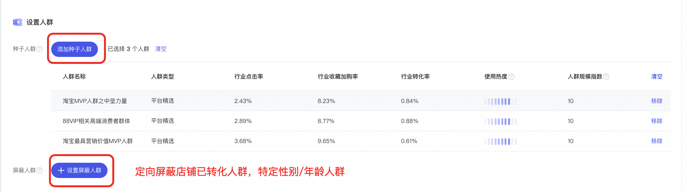

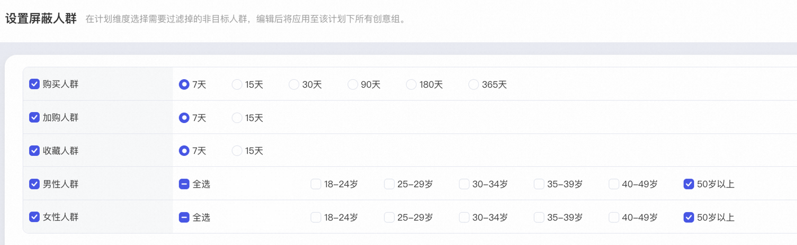

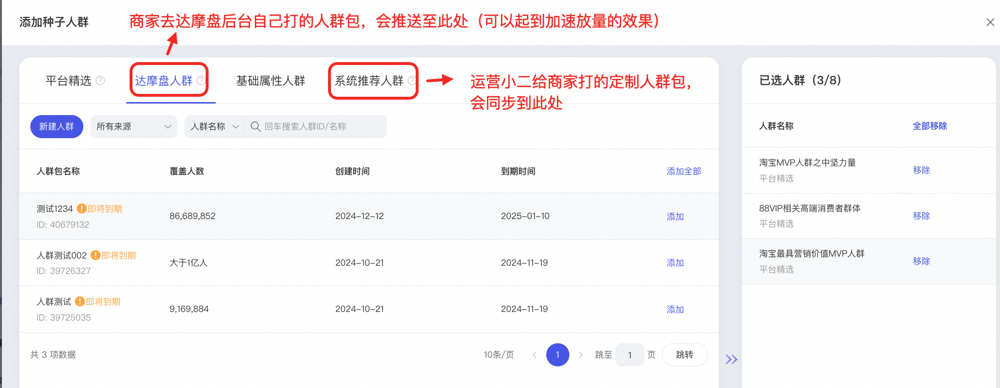

### 第五步：设置投放地域

**商家可基于自身需要，自行选择投放地域、投放时间段，过滤掉转化率差的地区！🔥🔥🔥**

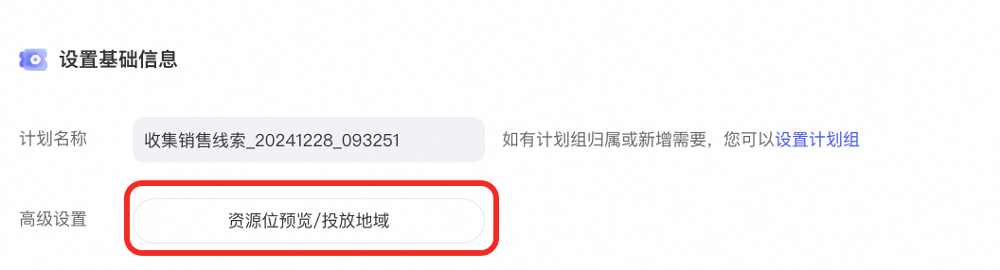

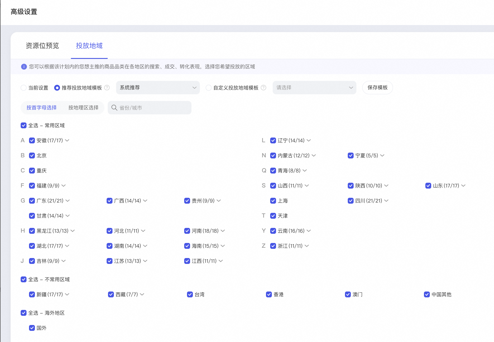

## 3、效果调优

商家可采用下列方案进行测试，验证**智能单品页**和**商品详情页**哪个投放效果更好。

创建两个计划，一个只有商详页，一个只有智能单品页，测试7天，将投放效果较差的计划关停，同时加大另一计划的预算。

## 4、数据监控

重点关注**总成交笔数、拍下订单笔数、线索成本**

总成交笔数：有价开卡订单数

拍下订单笔数：免费0元开通订单数+有价开卡订单数

线索成本：约等于开卡成本

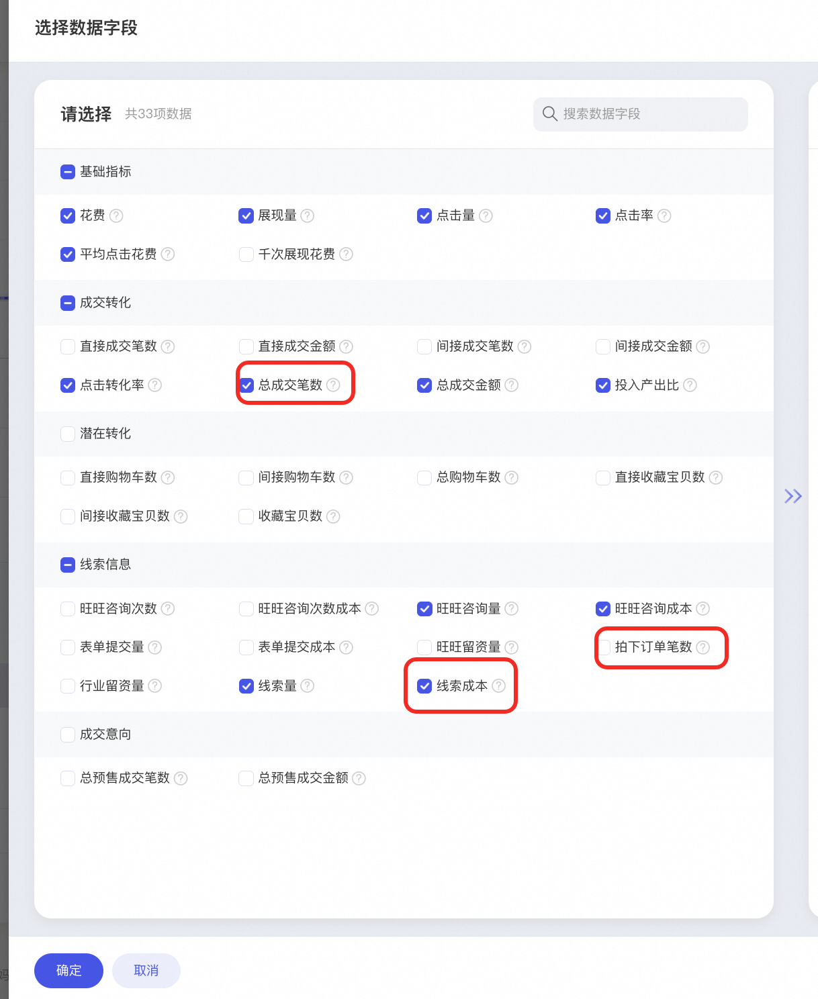

​

其他问题欢迎进入线索推广答疑钉钉群咨询小二：105120012987

**​**

​
