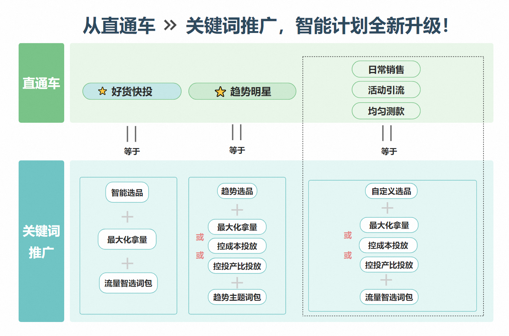
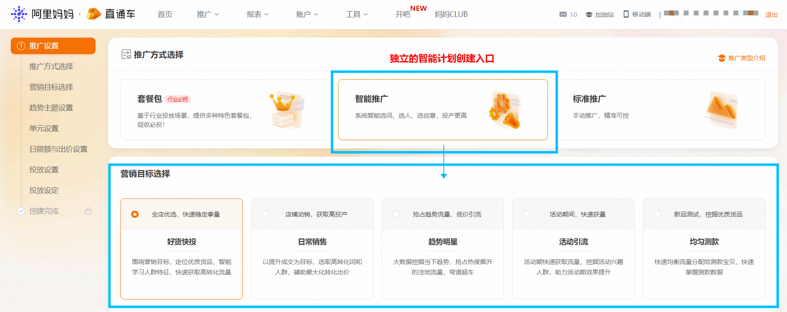
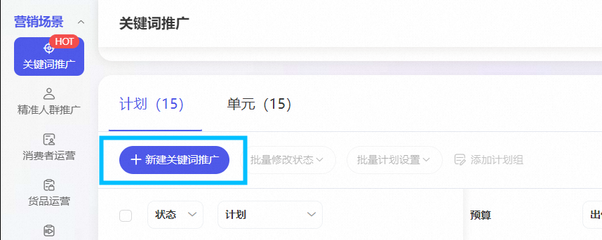
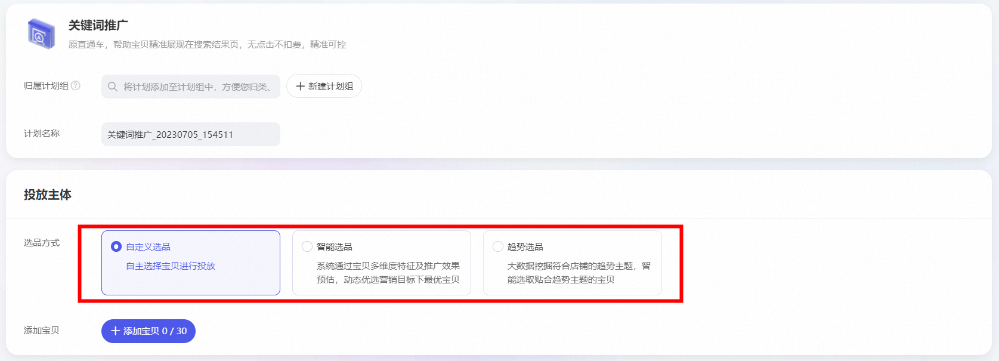
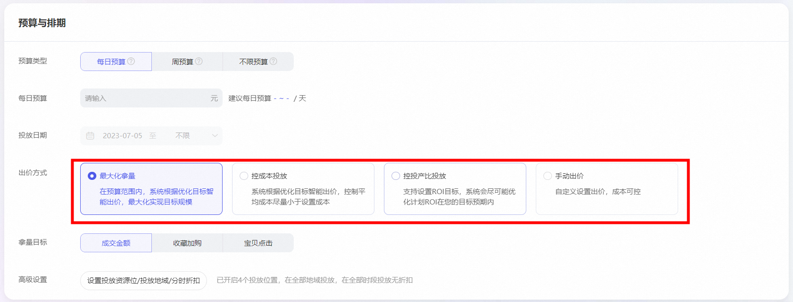
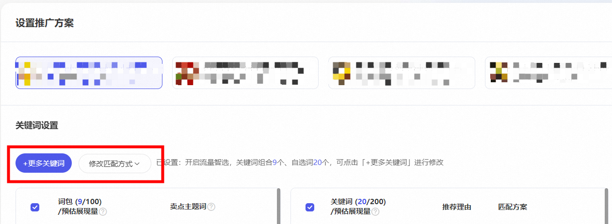
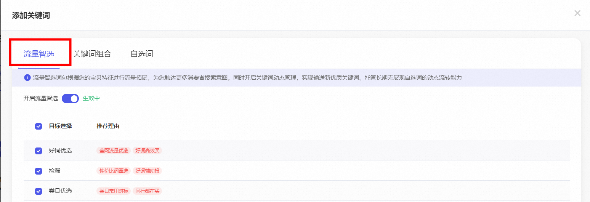
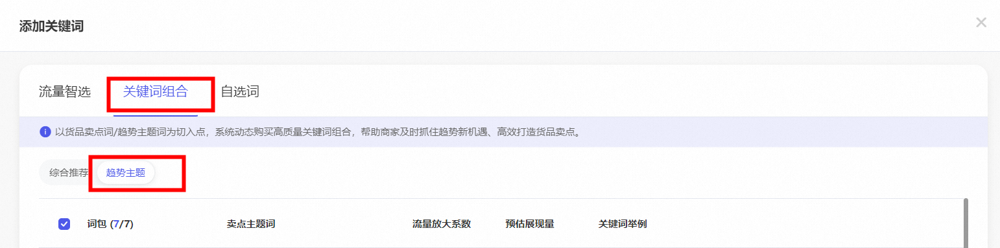

# 迁移后，原直通车智能计划如何在关键词场景进行创建？

> 来源：https://alidocs.dingtalk.com/i/nodes/ydxXB52LJqPvwoK0IAxMX9xoVqjMp697

**原语雀文档链接：**https://yuque.antfin.com/chenchun.chen/gqhty9/uyedvcybcp5z9003

---

​

从**原直通车**迁移至**万相台无界-关键词推广**后，有些商家存在这样的疑惑：“迁移后怎么没办法创建智能计划了？”，“直通车智能计划没有了么？”-----这些，统统不存在的！！

真相是，迁移后直通车核心的能力不仅没有下线，反而实现了全新的升级，核心升级点在于，将标准计划的可控性与智能计划的高效拿量能力进行了完美的结合，结合后的投放模式叫做：自定义推广。

那么问题来了：直通车智能计划的不同营销场景，我到底怎么创建？

很简单，一张图，一分钟，您就明白了：

## 具体操作方式：

### 1.1创建入口对比

原直通车标准推广、智能推广各自拥有独立创建入口；选择智能推广+相应的营销目标后创建计划。

万相台无界所有的关键词投放计划，均从一个入口进行创建。

### 1.2 在万相台无界创建“智能计划”

1.入口都是下方截图的这一个

2.原智能计划营销目标在万相台无界对应的选品、出价、关键词模式

3.**选品模块，基于运营目标+上图关系选择**

**4.出价模式选择**

**5.关键词词包选择**

在这里，大家也会发现一个升级点，标准计划支持我们进行智能出价模式的选择了，可以帮助我们标准计划的投放效率、效果进一步提升！

##
