# 1- 自定义推广

> 来源：https://alidocs.dingtalk.com/i/nodes/ydxXB52LJqPvwoK0IAxMknyBVqjMp697

**原语雀文档链接：**https://yuque.antfin.com/chenchun.chen/gqhty9/zltam6o6uen7tlyu

---

## **使用诉求**

## 一、产品介绍

自定义推广是原关键词推广标准计划和智能计划的**整合升级版**。支持自主选品、选词等能力，同时出价方式进行打通，支持手动出价、智能出价两种出价方式，支持**「获取成交量」、「稳定投产比」、「相似品跟投」、「增加收藏加购量」和「增加点击量」****，和「提升词市场渗透****」**六大出价目标，打破原有关键词推广出价壁垒，投放可控，效果更优。

关键词-自定义推广是按照商家所选**[关键词]**圈选流量，选品/出价/人群均支持自定义，十足的精准可控！

广告**展现免费，点击收费**，展示在手机淘宝的核心资源位：在手淘APP搜索结果页首条，以及往下动态展现关键词推广位置

关键词推广能为商家带来两种收益，一种是直接转化**助力宝贝成交**，一种是**长期品牌心智种草**

## 二、创建流程说明

### **商家诉求一：希望自主投放，对每个关键词出价、设置想要的人群**

投放思路：选择自定义推广下的手动选品下的手动出价

#### **1、进入推广**

登录 **万相台无界 ->选择推广 -> 关键词推广 -> 选择“自定义推广”模式-> “自定义选品”模式-> “手动出价”**

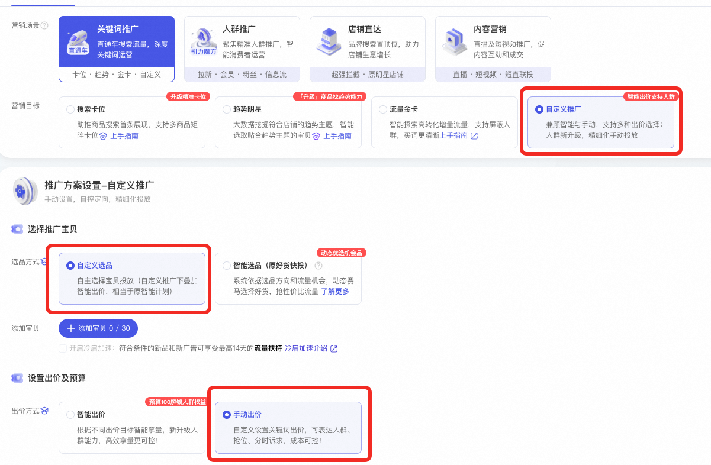

#### **2、设置选品 **

**自定义选品**：全店商品自选投放，可控性强，可添加宝贝上限30个

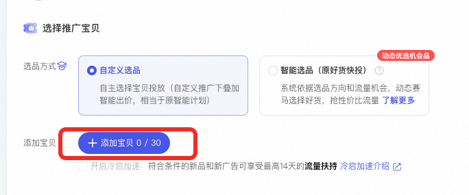

#### **3、**选择关键词

（1）操作路径：关键词推广-自定义推广-自定义选品-关键词设置

注意：智能选品不支持自定义设置关键词

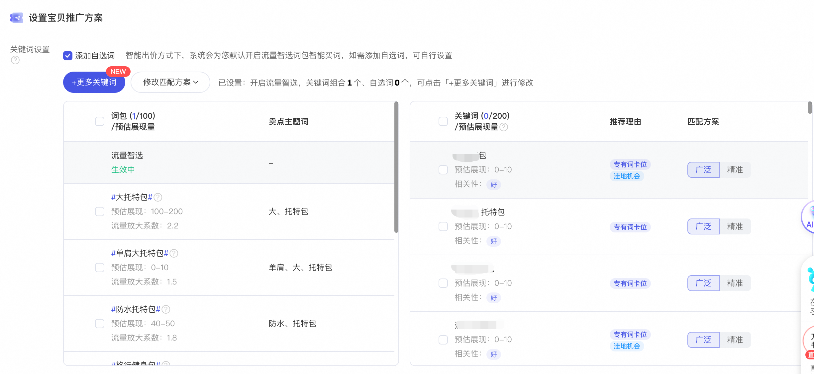

（2）关键词分类包括：自定义买词、流量智选、关键词组合

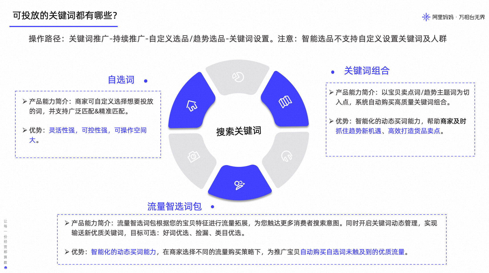

流量智选三大目标介绍：

捡漏：系统智能自动购买行业内高点击、高转化，平均点击成本相对较低的词，帮助商家捡漏。

类目优选：系统智能自动购买与您的宝贝二级类目相同，属性、价格类似的推广商品优质词，帮助商家流量争夺。

好词优选：系统根据宝贝特征进行流量拓展，并基于关键词优选的逻辑，为您触达更多高效的消费者搜索意图。

#### **4、选择人群 **

（1）操作路径：关键词推广-自定义推广-自定义选品-关键词设置-人群设置

注意：只有【自定义选品】+【手动出价】，才可支持添加人群投放。

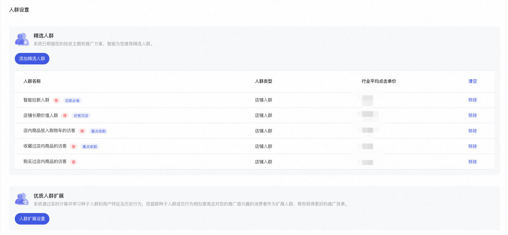

（2）人群设置

人群设置包括种子人群、扩展人群

| ​ | 产品能力简介 | 商家价值 |
| --- | --- | --- |
| 种子人群 | 商家可以在关键词流量下，选择自定义人群、行业人群、店铺人群、智能人群，通过人群溢价的方式，表达人群投放偏好。 | 在已选关键词的基础上，为商家提供丰富的人群及标签，帮助商家精细化运营，提升目标人群搜索时看到广告的几率，提升关键词推广效率。 |
| 扩展人群 | 基于您选择的种子人群，系统实时计算并学习种子人群的用户特征及历史行为，挖掘跟种子人群成交行为相似度高且对您的推广感兴趣的消费者作为扩展人群。 | 在已选种子人群的基础上，系统进行优质人群扩展，帮助商家快速获取更多的人群流量。 |

#### **5、高级设置：设置投放位置、地域、时间**

投放资源位：

淘宝搜索资源位是关键词推广的核心资源位，建议开启

追投资源位当计划是智能化出价情况下可以发挥算法实时能力，效果较优，建议开启。开启搜索意图全域追投，只会针对搜索花不完的预算进行全域追投，不会对搜索计划本身的效果产生影响；

投放地域：

投放地域怎么选择，主要取决于您的宝贝是否有比较的地域属性，同时参考该计划内的您想主推的商品品类在各地区的搜索、成交、转化表现，选择您希望投放的区域；

如果出现未设置投放的地域有消耗，原因是为了提高地域识别准确度系统做了升级，由原来的ip识别改为了收货地址识别，属于正常情况，您无需担心正常推广即可。

举个例子方便理解：消费者在成都，常用收货地址在杭州，您关键词推广投放了杭州未投放成都，该消费者可以正常看到并点击您的推广信息，则该消费者正常产生了点击消耗。
分时折扣：

分时折扣怎么设置，可以参考计划在各时间段内的搜索、成交、转化表现，从而选择该时间是需要投放或者不投放或者更改时间折扣；

如果出现未投放的时段有消耗，请自查计划的分时折扣设置页面是否有投放产生消耗的时段，同时自查操作记录是否有修改过设置。

（1）设置投放资源位

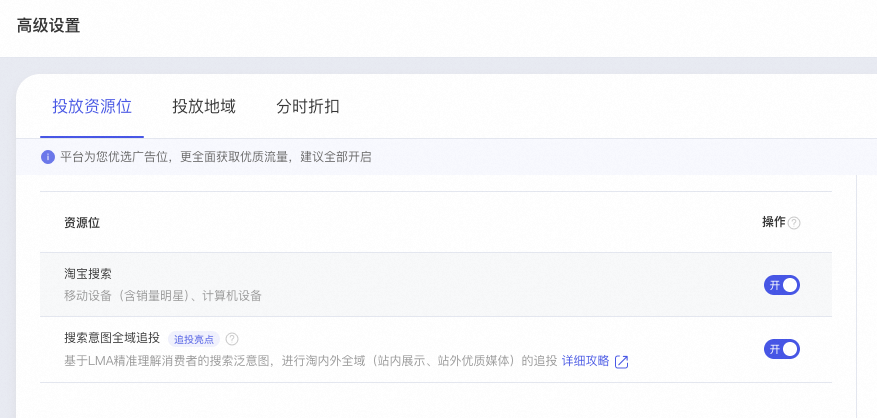

（2）设置投放地域

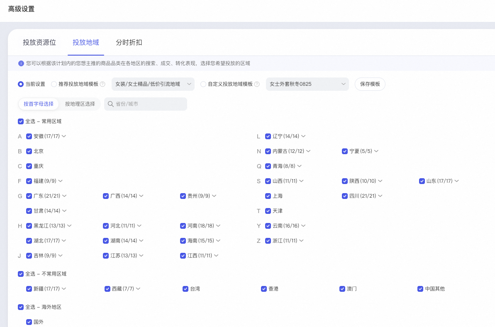

（3）设置投放时间

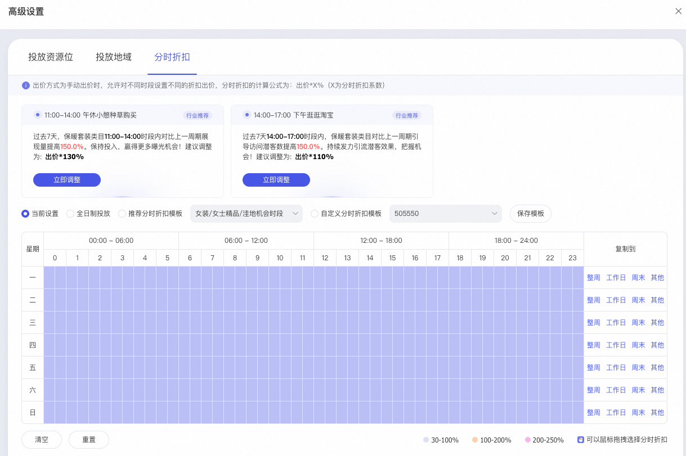

### **商家诉求二：希望**系统优化投放效果，获取更多转化或者达成目标ROI

投放思路：选择自定义推广下，手动选品的智能出价

注意：此时可以添加关键词，但是无法设置每个关键词出价；不支持设置丰富人群溢价

#### **1、进入推广**

登录 **万相台无界 ->选择推广 -> 关键词推广 -> 选择“自定义推广”模式-> “自定义选品”模式-> “智能出价”**

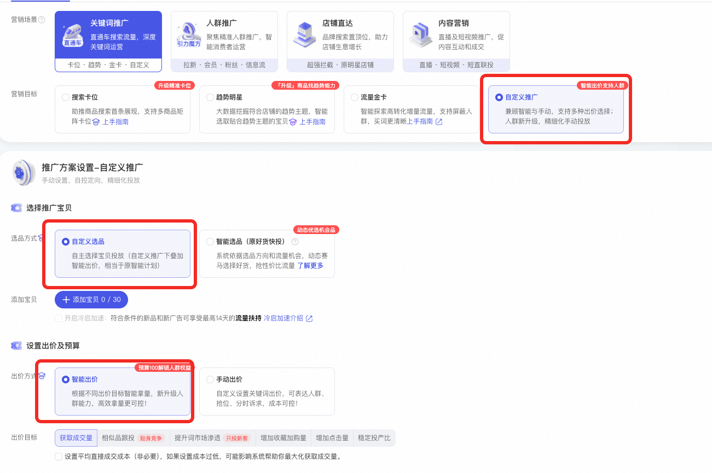

#### **2、设置选品 **

**自定义选品**：全店商品自选投放，可控性强，可添加宝贝上限30个

#### **3、**选择出价目标

第一步：**先明确投放诉求**，比如日销期时期望稳定投产比、或者大促期希望爆品快速获取成交等等

第二步：根据投放诉求，**选择适配的出价目标**，具体参考下表适用场景

第三步：**根据选择的出价目标效果，分析是否达成诉求**。如选择稳定投产比时，在一阶段数据积累期计划会有一定波动，但进入二阶段稳定投放期后，从7日效果看计划会更加稳定，建议拉长周期看待投放效果；

第四步：**投放诉求达成后，提升计划日预算**。计划效果的稳定依赖数据量的累积，日预算过少会造成计划波动大，当出价目标效果达成预期后，建议提升单计划日预算，获取更加稳定的效果。建议结合次日预算一起使用哦！

| **出价目标** | **功能** | **适用场景** | **注意事项** |
| --- | --- | --- | --- |
| 获取成交量 | 预算范围内，系统会**最大化获取成交量****；** 若勾选设置平均成本，则系统会尽可能控制**7日**直接成交成本在您设置值的一定范围内浮动 | 大促抢量或日常销售抢量，比如爆品需要快速抢占市场，获取更多成交 | 1.建议优先选择有一定真实销量的宝贝 2.请谨慎勾选设置平均成本，设置后拿量会有影响，不适合新品和成交少的宝贝 |
| 相似品跟投 | **将您的商品投放和展现在跟投商品的搜索结果附近位置**，赢得目标人群关注度**，影响用户决策路径**，带来更精准的流量与转化；支持智能跟投和自定义跟投。 | 🎯 新品上新打爆，快速获取流量 **→ ****继承店铺及行业爆品流量****，新品“躺赢”爆单****！** 🎯 爆品持续曝光，巩固市场地位 **→ ****跟投相似品+叶子类目爆品****，精准截流！** 🎯 类目内卷严重，寻求增量市场 **→ ****搭配商品，拉新破圈****！** | 建议选择自身店铺竞争力强的商品 |
| 稳定投产比 | 支持设置ROI目标，当您设置合理ROI目标后，系统会尽可能优化7日ROI在您设置值的一定范围内浮动 | 1.大促期间对投产有明确诉求，追求确定性投入产出比 2.日常销售中，通过控投产投放店铺有一定销量的宝贝，保证店铺营收 ​ | 1.设置的ROI目标要参考宝贝日常转化情况或者系统建议设置合理值，过高算法无法完成。 2.特别提醒要关注周期内7天的ROI达成情况，强烈建议不要因为单天或者实时波动就关停计划，影响计划数据模型 |
| 📈提升词市场渗透 | 助力宝贝提升所选关键词的市场渗透率，获取更多流量份额，更大生意规模！ | 期望提升所选关键词的市场渗透率 | ​ |
| 增加收藏加购量 | 预算范围内，系统会**最大化获取收藏加购量****；** 若勾选设置平均成本，则系统会尽可能控制**7日**收藏加购成本在您设置值的一定范围内浮动 | 1.大促种草期获取收藏加购 2.长周期成交商品、高客单成交商品 3.新品积累收藏加购等行为数据 | 请谨慎勾选设置平均成本，设置后拿量会有影响，不适合新品和成交少的宝贝 |
| 增加点击量 | 预算范围内，系统会**最大化获取点击量****；** 若勾选设置平均成本，则系统会尽可能控制**7日**点击成本在您设置值的一定范围内浮动 | 产品处于早期，期望通过大量拿点击量来进行人群探索 | 1.由于点击量是比较泛的流量，可能会导致不满足预期 2.请谨慎勾选设置平均成本，设置后拿量会有影响，不适合新品和成交少的宝贝 |

#### **4、高级设置：设置投放位置、地域、时间**

投放资源位：

淘宝搜索资源位是关键词推广的核心资源位，建议开启

追投资源位当计划是智能化出价情况下可以发挥算法实时能力，效果较优，建议开启。开启搜索意图全域追投，只会针对搜索花不完的预算进行全域追投，不会对搜索计划本身的效果产生影响；

投放地域：

投放地域怎么选择，主要取决于您的宝贝是否有比较的地域属性，同时参考该计划内的您想主推的商品品类在各地区的搜索、成交、转化表现，选择您希望投放的区域；

如果出现未设置投放的地域有消耗，原因是为了提高地域识别准确度系统做了升级，由原来的ip识别改为了收货地址识别，属于正常情况，您无需担心正常推广即可。

举个例子方便理解：消费者在成都，常用收货地址在杭州，您关键词推广投放了杭州未投放成都，该消费者可以正常看到并点击您的推广信息，则该消费者正常产生了点击消耗。
分时折扣：

分时折扣怎么设置，可以参考计划在各时间段内的搜索、成交、转化表现，从而选择该时间是需要投放或者不投放或者更改时间折扣；

如果出现未投放的时段有消耗，请自查计划的分时折扣设置页面是否有投放产生消耗的时段，同时自查操作记录是否有修改过设置。

### **商家诉求三：**店铺商品繁多，希望系统优选商品自动投放

投放思路：选择自定义推广下，智能选品（此时不支持自主添加关键词）

#### **1、进入推广**

登录 **万相台无界 ->选择推广 -> 关键词推广 -> 选择“自定义推广”模式-> “智能选品”模式**

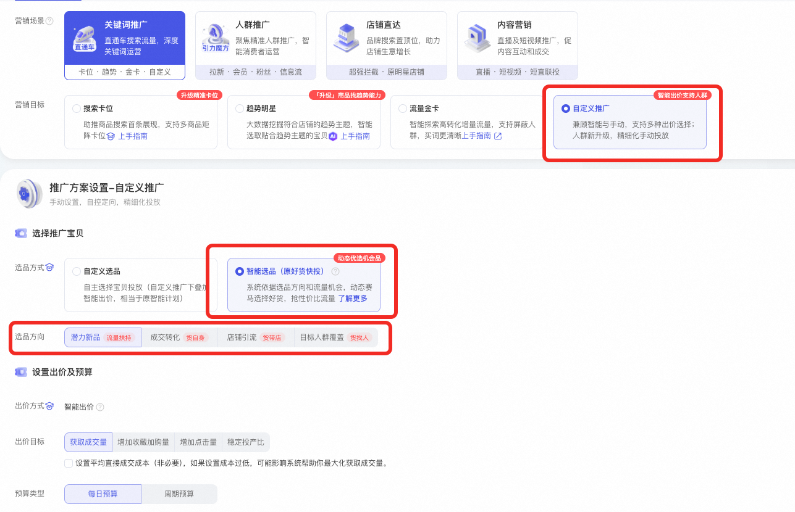

#### **2、设置选品方向 **

通过淘系的海量大数据分析和算法智选能力，参考商家设置的选品方向（**潜力新品 / 成交转化 / 店铺引流 / 目标人群覆盖**）精准从商家店铺的全部宝贝中，选出符合要求的优质宝贝，达成商家对应的推广目标：

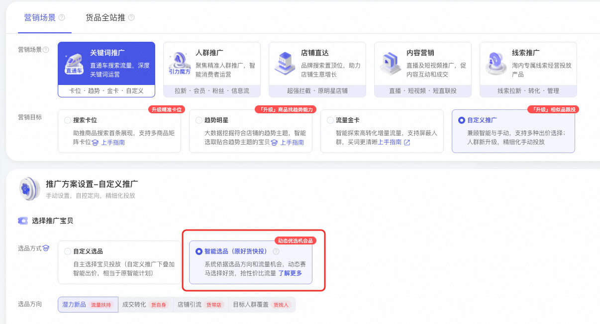

更多智能选品介绍：

#### **3、高级设置：设置投放位置、地域、时间**

投放资源位：

淘宝搜索资源位是关键词推广的核心资源位，建议开启

追投资源位当计划是智能化出价情况下可以发挥算法实时能力，效果较优，建议开启。开启搜索意图全域追投，只会针对搜索花不完的预算进行全域追投，不会对搜索计划本身的效果产生影响；

投放地域：

投放地域怎么选择，主要取决于您的宝贝是否有比较的地域属性，同时参考该计划内的您想主推的商品品类在各地区的搜索、成交、转化表现，选择您希望投放的区域；

如果出现未设置投放的地域有消耗，原因是为了提高地域识别准确度系统做了升级，由原来的ip识别改为了收货地址识别，属于正常情况，您无需担心正常推广即可。

举个例子方便理解：消费者在成都，常用收货地址在杭州，您关键词推广投放了杭州未投放成都，该消费者可以正常看到并点击您的推广信息，则该消费者正常产生了点击消耗。
分时折扣：

分时折扣怎么设置，可以参考计划在各时间段内的搜索、成交、转化表现，从而选择该时间是需要投放或者不投放或者更改时间折扣；

如果出现未投放的时段有消耗，请自查计划的分时折扣设置页面是否有投放产生消耗的时段，同时自查操作记录是否有修改过设置。

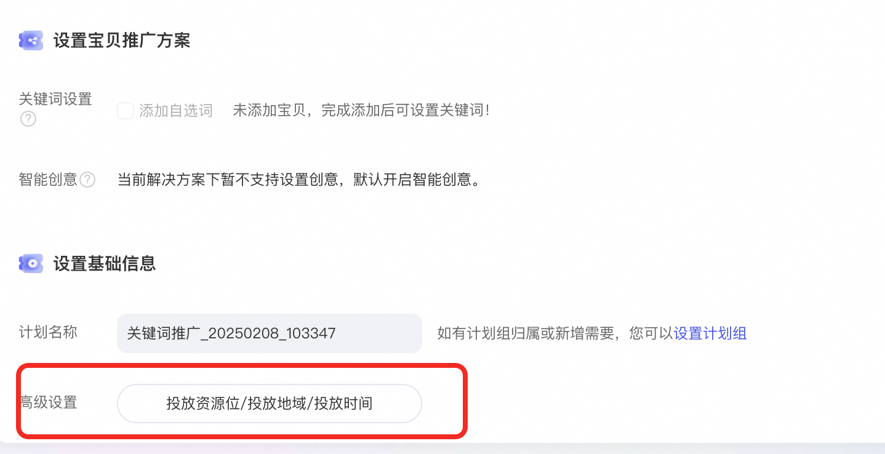

## 三、常见FAQ

### Q1：关键词列表、人群列表及创意列表的实时数据和单元/计划的实时数据对不上是怎么回事？

关键词推广的计划开启了“一键起量”或者“搜索人群追投”时，因关键词列表页、人群列表页及创意列表页无法展现实时搜索人群追投及一键起量的数据，因此会出现关键词列表页等的实时数据与单元/计划维度数据对不齐的情况。

可在计划及单元维度查看搜索人群追投的数据。

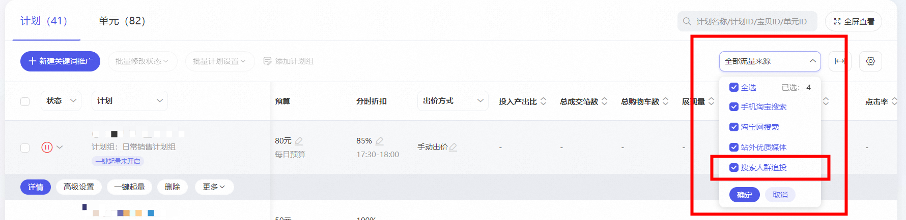

可以在计划列表页点击“一键起量”单独查看一键起量数据。

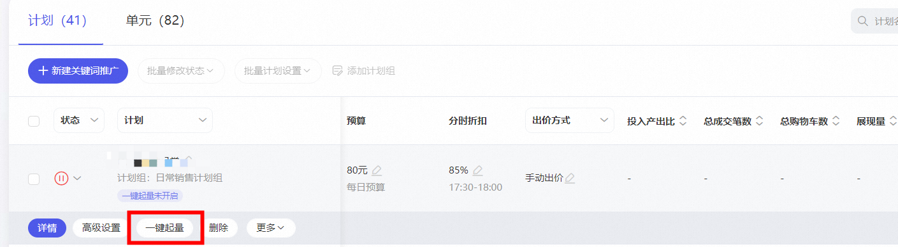

**查看是否开启搜索意图全域追投**

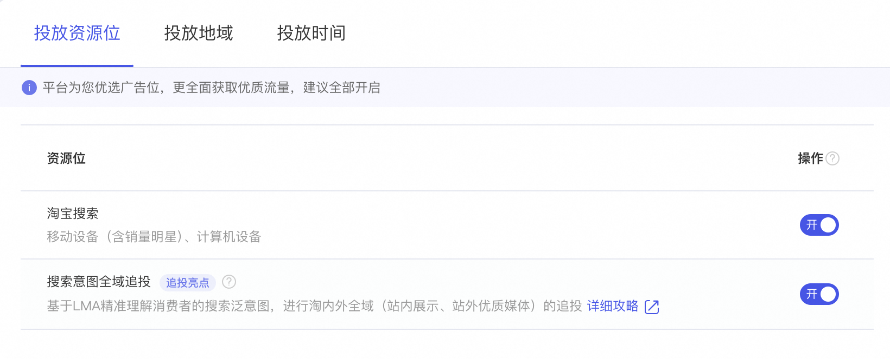

### Q2：关键词推广的展示位置在哪里？

A2：关键词推广 **展现免费，点击收费**，展示在手机淘宝的核心资源位：在手淘APP搜索结果页首条，以及往下动态展示关键词推广展现位置；具体以搜索结果页【广告】标识为准。注：前述规则适合综合tab、销量tab、天猫tab、上新tab，但具体均以【广告】标识为准；

此外，搜索结果页下店铺tab：同综合tab、销量tab、天猫tab、上新tab均为搜索推广资源位一种，商家使用搜索广告推广时，均会投放到前序资源位。店铺tab资源位为搜索结果下最靠前的坑位，消费者点击率、转化率均高于其他坑位，是获取流量成交的优质资源位。默认投放，相关关键词需要满足店铺有3个及以上宝贝同时投放；

### Q3：计划创建完成后出价目标是否可以修改？

A3：出价方式主要包括：手动出价、智能出价（包括：**「获取成交量」、「稳定投产比」、「相似品跟投」、「增加收藏加购量」和「增加点击量」**，**「抢占搜索卡位」和「提升词市场渗透」等出价目标**）

当前仅支持部分出价目标之间的互相切换。

操作路径：关键词推广-找到需要修改出价方式的计划-点击出价方式后面的编辑图标，即可进行修改。

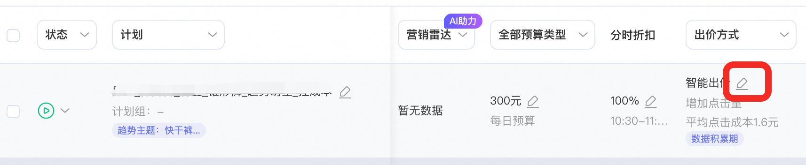

### Q4：关键词组合中的【流量放大系数】，具体定义是什么？

流量放大系数——准确衡量词包的拿量能力

流量放大系数的定义是：比于购买该词的精确匹配，购买词包能获得的流量的放大倍数，有助于有针对性的卖点词下拿到更多的量，即：流量放大系数=词包覆盖的PV/词包的原词PV

比如购买原词是保湿套装，卖点词包中围绕着保湿套装的卖点词加总覆盖的PV/保湿套装原词的PV，就是该卖点词包的流量放大系数。

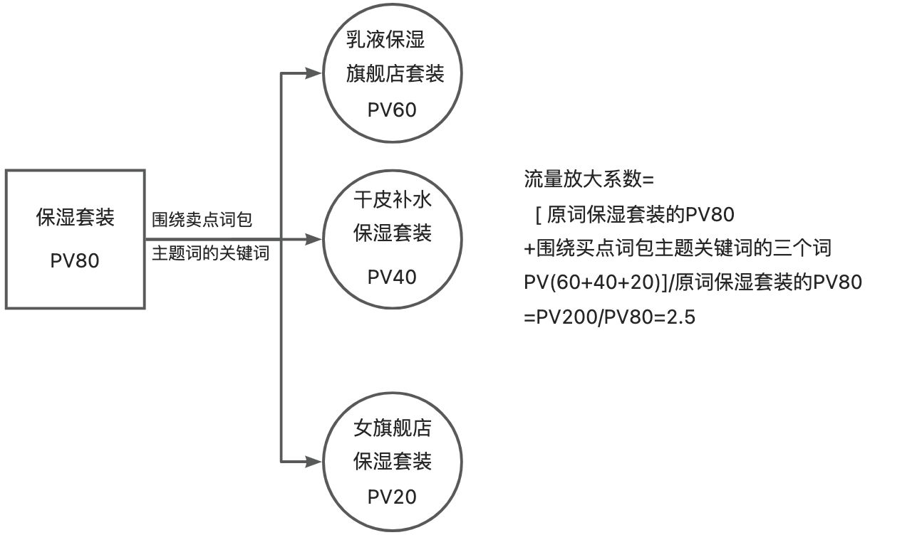

### Q5： 关键词屏蔽上限是多少？

中心词屏蔽词数量10个、精确词屏蔽数量50个

### Q6： 如何添加/修改创意

操作路径：关键词推广-已创建的计划-单元页-创意-添加创意

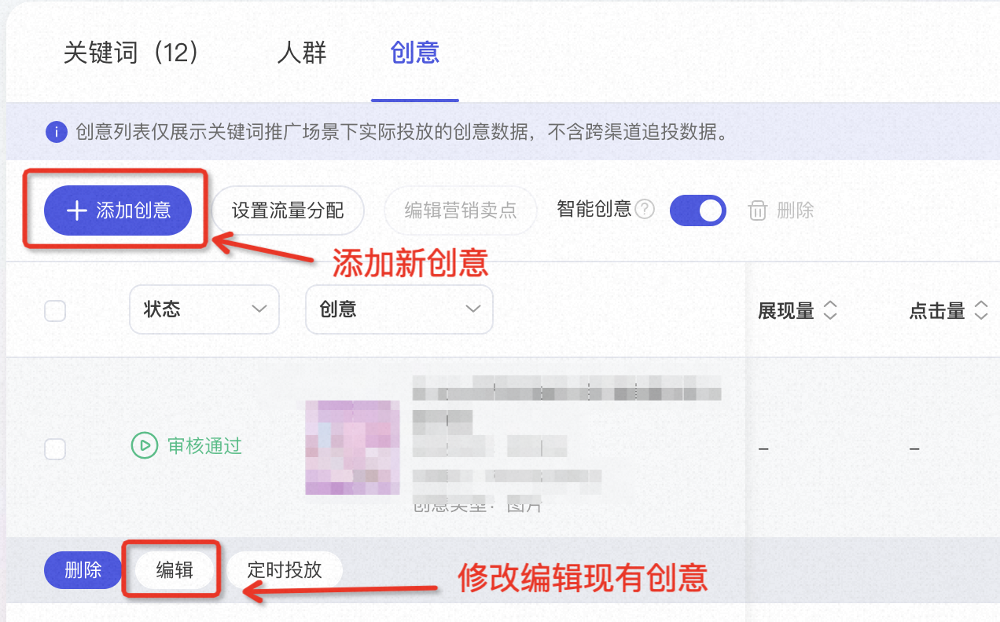

## 四、核心玩法介绍

### 1、自定义推广如何进行出价的选择？

现在详细来说明各个出价目标的能力以及适用的一些场景，更多内容见《关键词智能出价升级，更加贴合您的经营诉求！》

| **出价目标** | **功能** | **适用场景** | **注意事项** |
| --- | --- | --- | --- |
| 获取成交量 | 预算范围内，系统会**最大化获取成交量****；** 若勾选设置平均成本，则系统会尽可能控制**7日**直接成交成本在您设置值的一定范围内浮动 | 大促抢量或日常销售抢量，比如爆品需要快速抢占市场，获取更多成交 | 1.建议优先选择有一定真实销量的宝贝 2.请谨慎勾选设置平均成本，设置后拿量会有影响，不适合新品和成交少的宝贝 |
| 稳定投产比 | 支持设置ROI目标，当您设置合理ROI目标后，系统会尽可能优化7日ROI在您设置值的一定范围内浮动 | 1.大促期间对投产有明确诉求，追求确定性投入产出比 2.日常销售中，通过控投产投放店铺有一定销量的宝贝，保证店铺营收 ​ | 1.设置的ROI目标要参考宝贝日常转化情况或者系统建议设置合理值，过高算法无法完成。 2.特别提醒要关注周期内7天的ROI达成情况，强烈建议不要因为单天或者实时波动就关停计划，影响计划数据模型 |
| 🎯抢占搜索卡位 | 助推宝贝在**搜索首条、前三等顶级位置展现，抢位成功率最高达100%**，放大品牌声量、拦截精准意图必用！首条成交转化率比其他位置提升约220% |  | 建议添加卡位词数量10个左右，效果更好哦 |
| 📈提升词市场渗透 | 助力宝贝提升所选关键词的市场渗透率，获取更多流量份额，更大生意规模！ | 期望提升所选关键词的市场渗透率 | ​ |
| 增加收藏加购量 | 预算范围内，系统会**最大化获取收藏加购量****；** 若勾选设置平均成本，则系统会尽可能控制**7日**收藏加购成本在您设置值的一定范围内浮动 | 1.大促种草期获取收藏加购 2.长周期成交商品、高客单成交商品 3.新品积累收藏加购等行为数据 | 请谨慎勾选设置平均成本，设置后拿量会有影响，不适合新品和成交少的宝贝 |
| 增加点击量 | 预算范围内，系统会**最大化获取点击量****；** 若勾选设置平均成本，则系统会尽可能控制**7日**点击成本在您设置值的一定范围内浮动 | 产品处于早期，期望通过大量拿点击量来进行人群探索 | 1.由于点击量是比较泛的流量，可能会导致不满足预期 2.请谨慎勾选设置平均成本，设置后拿量会有影响，不适合新品和成交少的宝贝 |

​

### 2、如何玩转搜索关键词？

#### 2.1、为什么要投放关键词？

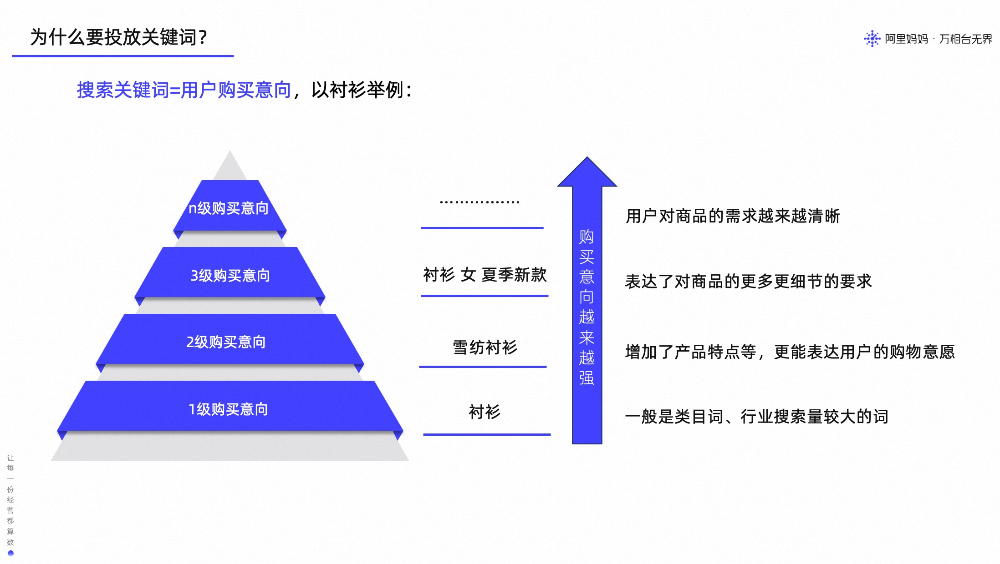

#### 2.2、关键词投放技巧分享

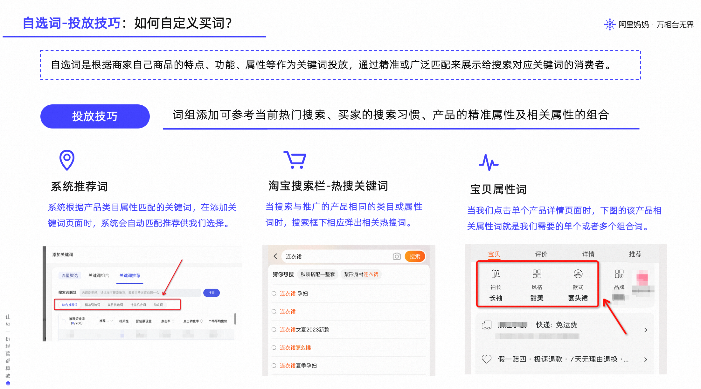

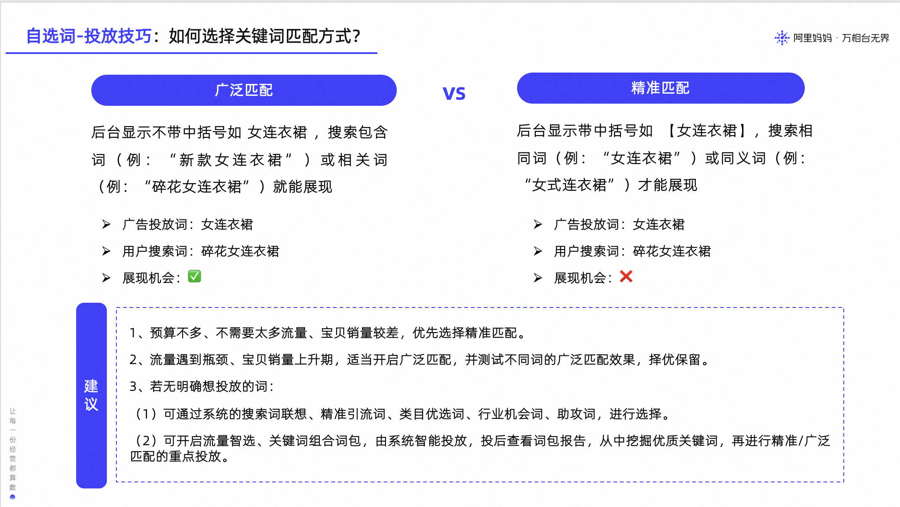

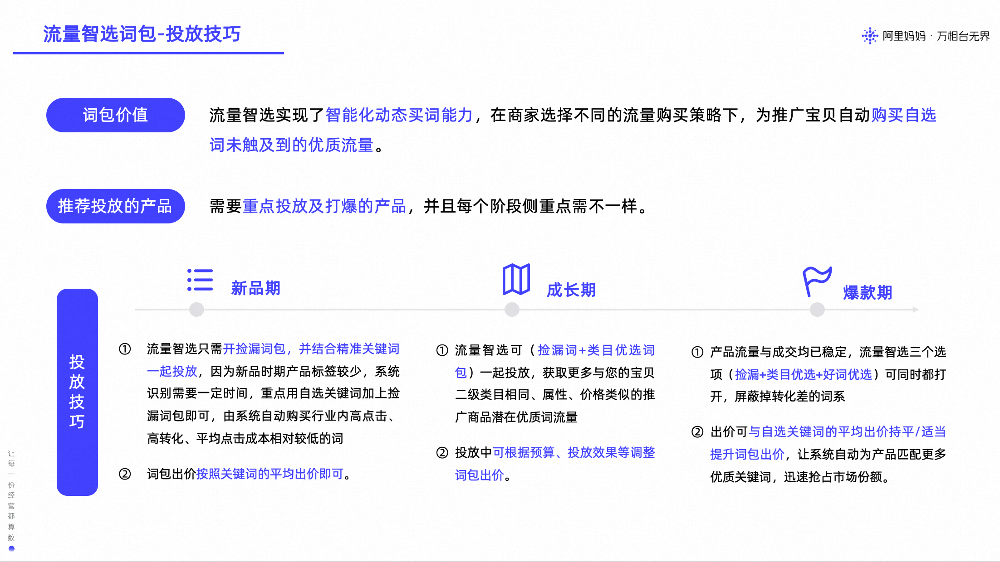

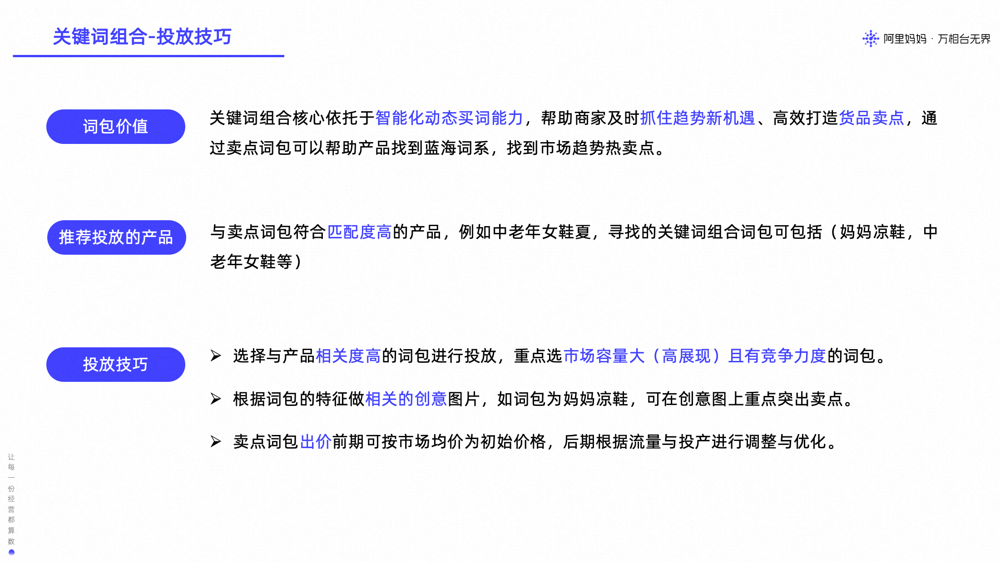

### 3、如何选择人群投放？

#### 3.1、为什么要投放人群？

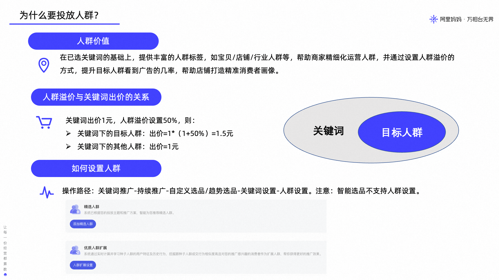

#### 3.2、人群投放技巧分享

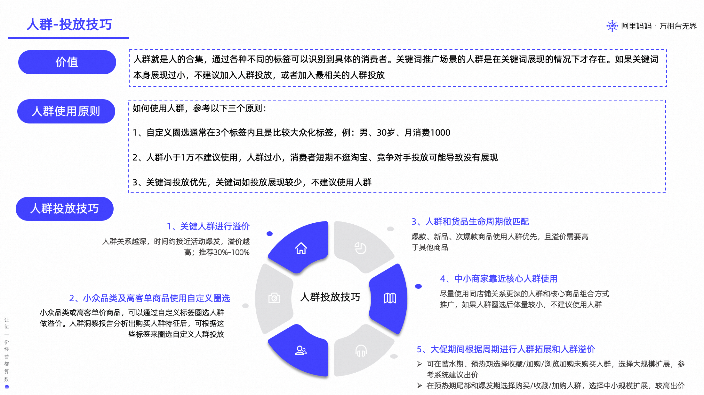

### 4、如何提升点击率（创意/权益相关的都可以）

#### 4.1 通过「报名营销权益」提高点击率、转化率

**4.1.1 三种权益，提升广告效能**

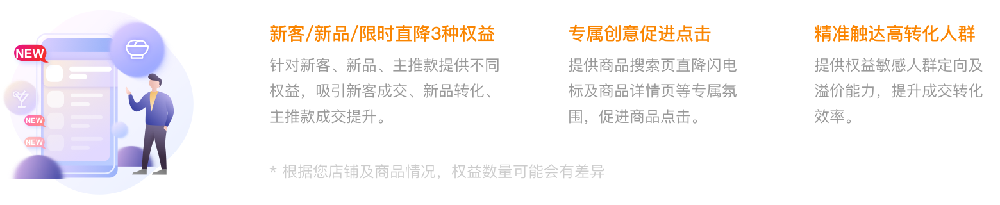

| **权益名称** | **淘宝商家** | **天猫商家** |
| --- | --- | --- |
| 新客活动（与新享互通） | 符合规则货品可报 | 符合规则货品可报 |
| 新品活动（与新享互通） | —— | 符合规则货品可报 |
| 限时直降（仅关键词推广渠道享有） | —— | 符合规则货品可报 |

关键词推广权益模块提供3种新享权益，即新客、新品、限时直降。可基于店铺拉新、新品快速成长、主推打爆/尾货清仓等店铺目标选择对应的权益使用。让店铺目标客户更快地看到您的宝贝，提升广告效能，帮助商家快锁获取高转化流量。各权益与品牌新享互通，关键词推广限时直降活动当前为关键词推广与新享共建的搜索渠道专享权益、仅可在关键词推广权益模块报名。

​

**4.1.2权益专享创意样式，提升点击转化**

搜索结果页展现闪电标及飘条（飘条仅在新客、新品活动中呈现）、商品详情页专属创意样式，全链路权益视觉氛围展现。同时首单礼金频道页流量加持，刺激消费者点击转化。

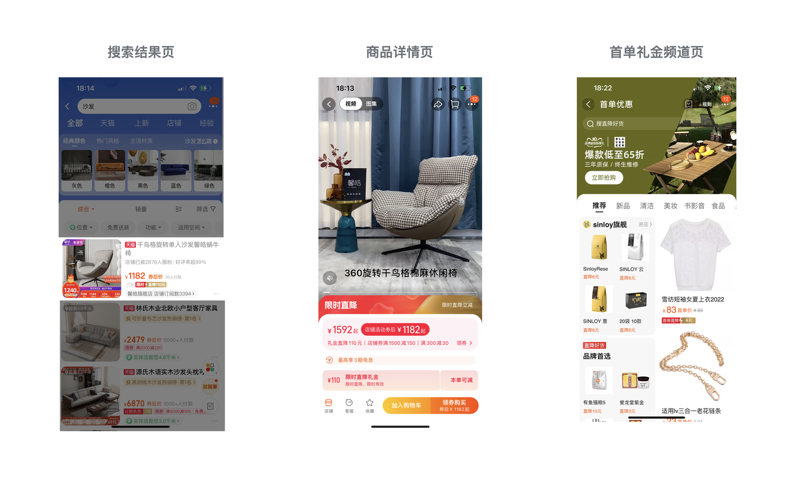

**4.1.3权益可精准触达高转化人群，提升转化效率**

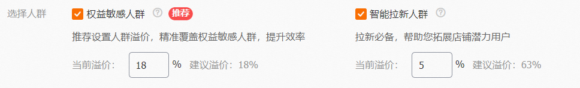

​

关键词推广提供**【权益敏感人群】**、**【智能拉新人群】**两类人群供商家做重点运营，帮助提升成交转化。

权益敏感人群：针对优惠、促销和折扣更为敏感的用户进行智能溢价，更精准的锁定目标人群。

智能拉新人群：根据店铺消费者特征及所属类目的用户行为数据，智能挖掘潜在对您店铺有兴趣的访客。

​

**4.1.4权益让利金额不计最低价，助力货品成长**​

使用新客、新品、限时直降权益的让利优惠金额不计入货品最低价，方便宝贝后续参与活动，助力货品成长。

**4.1.5权益差异对比**

| **相应模块** | **新客活动** | **新品活动** | **限时直降** |
| --- | --- | --- | --- |
| **商家报名** | **淘宝/天猫符合规则均可报名** | **仅天猫符合规则货品可报名** | **仅天猫符合规则货品可报名** |
| **投放人群** | **近365天未购买过店铺商品&类目新的消费者** **注：同一个消费者365天内只能享受一次新客权益，可享受多个新品的权益。** | **新品期内未购消费者** | **全量消费者** |
| **可报名货品** | **开放可报类目且商品符合《**营销平台基础规则**》** | **限新品，不同类目新品规则会有差异，以天猫规则为准。** | **开放可报类目且商品符合《**营销平台基础规则**》** |
| **创意样式** | **搜索结果页、商品详情页、礼金频道页、商品推荐页均显示氛围。** **消费者端显示首单直降** | **搜索结果页、商品详情页、礼金频道页、商品推荐页均显示氛围。** **消费者端显示限时直降** | **搜索结果页、商品详情页、礼金频道页均显示氛围。** **消费者端显示限时直降** |
| **面额策略** | **消费者的红包金额是平台按照商家设置的折扣比例上下浮动发放的，发放给消费者的红包是随机动态的，算法动态保证最佳效率转化店铺客户。** |  |  |
| **投放渠道** | **权益/活动报名成功后，在整个搜索结果页面生效，即广告位和非广告位都展现活动。** |  | **仅在搜索广告位生效。** |
| **商品生效** | **权益/活动的设置将在该宝贝对应的全部单元下生效（标准计划、智能计划下的该商品均生效）。** |  |  |
| **报名通道** | **关键词推广/新享后台均可报名，报名互通。** | **关键词推广/新享后台均可报名，报名互通。** | **仅关键词推广后台报名。** |
| **活动更改** | **关键词推广后台可暂停权益，若需更改比例，可去新享后台退出后重新报名。** | **关键词推广后台可暂停权益，若需更改比例，可去新享后台退出后重新报名。** | **关键词推广后台可暂停权益/修改让利比例。** |
| **可设定让利比例** | **4档可选，10%-15%-20%-25%** | **5档可选，5%-10%-15%-20%** | **4档可选，10%-15%-20%-25%** |

**4.1.5新享介绍**

更多新享产品能力可查看对应产品手册。新品/新客权益以新享手册为准。

《天猫品牌新享使用手册》 https://ppxx.yuque.com/staff-rk3aek/no0w2m

《淘宝品牌新享使用手册》 https://ppxx.yuque.com/staff-rk3aek/rfzzk1?

​

#### 4.2 通过「优化创意」提高点击率、转化率

**4.2.1 开启智能创意**

「智能创意」会针对推广标题和副标题、商品主图，系统根据产品特性、店铺情况、行业趋势组合关键词，结合搜索用户的喜好倾向，进行实施调整、投放展示；智能创意生成的标题不影响投放的实际关键词，既创意标题没有关键词【裙子】但是后台有投放，那么买家搜索【裙子】还是能展现。

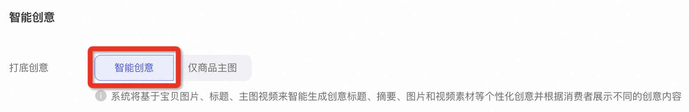

**4.2.2 使用关键词推广V视频**

为什么要使用V视频：**容易吸引访客，提升点击率。**对用户而言，视频广告看起来更加省时省力，并且直观，更加符合现代节奏快的生活。并且在WiFi情况下，视频可以自动播放，通过内容、声音等更容易吸引访客注意力。**且可以展示更多内容/利益点**

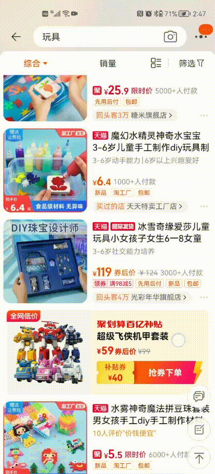

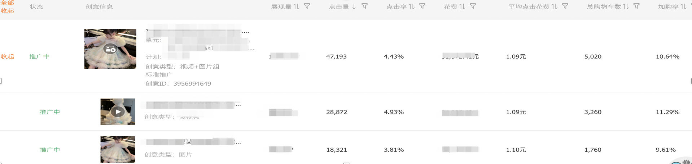

**如何使用关键词推广V视频：**

进入计划-单元页，点击「创意」-「添加创意」-点击上传/选择微视频

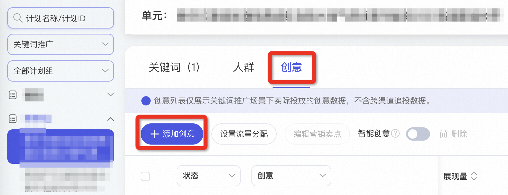

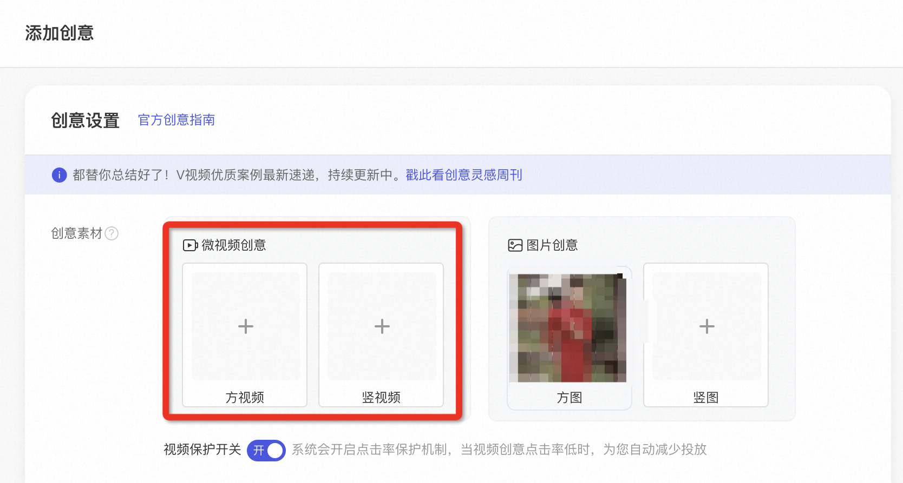

#### **4.3 使用阿里妈妈创意中心-「创意洞察/优化工具」**

阿里妈妈创意中心为各位商家提供了创意洞察、创意分析诊断、创意排行榜等创意指导工具，图片、文案、短视频、落地页等创意制作工具、以及AIGC做图工具，帮助商家快速、低成本生成高质量、高转化率的广告创意素材，提升广告投放效果。

阿里妈妈创意中心：https://chuangyi.taobao.com/

阿里妈妈创意中心-创意洞察工具：https://www.yuque.com/macy/ngpw94/hrwgs9h2chwxeovz?spm=a2esx.12365734.accountInsight.2.e7742593bcPZv0&singleDoc

阿里妈妈创意中心-趋势洞察工具：https://www.yuque.com/macy/ngpw94/mz9zh0?spm=a2esx.12365734.accountInsight.4.e7742593bcPZv0&singleDoc

https://www.yuque.com/macy/ngpw94/mz9zh0?spm=a2esx.12365734.accountInsight.4.e7742593bcPZv0&singleDoc

阿里妈妈创意中心-创意学院：https://chuangyi.taobao.com/inspiration?spm=a2esx.22971310.kbheader00.3.6f69470ayc268t

​

#### **4.4 优化「质量分」**

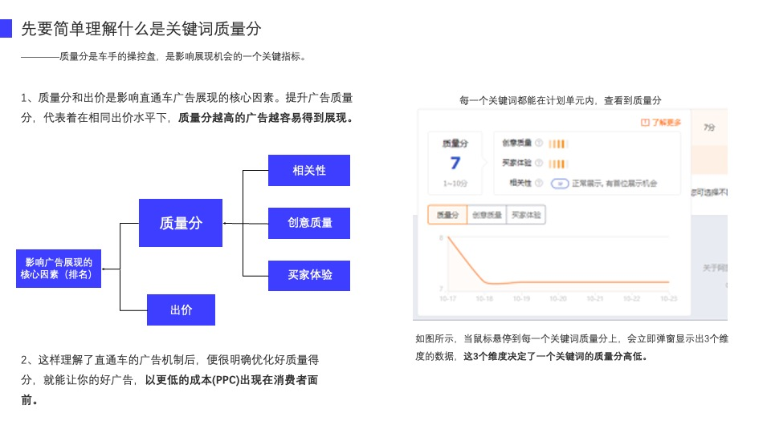

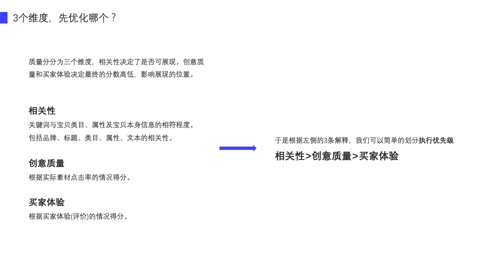

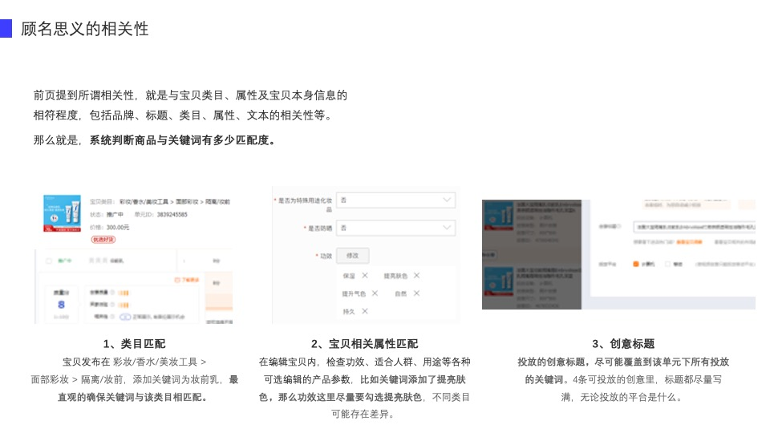

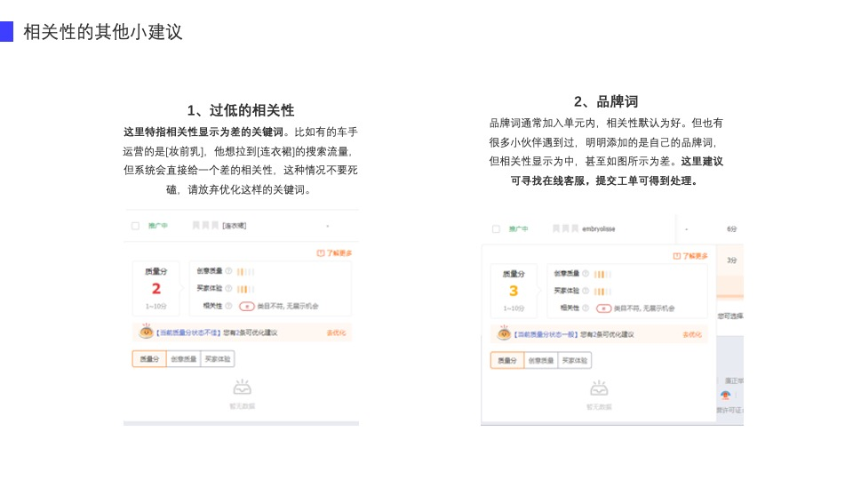

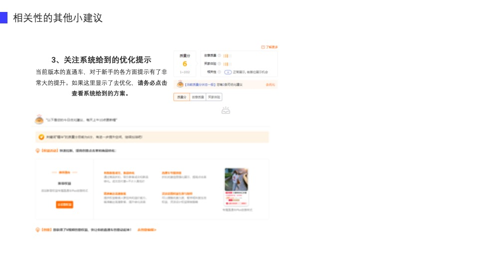

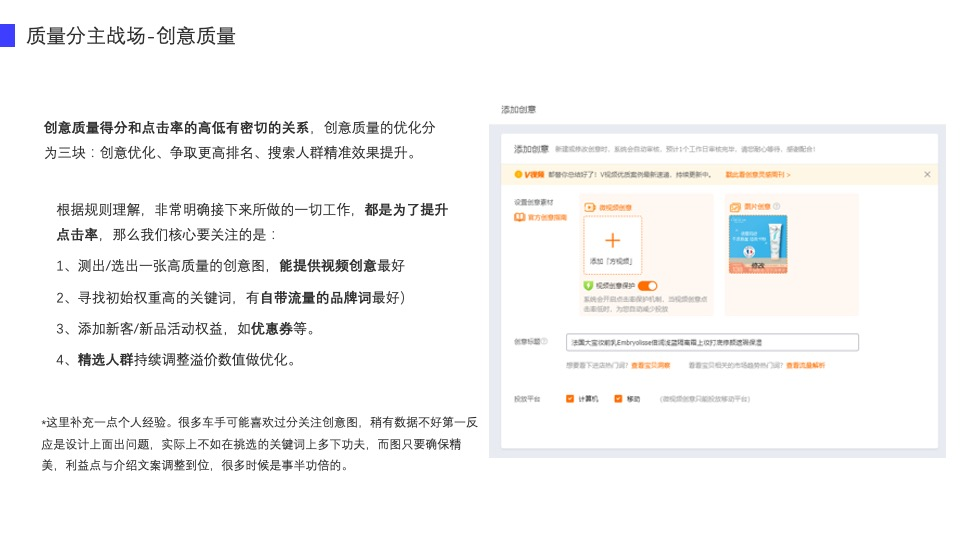

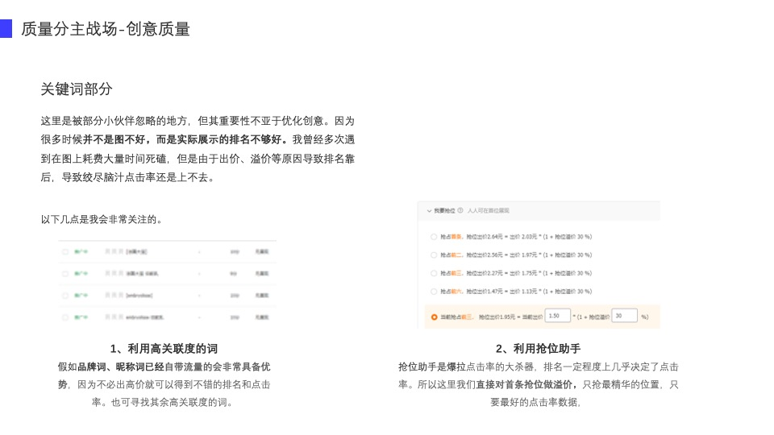

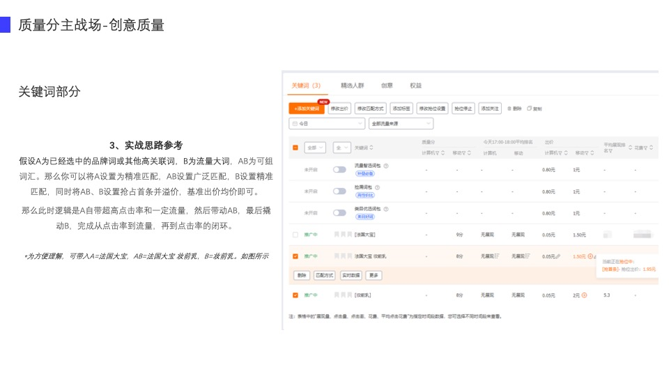

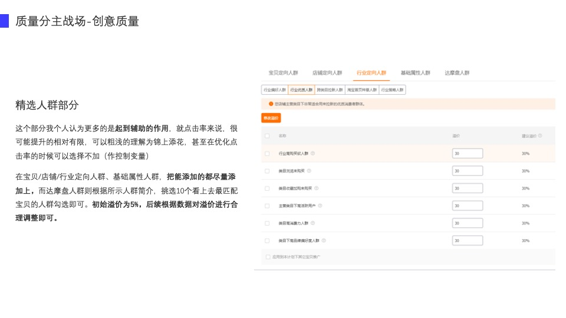

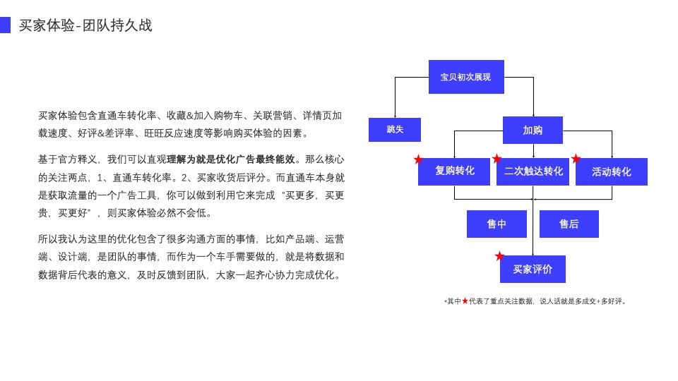
